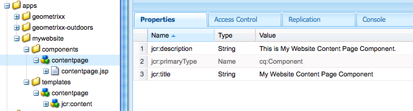
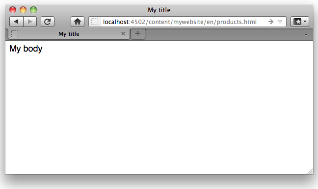

# Creare un sito web completo (JSP){#create-a-fully-featured-website-jsp}

>[!NOTE]
>
>Questo articolo descrive come creare un sito web utilizzando JSP e in base all’interfaccia classica. L’Adobe consiglia di utilizzare le tecnologie AEM più recenti per i siti web come descritto in dettaglio nell’articolo [Guida introduttiva allo sviluppo per AEM Sites](/help/sites-developing/getting-started.md).

Questa esercitazione consente di creare un sito web completo con Adobe Experience Manager (AEM). Il sito web sarà basato su un sito web generico ed è destinato principalmente agli sviluppatori web. Tutte le attività di sviluppo avranno luogo in un ambiente di authoring.

Questa esercitazione descrive come:

1. Installa AEM.
1. Accedere a CRXDE Lite (l’ambiente di sviluppo).
1. Imposta la struttura del progetto in CRXDE Lite.
1. Crea il modello, il componente e gli script utilizzati come base per la creazione di pagine di contenuto.
1. Crea la pagina principale per il tuo sito web e quindi le pagine di contenuto.
1. Crea i seguenti componenti da utilizzare sulle pagine:

   * Navigazione superiore
   * Elementi figli elenco
   * Logo
   * Immagine
   * Testo-immagine
   * Ricerca

1. Includi vari componenti di base.

Dopo aver eseguito tutti i passaggi, le pagine avranno il seguente aspetto:


**Scarica il risultato finale**

Per seguire l&#39;esercitazione invece di eseguire gli esercizi, scarica website-1.0.zip. Questo file è un pacchetto di contenuti AEM che contiene i risultati di questa esercitazione. Utilizzo [Gestione pacchetti](/help/sites-administering/package-manager.md) per installare il pacchetto nell’istanza di authoring.

**NOTA:** L’installazione di questo pacchetto sovrascrive le risorse nell’istanza di authoring creata con questa esercitazione.

Pacchetto di contenuti del sito web

[Ottieni file](assets/website-1_0.zip)

## Installazione di Adobe Experience Manager {#installing-adobe-experience-manager}

Per installare un&#39;istanza AEM per lo sviluppo del sito web, segui le istruzioni per configurare un [ambiente di distribuzione con istanze di creazione e pubblicazione](/help/sites-deploying/deploy.md#author-and-publish-installs)o eseguire un [installazione generica](/help/sites-deploying/deploy.md#default-local-install). L&#39;installazione generica comporta il download del file JAR AEM Quickstart, il posizionamento del file license.properties nella stessa directory del file JAR e il doppio clic sul file JAR.

Dopo aver installato AEM, accedi all’ambiente di sviluppo di CRXDE Lite facendo clic sul collegamento CRXDE Lite nella pagina di benvenuto:


>[!NOTE]
>
>L’URL di CRXDE Lite per un’istanza di authoring AEM installata localmente utilizzando la porta predefinita è [https://localhost:4502/crx/de/](https://localhost:4502/crx/de/).

### Impostazione della struttura del progetto in CRXDE Lite {#setting-up-the-project-structure-in-crxde-lite}

Utilizza CRXDE Lite per creare la struttura dell’applicazione mywebsite nell’archivio:

1. Nella struttura ad albero sul lato sinistro di CRXDE Lite, fai clic con il pulsante destro del mouse sul pulsante **`/apps`** e fai clic su **Crea** > **Crea** **Cartella**. In **Crea cartella** finestra di dialogo, tipo `mywebsite` come nome della cartella e fai clic su **OK**.
1. Fai clic con il pulsante destro del mouse sul pulsante **`/apps/mywebsite`** e fai clic su **Crea** > **Crea cartella**. In **Crea cartella** finestra di dialogo, tipo `components` come nome della cartella e fai clic su **OK**.
1. Fai clic con il pulsante destro del mouse sul pulsante **`/apps/mywebsite`** e fai clic su **Crea** > **Crea cartella**. In **Crea cartella** finestra di dialogo, tipo `templates` come nome della cartella e fai clic su **OK**.

   La struttura nell&#39;albero dovrebbe ora avere un aspetto simile al seguente:

   

1. Fai clic su **Salva tutto**.

### Impostazione della progettazione {#setting-up-the-design}

In questa sezione viene creata la progettazione dell’applicazione utilizzando lo strumento Designer. La progettazione fornisce risorse CSS e immagini per il sito web.

>[!NOTE]
>
>Fai clic sul seguente collegamento per scaricare mywebsite.zip. L&#39;archivio contiene i file static.css e immagine per la progettazione.

Esempio di file static.css e immagini

[Ottieni file](assets/mywebsite.zip)

1. Nella pagina AEM benvenuto, fai clic su **Strumenti**. ([https://localhost:4502/libs/cq/core/content/welcome.html](https://localhost:4502/libs/cq/core/content/welcome.html))

   

1. Nella struttura delle cartelle, seleziona la **Disegni** e fai clic su **Nuovo** > **Nuova pagina**. Tipo `mywebsite` come titolo e fai clic su **Crea**.

1. Se l’elemento del sito web non viene visualizzato nella tabella, aggiornare la struttura ad albero o la tabella.

1. [Utilizzo di WebDAV](/help/sites-administering/webdav-access.md) accedere all’URL all’indirizzo https://localhost:4502, copia l’esempio `static.css` file e `images` dal file mywebsite.zip scaricato nel `/etc/designs/mywebsite` cartella.

   

### Creazione del modello, del componente e dello script della pagina di contenuto {#creating-the-contentpage-template-component-and-script}

In questa sezione puoi creare quanto segue:

* Modello di pagina di contenuto che verrà utilizzato per creare pagine di contenuto nel sito web di esempio
* Componente della pagina di contenuto che verrà utilizzato per il rendering delle pagine di contenuto
* Lo script della pagina di contenuto

#### Creazione del modello di pagina di contenuto {#creating-the-contentpage-template}

Crea un modello da utilizzare come base delle pagine web del sito.

Un modello definisce il contenuto predefinito di una nuova pagina. I siti web complessi possono utilizzare diversi modelli per la creazione di diversi tipi di pagine nel sito. In questo esercizio, tutte le pagine sono basate su un modello semplice.

1. Nella struttura delle cartelle di CRXDE Lite, fai clic con il pulsante destro del mouse su `/apps/mywebsite/templates` e fai clic su **Crea** > **Crea modello**.

1. Nella finestra di dialogo Crea modello, digita i seguenti valori e fai clic su **Successivo**:

   * **Etichetta**: contentpage
   * **Titolo**: Modello pagina contenuto sito Web personale
   * **Descrizione**: Questo è il mio modello di pagina del contenuto del sito Web
   * **Tipo di risorsa:** mywebsite/components/contentpage

   Utilizzare il valore predefinito per la proprietà Classifica.

   

   Il tipo di risorsa identifica il componente che esegue il rendering della pagina. In questo caso, tutte le pagine create utilizzando il modello di pagina di contenuto vengono sottoposte a rendering dal `mywebsite/components/contentpage` componente.

1. Per specificare i percorsi delle pagine che possono utilizzare questo modello, fai clic sul pulsante più e digita `/content(/.*)?` nella casella di testo visualizzata. Quindi, fai clic su **Successivo**.

   

   Il valore della proprietà percorso consentita è un *espressione regolare.* Per le pagine con un percorso che corrisponde all’espressione è possibile utilizzare il modello . In questo caso l&#39;espressione regolare corrisponde al percorso del **/content** e tutte le pagine secondarie.

   Quando un autore crea una pagina sotto /content, la **contentpage** il modello viene visualizzato in un elenco di modelli disponibili da utilizzare.

1. Fai clic su **Successivo** in **Genitori consentiti** e **Bambini consentiti** e fai clic su **OK**. In CRXDE Lite, fai clic su **Salva tutto**.

   

#### Creazione del componente Pagina di contenuto {#creating-the-contentpage-component}

Crea il *component* che definisce il contenuto ed esegue il rendering delle pagine che utilizzano il modello di pagina di contenuto. La posizione del componente deve corrispondere al valore della proprietà Tipo di risorsa del modello di pagina di contenuto.

1. In CRXDE Lite, fai clic con il pulsante destro del mouse su `/apps/mywebsite/components` e fai clic su **Crea** > **Componente**.
1. In **Crea componente** digitare i seguenti valori di proprietà nella finestra di dialogo:

   * **Etichetta**: contentpage
   * **Titolo**: Componente Pagina contenuto sito Web
   * **Descrizione**: Componente Pagina contenuto sito Web personale

   

   La posizione del nuovo componente è `/apps/mywebsite/components/contentpage`. Questo percorso corrisponde al tipo di risorsa del modello di pagina di contenuto (meno il **`/apps/`** parte del percorso).

   Questa corrispondenza collega il modello al componente ed è fondamentale per il corretto funzionamento del sito web.

1. Fai clic su **Successivo** finché non viene visualizzato il pannello Elementi figlio consentiti della finestra di dialogo, quindi fai clic su **OK**. In CRXDE Lite, fai clic su **Salva tutto**.

   La struttura si presenta ora come segue:

   

#### Sviluppo dello script del componente Pagina di contenuto {#developing-the-contentpage-component-script}

Aggiungi il codice allo script contentpage.jsp per definire il contenuto della pagina.

1. In CRXDE Lite, apri il file . `contentpage.jsp` in `/apps/mywebsite/components/contentpage`. Per impostazione predefinita, il file contiene il seguente codice:

   ```java
   <%--
   
     My Website Content Page Component component.
   
     This is My Website Content Page Component.
   
   --%><%
   %><%@include file="/libs/foundation/global.jsp"%><%
   %><%@page session="false" %><%
   %><%
       /* TODO add you code here */
   %>
   ```

1. Copia il codice seguente e incollalo in contentpage.jsp dopo il codice predefinito:

   ```java
   <%@ page language="java" contentType="text/html; charset=ISO-8859-1"
       pageEncoding="ISO-8859-1"%>
   <!DOCTYPE html PUBLIC "-//W3C//DTD HTML 4.01 Transitional//EN"
   "https://www.w3.org/TR/html4/loose.dtd">
   <html>
   <head>
   <meta http-equiv="Content-Type" content="text/html; charset=ISO-8859-1">
   <title>My title</title>
   </head>
   <body>
   <div>My body</div>
   </body>
   </html>
   ```

1. Fai clic su **Salva tutto** per salvare le modifiche.

### Creazione della pagina del sito web e delle pagine di contenuto {#creating-your-website-page-and-content-pages}

In questa sezione vengono create le pagine seguenti che utilizzano tutte il modello di pagina di contenuto: Sito web, inglese, prodotti, servizi e clienti.

1. Nella pagina di benvenuto AEM ([https://localhost:4502/libs/cq/core/content/welcome.html](https://localhost:4502/libs/cq/core/content/welcome.html)), fare clic su Siti web.

   

1. Nella struttura delle cartelle, seleziona la **Siti Web** e fai clic su **Nuovo** > **Nuova pagina**.
1. In **Crea pagina** immetti quanto segue:

   * Titolo: `My Website`
   * Nome: `mywebsite`
   * Seleziona la `My Website Content Page Template`

   

1. Fai clic su **Crea**. Nella struttura delle cartelle, seleziona la **/Siti Web/Sito Web personale** e fai clic su **Nuovo** > **Nuova pagina**.
1. Nella finestra di dialogo Crea pagina , immetti i seguenti valori di proprietà e fai clic su Crea:

   * Titolo: Inglese
   * Nome: en
   * Selezionare il modello Pagina contenuto sito Web personale

1. Nella struttura delle cartelle, seleziona la **/Websites/My Website/English** e fai clic su **Nuovo**> **Nuova pagina**.
1. In **Crea pagina** immetti i seguenti valori di proprietà e fai clic su **Crea**:

   * Titolo: Prodotti
   * Selezionare il modello Pagina contenuto sito Web personale

1. Nella struttura delle cartelle, seleziona la **/Websites/My Website/English** e fai clic su **Nuovo** > **Nuova pagina**.
1. In **Crea pagina** immetti i seguenti valori di proprietà e fai clic su **Crea**:

   * Titolo: Servizi
   * Selezionare il modello Pagina contenuto sito Web personale

1. Nella struttura delle cartelle, seleziona la **/Websites/My Website/English** e fai clic su **Nuovo** > **Nuova pagina**.
1. In **Crea pagina** immetti i seguenti valori di proprietà e fai clic su **Crea**:

   * Titolo: Clienti
   * Selezionare il modello Pagina contenuto sito Web personale

   La struttura si presenta come segue:

   

1. Per collegare le pagine alla progettazione del sito web mysite, in CRXDE Lite, seleziona la `/content/mywebsite/en/jcr:content` nodo. Nella scheda Proprietà, digita i seguenti valori per una nuova proprietà, quindi fai clic su Aggiungi:

   * Nome: cq:designPath
   * Tipo: Stringa
   * Valore: /etc/designs/mywebsite

   

1. In una nuova scheda o finestra del browser Web, apri [https://localhost:4502/content/mywebsite/en/products.html](https://localhost:4502/content/mywebsite/en/products.html) per visualizzare la pagina Prodotti :

   

### Miglioramento dello script di Contentpage {#enhancing-the-contentpage-script}

Questa sezione descrive come migliorare lo script della pagina del contenuto utilizzando gli script dei componenti di AEM foundation e scrivendo script personalizzati.

La **Prodotti** La pagina verrà visualizzata come segue:


#### Utilizzo degli script di pagina di base {#using-the-foundation-page-scripts}

In questo esercizio, configura il componente contenuto pagina in modo che il relativo supertipo sia il componente Pagina AEM. Poiché i componenti ereditano le caratteristiche del loro supertipo, il contenuto della pagina eredita gli script e le proprietà del componente Pagina.

Ad esempio, nel codice JSP del componente, puoi fare riferimento agli script forniti dal componente supertipo come se fossero inclusi nel componente.

1. In CRXDE Lite, aggiungi una proprietà al `/apps/mywebsite/components/contentpage` nodo.

   1. Seleziona la `/apps/mywebsite/components/contentpage` nodo.
   1. Nella parte inferiore della scheda Proprietà, digita i seguenti valori di proprietà e fai clic su Aggiungi:

      * **Nome:** sling:resourceSuperType
      * **Tipo:** Stringa
      * **Valore:** foundation/components/page
   1. Fai clic su Salva tutto.


1. Apri `contentpage.jsp` file in `/apps/mywebsite/components/contentpage` e sostituisci il codice esistente con il seguente codice:

   ```xml
   <%@include file="/libs/foundation/global.jsp"%><%
   %><%@page session="false" contentType="text/html; charset=utf-8" %><%
   %><!DOCTYPE HTML PUBLIC "-//W3C//DTD HTML 4.01//EN" "https://www.w3.org/TR/html4/strict.dtd">
   <html>
   <cq:include script="head.jsp"/>
   <cq:include script="body.jsp"/>
   </html>
   ```

1. Salva le modifiche.
1. Nel browser, ricarica la pagina Prodotti. Si presenta come segue:

   

   Apri la pagina sorgente per visualizzare gli elementi javascript e HTML generati dagli script head.jsp e body.jsp. Il seguente snippet di script apre la barra laterale all’apertura della pagina:

   ```java
   CQ.WCM.launchSidekick("/content/mywebsite/en/products",
               {propsDialog: "/libs/foundation/components/page/dialog",
                  locked: false locked: false
                });
   ```

#### Utilizzo di script personalizzati {#using-your-own-scripts}

In questa sezione vengono creati diversi script che generano ciascuno una parte del corpo della pagina. Quindi crea il file body.jsp nel componente pageContent per sovrascrivere il file body.jsp del componente Pagina AEM. Nel file body.jsp, includi gli script che generano le diverse parti del corpo della pagina.

**Suggerimento:** Quando un componente include un file con lo stesso nome e la stessa posizione relativa di un file nel supertipo del componente, viene chiamato *sovrapposizione*.

1. In CRXDE Lite, crea il file . `left.jsp` sotto `/apps/mywebsite/components/contentpage`:

   1. Fai clic con il pulsante destro del mouse sul nodo `/apps/mywebsite/components/contentpage`, quindi seleziona **Crea **quindi **Crea file**.

   1. Nella finestra, digita `left.jsp` come **Nome** e fai clic su **OK**.

1. Modificare il file `left.jsp` per rimuovere il contenuto esistente e sostituirlo con il codice seguente:

   ```java
   <%@include file="/libs/foundation/global.jsp"%><%
   %><div class="left">
   <div>logo</div>
   <div>newslist</div>
   <div>search</div>
   </div>
   ```

1. Salva le modifiche.
1. In CRXDE Lite, crea il file . `center.jsp` sotto `/apps/mywebsite/components/contentpage`:

   1. Fai clic con il pulsante destro del mouse sul nodo `/apps/mywebsite/components/contentpage`, seleziona **Crea**, quindi **Crea file**.

   1. Nella finestra di dialogo, digita `center.jsp` come **Nome** e fai clic su **OK**.

1. Modificare il file `center.jsp` per rimuovere il contenuto esistente e sostituirlo con il codice seguente:

   ```java
   <%@include file="/libs/foundation/global.jsp"%><%
   %><div class="center">
   <div>trail</div>
   <div>title</div>
   <div>parsys</div>
   </div>
   ```

1. Salva le modifiche.
1. In CRXDE Lite, crea il file . `right.jsp` sotto `/apps/mywebsite/components/contentpage`:

   1. Fai clic con il pulsante destro del mouse sul nodo `/apps/mywebsite/components/contentpage`, seleziona **Crea**, quindi **Crea file**.

   1. Nella finestra di dialogo, digita `right.jsp` come **Nome** e fai clic su **OK**.

1. Modificare il file `right.jsp` per rimuovere il contenuto esistente e sostituirlo con il codice seguente:

   ```java
   <%@include file="/libs/foundation/global.jsp"%><%
   %><div class="right">
   <div>iparsys</div>
   </div>
   ```

1. Salva le modifiche.
1. In CRXDE Lite, crea il file . `body.jsp` sotto `/apps/mywebsite/components/contentpage`:
1. Modificare il file `body.jsp` per rimuovere il contenuto esistente e sostituirlo con il codice seguente:

   ```java
   <%@include file="/libs/foundation/global.jsp"%><%
   %><body>
   <div id="CQ">
   <div class="topnav">topnav</div>
   <div class="content">
   <cq:include script="left.jsp" />
   <cq:include script="center.jsp" />
   <cq:include script="right.jsp" />
   </div>
   <div class="footer">
   <div class="toolbar">toolbar</div>
   </div>
   </div>
   </body>
   ```

1. Salva le modifiche.
1. Nel browser, ricarica la pagina Prodotti. Si presenta come segue:

   

### Creazione del componente di navigazione superiore {#creating-the-top-navigation-component}

In questa sezione viene creato un componente che visualizza i collegamenti a tutte le pagine principali del sito web per facilitarne la navigazione. Il contenuto di questo componente viene visualizzato nella parte superiore di tutte le pagine create utilizzando il modello di pagina di contenuto.

Nella prima versione del componente di navigazione superiore (navigazione in alto) gli elementi di navigazione sono solo collegamenti di testo. Nella seconda versione implementa la navigazione topnav con i collegamenti di navigazione delle immagini.

La navigazione superiore si presenterà come segue:


#### Creazione del componente di navigazione superiore {#creating-the-top-navigation-component-1}

1. In CRXDE Lite, fai clic con il pulsante destro del mouse su `/apps/mywebsite/components`, seleziona **Crea**, quindi **Crea componente**.
1. In **Crea componente** immetti quanto segue:

   * **Etichetta**: `topnav`

   * **Titolo**: `My Top Navigation Component`

   * **Descrizione**: `This is My Top Navigation Component`

1. Fai clic su **Successivo** fino all&#39;ultima finestra in cui si fa clic **OK**. Salva le modifiche.

#### Creazione dello script di navigazione superiore con collegamenti testuali {#creating-the-top-navigation-script-with-textual-links}

Aggiungi lo script di rendering alla navigazione superiore per generare collegamenti di testo alle pagine figlie:

1. In CRXDE Lite, apri il file . `topnav.jsp` sotto `/apps/mywebsite/components/topnav`.
1. Sostituisci il codice presente copiando e incollando il seguente codice:

   ```xml
   <%@include file="/libs/foundation/global.jsp"%><%
   %><%@ page import="java.util.Iterator,
           com.day.text.Text,
           com.day.cq.wcm.api.PageFilter, com.day.cq.wcm.api.Page" %><%
       /* get starting point of navigation */
       Page navRootPage = currentPage.getAbsoluteParent(2);
       if (navRootPage == null && currentPage != null) {
       navRootPage = currentPage;
       }
       if (navRootPage != null) {
           Iterator<Page> children = navRootPage.listChildren(new PageFilter(request));
           while (children.hasNext()) {
               Page child = children.next();
               %><a href="<%= child.getPath() %>.html"><%=child.getTitle() %></a><%
           }
       }
   %>
   ```

#### Inclusione della navigazione in alto nel componente Pagina di contenuto {#including-top-navigation-in-the-contentpage-component}

Per includere la navigazione superiore nel componente della pagina di contenuto:

1. In CRXDE Lite, apri le `body.jsp` sotto `/apps/mywebsite/components/contentpage`e sostituiscono:

   ```xml
   <div class="topnav">topnav</div>
   ```

   con:

   ```xml
   <cq:include path="topnav" resourceType="mywebsite/components/topnav" />
   ```

1. Salva le modifiche.
1. Nel browser, ricarica la pagina Prodotti. La navigazione superiore viene visualizzata come segue:

   

#### Miglioramento delle pagine con i sottotitoli {#enhancing-pages-with-subtitles}

Il componente Pagina definisce le proprietà che consentono di fornire sottotitoli per le pagine. Aggiungi sottotitoli che forniscono informazioni sul contenuto della pagina.

1. Nel browser, apri le **Prodotti** pagina.
1. Sulla barra laterale **Pagina** scheda , fai clic su **Proprietà pagina**.
1. Nella scheda Base della finestra di dialogo, espandi **Altri titoli e descrizioni,** e per **Sottotitolo** proprietà, tipo **cosa facciamo**. Fai clic su **OK**.
1. Ripeti i passaggi precedenti per aggiungere il sottotitolo **sui nostri servizi** al **Servizi** pagina.
1. Ripeti i passaggi precedenti per aggiungere il sottotitolo **la fiducia che guadagniamo** al **Clienti** pagina.

   **Suggerimento:** In CRXDE Lite, seleziona il nodo /content/mywebsite/en/products/jcr:content per verificare che la proprietà subtitle sia aggiunta.

#### Migliora la navigazione superiore utilizzando i collegamenti alle immagini {#enhance-top-navigation-by-using-image-links}

Per utilizzare i collegamenti alle immagini invece che il testo ipertestuale per i controlli di navigazione, è consigliabile migliorare lo script di rendering del componente di navigazione superiore. L’immagine include il titolo e il sottotitolo della destinazione del collegamento.

Questo esercizio dimostra [Elaborazione richiesta Sling](/help/sites-developing/the-basics.md#sling-request-processing). Lo script topnav.jsp viene modificato per richiamare uno script che genera dinamicamente immagini da utilizzare per i collegamenti di navigazione della pagina. In questo esercizio, Sling analizza l’URL dei file di origine dell’immagine per determinare lo script da utilizzare per il rendering delle immagini.

Ad esempio, la sorgente del collegamento immagine alla pagina Prodotti potrebbe essere https://localhost:4502/content/mywebsite/en/products.navimage.png. Sling analizza questo URL per determinare il tipo di risorsa e lo script da utilizzare per il rendering della risorsa:

1. Sling determina il percorso della risorsa da assegnare `/content/mwebysite/en/products.png.`
1. Sling corrisponde a questo percorso con `/content/mywebsite/en/products` nodo.
1. Sling determina la `sling:resourceType` di questo nodo da essere `mywebsite/components/contentpage`.

1. Sling trova lo script in questo componente che meglio corrisponde al selettore URL ( `navimage`) e l&#39;estensione del nome file ( `png`).

In questo esercizio, Sling corrisponde a questi URL allo script /apps/mywebsite/components/contentpage/navimage.png.java creato.

1. In CRXDE Lite, apri le `topnav.jsp` sotto `/apps/mywebsite/components/topnav.`Individua il contenuto dell’elemento di ancoraggio (riga 14):

   ```xml
   <%=child.getTitle() %>
   ```

1. Sostituisci il contenuto di ancoraggio con il seguente codice:

   ```xml
   " src="<%= child.getPath() %>.navimage.png">
   ```

1. Salva le modifiche.
1. Fai clic con il pulsante destro del mouse sul pulsante `/apps/mywebsite/components/contentpage` nodo e fai clic su **Crea** > **Crea file**.
1. In **Crea file** come **Nome**, tipo `navimage.png.java`.

   L&#39;estensione del nome file .java indica a Sling che il supporto Java per gli script Apache Sling deve essere utilizzato per compilare lo script e creare un servlet.

1. Copia il seguente codice in `navimage.png.java.`Il codice estende la classe AbstractImageServlet:

   * [AbstractImageServlet](https://helpx.adobe.com/experience-manager/6-5/sites/developing/using/reference-materials/javadoc/com/day/cq/wcm/commons/AbstractImageServlet.html) crea un oggetto ImageContext in cui vengono memorizzate le proprietà della risorsa corrente.
   * La pagina padre della risorsa viene estratta dall&#39;oggetto ImageContext. Vengono quindi ottenuti il titolo e il sottotitolo della pagina.
   * [ImageHelper](https://helpx.adobe.com/experience-manager/6-5/sites/developing/using/reference-materials/javadoc/com/day/cq/commons/ImageHelper.html) viene utilizzato per generare l’immagine dal file navimage_bg.jpg della struttura del sito, dal titolo della pagina e dal sottotitolo della pagina.

   ```java
   package apps.mywebsite.components.contentpage;
   
   import java.awt.Color;
   import java.awt.Paint;
   import java.awt.geom.Rectangle2D;
   
   import java.io.IOException;
   import javax.jcr.RepositoryException;
   
   import com.day.cq.wcm.api.Page;
   import com.day.cq.wcm.api.PageManager;
   import com.day.cq.wcm.api.components.Component;
   import com.day.cq.wcm.api.designer.Designer;
   
   import com.day.cq.commons.SlingRepositoryException;
   import com.day.cq.wcm.commons.WCMUtils;
   import com.day.cq.wcm.commons.AbstractImageServlet;
   import com.day.cq.commons.ImageHelper;
   
   import com.day.image.Font;
   import com.day.image.Layer;
   
   import org.apache.sling.api.SlingHttpServletRequest;
   import org.apache.sling.api.SlingHttpServletResponse;
   import org.apache.sling.api.resource.Resource;
   import org.apache.sling.api.servlets.SlingSafeMethodsServlet;
   
   /**
     * Renders the navigation image
     */
   public class navimage_png extends AbstractImageServlet {
   
         protected Layer createLayer(ImageContext ctx)
                throws RepositoryException, IOException {
            PageManager pageManager = ctx.resolver.adaptTo(PageManager.class);
            Page currentPage = pageManager.getContainingPage(ctx.resource);
   
            /* constants for image appearance */
            int scale = 6;
            int paddingX = 24;
            int paddingY = 24;
            Color bgColor = new Color(0x004a565c, true);
   
            /* obtain the page title */
            String title = currentPage.getTitle();
            if (title == null) {
                title = currentPage.getName();
            }
   
            /* format the title text */
            title = title.toUpperCase();
            Paint titleColor = Color.WHITE;
            Font titleFont = new Font("Myriad Pro", 10 * scale, Font.BOLD);
            int titleBase = 10 * scale;
   
            /* obtain and format the page subtitle */
            String subtitle = currentPage.getProperties().get("subtitle", "");
            Paint subtitleColor = new Color(0xffa9afb1, true);
            Font subTitleFont = new Font("Tahoma", 7);
            int subTitleBase = 20;
   
            /* create a layer that contains the background image from the mywebsite design */
            Designer dg = ctx.resolver.adaptTo(Designer.class);
            String imgPath = new String(dg.getDesignPath(currentPage)+"/images/navimage_bg.jpg");
            Layer bg = ImageHelper.createLayer(ctx.resolver.resolve(imgPath));
   
            /* draw the title text (4 times bigger) */
            Rectangle2D titleExtent = titleFont.getTextExtent(0, 0, 0, 0, title, Font.ALIGN_LEFT, 0, 0);
            Rectangle2D subtitleExtent = subTitleFont.getTextExtent(0, 0, 0, 0, subtitle, Font.ALIGN_LEFT, 0, 0);
   
            /* ensure subtitleExtent is wide enough */
            if ( subtitle.length() > 0 ) {
                int titleWidth = (int)titleExtent.getWidth() / scale;
                if ( subtitleExtent.getWidth() > titleWidth && subtitleExtent.getWidth() + 2 * paddingX >
    bg.getWidth() ) {
                    int charWidth = (int)subtitleExtent.getWidth() / subtitle.length();
                    int maxWidth = (bg.getWidth() > titleWidth + 2  * paddingX ? bg.getWidth() - 2 * paddingX : titleWidth);
                    int len = (maxWidth - ( 2 * charWidth) ) / charWidth;
                    subtitle = subtitle.substring(0, len) + "...";
                    subtitleExtent = subTitleFont.getTextExtent(0, 0, 0, 0, subtitle, Font.ALIGN_LEFT, 0, 0);
                }
            }
            int width = Math.max((int) titleExtent.getWidth(), (int) subtitleExtent.getWidth());
           /* create the text layer */
            Layer text = new Layer(width, (int) titleExtent.getHeight() + 40, new Color(0x01ffffff, true));
            text.setPaint(titleColor);
            text.drawText(0, titleBase, 0, 0, title, titleFont, Font.ALIGN_LEFT | Font.ALIGN_BASE, 0, 0);
            text.resize(text.getWidth() / scale, text.getHeight() / scale);
            text.setX(0);
            text.setY(0);
   
            if (subtitle.length() > 0) {
                /* draw the subtitle normal sized */
                text.setPaint(subtitleColor);
                text.drawText(0, subTitleBase, 0, 0, subtitle, subTitleFont, Font.ALIGN_LEFT | Font.ALIGN_BASE, 0, 0);
            }
   
            /* merge the image and text layers */
            text.setY(paddingY);
            text.setX(paddingX);
            text.setBackgroundColor(bgColor);
   
            int bgWidth = bg.getWidth();
            if ( text.getWidth() + 2 * paddingX > bgWidth ) {
                bgWidth = text.getWidth() + 2 * paddingX;
                bg.resize(bgWidth, bg.getHeight());
            }
            bg.merge(text);
   
            return bg;
        }
    }
   ```

1. Salva le modifiche.
1. Nel browser, ricarica la pagina Prodotti. La navigazione superiore ora viene visualizzata come segue:

   

### Creazione del componente Elenco figli {#creating-the-list-children-component}

Crea il componente listchildren che genera un elenco di collegamenti di pagina che includono il titolo, la descrizione e la data delle pagine (ad esempio, le pagine di prodotto). I collegamenti sono destinati alle pagine figlie della pagina corrente o di una pagina principale specificata nella finestra di dialogo del componente.


#### Creazione di pagine di prodotto {#creating-product-pages}

Crea due pagine sotto la pagina Prodotti. Per ogni pagina, che descrive due prodotti specifici, puoi impostare un titolo, una descrizione e una data.

1. Nella struttura delle cartelle della pagina Siti Web, selezionate l’elemento Siti Web/Sito Web personale/Inglese/Prodotti e fate clic su Nuovo > Nuova pagina.
1. Nella finestra di dialogo immetti i seguenti valori di proprietà e fai clic su Crea:

   * Titolo: Prodotto 1.
   * Nome: prodotto1.
   * Seleziona il modello di pagina del contenuto del sito Web

1. Crea un&#39;altra pagina sotto Products utilizzando i seguenti valori di proprietà:

   * Titolo: Prodotto 2
   * Nome: prodotto2
   * Seleziona il modello di pagina del contenuto del sito Web

1. In CRXDE Lite, imposta una descrizione e una data per la pagina Prodotto 1:

   1. Seleziona la `/content/mywebsite/en/products/product1/jcr:content` nodo.
   1. In **Proprietà** , immetti i seguenti valori:

      * Nome: `jcr:description`
      * Tipo: `String`
      * Valore: `This is a description of the Product 1!.`
   1. Fate clic su **Aggiungi**.
   1. In **Proprietà** crea un’altra proprietà utilizzando i seguenti valori:

      * Nome: date
      * Tipo: Stringa
      * Valore: 14/02/2008
      * Fate clic su Aggiungi.
   1. Fai clic su Salva tutto.


1. In CRXDE Lite, imposta una descrizione e una data per la pagina Prodotto 2:

   1. Seleziona il nodo /content/mywebsite/en/products/product2/jcr:content .
   1. In **Proprietà** , immetti i seguenti valori:

      * Nome: jcr:description
      * Tipo: Stringa
      * Valore: Questa è una descrizione del Prodotto 2!.
   1. Fate clic su **Aggiungi**.
   1. Nelle stesse caselle di testo, sostituire i valori precedenti con i seguenti valori:

      * Nome: date
      * Tipo: Stringa
      * Valore: 11/05/2012
      * Fate clic su Aggiungi.
   1. Fai clic su Salva tutto.


#### Creazione del componente Elenco figli {#creating-the-list-children-component-1}

Per creare il componente listchildren :

1. In CRXDE Lite, fai clic con il pulsante destro del mouse su `/apps/mywebsite/components`, seleziona **Crea**, quindi **Crea componente**.
1. Nella finestra di dialogo, immetti i seguenti valori di proprietà e fai clic su Avanti:

   * Etichetta: Ascolta dei bambini.
   * Titolo: Componente Listchildren .
   * Descrizione: Questo è il componente Listchildren .

1. Continua a fare clic su Avanti fino a visualizzare il pannello Elementi figlio consentiti, quindi fai clic su OK.

#### Creazione dello script List Children {#creating-the-list-children-script}

Sviluppa lo script per il componente listchildren .

1. In CRXDE Lite, apri il file . `listchildren.jsp` sotto `/apps/mywebsite/components/listchildren`.
1. Sostituisci il codice predefinito con il seguente codice:

   ```xml
   <%@include file="/libs/foundation/global.jsp"%><%
   %><%@ page import="java.util.Iterator,
            com.day.cq.wcm.api.PageFilter"%><%
        /* Create a new Page object using the path of the current page */
         String listroot = properties.get("listroot", currentPage.getPath());
        Page rootPage = pageManager.getPage(listroot);
        /* iterate through the child pages and gather properties */
        if (rootPage != null) {
            Iterator<Page> children = rootPage.listChildren(new PageFilter(request));
            while (children.hasNext()) {
                Page child = children.next();
                String title = child.getTitle() == null ? child.getName() : child.getTitle();
                String date = child.getProperties().get("date","");
                %><div class="item">
                <a href="<%= child.getPath() %>.html"><b><%= title %></b></a>
                <span><%= date %></code><br>
                <%= child.getProperties().get("jcr:description","") %><br>
                </div><%
            }
        }
    %>
   ```

1. Salva le modifiche.

#### Creazione della finestra di dialogo Elenco elementi figlio {#creating-the-list-children-dialog}

Crea la finestra di dialogo utilizzata per configurare le proprietà del componente listchildren .

1. Crea il nodo di dialogo sotto il componente listchildren :

   1. In CRXDE Lite, fai clic con il pulsante destro del mouse su `/apps/mywebsite/components/listchildren`nodo e fai clic su **Crea** > **Finestra di dialogo Crea**.

   1. Nella finestra di dialogo, immetti i seguenti valori di proprietà e fai clic su OK

      * **Etichetta**: `dialog`

      * **Titolo**: `Edit Component` e fai clic su **OK**.

   

   Con le seguenti proprietà:

   

1. Seleziona la `/apps/mywebsite/components/listchildren/dialog/items/items/tab1` nodo.
1. Nella scheda Proprietà , modifica il valore del **title** proprietà di `List Children`

   

1. Seleziona il nodo tab1 e fai clic su Crea > Crea nodo, immetti i seguenti valori di proprietà e fai clic su OK:

   * Nome: items
   * Tipo: cq:WidgetCollection

   

1. Crea un nodo sotto il nodo elementi utilizzando i seguenti valori di proprietà:

   * Nome: listroot
   * Tipo: cq:Widget

   

1. Aggiungi le proprietà del nodo listroot per configurarlo come campo di testo. Ogni riga della tabella seguente rappresenta una proprietà. Al termine, fare clic su Salva tutto.

   | Nome | Tipo | Valore |
   |---|---|---|
   | fieldLabel | Stringa | Percorso della directory principale elenco |
   | name | Stringa | ./listroot |
   | xtype | Stringa | campo di testo |

   

#### Inclusione di elementi figlio elenco nel componente Pagina di contenuto {#including-list-children-in-the-contentpage-component}

Per includere il componente listchildren nel componente della pagina di contenuto, procedi come segue:

1. In CRXDE Lite, apri il file . `left.jsp` sotto `/apps/mywebsite/components/contentpage` e individua il seguente codice (riga 4):

   ```xml
   <div>newslist</div>
   ```

1. Sostituisci il codice con il seguente codice:

   ```xml
   <cq:include path="newslist" resourceType="mywebsite/components/listchildren" />
   ```

1. Salva le modifiche.

#### Visualizzazione degli elementi figlio di un elenco in una pagina {#viewing-list-children-in-a-page}

Per visualizzare il funzionamento completo di questo componente, puoi visualizzare la pagina Prodotti :

* quando la pagina padre (&quot;Percorso della directory principale dell’elenco&quot;) non è definita.
* quando è definita la pagina padre (&quot;Percorso della directory principale dell’elenco&quot;).

1. Nel browser, ricarica la pagina Prodotti. Il componente listchildren viene visualizzato come segue:

   

1. 

1. Come Percorso della directory principale dell&#39;elenco, immetti: `/content/mywebsite/en`. Fai clic su OK. Il componente listchildren sulla pagina si presenta ora come segue:

   

### Creazione del componente Logo {#creating-the-logo-component}

Crea un componente che mostra il logo della società e fornisce un collegamento alla home page del sito. Il componente contiene una finestra di dialogo in modalità progettazione in modo che i valori delle proprietà siano memorizzati nella progettazione del sito (/etc/designs/mywebsite):

* I valori delle proprietà si applicano a tutte le istanze del componente che vengono aggiunte alle pagine che utilizzano la progettazione.
* Le proprietà possono essere configurate utilizzando qualsiasi istanza del componente presente in una pagina che utilizza la progettazione.

La finestra di dialogo in modalità progettazione contiene le proprietà per l&#39;impostazione dell&#39;immagine e il percorso di collegamento. Il componente logo viene posizionato in alto a sinistra in tutte le pagine del sito web.

Si presenterà come segue:


>[!NOTE]
>
>Adobe Experience Manager fornisce un componente logo più completo ( `/libs/foundation/components/logo`).

#### Creazione del nodo del componente logo {#creating-the-logo-component-node}

Per creare il componente logo, effettua le seguenti operazioni:

1. In CRXDE Lite, fai clic con il pulsante destro del mouse su /apps/mywebsite/components, seleziona **Crea**, quindi **Crea componente**.
1. Nella finestra di dialogo Crea componente , immetti i seguenti valori di proprietà e fai clic su Avanti:

   * Etichetta: `logo`.
   * Titolo: `My Logo Component`.
   * Descrizione: `This is My Logo Component`.

1. Fai clic su Avanti fino a raggiungere il pannello finale della finestra di dialogo, quindi fai clic su **OK**.

#### Creazione dello script del logo {#creating-the-logo-script}

Questa sezione descrive come creare lo script per visualizzare l’immagine del logo con un collegamento alla home page.

1. In CRXDE Lite, apri il file . `logo.jsp` sotto `/apps/mywebsite/components/logo`.
1. Il codice seguente crea il collegamento alla home page del sito e aggiunge un riferimento all’immagine del logo. Copia il codice in `logo.jsp`:

   ```xml
   <%@include file="/libs/foundation/global.jsp"%><%
   %><%@ page import="com.day.text.Text,
                      com.day.cq.wcm.foundation.Image,
                      com.day.cq.commons.Doctype" %><%
       /* obtain the path for home */
       long absParent = currentStyle.get("absParent", 2L);
       String home = Text.getAbsoluteParent(currentPage.getPath(), (int) absParent);
       /* obtain the image */
       Resource res = currentStyle.getDefiningResource("imageReference");
       if (res == null) {
           res = currentStyle.getDefiningResource("image");
       }
       /* if no image use text link, otherwise draw the image */
       %>
   <a href="<%= home %>.html"><%
       if (res == null) {
           %>Home<%
       } else {
           Image img = new Image(res);
           img.setItemName(Image.NN_FILE, "image");
           img.setItemName(Image.PN_REFERENCE, "imageReference");
           img.setSelector("img");
           img.setDoctype(Doctype.fromRequest(request));
           img.setAlt("Home");
           img.draw(out);
       }
       %></a>
   ```

1. Salva le modifiche.

#### Creazione della finestra di dialogo Progettazione logo {#creating-the-logo-design-dialog}

Crea la finestra di dialogo per configurare il componente logo in modalità Progettazione. I nodi di dialogo in modalità Progettazione devono essere denominati `design_dialog`.

1. Crea il nodo di dialogo sotto il componente logo:

   1. Fai clic con il pulsante destro del mouse sul pulsante `/apps/mywebsite/components/logo` nodo e fai clic su **Crea** > **Finestra di dialogo Crea**.

   1. Digita i seguenti valori di proprietà e fai clic su OK:

      * **Etichetta:** `design_dialog`

      * **Titolo:** `Logo (Design)`

1. Fare clic con il pulsante destro del mouse sul nodo tab1 nel ramo design_dialog e scegliere Elimina. Fai clic su Salva tutto.
1. Sotto la `design_dialog/items/items`nodo, creare un nuovo nodo denominato `img` di tipo `cq:Widget`. Aggiungi le seguenti proprietà e fai clic su Salva tutto:

   | Nome | Tipo | Valore |
   |---|---|---|
   | fileNameParameter | Stringa | ./imageName |
   | fileReferenceParameter | Stringa | ./imageReference |
   | name | Stringa | ./immagine |
   | titolo | Stringa | Immagine |
   | xtype | Stringa | html5smartimage |

   

#### Creazione dello script di rendering del logo {#creating-the-logo-render-script}

Creare lo script che recupera l’immagine logo e la scrive nella pagina.

1. Fai clic con il pulsante destro del mouse sul nodo del componente logo e fai clic su Crea > Crea file per creare il file di script denominato img.GET.java.
1. Apri il file , copia il seguente codice nel file e fai clic su Salva tutto:

```java
package apps.mywebsite.components.logo;

import java.io.IOException;
import java.io.InputStream;

import javax.jcr.RepositoryException;
import javax.jcr.Property;
import javax.servlet.http.HttpServletResponse;

import com.day.cq.wcm.foundation.Image;
import com.day.cq.wcm.commons.RequestHelper;
import com.day.cq.wcm.commons.WCMUtils;
import com.day.cq.wcm.commons.AbstractImageServlet;
import com.day.cq.commons.SlingRepositoryException;
import com.day.image.Layer;
import org.apache.commons.io.IOUtils;
import org.apache.sling.api.SlingHttpServletRequest;
import org.apache.sling.api.SlingHttpServletResponse;
import org.apache.sling.api.resource.Resource;
import org.apache.sling.api.resource.ValueMap;
import org.apache.sling.api.servlets.SlingSafeMethodsServlet;

/**
 * Renders an image
 */
public class img_GET extends AbstractImageServlet {

    protected Layer createLayer(ImageContext c)
            throws RepositoryException, IOException {
        /* don't create the layer yet. handle everything later */
        return null;
    }

    protected void writeLayer(SlingHttpServletRequest req,
                              SlingHttpServletResponse resp,
                              ImageContext c, Layer layer)
            throws IOException, RepositoryException {

        Image image = new Image(c.resource);
        image.setItemName(Image.NN_FILE, "image");
        image.setItemName(Image.PN_REFERENCE, "imageReference");
        if (!image.hasContent()) {
            resp.sendError(HttpServletResponse.SC_NOT_FOUND);
            return;
        }
        /* get pure layer */
        layer = image.getLayer(false, false, false);

        /* do not re-encode layer, just spool */
        Property data = image.getData();
        InputStream in = data.getStream();
        resp.setContentLength((int) data.getLength());
        String contentType = image.getMimeType();
        if (contentType.equals("application/octet-stream")) {
            contentType=c.requestImageType;
        }
        resp.setContentType(contentType);
        IOUtils.copy(in, resp.getOutputStream());
        in.close();

        resp.flushBuffer();
    }
}
```

#### Aggiunta del componente Logo al componente Pagina di contenuto {#adding-the-logo-component-to-the-contentpage-component}

1. In CRXDE Lite, apri le `left.jsp` sotto `/apps/mywebsite/components/contentpage file` e individua la seguente riga di codice:

   ```xml
   <div>logo</div>
   ```

1. Sostituisci il codice con la seguente riga di codice:

   ```xml
   <cq:include path="logo" resourceType="mywebsite/components/logo" />
   ```

1. Salva le modifiche.
1. Nel browser, ricarica la pagina Prodotti. Il logo ha il seguente aspetto, anche se attualmente mostra solo il collegamento sottostante:

   

#### Impostazione dell’immagine del logo in una pagina {#setting-the-logo-image-in-a-page}

Questa sezione descrive come impostare un’immagine come logo utilizzando la finestra di dialogo della modalità di progettazione.

1. Con la pagina Prodotti aperta nel browser, fate clic sul pulsante Progettazione nella parte inferiore della barra laterale per accedere alla modalità di progettazione.

   

1. Nella barra Progettazione del logo, fai clic su Modifica per utilizzare la finestra di dialogo per modificare le impostazioni del componente logo.
1. Nella finestra di dialogo, fai clic nel pannello della scheda Immagine, cerca l’immagine logo.png estratta dal file mywebsite.zip e fai clic su OK.

   

1. Fate clic sul triangolo nella barra del titolo della barra laterale per tornare alla modalità di modifica.

   

1. In CRXDE Lite, passa al seguente nodo per visualizzare i valori delle proprietà memorizzate:

   `/etc/designs/mywebsite/jcr:content/contentpage/logo`

### Inclusione del componente Breadcrumb {#including-the-breadcrumb-component}

In questa sezione includi il componente breadcrumb (trail) , che è uno dei componenti di base.

1. In CRXDE Lite, cerca `/apps/mywebsite/components/contentpage`, apri il file `center.jsp` e sostituiscono:

   ```java
   <div>trail</div>
   ```

   con:

   ```xml
   <cq:include path="trail" resourceType="foundation/components/breadcrumb" />
   ```

1. Salva le modifiche.
1. Nel browser, ricarica le **Prodotti 1** pagina. Il componente trail si presenta come segue:

   

### Inclusione del componente Titolo {#including-the-title-component}

In questa sezione viene incluso il componente titolo, che è uno dei componenti di base.

1. In CRXDE Lite, cerca `/apps/mywebsite/components/contentpage`, apri il file `center.jsp` e sostituiscono:

   ```xml
   <div>title</div>
   ```

   con:

   ```xml
   <cq:include path="title" resourceType="foundation/components/title" />
   ```

1. Salva le modifiche.
1. Nel browser, ricarica la pagina Prodotti. Il componente Titolo si presenta come segue:

   

   **Nota**: In modalità di modifica potete impostare un titolo diverso e il tipo/dimensione.

### Inclusione del componente Sistema Paragrafo {#including-the-paragraph-system-component}

Il sistema paragrafo (parsys) è una parte significativa di un sito web in quanto gestisce un elenco di paragrafi. Consente agli autori di aggiungere componenti paragrafo alla pagina e fornisce una struttura.

Aggiungi il componente parsys (uno dei componenti di base) al componente della pagina di contenuto.

1. In CRXDE Lite, cerca `/apps/mywebsite/components/contentpage`, apri il file `center.jsp` e individua la seguente riga di codice:

   ```xml
   <div>parsys</div>
   ```

1. Sostituisci quella riga di codice con il seguente codice, quindi salva le modifiche:

   ```xml
   <cq:include path="par" resourceType="foundation/components/parsys" />
   ```

1. Nel browser, aggiorna la pagina Prodotti. Ora ha il componente parsys, che viene visto come segue:

   

### Creazione del componente immagine {#creating-the-image-component}

Crea un componente per visualizzare un’immagine nel sistema paragrafo. Per risparmiare tempo, il componente immagine viene creato come copia del componente logo con alcune modifiche di proprietà.

>[!NOTE]
>
>Adobe Experience Manager fornisce un componente immagine più completo ( `/libs/foundation/components/image`).

#### Creazione del componente immagine {#creating-the-image-component-1}

1. Fai clic con il pulsante destro del mouse `/apps/mywebsite/components/logo` e fare clic su Copia.
1. Fai clic con il pulsante destro del mouse sul pulsante `/apps/mywebsite/components` e fare clic su Incolla.
1. Fai clic con il pulsante destro del mouse sul pulsante `Copy of logo` fare clic su Rinomina, eliminare il testo esistente e digitare `image`.

1. Seleziona la `image` nodo componente e modificare i seguenti valori di proprietà:

   * `jcr:title:` Componente immagine personale.
   * `jcr:description`: Questo è il componente Immagine personale.

1. Aggiungi una proprietà al `image` nodo con i seguenti valori di proprietà:

   * Nome: componentGroup
   * Tipo: Stringa
   * Valore: Sito Web personale

1. Sotto la `image` nodo, rinominare `design_dialog` nodo a `dialog`.

1. Rinomina `logo.jsp` a `image.jsp.`

1. Apri img.GET.java e modifica il pacchetto in `apps.mywebsite.components.image`.


#### Creazione dello script immagine {#creating-the-image-script}

Questa sezione descrive come creare lo script immagine.

1. Apri `/apps/mywebsite/components/image/` `image.jsp`
1. Sostituisci il codice esistente con il codice seguente, quindi salva le modifiche:

   ```xml
   <%@include file="/libs/foundation/global.jsp"%><%
   %><%@ page import="com.day.cq.commons.Doctype,
                       com.day.cq.wcm.foundation.Image,
                       com.day.cq.wcm.api.components.DropTarget,
                       com.day.cq.wcm.api.components.EditConfig,
                       com.day.cq.wcm.commons.WCMUtils" %><%
    /* global.jsp provides access to the current resource through the resource object */
           Image img = new Image(resource);
           img.setItemName(Image.NN_FILE, "image");
           img.setItemName(Image.PN_REFERENCE, "imageReference");
           img.setSelector("img");
           img.setDoctype(Doctype.fromRequest(request));
           img.setAlt("Home");
           img.draw(out); %>
   ```

1. Salva le modifiche.

#### Creazione del nodo Image cq:editConfig {#creating-the-image-cq-editconfig-node}

La `cq:editConfig` il tipo di nodo consente di configurare determinati comportamenti dei componenti durante la modifica delle relative proprietà.

In questa sezione, utilizzi un nodo cq:editConfig per abilitare il trascinamento delle risorse da Content Finder al componente immagine.

1. In CRXDE Lite, sotto il nodo /apps/mywebsite/components/image, crea un nuovo nodo come segue:

   * Nome: cq:editConfig.
   * Tipo: cq:EditConfig.

1. Sotto il nodo cq:editConfig, crea un nuovo nodo come segue:

   * Nome: cq:dropTargets.
   * Tipo: cq:DropTargetConfig.

1. Sotto il nodo cq:dropTargets, crea un nuovo nodo come segue:

   * Nome: immagine.
   * Tipo: nt:unstructured.

1. In CRXDE imposta le proprietà come segue:

| Nome | Tipo | Valore |
|---|---|---|
| accetta | Stringa | image/(gif | jpeg | png) |
| groups | Stringa | media |
| propertyName | Stringa | ./imageReference |


#### Aggiunta dell’icona {#adding-the-icon}

In questa sezione, aggiungi l’icona da visualizzare accanto al componente immagine quando è elencato nella barra laterale:

1. In CRXDE Lite, fai clic con il pulsante destro del mouse sul file . `/libs/foundation/components/image/icon.png` e seleziona **Copia.**
1. Fai clic con il pulsante destro del mouse sul nodo `/apps/mywebsite/components/image` e fai clic su **Incolla**, quindi fai clic su **Salva tutto**.

#### Utilizzo del componente Immagine {#using-the-image-component}

In questa sezione viene visualizzata la **Prodotti** e aggiungi il componente immagine al sistema paragrafo.

1. Nel browser, ricarica le **Prodotti** pagina.
1. Nella barra laterale, fai clic sul pulsante **modalità di progettazione** icona.
1. Fare clic sul pulsante Modifica per modificare la finestra di dialogo di progettazione di par.
1. Nella finestra di dialogo, un elenco di **Componenti consentiti** è indicato; naviga a **Sito Web personale**, seleziona **Componente immagine personale** e fai clic su **OK.**
1. Torna a **modalità di modifica.**
1. Fare doppio clic sul frame parsys (in **Trascina qui i componenti o le risorse**). La **Inserisci nuovo componente** e **Barra laterale** i selettori si presentano come segue:

   

### Inclusione del componente Barra degli strumenti {#including-the-toolbar-component}

In questa sezione viene incluso il componente della barra degli strumenti, che è uno dei componenti di base.

Sono disponibili diverse opzioni, sia in modalità di modifica che in modalità di progettazione.

1. In CRXDE Lite, passa a `/apps/mywebsite/components/contentpage`, apri `body.jsp` e individua il seguente codice:

   ```java
   <div class="toolbar">toolbar</div>
   ```

1. Sostituisci il codice con il codice seguente, quindi salva le modifiche.

   ```java
   <cq:include path="toolbar" resourceType="foundation/components/toolbar"/>
   ```

1. Nella struttura delle cartelle della pagina Siti Web AEM selezionare Siti Web/Sito Web personale/Inglese, quindi fare clic su Nuovo > Nuova pagina. Specifica i seguenti valori di proprietà e fai clic su Crea:

   * Titolo: Barra degli strumenti
   * Seleziona il modello di pagina del contenuto del sito Web

1. Nell’elenco delle pagine fare clic con il pulsante destro del mouse sulla pagina Barra degli strumenti e scegliere Proprietà. Selezionare Nascondi in navigazione e fare clic su OK.

   L’opzione Nascondi in navigazione impedisce la visualizzazione della pagina nei componenti di navigazione, ad esempio nella navigazione superiore e negli elenchi secondari.

1. In Barra degli strumenti, crea le pagine seguenti:

   * Contatti
   * Commenti
   * Accesso
   * Ricerca

1. Nel browser, ricarica la pagina Prodotti. Si presenta come segue:

   

### Creazione del componente Ricerca {#creating-the-search-component}

In questa sezione viene creato il componente per cercare contenuti nel sito web. Questo componente di ricerca può essere inserito nel sistema paragrafo di qualsiasi pagina (ad esempio, in una pagina di risultati di ricerca specializzata).

La casella di input di ricerca verrà visualizzata come segue **Inglese** pagina:


#### Creazione del componente Ricerca {#creating-the-search-component-1}

1. In CRXDE Lite, fai clic con il pulsante destro del mouse su `/apps/mywebsite/components`, seleziona **Crea**, quindi **Crea componente**.
1. Utilizza la finestra di dialogo per configurare il componente:

   1. In un primo pannello, specifica i seguenti valori di proprietà:

      * Etichetta: ricerca
      * Titolo: Componente Ricerca personale
      * Descrizione: Questo è il mio componente di ricerca
      * Gruppo: Sito Web personale
   1. Fare clic su Avanti, quindi fare di nuovo clic su Avanti.
   1. Nel pannello Genitori consentiti, fai clic sul pulsante + e digita `*/parsys`.
   1. Fare clic su Avanti e quindi su OK.


1. Fai clic su Salva tutto.
1. Copia i seguenti nodi e incollali nel nodo apps/mywebsite/components/search:

   * `/libs/foundation/components/search/dialog`
   * `` `/libs/foundation/components/search/i18n`

   * `/libs/foundation/components/search/icon.png`

1. Fai clic su Salva tutto.

#### Creazione dello script di ricerca {#creating-the-search-script}

Questa sezione descrive come creare lo script di ricerca:

1. Apri `/apps/mywebsite/components/search/search.jsp` file.
1. Copia il seguente codice in `search.jsp`:

   ```java
   <%@ page import="com.day.cq.wcm.foundation.Search,com.day.cq.tagging.TagManager" %>
   <%@include file="/libs/foundation/global.jsp" %><%
   %><cq:setContentBundle/><%
       Search search = new Search(slingRequest);
   
       String searchIn = (String) properties.get("searchIn");
       String requestSearchPath = request.getParameter("path");
       if (searchIn != null) {
           /* only allow the "path" request parameter to be used if it
            is within the searchIn path configured */
           if (requestSearchPath != null && requestSearchPath.startsWith(searchIn)) {
               search.setSearchIn(requestSearchPath);
           } else {
               search.setSearchIn(searchIn);
           }
       } else if (requestSearchPath != null) {
           search.setSearchIn(requestSearchPath);
       }
   
       pageContext.setAttribute("search", search);
       TagManager tm = resourceResolver.adaptTo(TagManager.class);
   %><c:set var="trends" value="${search.trends}"/><%
   %><center>
     <form action="${currentPage.path}.html">
       <input size="41" maxlength="2048" name="q" value="${fn:escapeXml(search.query)}"/>
       <input value="<fmt:message key="searchButtonText"/>" type="submit" />
     </form>
   </center>
   <br/>
   <c:set var="result" value="${search.result}"/>
   <c:choose>
     <c:when test="${empty result && empty search.query}">
     </c:when>
     <c:when test="${empty result.hits}">
       <c:if test="${result.spellcheck != null}">
         <p><fmt:message key="spellcheckText"/> <a href="<c:url value="${currentPage.path}.html"><c:param name="q" value="${result.spellcheck}"/></c:url>"><b><c:out value="${result.spellcheck}"/></b></a></p>
       </c:if>
       <fmt:message key="noResultsText">
         <fmt:param value="${fn:escapeXml(search.query)}"/>
       </fmt:message>
     </c:when>
     <c:otherwise>
       <p class="searchmeta">Results ${result.startIndex + 1} - ${result.startIndex + fn:length(result.hits)} of ${result.totalMatches} for <b>${fn:escapeXml(search.query)}</b>. (${result.executionTime} seconds)</p>
      <br/>
   
     <div class="searchresults">
       <div class="results">
         <c:forEach var="hit" items="${result.hits}" varStatus="status">
           <div class="hit">
           <a href="${hit.URL}">${hit.title}</a>
           <div class="excerpt">${hit.excerpt}</div>
          <div class="hiturl"> ${hit.URL}<c:if test="${!empty hit.properties['cq:lastModified']}"> - <c:catch><fmt:formatDate value="${hit.properties['cq:lastModified'].time}" dateStyle="medium"/></c:catch></c:if> - <a href="${hit.similarURL}"><fmt:message key="similarPagesText"/></a>
           </div></div>
         </c:forEach>
       </div>
         <br/>
   
        <div class="searchRight">
             <c:if test="${fn:length(trends.queries) > 0}">
                 <p><fmt:message key="searchTrendsText"/></p>
                 <div class="searchTrends">
                     <c:forEach var="query" items="${trends.queries}">
                         <a href="<c:url value="${currentPage.path}.html"><c:param name="q" value="${query.query}"/></c:url>"><span style="font-size:${query.size}px"><c:out value="${query.query}"/></code></a>
                     </c:forEach>
                 </div>
             </c:if>
             <c:if test="${result.facets.languages.containsHit}">
                 <p>Languages</p>
                 <c:forEach var="bucket" items="${result.facets.languages.buckets}">
                     <c:set var="bucketValue" value="${bucket.value}"/>
                     <c:set var="label" value='<%= new java.util.Locale((String) pageContext.getAttribute("bucketValue")).getDisplayLanguage(request.getLocale()) %>'/>
                     <c:choose>
                         <c:when test="${param.language != null}">${label} (${bucket.count}) - <a href="<cq:requestURL><cq:removeParam name="language"/></cq:requestURL>">remove filter</a></c:when>
                         <c:otherwise><a title="filter results" href="<cq:requestURL><cq:addParam name="language" value="${bucket.value}"/></cq:requestURL>">${label} (${bucket.count})</a></c:otherwise>
                     </c:choose><br/>
                 </c:forEach>
             </c:if>
             <c:if test="${result.facets.tags.containsHit}">
                 <p>Tags</p>
                 <c:forEach var="bucket" items="${result.facets.tags.buckets}">
                     <c:set var="bucketValue" value="${bucket.value}"/>
                     <c:set var="tag" value="<%= tm.resolve((String) pageContext.getAttribute("bucketValue")) %>"/>
                     <c:if test="${tag != null}">
                         <c:set var="label" value="${tag.title}"/>
                         <c:choose>
                             <c:when test="<%= request.getParameter("tag") != null && java.util.Arrays.asList(request.getParameterValues("tag")).contains(pageContext.getAttribute("bucketValue")) %>">${label} (${bucket.count}) - <a href="<cq:requestURL><cq:removeParam name="tag" value="${bucket.value}"/></cq:requestURL>">remove filter</a></c:when>
                             <c:otherwise><a title="filter results" href="<cq:requestURL><cq:addParam name="tag" value="${bucket.value}"/></cq:requestURL>">${label} (${bucket.count})</a></c:otherwise>
                         </c:choose><br/>
                     </c:if>
                 </c:forEach>
             </c:if>
             <c:if test="${result.facets.mimeTypes.containsHit}">
                 <jsp:useBean id="fileTypes" class="com.day.cq.wcm.foundation.FileTypes"/>
                 <p>File types</p>
                 <c:forEach var="bucket" items="${result.facets.mimeTypes.buckets}">
                     <c:set var="bucketValue" value="${bucket.value}"/>
                     <c:set var="label" value="${fileTypes[bucket.value]}"/>
                     <c:choose>
                         <c:when test="<%= request.getParameter("mimeType") != null && java.util.Arrays.asList(request.getParameterValues("mimeType")).contains(pageContext.getAttribute("bucketValue")) %>">${label} (${bucket.count}) - <a href="<cq:requestURL><cq:removeParam name="mimeType" value="${bucket.value}"/></cq:requestURL>">remove filter</a></c:when>
                         <c:otherwise><a title="filter results" href="<cq:requestURL><cq:addParam name="mimeType" value="${bucket.value}"/></cq:requestURL>">${label} (${bucket.count})</a></c:otherwise>
                     </c:choose><br/>
                 </c:forEach>
             </c:if>
             <c:if test="${result.facets.lastModified.containsHit}">
                 <p>Last Modified</p>
                 <c:forEach var="bucket" items="${result.facets.lastModified.buckets}">
                     <c:choose>
                         <c:when test="${param.from == bucket.from && param.to == bucket.to}">${bucket.value} (${bucket.count}) - <a href="<cq:requestURL><cq:removeParam name="from"/><cq:removeParam name="to"/></cq:requestURL>">remove filter</a></c:when>
                         <c:otherwise><a title="filter results" href="<cq:requestURL><cq:removeParam name="from"/><cq:removeParam name="to"/><c:if test="${bucket.from != null}"><cq:addParam name="from" value="${bucket.from}"/></c:if><c:if test="${bucket.to != null}"><cq:addParam name="to" value="${bucket.to}"/></c:if></cq:requestURL>">${bucket.value} (${bucket.count})</a></c:otherwise>
                     </c:choose><br/>
                 </c:forEach>
             </c:if>
   
         <c:if test="${fn:length(search.relatedQueries) > 0}">
   
          <br/><br/><div class="related">
           <fmt:message key="relatedSearchesText"/>
           <c:forEach var="rq" items="${search.relatedQueries}">
               <a href="${currentPage.path}.html?q=${rq}"><c:out value="${rq}"/></a>
           </c:forEach></div>
         </c:if>
         </div>
   
         <c:if test="${fn:length(result.resultPages) > 1}">
           <div class="pagination">
               <fmt:message key="resultPagesText"/>
           <c:if test="${result.previousPage != null}">
             <a href="${result.previousPage.URL}"><fmt:message key="previousText"/></a>
           </c:if>
           <c:forEach var="page" items="${result.resultPages}">
             <c:choose>
               <c:when test="${page.currentPage}">${page.index + 1}</c:when>
               <c:otherwise>
                 <a href="${page.URL}">${page.index + 1}</a>
               </c:otherwise>
             </c:choose>
           </c:forEach>
           <c:if test="${result.nextPage != null}">
             <a href="${result.nextPage.URL}"><fmt:message key="nextText"/></a>
           </c:if>
           </div>
         </c:if>
         </div>
   
     </c:otherwise>
   </c:choose>
   ```

1. Salva le modifiche.

#### Inclusione di una casella di ricerca nel componente Pagina di contenuto {#including-a-search-box-in-the-contentpage-component}

Per includere una casella di immissione ricerca nella sezione sinistra della pagina di contenuto, procedere come segue:

1. In CRXDE Lite, apri il file . `left.jsp` sotto `/apps/mywebsite/components/contentpage` e individua il seguente codice (riga 2):

   ```xml
   %><div class="left">
   ```

1. Inserire il seguente codice **prima** tale linea:

   ```java
   %><%@ page import="com.day.text.Text"%><%
   %><% String docroot = currentDesign.getPath();
   String home = Text.getAbsoluteParent(currentPage.getPath(), 2);%><%
   ```

1. Individua la seguente riga di codice:

   ```xml
   <div>search</div>
   ```

1. Sostituisci il codice con il codice seguente, quindi salva le modifiche.

   ```java
   <div class="form_1">
        <form class="geo" action="<%= home %>/toolbar/search.html" id="form" >
             <p>
                  <input class="geo" type="text" name="q"><br>
                  <a href="<%= home %>/toolbar/search.html" class="link_1">advanced search</a>
             </p>
        </form>
   </div>
   ```

1. Nel browser, ricarica la pagina Prodotti. Il componente di ricerca si presenta come segue:

   

#### Inclusione del componente Ricerca nella pagina di ricerca {#including-the-search-component-in-the-search-page}

In questa sezione viene aggiunto il componente di ricerca al sistema di paragrafi.

1. Nel browser, apri la pagina Ricerca .
1. Nella barra laterale fate clic sull’icona della modalità di progettazione.
1. Nel blocco di paragrafo Progettazione (sotto il titolo Ricerca) fare clic su Modifica.
1. Nella finestra di dialogo, scorri verso il basso fino al  **Siti Web personali** gruppo, selezionare **Componente Ricerca personale** e fai clic su **OK**.
1. Nella barra laterale fate clic sul triangolo per tornare alla modalità di modifica.
1. Trascinate il componente Ricerca personale dalla barra laterale alla cornice parsys. Si presenta come segue:

   

1. Passa alla pagina Prodotti . Cercare i clienti nella casella di immissione e premere Invio. Viene eseguito il reindirizzamento alla pagina Ricerca. Passa alla modalità anteprima: l&#39;output è in un formato simile al seguente:

   

### Inclusione del componente Iparsys {#including-the-iparsys-component}

In questa sezione viene incluso il componente Iparsys (Inheritance Paragraph System), che è uno dei componenti di base. Questo componente consente di creare una struttura di paragrafi in una pagina padre e le pagine figlie ereditano i paragrafi.

Per questo componente è possibile impostare diversi parametri sia in modalità di modifica che in modalità di progettazione.

1. In CRXDE Lite, passa a `/apps/mywebsite/components/contentpage`, apri il file `right.jsp` e sostituiscono:

   ```java
   <div>iparsys</div>
   ```

   con:

   ```java
   <cq:include path="rightpar" resourceType="foundation/components/iparsys" />
   ```

1. Salva le modifiche.
1. Nel browser, ricarica la pagina** Products**. L&#39;intera pagina si presenta come segue:

   
