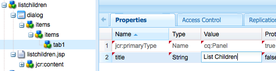

# Creare un sito Web completo (JSP){#create-a-fully-featured-website-jsp}

>[!NOTE]
>
>Questo articolo descrive come creare un sito Web utilizzando JSP e in base all’interfaccia classica.  Adobe consiglia di utilizzare le tecnologie AEM più recenti per i siti Web, come descritto in dettaglio nell&#39;articolo [Guida introduttiva allo sviluppo  AEM Sites](/help/sites-developing/getting-started.md).

Questa esercitazione consente di creare un sito Web completo con Adobe Experience Manager (AEM). Il sito web sarà basato su un sito web generico ed è rivolto principalmente agli sviluppatori web. Tutte le attività di sviluppo si svolgeranno in un ambiente di authoring.

Questa esercitazione descrive come:

1. Installare AEM.
1. Access CRXDE Lite (l&#39;ambiente di sviluppo).
1. Configurate la struttura del progetto in CRXDE Lite.
1. Creare il modello, il componente e gli script utilizzati come base per la creazione di pagine di contenuto.
1. Create la pagina principale per il sito Web e quindi le pagine di contenuto.
1. Create i seguenti componenti da usare sulle pagine:

   * Navigazione superiore
   * Elementi figli elenco
   * Logo
   * Immagine
   * Testo-immagine
   * Ricerca

1. Include vari componenti di base.

Dopo aver eseguito tutti i passaggi, le pagine avranno il seguente aspetto:


**Download del risultato finale**

Per seguire l&#39;esercitazione anziché eseguire gli esercizi, scaricate il sito Web-1.0.zip. Questo file è un pacchetto di contenuti AEM che contiene i risultati di questa esercitazione. Utilizzate [Package Manager](/help/sites-administering/package-manager.md) per installare il pacchetto nell&#39;istanza di creazione.

**NOTA:** L&#39;installazione di questo pacchetto sovrascrive tutte le risorse sull&#39;istanza di authoring creata con questa esercitazione.

Pacchetto contenuto del sito Web

[Ottieni file](assets/website-1_0.zip)

## Installazione di Adobe Experience Manager {#installing-adobe-experience-manager}

Per installare un&#39;istanza AEM per lo sviluppo del sito Web, seguite le istruzioni per configurare un ambiente di distribuzione [con le istanze di creazione e pubblicazione](/help/sites-deploying/deploy.md#author-and-publish-installs) oppure eseguite un&#39;installazione [generica](/help/sites-deploying/deploy.md#default-local-install). L&#39;installazione generica prevede il download del file JAR AEM Quickstart, il posizionamento del file license.properties nella stessa directory del file JAR e il doppio clic sul file JAR.

Dopo aver installato AEM, accedete all’ambiente di sviluppo CRXDE Lite facendo clic sul collegamento CRXDE Lite nella pagina di benvenuto:


>[!NOTE]
>
>L&#39;URL del CRXDE Lite per un&#39;istanza di creazione AEM installata localmente utilizzando la porta predefinita è [https://localhost:4502/crx/de/](https://localhost:4502/crx/de/).

### Impostazione della struttura del progetto in CRXDE Lite {#setting-up-the-project-structure-in-crxde-lite}

Utilizzate CRXDE Lite per creare la struttura dell’applicazione miosito Web nella directory archivio:

1. Nella struttura ad albero sul lato sinistro del CRXDE Lite, fare clic con il pulsante destro del mouse sulla cartella **`/apps`** e scegliere **Crea** > **Crea** **Cartella**. Nella finestra di dialogo **Crea cartella**, digitare `mywebsite` come nome della cartella e fare clic su **OK**.
1. Fare clic con il pulsante destro del mouse sulla cartella **`/apps/mywebsite`** e scegliere **Crea** > **Crea cartella**. Nella finestra di dialogo **Crea cartella**, digitare `components` come nome della cartella e fare clic su **OK**.
1. Fare clic con il pulsante destro del mouse sulla cartella **`/apps/mywebsite`** e scegliere **Crea** > **Crea cartella**. Nella finestra di dialogo **Crea cartella**, digitare `templates` come nome della cartella e fare clic su **OK**.

   La struttura nell&#39;albero dovrebbe ora essere simile a questa:

   

1. Fare clic su **Salva tutto**.

### Impostazione della progettazione {#setting-up-the-design}

In questa sezione è possibile creare la progettazione dell&#39;applicazione utilizzando lo strumento Designer. La progettazione fornisce file CSS e risorse di immagine per il sito Web.

>[!NOTE]
>
>Fate clic sul seguente collegamento per scaricare il file mywebsite.zip. L&#39;archivio contiene i file static.css e le immagini per la progettazione.

Esempio di file static.css e immagini

[Ottieni file](assets/mywebsite.zip)

1. Nella pagina di AEM benvenuto, fate clic su **Strumenti**. ([https://localhost:4502/libs/cq/core/content/welcome.html](https://localhost:4502/libs/cq/core/content/welcome.html))

   

1. Nella struttura delle cartelle, selezionare la cartella **Designs**, quindi fare clic su **New** > **New Page**. Digitare `mywebsite` come titolo e fare clic su **Crea**.

1. Se l’elemento del sito Web non viene visualizzato nella tabella, aggiornare la struttura ad albero o la tabella.

1. [Utilizzando ](/help/sites-administering/webdav-access.md) WebDAVaccess per l&#39;URL all&#39;indirizzo https://localhost:4502, copiate il  `static.css` file di esempio e la  `images` cartella dal file mywebsite.zip scaricato nella  `/etc/designs/mywebsite` cartella.

   

### Creazione di un modello, di un componente e di uno script per la pagina di contenuto {#creating-the-contentpage-template-component-and-script}

In questa sezione potete creare quanto segue:

* Modello di pagina di contenuto che verrà utilizzato per creare pagine di contenuto nel sito Web di esempio
* Componente pagina di contenuto che verrà utilizzato per il rendering delle pagine di contenuto
* Lo script contentpage

#### Creazione del modello di pagina contenuto {#creating-the-contentpage-template}

Create un modello da usare come base per le pagine Web del sito.

Un modello definisce il contenuto predefinito di una nuova pagina. I siti Web complessi possono utilizzare diversi modelli per la creazione di diversi tipi di pagine nel sito. In questo esercizio, tutte le pagine sono basate su un modello semplice.

1. Nella struttura delle cartelle del CRXDE Lite, fare clic con il pulsante destro del mouse su `/apps/mywebsite/templates` e scegliere **Crea** > **Crea modello**.

1. Nella finestra di dialogo Crea modello, digitate i seguenti valori e fate clic su **Avanti**:

   * **Etichetta**: contentpage
   * **Titolo**: Modello pagina contenuto sito Web personale
   * **Descrizione**: Questo è il mio modello di pagina del contenuto del sito Web
   * **Tipo di risorsa:** sito Web/componenti/pagina di contenuto

   Utilizzare il valore predefinito per la proprietà Classificazione.

   

   Il tipo di risorsa identifica il componente che esegue il rendering della pagina. In questo caso, tutte le pagine create utilizzando il modello di pagina del contenuto vengono rappresentate dal componente `mywebsite/components/contentpage`.

1. Per specificare i percorsi delle pagine che possono utilizzare questo modello, fare clic sul pulsante più e digitare `/content(/.*)?` nella casella di testo visualizzata. Quindi, fare clic su **Next**.

   

   Il valore della proprietà path consentita è un&#39;espressione *regolare.* Per le pagine con un percorso che corrisponde all&#39;espressione è possibile utilizzare il modello. In questo caso, l&#39;espressione regolare corrisponde al percorso della cartella **/content** e di tutte le relative sottopagine.

   Quando un autore crea una pagina sotto /content, il modello **content page** viene visualizzato in un elenco di modelli disponibili da utilizzare.

1. Fare clic su **Next** nei pannelli **Genitori consentiti** e **Figli consentiti** e fare clic su **OK**. In CRXDE Lite, fare clic su **Salva tutto**.

   

#### Creazione del componente della pagina di contenuto {#creating-the-contentpage-component}

Create il *componente* che definisce il contenuto ed esegue il rendering delle pagine che utilizzano il modello di pagina del contenuto. La posizione del componente deve corrispondere al valore della proprietà Tipo risorsa del modello di pagina del contenuto.

1. In CRXDE Lite, fare clic con il pulsante destro del mouse su `/apps/mywebsite/components` e scegliere **Crea** > **Componente**.
1. Nella finestra di dialogo **Crea componente**, digitare i seguenti valori di proprietà:

   * **Etichetta**: contentpage
   * **Titolo**: Componente pagina contenuto sito Web personale
   * **Descrizione**: Componente Pagina contenuto sito Web personale

   

   La posizione del nuovo componente è `/apps/mywebsite/components/contentpage`. Questo percorso corrisponde al tipo di risorsa del modello di pagina del contenuto (meno la parte iniziale **`/apps/`** del percorso).

   Questa corrispondenza collega il modello al componente ed è fondamentale per il corretto funzionamento del sito Web.

1. Fare clic su **Next** fino a visualizzare il pannello Elementi figlio consentiti della finestra di dialogo, quindi fare clic su **OK**. In CRXDE Lite, fare clic su **Salva tutto**.

   La struttura ora si presenta come segue:

   

#### Sviluppo dello script del componente della pagina di contenuto {#developing-the-contentpage-component-script}

Aggiungete il codice allo script contentpage.jsp per definire il contenuto della pagina.

1. In CRXDE Lite , aprire il file `contentpage.jsp` in `/apps/mywebsite/components/contentpage`. Per impostazione predefinita, il file contiene il codice seguente:

   ```java
   <%--
   
     My Website Content Page Component component.
   
     This is My Website Content Page Component.
   
   --%><%
   %><%@include file="/libs/foundation/global.jsp"%><%
   %><%@page session="false" %><%
   %><%
       /* TODO add you code here */
   %>
   ```

1. Copiate il codice seguente e incollatelo in contentpage.jsp dopo il codice predefinito:

   ```java
   <%@ page language="java" contentType="text/html; charset=ISO-8859-1"
       pageEncoding="ISO-8859-1"%>
   <!DOCTYPE html PUBLIC "-//W3C//DTD HTML 4.01 Transitional//EN"
   "https://www.w3.org/TR/html4/loose.dtd">
   <html>
   <head>
   <meta http-equiv="Content-Type" content="text/html; charset=ISO-8859-1">
   <title>My title</title>
   </head>
   <body>
   <div>My body</div>
   </body>
   </html>
   ```

1. Fare clic su **Salva tutto** per salvare le modifiche.

### Creazione di pagine di siti Web e di contenuti {#creating-your-website-page-and-content-pages}

In questa sezione vengono create le seguenti pagine che utilizzano tutte il modello di pagina di contenuto: Il mio sito Web, inglese, prodotti, servizi e clienti.

1. Nella pagina di AEM benvenuto ([https://localhost:4502/libs/cq/core/content/welcome.html](https://localhost:4502/libs/cq/core/content/welcome.html)), fate clic su Siti Web.

   

1. Nella struttura delle cartelle, selezionare la cartella **Siti Web**, quindi fare clic su **Nuovo** > **Nuova pagina**.
1. Nella finestra **Crea pagina**, immettere quanto segue:

   * Titolo: `My Website`
   * Nome: `mywebsite`
   * Selezionare la `My Website Content Page Template`

   

1. Fai clic su **Crea**. Nella struttura delle cartelle, selezionare la pagina **/Websites/My Website** e fare clic su **New** > **New Page**.
1. Nella finestra di dialogo Crea pagina, immettete i seguenti valori di proprietà e fate clic su Crea:

   * Titolo: Inglese
   * Nome: en
   * Selezionare il modello di pagina Contenuto del sito Web personale

1. Nella struttura delle cartelle, selezionare la pagina **/Websites/My Website/English** e fare clic su **New** **New Page**.
1. Nella finestra di dialogo **Crea pagina**, immettere i seguenti valori di proprietà, quindi fare clic su **Crea**:

   * Titolo: Prodotti
   * Selezionare il modello di pagina Contenuto del sito Web personale

1. Nella struttura delle cartelle, selezionare la pagina **/Websites/My Website/English** e fare clic su **New** > **New Page**.
1. Nella finestra di dialogo **Crea pagina**, immettere i seguenti valori di proprietà, quindi fare clic su **Crea**:

   * Titolo: Servizi
   * Selezionare il modello di pagina Contenuto del sito Web personale

1. Nella struttura delle cartelle, selezionare la pagina **/Websites/My Website/English** e fare clic su **New** > **New Page**.
1. Nella finestra di dialogo **Crea pagina**, immettere i seguenti valori di proprietà, quindi fare clic su **Crea**:

   * Titolo: Clienti
   * Selezionare il modello di pagina Contenuto del sito Web personale

   La struttura si presenta come segue:

   

1. Per collegare le pagine al progetto del mio sito Web, in CRXDE Lite, selezionate il nodo `/content/mywebsite/en/jcr:content`. Nella scheda Proprietà, digitare i valori seguenti per una nuova proprietà, quindi fare clic su Aggiungi:

   * Nome: cq:designPath
   * Tipo: Stringa
   * Valore: /etc/designs/mywebsite

   

1. In una nuova scheda o finestra del browser Web, aprire [https://localhost:4502/content/mywebsite/en/products.html](https://localhost:4502/content/mywebsite/en/products.html) per visualizzare la pagina Prodotti:

   

### Ottimizzazione dello script di pagina di contenuto {#enhancing-the-contentpage-script}

Questa sezione descrive come migliorare lo script della pagina di contenuto utilizzando gli script dei componenti AEM foundation e scrivendo script personalizzati.

La pagina **Products** avrà l&#39;aspetto seguente:


#### Utilizzo degli script di pagina di Foundation {#using-the-foundation-page-scripts}

In questo esercizio, è possibile configurare il componente contenuto pagina in modo che il relativo tipo di superficie sia il componente Pagina AEM. Poiché i componenti ereditano le funzionalità del relativo tipo di superpagina, il contenuto della pagina eredita gli script e le proprietà del componente Pagina.

Ad esempio, nel codice JSP del componente, è possibile fare riferimento agli script forniti dal componente supertipo come se fossero inclusi nel componente.

1. In CRXDE Lite, aggiungi una proprietà al nodo `/apps/mywebsite/components/contentpage`.

   1. Selezionare il nodo `/apps/mywebsite/components/contentpage`.
   1. Nella parte inferiore della scheda Proprietà, digitare i seguenti valori di proprietà, quindi fare clic su Aggiungi:

      * **Nome:** sling:resourceSuperType
      * **Tipo:** Stringa
      * **Valore:** foundation/components/page
   1. Fate clic su Salva tutto.


1. Aprire il file `contentpage.jsp` in `/apps/mywebsite/components/contentpage` e sostituire il codice esistente con il seguente codice:

   ```xml
   <%@include file="/libs/foundation/global.jsp"%><%
   %><%@page session="false" contentType="text/html; charset=utf-8" %><%
   %><!DOCTYPE HTML PUBLIC "-//W3C//DTD HTML 4.01//EN" "https://www.w3.org/TR/html4/strict.dtd">
   <html>
   <cq:include script="head.jsp"/>
   <cq:include script="body.jsp"/>
   </html>
   ```

1. Salvare le modifiche.
1. Nel browser, ricaricate la pagina Products (Prodotti). Si presenta come segue:

   

   Aprite l&#39;origine della pagina per visualizzare gli elementi javascript e HTML generati dagli script head.jsp e body.jsp. Lo snippet di script seguente apre la barra laterale quando si apre la pagina:

   ```java
   CQ.WCM.launchSidekick("/content/mywebsite/en/products",
               {propsDialog: "/libs/foundation/components/page/dialog",
                  locked: false locked: false
                });
   ```

#### Uso dei propri script {#using-your-own-scripts}

In questa sezione vengono creati diversi script che generano ciascuno una parte del corpo della pagina. Quindi create il file body.jsp nel componente PageContent per ignorare il file body.jsp del componente Pagina AEM. Nel file body.jsp è possibile includere gli script che generano le diverse parti del corpo della pagina.

**Suggerimento:** quando un componente include un file con lo stesso nome e la stessa posizione relativa di un file nel supertipo del componente, viene chiamato  *sovrapposizione*.

1. In CRXDE Lite, creare il file `left.jsp` in `/apps/mywebsite/components/contentpage`:

   1. Fare clic con il pulsante destro del mouse sul nodo `/apps/mywebsite/components/contentpage`, quindi selezionare **Create **then **Create File**.

   1. Nella finestra, digitare `left.jsp` come **Nome** e fare clic su **OK**.

1. Modificate il file `left.jsp` per rimuovere il contenuto esistente e sostituirlo con il seguente codice:

   ```java
   <%@include file="/libs/foundation/global.jsp"%><%
   %><div class="left">
   <div>logo</div>
   <div>newslist</div>
   <div>search</div>
   </div>
   ```

1. Salva le modifiche.
1. In CRXDE Lite, creare il file `center.jsp` in `/apps/mywebsite/components/contentpage`:

   1. Fare clic con il pulsante destro del mouse sul nodo `/apps/mywebsite/components/contentpage`, selezionare **Crea**, quindi **Crea file**.

   1. Nella finestra di dialogo, digitare `center.jsp` come **Nome** e fare clic su **OK**.

1. Modificate il file `center.jsp` per rimuovere il contenuto esistente e sostituirlo con il seguente codice:

   ```java
   <%@include file="/libs/foundation/global.jsp"%><%
   %><div class="center">
   <div>trail</div>
   <div>title</div>
   <div>parsys</div>
   </div>
   ```

1. Salva le modifiche.
1. In CRXDE Lite, creare il file `right.jsp` in `/apps/mywebsite/components/contentpage`:

   1. Fare clic con il pulsante destro del mouse sul nodo `/apps/mywebsite/components/contentpage`, selezionare **Crea**, quindi **Crea file**.

   1. Nella finestra di dialogo, digitare `right.jsp` come **Nome** e fare clic su **OK**.

1. Modificate il file `right.jsp` per rimuovere il contenuto esistente e sostituirlo con il seguente codice:

   ```java
   <%@include file="/libs/foundation/global.jsp"%><%
   %><div class="right">
   <div>iparsys</div>
   </div>
   ```

1. Salva le modifiche.
1. In CRXDE Lite, creare il file `body.jsp` in `/apps/mywebsite/components/contentpage`:
1. Modificate il file `body.jsp` per rimuovere il contenuto esistente e sostituirlo con il seguente codice:

   ```java
   <%@include file="/libs/foundation/global.jsp"%><%
   %><body>
   <div id="CQ">
   <div class="topnav">topnav</div>
   <div class="content">
   <cq:include script="left.jsp" />
   <cq:include script="center.jsp" />
   <cq:include script="right.jsp" />
   </div>
   <div class="footer">
   <div class="toolbar">toolbar</div>
   </div>
   </div>
   </body>
   ```

1. Salva le modifiche.
1. Nel browser, ricaricate la pagina Products (Prodotti). Si presenta come segue:

   

### Creazione del componente di navigazione superiore {#creating-the-top-navigation-component}

In questa sezione, potete creare un componente per visualizzare i collegamenti a tutte le pagine di livello principale del sito Web per semplificare la navigazione. Il contenuto di questo componente viene visualizzato nella parte superiore di tutte le pagine create utilizzando il modello di pagina del contenuto.

Nella prima versione del componente di navigazione superiore (navigazione superiore), gli elementi di navigazione sono solo collegamenti di testo. Nella seconda versione implementate la navigazione topnav con i collegamenti di navigazione delle immagini.

La navigazione superiore avrà il seguente aspetto:


#### Creazione del componente di navigazione superiore {#creating-the-top-navigation-component-1}

1. In CRXDE Lite, fare clic con il pulsante destro del mouse su `/apps/mywebsite/components`, selezionare **Crea**, quindi **Crea componente**.
1. Nella finestra **Crea componente**, immettere quanto segue:

   * **Etichetta**: `topnav`

   * **Titolo**: `My Top Navigation Component`

   * **Descrizione**: `This is My Top Navigation Component`

1. Fare clic su **Next** fino all&#39;ultima finestra in cui si fa clic su **OK**. Salvare le modifiche.

#### Creazione di uno script di navigazione superiore con collegamenti testuali {#creating-the-top-navigation-script-with-textual-links}

Aggiungete lo script di rendering alla navigazione superiore per generare collegamenti di testo alle pagine figlie:

1. In CRXDE Lite, aprire il file `topnav.jsp` in `/apps/mywebsite/components/topnav`.
1. Sostituite il codice presente copiando e incollando il seguente codice:

   ```xml
   <%@include file="/libs/foundation/global.jsp"%><%
   %><%@ page import="java.util.Iterator,
           com.day.text.Text,
           com.day.cq.wcm.api.PageFilter, com.day.cq.wcm.api.Page" %><%
       /* get starting point of navigation */
       Page navRootPage = currentPage.getAbsoluteParent(2);
       if (navRootPage == null && currentPage != null) {
       navRootPage = currentPage;
       }
       if (navRootPage != null) {
           Iterator<Page> children = navRootPage.listChildren(new PageFilter(request));
           while (children.hasNext()) {
               Page child = children.next();
               %><a href="<%= child.getPath() %>.html"><%=child.getTitle() %></a><%
           }
       }
   %>
   ```

#### Inclusione della navigazione in alto nel componente della pagina di contenuto {#including-top-navigation-in-the-contentpage-component}

Per includere la navigazione superiore nel componente della pagina di contenuto:

1. Nel CRXDE Lite , aprire la `body.jsp` in `/apps/mywebsite/components/contentpage`e sostituire:

   ```xml
   <div class="topnav">topnav</div>
   ```

   con:

   ```xml
   <cq:include path="topnav" resourceType="mywebsite/components/topnav" />
   ```

1. Salva le modifiche.
1. Nel browser, ricaricate la pagina Prodotti. La navigazione superiore viene visualizzata come segue:

   

#### Miglioramento delle pagine con sottotitoli {#enhancing-pages-with-subtitles}

Il componente Pagina definisce le proprietà che consentono di fornire sottotitoli per le pagine. Aggiungete sottotitoli che forniscono informazioni sul contenuto della pagina.

1. Nel browser, aprite la pagina **Products**.
1. Nella scheda Barra laterale **Pagina**, fare clic su **Proprietà pagina**.
1. Nella scheda Base della finestra di dialogo, espandere **Altri titoli e descrizioni,** e per la proprietà **Sottotitolo** digitare **cosa facciamo**. Fai clic su **OK**.
1. Ripetere i passaggi precedenti per aggiungere il sottotitolo **sui nostri servizi** alla pagina **Services**.
1. Ripetere i passaggi precedenti per aggiungere il sottotitolo **l&#39;attendibilità ottenuta** alla pagina **Customers**.

   **Suggerimento:** in CRXDE Lite, seleziona il nodo /content/mywebsite/en/products/jcr:content per verificare che la proprietà subtitle sia aggiunta.

#### Migliorare la navigazione in alto utilizzando i collegamenti immagine {#enhance-top-navigation-by-using-image-links}

Migliorate lo script di rendering del componente nav principale per utilizzare i collegamenti immagine invece del testo ipertestuale per i controlli di navigazione. L’immagine include il titolo e il sottotitolo della destinazione del collegamento.

Questo esercizio illustra [Elaborazione richiesta Sling](/help/sites-developing/the-basics.md#sling-request-processing). Lo script topnav.jsp viene modificato per richiamare uno script che genera dinamicamente immagini da utilizzare per i collegamenti di navigazione della pagina. In questo esercizio Sling analizza l’URL dei file sorgente delle immagini per determinare lo script da utilizzare per il rendering delle immagini.

Ad esempio, l’origine del collegamento immagine alla pagina Prodotti potrebbe essere https://localhost:4502/content/mywebsite/en/products.navimage.png. Sling analizza questo URL per determinare il tipo di risorsa e lo script da utilizzare per il rendering della risorsa:

1. Sling determina il percorso della risorsa da `/content/mwebysite/en/products.png.`
1. Sling corrisponde a questo percorso con il nodo `/content/mywebsite/en/products`.
1. Sling determina la `sling:resourceType` di questo nodo come `mywebsite/components/contentpage`.

1. Sling trova lo script in questo componente che meglio corrisponde al selettore URL ( `navimage`) e all&#39;estensione del nome file ( `png`).

In questo esercizio, Sling corrisponde a questi URL per lo script /apps/mywebsite/components/contentpage/navimage.png.java creato dall&#39;utente.

1. In CRXDE Lite, aprire la sezione `topnav.jsp` in `/apps/mywebsite/components/topnav.`Individuare il contenuto dell&#39;elemento di ancoraggio (riga 14):

   ```xml
   <%=child.getTitle() %>
   ```

1. Sostituite il contenuto dell’ancoraggio con il seguente codice:

   ```xml
   " src="<%= child.getPath() %>.navimage.png">
   ```

1. Salva le modifiche.
1. Fare clic con il pulsante destro del mouse sul nodo `/apps/mywebsite/components/contentpage` e scegliere **Crea** > **Crea file**.
1. Nella finestra **Crea file** digitare **Nome** `navimage.png.java`.

   L&#39;estensione del nome del file .java indica a Sling che il supporto Java per gli script Apache Sling deve essere utilizzato per compilare lo script e creare un servlet.

1. Copiate il codice seguente in `navimage.png.java.`Il codice estende la classe AbstractImageServlet:

   * [](https://helpx.adobe.com/experience-manager/6-5/sites/developing/using/reference-materials/javadoc/com/day/cq/wcm/commons/AbstractImageServlet.html) AbstractImageServletcrea un oggetto ImageContext che memorizza le proprietà della risorsa corrente.
   * La pagina padre della risorsa viene estratta dall&#39;oggetto ImageContext. Il titolo e il sottotitolo della pagina vengono quindi ottenuti.
   * [](https://helpx.adobe.com/experience-manager/6-5/sites/developing/using/reference-materials/javadoc/com/day/cq/commons/ImageHelper.html) ImageHelperis consente di generare l’immagine dal file navimage_bg.jpg della struttura del sito, dal titolo della pagina e dal sottotitolo della pagina.

   ```java
   package apps.mywebsite.components.contentpage;
   
   import java.awt.Color;
   import java.awt.Paint;
   import java.awt.geom.Rectangle2D;
   
   import java.io.IOException;
   import javax.jcr.RepositoryException;
   
   import com.day.cq.wcm.api.Page;
   import com.day.cq.wcm.api.PageManager;
   import com.day.cq.wcm.api.components.Component;
   import com.day.cq.wcm.api.designer.Designer;
   
   import com.day.cq.commons.SlingRepositoryException;
   import com.day.cq.wcm.commons.WCMUtils;
   import com.day.cq.wcm.commons.AbstractImageServlet;
   import com.day.cq.commons.ImageHelper;
   
   import com.day.image.Font;
   import com.day.image.Layer;
   
   import org.apache.sling.api.SlingHttpServletRequest;
   import org.apache.sling.api.SlingHttpServletResponse;
   import org.apache.sling.api.resource.Resource;
   import org.apache.sling.api.servlets.SlingSafeMethodsServlet;
   
   /**
     * Renders the navigation image
     */
   public class navimage_png extends AbstractImageServlet {
   
         protected Layer createLayer(ImageContext ctx)
                throws RepositoryException, IOException {
            PageManager pageManager = ctx.resolver.adaptTo(PageManager.class);
            Page currentPage = pageManager.getContainingPage(ctx.resource);
   
            /* constants for image appearance */
            int scale = 6;
            int paddingX = 24;
            int paddingY = 24;
            Color bgColor = new Color(0x004a565c, true);
   
            /* obtain the page title */
            String title = currentPage.getTitle();
            if (title == null) {
                title = currentPage.getName();
            }
   
            /* format the title text */
            title = title.toUpperCase();
            Paint titleColor = Color.WHITE;
            Font titleFont = new Font("Myriad Pro", 10 * scale, Font.BOLD);
            int titleBase = 10 * scale;
   
            /* obtain and format the page subtitle */
            String subtitle = currentPage.getProperties().get("subtitle", "");
            Paint subtitleColor = new Color(0xffa9afb1, true);
            Font subTitleFont = new Font("Tahoma", 7);
            int subTitleBase = 20;
   
            /* create a layer that contains the background image from the mywebsite design */
            Designer dg = ctx.resolver.adaptTo(Designer.class);
            String imgPath = new String(dg.getDesignPath(currentPage)+"/images/navimage_bg.jpg");
            Layer bg = ImageHelper.createLayer(ctx.resolver.resolve(imgPath));
   
            /* draw the title text (4 times bigger) */
            Rectangle2D titleExtent = titleFont.getTextExtent(0, 0, 0, 0, title, Font.ALIGN_LEFT, 0, 0);
            Rectangle2D subtitleExtent = subTitleFont.getTextExtent(0, 0, 0, 0, subtitle, Font.ALIGN_LEFT, 0, 0);
   
            /* ensure subtitleExtent is wide enough */
            if ( subtitle.length() > 0 ) {
                int titleWidth = (int)titleExtent.getWidth() / scale;
                if ( subtitleExtent.getWidth() > titleWidth && subtitleExtent.getWidth() + 2 * paddingX >
    bg.getWidth() ) {
                    int charWidth = (int)subtitleExtent.getWidth() / subtitle.length();
                    int maxWidth = (bg.getWidth() > titleWidth + 2  * paddingX ? bg.getWidth() - 2 * paddingX : titleWidth);
                    int len = (maxWidth - ( 2 * charWidth) ) / charWidth;
                    subtitle = subtitle.substring(0, len) + "...";
                    subtitleExtent = subTitleFont.getTextExtent(0, 0, 0, 0, subtitle, Font.ALIGN_LEFT, 0, 0);
                }
            }
            int width = Math.max((int) titleExtent.getWidth(), (int) subtitleExtent.getWidth());
           /* create the text layer */
            Layer text = new Layer(width, (int) titleExtent.getHeight() + 40, new Color(0x01ffffff, true));
            text.setPaint(titleColor);
            text.drawText(0, titleBase, 0, 0, title, titleFont, Font.ALIGN_LEFT | Font.ALIGN_BASE, 0, 0);
            text.resize(text.getWidth() / scale, text.getHeight() / scale);
            text.setX(0);
            text.setY(0);
   
            if (subtitle.length() > 0) {
                /* draw the subtitle normal sized */
                text.setPaint(subtitleColor);
                text.drawText(0, subTitleBase, 0, 0, subtitle, subTitleFont, Font.ALIGN_LEFT | Font.ALIGN_BASE, 0, 0);
            }
   
            /* merge the image and text layers */
            text.setY(paddingY);
            text.setX(paddingX);
            text.setBackgroundColor(bgColor);
   
            int bgWidth = bg.getWidth();
            if ( text.getWidth() + 2 * paddingX > bgWidth ) {
                bgWidth = text.getWidth() + 2 * paddingX;
                bg.resize(bgWidth, bg.getHeight());
            }
            bg.merge(text);
   
            return bg;
        }
    }
   ```

1. Salva le modifiche.
1. Nel browser, ricaricate la pagina Products (Prodotti). La navigazione superiore ora viene visualizzata come segue:

   

### Creazione del componente Elenco figli {#creating-the-list-children-component}

Creare il componente Elenco figlie che genera un elenco di collegamenti di pagina che include il titolo, la descrizione e la data delle pagine (ad esempio, pagine di prodotto). I collegamenti sono destinati alle pagine figlie della pagina corrente o di una pagina principale specificata nella finestra di dialogo del componente.


#### Creazione di pagine di prodotto {#creating-product-pages}

Create due pagine sotto la pagina Prodotti. Per ogni pagina, che descrive due prodotti specifici, potete impostare un titolo, una descrizione e una data.

1. Nella struttura delle cartelle della pagina Siti Web, selezionate l’elemento Siti Web/Sito Web personale/Inglese/Prodotti e fate clic su Nuovo > Nuova pagina.
1. Nella finestra di dialogo immettete i seguenti valori di proprietà e fate clic su Crea:

   * Titolo: Prodotto 1.
   * Nome: product1.
   * Seleziona il modello di pagina del contenuto del sito Web

1. Create un&#39;altra pagina sotto Products utilizzando i seguenti valori delle proprietà:

   * Titolo: Prodotto 2
   * Nome: product2
   * Seleziona il modello di pagina del contenuto del sito Web

1. In CRXDE Lite, imposta una descrizione e una data per la pagina Prodotto 1:

   1. Selezionare il nodo `/content/mywebsite/en/products/product1/jcr:content`.
   1. Nella scheda **Proprietà** immettere i valori seguenti:

      * Nome: `jcr:description`
      * Tipo: `String`
      * Valore: `This is a description of the Product 1!.`
   1. Fate clic su **Aggiungi**.
   1. Nella scheda **Proprietà**, creare un&#39;altra proprietà utilizzando i seguenti valori:

      * Nome: date
      * Tipo: Stringa
      * Valore: 14/02/2008
      * Fate clic su Aggiungi.
   1. Fate clic su Salva tutto.


1. In CRXDE Lite, imposta una descrizione e una data per la pagina Prodotto 2:

   1. Selezionate il nodo /content/mywebsite/en/products/product2/jcr:content.
   1. Nella scheda **Proprietà** immettere i valori seguenti:

      * Nome: jcr:description
      * Tipo: Stringa
      * Valore: Questa è una descrizione del Prodotto 2!.
   1. Fate clic su **Aggiungi**.
   1. Nelle stesse caselle di testo, sostituire i valori precedenti con i seguenti valori:

      * Nome: date
      * Tipo: Stringa
      * Valore: 11/05/2012
      * Fate clic su Aggiungi.
   1. Fate clic su Salva tutto.


#### Creazione del componente Elenco figli {#creating-the-list-children-component-1}

Per creare il componente ListChildren:

1. In CRXDE Lite, fare clic con il pulsante destro del mouse su `/apps/mywebsite/components`, selezionare **Crea**, quindi **Crea componente**.
1. Nella finestra di dialogo immettete i seguenti valori delle proprietà e fate clic su Avanti:

   * Etichetta: ascolta i bambini.
   * Titolo: Componente Listchild
   * Descrizione: Questo è il componente ListChildren

1. Continuate a fare clic su Avanti fino a visualizzare il pannello Elementi figlio consentiti, quindi fate clic su OK.

#### Creazione dello script List Children {#creating-the-list-children-script}

Sviluppare lo script per il componente listchild.

1. In CRXDE Lite, aprire il file `listchildren.jsp` in `/apps/mywebsite/components/listchildren`.
1. Sostituite il codice predefinito con il seguente codice:

   ```xml
   <%@include file="/libs/foundation/global.jsp"%><%
   %><%@ page import="java.util.Iterator,
            com.day.cq.wcm.api.PageFilter"%><%
        /* Create a new Page object using the path of the current page */
         String listroot = properties.get("listroot", currentPage.getPath());
        Page rootPage = pageManager.getPage(listroot);
        /* iterate through the child pages and gather properties */
        if (rootPage != null) {
            Iterator<Page> children = rootPage.listChildren(new PageFilter(request));
            while (children.hasNext()) {
                Page child = children.next();
                String title = child.getTitle() == null ? child.getName() : child.getTitle();
                String date = child.getProperties().get("date","");
                %><div class="item">
                <a href="<%= child.getPath() %>.html"><b><%= title %></b></a>
                <span><%= date %></code><br>
                <%= child.getProperties().get("jcr:description","") %><br>
                </div><%
            }
        }
    %>
   ```

1. Salva le modifiche.

#### Creazione della finestra di dialogo Elenca elementi figlio {#creating-the-list-children-dialog}

Creare la finestra di dialogo utilizzata per configurare le proprietà del componente ListChildren.

1. Create il nodo di dialogo sotto il componente listchild:

   1. In CRXDE Lite, fare clic con il pulsante destro del mouse sul nodo `/apps/mywebsite/components/listchildren`e fare clic su **Crea** > **Crea finestra di dialogo**.

   1. Nella finestra di dialogo, immettete i seguenti valori di proprietà e fate clic su OK

      * **Etichetta**: `dialog`

      * **Titolo**:  `Edit Component` quindi fate clic su  **OK**.

   

   Con le seguenti proprietà:

   

1. Selezionare il nodo `/apps/mywebsite/components/listchildren/dialog/items/items/tab1`.
1. Nella scheda Proprietà, modificare il valore della proprietà **title** in `List Children`

   

1. Selezionare il nodo tab1 e fare clic su Crea > Crea nodo, immettere i seguenti valori di proprietà, quindi fare clic su OK:

   * Nome: items
   * Tipo: cq:WidgetCollection

   

1. Create un nodo sotto il nodo items utilizzando i seguenti valori di proprietà:

   * Nome: listroot
   * Tipo: cq:Widget

   

1. Aggiungere proprietà per il nodo listroot per configurarlo come campo di testo. Ogni riga della tabella seguente rappresenta una proprietà. Al termine, fate clic su Salva tutto.

   | Nome | Tipo | Valore |
   |---|---|---|
   | fieldLabel | Stringa | Percorso della directory principale elenco |
   | name | Stringa | ./listroot |
   | xtype | Stringa | textfield |

   

#### Inclusione di elementi figlio elenco nel componente Pagina contenuto {#including-list-children-in-the-contentpage-component}

Per includere il componente listchild nel componente per la pagina di contenuto, procedete come segue:

1. In CRXDE Lite, aprire il file `left.jsp` in `/apps/mywebsite/components/contentpage` e individuare il seguente codice (riga 4):

   ```xml
   <div>newslist</div>
   ```

1. Sostituire il codice con il codice seguente:

   ```xml
   <cq:include path="newslist" resourceType="mywebsite/components/listchildren" />
   ```

1. Salva le modifiche.

#### Visualizzazione degli elementi secondari di un elenco in una pagina {#viewing-list-children-in-a-page}

Per visualizzare il funzionamento completo di questo componente è possibile visualizzare la pagina Prodotti:

* quando la pagina padre (&quot;Percorso della directory principale dell&#39;elenco&quot;) non è definita.
* quando è definita la pagina padre (&quot;Percorso della directory principale dell&#39;elenco&quot;).

1. Nel browser, ricaricate la pagina Prodotti. Il componente ListChildren viene visualizzato come segue:

   

1. 

1. Come Percorso della directory principale dell&#39;elenco, immettere: `/content/mywebsite/en`. Fai clic su OK. Il componente ListChildren sulla pagina si presenta ora come segue:

   

### Creazione del componente Logo {#creating-the-logo-component}

Create un componente che visualizzi il logo della società e fornisca un collegamento alla pagina principale del sito. Il componente contiene una finestra di dialogo in modalità di progettazione che consente di memorizzare i valori delle proprietà nella struttura del sito (ad esempio, nelle progettazioni o in un sito Web):

* I valori delle proprietà si applicano a tutte le istanze del componente che vengono aggiunte alle pagine che utilizzano la progettazione.
* Le proprietà possono essere configurate utilizzando qualsiasi istanza del componente presente in una pagina che utilizza la progettazione.

La finestra di dialogo in modalità progettazione contiene le proprietà per impostare l’immagine e il percorso del collegamento. Il componente logo viene posizionato in alto a sinistra su tutte le pagine del sito Web.

Si presenterà come segue:


>[!NOTE]
>
>Adobe Experience Manager fornisce un componente logo più completo ( `/libs/foundation/components/logo`).

#### Creazione del nodo componente logo {#creating-the-logo-component-node}

Per creare il componente logo, effettuate le seguenti operazioni:

1. In CRXDE Lite, fare clic con il pulsante destro del mouse su /apps/mywebsite/components, selezionare **Crea**, quindi **Crea componente**.
1. Nella finestra di dialogo Crea componente, immettete i seguenti valori di proprietà e fate clic su Avanti:

   * Etichetta: `logo`.
   * Titolo: `My Logo Component`.
   * Descrizione: `This is My Logo Component`.

1. Fare clic su Avanti fino al pannello finale della finestra di dialogo, quindi fare clic su **OK**.

#### Creazione dello script di logo {#creating-the-logo-script}

Questa sezione descrive come creare lo script per visualizzare l&#39;immagine del logo con un collegamento alla pagina principale.

1. In CRXDE Lite, aprire il file `logo.jsp` in `/apps/mywebsite/components/logo`.
1. Il codice seguente crea il collegamento alla home page del sito e aggiunge un riferimento all’immagine del logo. Copiate il codice in `logo.jsp`:

   ```xml
   <%@include file="/libs/foundation/global.jsp"%><%
   %><%@ page import="com.day.text.Text,
                      com.day.cq.wcm.foundation.Image,
                      com.day.cq.commons.Doctype" %><%
       /* obtain the path for home */
       long absParent = currentStyle.get("absParent", 2L);
       String home = Text.getAbsoluteParent(currentPage.getPath(), (int) absParent);
       /* obtain the image */
       Resource res = currentStyle.getDefiningResource("imageReference");
       if (res == null) {
           res = currentStyle.getDefiningResource("image");
       }
       /* if no image use text link, otherwise draw the image */
       %>
   <a href="<%= home %>.html"><%
       if (res == null) {
           %>Home<%
       } else {
           Image img = new Image(res);
           img.setItemName(Image.NN_FILE, "image");
           img.setItemName(Image.PN_REFERENCE, "imageReference");
           img.setSelector("img");
           img.setDoctype(Doctype.fromRequest(request));
           img.setAlt("Home");
           img.draw(out);
       }
       %></a>
   ```

1. Salva le modifiche.

#### Creazione della finestra di dialogo Progettazione logo {#creating-the-logo-design-dialog}

Create la finestra di dialogo per configurare il componente logo in modalità Progettazione. I nodi della finestra di dialogo in modalità Progettazione devono essere denominati `design_dialog`.

1. Create il nodo di dialogo sotto il componente logo:

   1. Fare clic con il pulsante destro del mouse sul nodo `/apps/mywebsite/components/logo` e scegliere **Crea** > **Crea finestra di dialogo**.

   1. Digitate i seguenti valori di proprietà e fate clic su OK:

      * **Etichetta:** `design_dialog`

      * **Titolo:** `Logo (Design)`

1. Fare clic con il pulsante destro del mouse sul nodo tab1 nel ramo design_dialog e scegliere Elimina. Fate clic su Salva tutto.
1. Sotto il nodo `design_dialog/items/items`creare un nuovo nodo denominato `img` di tipo `cq:Widget`. Aggiungete le seguenti proprietà e fate clic su Salva tutto:

   | Nome | Tipo | Valore |
   |---|---|---|
   | fileNameParameter | Stringa | ./imageName |
   | fileReferenceParameter | Stringa | ./imageReference |
   | name | Stringa | ./immagine |
   | titolo | Stringa | Immagine |
   | xtype | Stringa | html5smartimage |

   

#### Creazione dello script di rendering del logo {#creating-the-logo-render-script}

Create lo script che recupera l&#39;immagine logo e la scrive nella pagina.

1. Fare clic con il pulsante destro del mouse sul nodo del componente logo e scegliere Crea > Crea file per creare il file di script denominato img.GET.java.
1. Aprite il file, copiate il seguente codice nel file, quindi fate clic su Salva tutto:

```java
package apps.mywebsite.components.logo;

import java.io.IOException;
import java.io.InputStream;

import javax.jcr.RepositoryException;
import javax.jcr.Property;
import javax.servlet.http.HttpServletResponse;

import com.day.cq.wcm.foundation.Image;
import com.day.cq.wcm.commons.RequestHelper;
import com.day.cq.wcm.commons.WCMUtils;
import com.day.cq.wcm.commons.AbstractImageServlet;
import com.day.cq.commons.SlingRepositoryException;
import com.day.image.Layer;
import org.apache.commons.io.IOUtils;
import org.apache.sling.api.SlingHttpServletRequest;
import org.apache.sling.api.SlingHttpServletResponse;
import org.apache.sling.api.resource.Resource;
import org.apache.sling.api.resource.ValueMap;
import org.apache.sling.api.servlets.SlingSafeMethodsServlet;

/**
 * Renders an image
 */
public class img_GET extends AbstractImageServlet {

    protected Layer createLayer(ImageContext c)
            throws RepositoryException, IOException {
        /* don't create the layer yet. handle everything later */
        return null;
    }

    protected void writeLayer(SlingHttpServletRequest req,
                              SlingHttpServletResponse resp,
                              ImageContext c, Layer layer)
            throws IOException, RepositoryException {

        Image image = new Image(c.resource);
        image.setItemName(Image.NN_FILE, "image");
        image.setItemName(Image.PN_REFERENCE, "imageReference");
        if (!image.hasContent()) {
            resp.sendError(HttpServletResponse.SC_NOT_FOUND);
            return;
        }
        /* get pure layer */
        layer = image.getLayer(false, false, false);

        /* do not re-encode layer, just spool */
        Property data = image.getData();
        InputStream in = data.getStream();
        resp.setContentLength((int) data.getLength());
        String contentType = image.getMimeType();
        if (contentType.equals("application/octet-stream")) {
            contentType=c.requestImageType;
        }
        resp.setContentType(contentType);
        IOUtils.copy(in, resp.getOutputStream());
        in.close();

        resp.flushBuffer();
    }
}
```

#### Aggiunta del componente Logo al componente Pagina contenuto {#adding-the-logo-component-to-the-contentpage-component}

1. In CRXDE Lite, aprire la sezione `left.jsp` in `/apps/mywebsite/components/contentpage file` e individuare la riga di codice seguente:

   ```xml
   <div>logo</div>
   ```

1. Sostituire il codice con la seguente riga di codice:

   ```xml
   <cq:include path="logo" resourceType="mywebsite/components/logo" />
   ```

1. Salva le modifiche.
1. Nel browser, ricaricate la pagina Products (Prodotti). Il logo ha il seguente aspetto, ma al momento mostra solo il collegamento sottostante:

   

#### Impostazione dell&#39;immagine del logo in una pagina {#setting-the-logo-image-in-a-page}

Questa sezione descrive come impostare un’immagine come logo utilizzando la finestra di dialogo della modalità di progettazione.

1. Con la pagina Prodotti aperta nel browser, fate clic sul pulsante Progettazione nella parte inferiore della barra laterale per passare alla modalità di progettazione.

   

1. Nella barra Progettazione del logo, fate clic su Modifica per usare la finestra di dialogo per modificare le impostazioni per il componente logo.
1. Nella finestra di dialogo, fate clic nel pannello della scheda Immagine, individuate l’immagine logo.png estratta dal file mywebsite.zip e fate clic su OK.

   

1. Fate clic sul triangolo nella barra del titolo della barra laterale per tornare alla modalità di modifica.

   

1. In CRXDE Lite, andare al nodo seguente per vedere i valori delle proprietà memorizzate:

   `/etc/designs/mywebsite/jcr:content/contentpage/logo`

### Inclusione del componente Breadcrumb {#including-the-breadcrumb-component}

In questa sezione viene incluso il componente breadcrumb (trail), che è uno dei componenti di base.

1. Nel CRXDE Lite , individuare `/apps/mywebsite/components/contentpage`, aprire il file `center.jsp` e sostituire:

   ```java
   <div>trail</div>
   ```

   con:

   ```xml
   <cq:include path="trail" resourceType="foundation/components/breadcrumb" />
   ```

1. Salva le modifiche.
1. Nel browser, ricaricate la pagina **Prodotti 1**. Il componente trail si presenta come segue:

   

### Inclusione del componente Titolo {#including-the-title-component}

In questa sezione viene incluso il componente titolo, uno dei componenti di base.

1. Nel CRXDE Lite , individuare `/apps/mywebsite/components/contentpage`, aprire il file `center.jsp` e sostituire:

   ```xml
   <div>title</div>
   ```

   con:

   ```xml
   <cq:include path="title" resourceType="foundation/components/title" />
   ```

1. Salva le modifiche.
1. Nel browser, ricaricate la pagina Products (Prodotti). Il componente Titolo si presenta come segue:

   

   **Nota**: Potete impostare un diverso Titolo e Tipo/Dimensione in modalità di modifica.

### Inclusione del componente del sistema paragrafo {#including-the-paragraph-system-component}

Il sistema paragrafo (parsys) è una parte significativa di un sito Web in quanto gestisce un elenco di paragrafi. Consente agli autori di aggiungere componenti paragrafo alla pagina e fornisce la struttura.

Aggiungete il componente parsys (uno dei componenti di base) al componente della pagina di contenuto.

1. In CRXDE Lite, individuare `/apps/mywebsite/components/contentpage`, aprire il file `center.jsp` e individuare la seguente riga di codice:

   ```xml
   <div>parsys</div>
   ```

1. Sostituite la riga di codice con il codice seguente, quindi salvate le modifiche:

   ```xml
   <cq:include path="par" resourceType="foundation/components/parsys" />
   ```

1. Nel browser, aggiorna la pagina Prodotti. Ora ha il componente parsys, che è visto come segue:

   

### Creazione del componente immagine {#creating-the-image-component}

Create un componente per visualizzare un’immagine nel sistema di paragrafi. Per risparmiare tempo, il componente immagine viene creato come copia del componente logo con alcune modifiche alle proprietà.

>[!NOTE]
>
>Adobe Experience Manager offre un componente immagine più completo ( `/libs/foundation/components/image`).

#### Creazione del componente immagine {#creating-the-image-component-1}

1. Fare clic con il pulsante destro del mouse sul nodo `/apps/mywebsite/components/logo` e scegliere Copia.
1. Fare clic con il pulsante destro del mouse sul nodo `/apps/mywebsite/components` e scegliere Incolla.
1. Fare clic con il pulsante destro del mouse sul nodo `Copy of logo`, scegliere Rinomina, eliminare il testo esistente e digitare `image`.

1. Selezionate il nodo del componente `image` e modificate i seguenti valori delle proprietà:

   * `jcr:title:` Componente immagine personale.
   * `jcr:description`: Questo è il componente Immagine personale.

1. Aggiungete una proprietà al nodo `image` con i seguenti valori di proprietà:

   * Nome: componentGroup
   * Tipo: Stringa
   * Valore: MyWebsite

1. Sotto il nodo `image`, rinominare il nodo `design_dialog` in `dialog`.

1. Rinomina `logo.jsp` in `image.jsp.`

1. Aprite img.GET.java e modificate il pacchetto in `apps.mywebsite.components.image`.


#### Creazione dello script immagine {#creating-the-image-script}

Questa sezione descrive come creare lo script immagine.

1. Apri `/apps/mywebsite/components/image/` `image.jsp`
1. Sostituite il codice esistente con il seguente codice, quindi salvate le modifiche:

   ```xml
   <%@include file="/libs/foundation/global.jsp"%><%
   %><%@ page import="com.day.cq.commons.Doctype,
                       com.day.cq.wcm.foundation.Image,
                       com.day.cq.wcm.api.components.DropTarget,
                       com.day.cq.wcm.api.components.EditConfig,
                       com.day.cq.wcm.commons.WCMUtils" %><%
    /* global.jsp provides access to the current resource through the resource object */
           Image img = new Image(resource);
           img.setItemName(Image.NN_FILE, "image");
           img.setItemName(Image.PN_REFERENCE, "imageReference");
           img.setSelector("img");
           img.setDoctype(Doctype.fromRequest(request));
           img.setAlt("Home");
           img.draw(out); %>
   ```

1. Salva le modifiche.

#### Creazione del nodo cq:editConfig dell&#39;immagine {#creating-the-image-cq-editconfig-node}

Il tipo di nodo `cq:editConfig` consente di configurare alcuni comportamenti dei componenti durante la modifica delle relative proprietà.

In questa sezione, utilizzate un nodo cq:editConfig per consentire di trascinare le risorse da Content Finder nel componente immagine.

1. In CRXDE Lite, sotto il nodo /apps/mywebsite/components/image, create un nuovo nodo come segue:

   * Nome: cq:editConfig.
   * Tipo: cq:EditConfig.

1. Sotto il nodo cq:editConfig, crea un nuovo nodo come segue:

   * Nome: cq:dropTargets.
   * Tipo: cq:DropTargetConfig.

1. Sotto il nodo cq:dropTargets, create un nuovo nodo come segue:

   * Nome: immagine.
   * Tipo: nt:unstructure.

1. In CRXDE impostare le proprietà come segue:

| Nome | Tipo | Valore |
|---|---|---|
| accetto | Stringa | image/(gif | jpeg | png) |
| groups | Stringa | media |
| propertyName | Stringa | ./imageReference |


#### Aggiunta dell&#39;icona {#adding-the-icon}

In questa sezione, l’icona viene aggiunta per essere visualizzata accanto al componente immagine quando è elencato nella barra laterale:

1. Nel CRXDE Lite , fare clic con il pulsante destro del mouse sul file `/libs/foundation/components/image/icon.png` e selezionare **Copia.**
1. Fare clic con il pulsante destro del mouse sul nodo `/apps/mywebsite/components/image` e scegliere **Incolla**, quindi fare clic su **Salva tutto**.

#### Utilizzo del componente immagine {#using-the-image-component}

In questa sezione verrà visualizzata la pagina **Products** e verrà aggiunto il componente immagine al sistema di paragrafi.

1. Nel browser, ricaricate la pagina **Products**.
1. Nella barra laterale, fate clic sull&#39;icona **modalità di progettazione**.
1. Fate clic sul pulsante Modifica per modificare la finestra di dialogo di progettazione di par.
1. Nella finestra di dialogo viene visualizzato un elenco di **Componenti consentiti**; passare a **MyWebsite**, selezionare il **My Image Component** e fare clic su **OK.**
1. Tornare alla modalità di modifica **.**
1. Fate doppio clic sul fotogramma parsys (in **Trascinate qui i componenti o le risorse**). I selettori **Inserisci nuovo componente** e **Barra laterale** si presentano come segue:

   

### Inclusione del componente Barra degli strumenti {#including-the-toolbar-component}

In questa sezione viene incluso il componente della barra degli strumenti, che è uno dei componenti di base.

Sono disponibili diverse opzioni, sia in modalità di modifica che in modalità di progettazione.

1. Nel CRXDE Lite , andate a `/apps/mywebsite/components/contentpage`, aprite il file `body.jsp` e individuate il codice seguente:

   ```java
   <div class="toolbar">toolbar</div>
   ```

1. Sostituire il codice con il codice seguente, quindi salvare le modifiche.

   ```java
   <cq:include path="toolbar" resourceType="foundation/components/toolbar"/>
   ```

1. Nella struttura delle cartelle della pagina Siti Web AEM, selezionate Siti Web/My Website/English, quindi fate clic su Nuovo > Nuova pagina. Specificate i seguenti valori di proprietà e fate clic su Crea:

   * Titolo: Barra degli strumenti
   * Seleziona il modello di pagina del contenuto del sito Web

1. Nell’elenco delle pagine, fare clic con il pulsante destro del mouse sulla pagina Barra degli strumenti e scegliere Proprietà. Selezionare Nascondi in navigazione e fare clic su OK.

   L&#39;opzione Nascondi in navigazione impedisce la visualizzazione della pagina nei componenti di navigazione, come la navigazione superiore e gli elenchi secondari.

1. In Barra degli strumenti, creare le pagine seguenti:

   * Contatti
   * Commenti
   * Accesso
   * Ricerca

1. Nel browser, ricaricate la pagina Products (Prodotti). Si presenta come segue:

   

### Creazione del componente di ricerca {#creating-the-search-component}

In questa sezione, potete creare il componente per cercare contenuti nel sito Web. Questo componente di ricerca può essere inserito nel sistema paragrafo di qualsiasi pagina (ad esempio, in una pagina di risultati di ricerca specializzata).

Nella pagina **English** la casella di immissione della ricerca sarà visualizzata come segue:


#### Creazione del componente di ricerca {#creating-the-search-component-1}

1. In CRXDE Lite, fare clic con il pulsante destro del mouse su `/apps/mywebsite/components`, selezionare **Crea**, quindi **Crea componente**.
1. Utilizzare la finestra di dialogo per configurare il componente:

   1. Un primo pannello, specifica i seguenti valori di proprietà:

      * Etichetta: search
      * Titolo: My Search Component
      * Descrizione: Questo è il componente Ricerca personale
      * Gruppo: MyWebsite
   1. Fare clic su Avanti, quindi fare di nuovo clic su Avanti.
   1. Nel pannello Genitori consentiti, fare clic sul pulsante + e digitare `*/parsys`.
   1. Fare clic su Avanti, quindi su OK.


1. Fate clic su Salva tutto.
1. Copiate i seguenti nodi e incollateli nelle app/mywebsite/components/search node:

   * `/libs/foundation/components/search/dialog`
   * `` `/libs/foundation/components/search/i18n`

   * `/libs/foundation/components/search/icon.png`

1. Fate clic su Salva tutto.

#### Creazione dello script di ricerca {#creating-the-search-script}

Questa sezione descrive come creare lo script di ricerca:

1. Aprire il file `/apps/mywebsite/components/search/search.jsp`.
1. Copiate il seguente codice in `search.jsp`:

   ```java
   <%@ page import="com.day.cq.wcm.foundation.Search,com.day.cq.tagging.TagManager" %>
   <%@include file="/libs/foundation/global.jsp" %><%
   %><cq:setContentBundle/><%
       Search search = new Search(slingRequest);
   
       String searchIn = (String) properties.get("searchIn");
       String requestSearchPath = request.getParameter("path");
       if (searchIn != null) {
           /* only allow the "path" request parameter to be used if it
            is within the searchIn path configured */
           if (requestSearchPath != null && requestSearchPath.startsWith(searchIn)) {
               search.setSearchIn(requestSearchPath);
           } else {
               search.setSearchIn(searchIn);
           }
       } else if (requestSearchPath != null) {
           search.setSearchIn(requestSearchPath);
       }
   
       pageContext.setAttribute("search", search);
       TagManager tm = resourceResolver.adaptTo(TagManager.class);
   %><c:set var="trends" value="${search.trends}"/><%
   %><center>
     <form action="${currentPage.path}.html">
       <input size="41" maxlength="2048" name="q" value="${fn:escapeXml(search.query)}"/>
       <input value="<fmt:message key="searchButtonText"/>" type="submit" />
     </form>
   </center>
   <br/>
   <c:set var="result" value="${search.result}"/>
   <c:choose>
     <c:when test="${empty result && empty search.query}">
     </c:when>
     <c:when test="${empty result.hits}">
       <c:if test="${result.spellcheck != null}">
         <p><fmt:message key="spellcheckText"/> <a href="<c:url value="${currentPage.path}.html"><c:param name="q" value="${result.spellcheck}"/></c:url>"><b><c:out value="${result.spellcheck}"/></b></a></p>
       </c:if>
       <fmt:message key="noResultsText">
         <fmt:param value="${fn:escapeXml(search.query)}"/>
       </fmt:message>
     </c:when>
     <c:otherwise>
       <p class="searchmeta">Results ${result.startIndex + 1} - ${result.startIndex + fn:length(result.hits)} of ${result.totalMatches} for <b>${fn:escapeXml(search.query)}</b>. (${result.executionTime} seconds)</p>
      <br/>
   
     <div class="searchresults">
       <div class="results">
         <c:forEach var="hit" items="${result.hits}" varStatus="status">
           <div class="hit">
           <a href="${hit.URL}">${hit.title}</a>
           <div class="excerpt">${hit.excerpt}</div>
          <div class="hiturl"> ${hit.URL}<c:if test="${!empty hit.properties['cq:lastModified']}"> - <c:catch><fmt:formatDate value="${hit.properties['cq:lastModified'].time}" dateStyle="medium"/></c:catch></c:if> - <a href="${hit.similarURL}"><fmt:message key="similarPagesText"/></a>
           </div></div>
         </c:forEach>
       </div>
         <br/>
   
        <div class="searchRight">
             <c:if test="${fn:length(trends.queries) > 0}">
                 <p><fmt:message key="searchTrendsText"/></p>
                 <div class="searchTrends">
                     <c:forEach var="query" items="${trends.queries}">
                         <a href="<c:url value="${currentPage.path}.html"><c:param name="q" value="${query.query}"/></c:url>"><span style="font-size:${query.size}px"><c:out value="${query.query}"/></code></a>
                     </c:forEach>
                 </div>
             </c:if>
             <c:if test="${result.facets.languages.containsHit}">
                 <p>Languages</p>
                 <c:forEach var="bucket" items="${result.facets.languages.buckets}">
                     <c:set var="bucketValue" value="${bucket.value}"/>
                     <c:set var="label" value='<%= new java.util.Locale((String) pageContext.getAttribute("bucketValue")).getDisplayLanguage(request.getLocale()) %>'/>
                     <c:choose>
                         <c:when test="${param.language != null}">${label} (${bucket.count}) - <a href="<cq:requestURL><cq:removeParam name="language"/></cq:requestURL>">remove filter</a></c:when>
                         <c:otherwise><a title="filter results" href="<cq:requestURL><cq:addParam name="language" value="${bucket.value}"/></cq:requestURL>">${label} (${bucket.count})</a></c:otherwise>
                     </c:choose><br/>
                 </c:forEach>
             </c:if>
             <c:if test="${result.facets.tags.containsHit}">
                 <p>Tags</p>
                 <c:forEach var="bucket" items="${result.facets.tags.buckets}">
                     <c:set var="bucketValue" value="${bucket.value}"/>
                     <c:set var="tag" value="<%= tm.resolve((String) pageContext.getAttribute("bucketValue")) %>"/>
                     <c:if test="${tag != null}">
                         <c:set var="label" value="${tag.title}"/>
                         <c:choose>
                             <c:when test="<%= request.getParameter("tag") != null && java.util.Arrays.asList(request.getParameterValues("tag")).contains(pageContext.getAttribute("bucketValue")) %>">${label} (${bucket.count}) - <a href="<cq:requestURL><cq:removeParam name="tag" value="${bucket.value}"/></cq:requestURL>">remove filter</a></c:when>
                             <c:otherwise><a title="filter results" href="<cq:requestURL><cq:addParam name="tag" value="${bucket.value}"/></cq:requestURL>">${label} (${bucket.count})</a></c:otherwise>
                         </c:choose><br/>
                     </c:if>
                 </c:forEach>
             </c:if>
             <c:if test="${result.facets.mimeTypes.containsHit}">
                 <jsp:useBean id="fileTypes" class="com.day.cq.wcm.foundation.FileTypes"/>
                 <p>File types</p>
                 <c:forEach var="bucket" items="${result.facets.mimeTypes.buckets}">
                     <c:set var="bucketValue" value="${bucket.value}"/>
                     <c:set var="label" value="${fileTypes[bucket.value]}"/>
                     <c:choose>
                         <c:when test="<%= request.getParameter("mimeType") != null && java.util.Arrays.asList(request.getParameterValues("mimeType")).contains(pageContext.getAttribute("bucketValue")) %>">${label} (${bucket.count}) - <a href="<cq:requestURL><cq:removeParam name="mimeType" value="${bucket.value}"/></cq:requestURL>">remove filter</a></c:when>
                         <c:otherwise><a title="filter results" href="<cq:requestURL><cq:addParam name="mimeType" value="${bucket.value}"/></cq:requestURL>">${label} (${bucket.count})</a></c:otherwise>
                     </c:choose><br/>
                 </c:forEach>
             </c:if>
             <c:if test="${result.facets.lastModified.containsHit}">
                 <p>Last Modified</p>
                 <c:forEach var="bucket" items="${result.facets.lastModified.buckets}">
                     <c:choose>
                         <c:when test="${param.from == bucket.from && param.to == bucket.to}">${bucket.value} (${bucket.count}) - <a href="<cq:requestURL><cq:removeParam name="from"/><cq:removeParam name="to"/></cq:requestURL>">remove filter</a></c:when>
                         <c:otherwise><a title="filter results" href="<cq:requestURL><cq:removeParam name="from"/><cq:removeParam name="to"/><c:if test="${bucket.from != null}"><cq:addParam name="from" value="${bucket.from}"/></c:if><c:if test="${bucket.to != null}"><cq:addParam name="to" value="${bucket.to}"/></c:if></cq:requestURL>">${bucket.value} (${bucket.count})</a></c:otherwise>
                     </c:choose><br/>
                 </c:forEach>
             </c:if>
   
         <c:if test="${fn:length(search.relatedQueries) > 0}">
   
          <br/><br/><div class="related">
           <fmt:message key="relatedSearchesText"/>
           <c:forEach var="rq" items="${search.relatedQueries}">
               <a href="${currentPage.path}.html?q=${rq}"><c:out value="${rq}"/></a>
           </c:forEach></div>
         </c:if>
         </div>
   
         <c:if test="${fn:length(result.resultPages) > 1}">
           <div class="pagination">
               <fmt:message key="resultPagesText"/>
           <c:if test="${result.previousPage != null}">
             <a href="${result.previousPage.URL}"><fmt:message key="previousText"/></a>
           </c:if>
           <c:forEach var="page" items="${result.resultPages}">
             <c:choose>
               <c:when test="${page.currentPage}">${page.index + 1}</c:when>
               <c:otherwise>
                 <a href="${page.URL}">${page.index + 1}</a>
               </c:otherwise>
             </c:choose>
           </c:forEach>
           <c:if test="${result.nextPage != null}">
             <a href="${result.nextPage.URL}"><fmt:message key="nextText"/></a>
           </c:if>
           </div>
         </c:if>
         </div>
   
     </c:otherwise>
   </c:choose>
   ```

1. Salva le modifiche.

#### Inclusione di una casella di ricerca nel componente Pagina contenuto {#including-a-search-box-in-the-contentpage-component}

Per includere una casella di input per la ricerca nella sezione sinistra della pagina di contenuto, procedere come segue:

1. In CRXDE Lite, aprire il file `left.jsp` in `/apps/mywebsite/components/contentpage` e individuare il seguente codice (riga 2):

   ```xml
   %><div class="left">
   ```

1. Inserire il seguente codice **prima di** la riga:

   ```java
   %><%@ page import="com.day.text.Text"%><%
   %><% String docroot = currentDesign.getPath();
   String home = Text.getAbsoluteParent(currentPage.getPath(), 2);%><%
   ```

1. Individuate la seguente riga di codice:

   ```xml
   <div>search</div>
   ```

1. Sostituire il codice con il codice seguente, quindi salvare le modifiche.

   ```java
   <div class="form_1">
        <form class="geo" action="<%= home %>/toolbar/search.html" id="form" >
             <p>
                  <input class="geo" type="text" name="q"><br>
                  <a href="<%= home %>/toolbar/search.html" class="link_1">advanced search</a>
             </p>
        </form>
   </div>
   ```

1. Nel browser, ricaricate la pagina Products (Prodotti). Il componente di ricerca si presenta come segue:

   

#### Inclusione del componente Ricerca nella pagina di ricerca {#including-the-search-component-in-the-search-page}

In questa sezione viene aggiunto il componente di ricerca al sistema di paragrafi.

1. Nel browser, aprite la pagina di ricerca.
1. Nella barra laterale fate clic sull’icona della modalità di progettazione.
1. Nella struttura del blocco par (sotto il titolo Cerca), fare clic su Modifica.
1. Nella finestra di dialogo, scorrete verso il basso fino al gruppo **My Websites**, selezionate **My Search Component** e fate clic su **OK**.
1. Nella barra laterale, fate clic sul triangolo per tornare alla modalità di modifica.
1. Trascinate il componente Ricerca personale dalla barra laterale alla cornice parsys. Si presenta come segue:

   

1. Passate alla pagina Prodotti. Cercare i clienti nella casella di input e premere Invio. Viene nuovamente visualizzata la pagina di ricerca. Passa alla modalità di anteprima: l&#39;output è in un formato simile al seguente:

   

### Inclusione del componente Iparsys {#including-the-iparsys-component}

In questa sezione viene incluso il componente Iparsys (Inheritance Paragraph System), uno dei componenti di base. Questo componente consente di creare una struttura di paragrafi su una pagina padre e fare in modo che le pagine figlie ereditino i paragrafi.

Per questo componente potete impostare diversi parametri sia in modalità di modifica che in modalità di progettazione.

1. Nel CRXDE Lite , andate a `/apps/mywebsite/components/contentpage`, aprite il file `right.jsp` e sostituite:

   ```java
   <div>iparsys</div>
   ```

   con:

   ```java
   <cq:include path="rightpar" resourceType="foundation/components/iparsys" />
   ```

1. Salva le modifiche.
1. Nel browser, ricaricate la pagina** Products**. L’intera pagina si presenta come segue:

   
