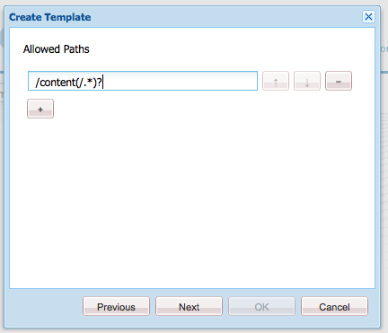
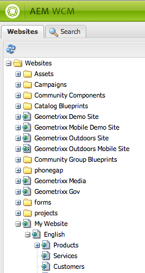
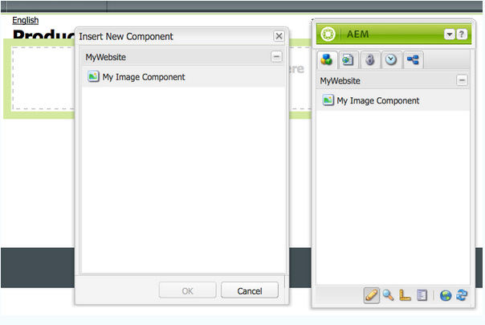
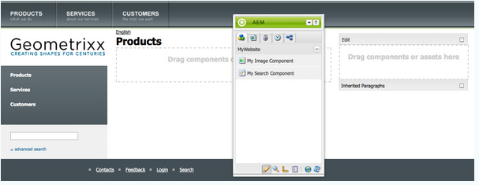

# Creare un sito web completo (JSP){#create-a-fully-featured-website-jsp}

>[!NOTE]
>
>Questo articolo descrive come creare un sito web utilizzando JSP e basato sull’interfaccia classica. L’Adobe consiglia di utilizzare le tecnologie Adobe Experience Manager (AEM) più recenti per i siti web, come descritto in dettaglio nell’articolo [Guida introduttiva allo sviluppo per AEM Sites](/help/sites-developing/getting-started.md).

Questa esercitazione consente di creare un sito Web completo di tutte le funzioni con AEM. Il sito web sarà basato su un sito web generico ed è destinato principalmente agli sviluppatori web. Tutto lo sviluppo avviene all’interno di un ambiente di authoring.

Questo tutorial descrive come:

1. Installare AEM.
1. Accedere a CRXDE Liti (l’ambiente di sviluppo).
1. Imposta la struttura del progetto in CRXDE Liti.
1. Crea il modello, il componente e gli script utilizzati come base per la creazione delle pagine di contenuto.
1. Crea la pagina root per il tuo sito web e quindi per le pagine di contenuto.
1. Crea i seguenti componenti da utilizzare sulle pagine:

   * Navigazione superiore
   * Elementi figli elenco
   * Logo
   * Immagine
   * Text-Image
   * Ricerca

1. Includi vari componenti di base.

Dopo aver eseguito tutti i passaggi, le pagine dovrebbero avere il seguente aspetto:


**Scarica il risultato finale**

Per seguire insieme al tutorial invece di eseguire gli esercizi, scarica il sito web-1.0.zip. Questo file è un pacchetto di contenuti AEM che contiene i risultati di questa esercitazione. Utilizzare [Gestione pacchetti](/help/sites-administering/package-manager.md) per installare il pacchetto nell’istanza di authoring.

**NOTA:** L’installazione di questo pacchetto sovrascrive tutte le risorse sull’istanza di authoring creata con questa esercitazione.

Pacchetto di contenuti per siti web

[Ottieni file](assets/website-1_0.zip)

## Installazione di Adobe Experience Manager {#installing-adobe-experience-manager}

Per installare un’istanza AEM per lo sviluppo del sito web, segui le istruzioni per la configurazione di un’ [ambiente di implementazione con istanze di authoring e pubblicazione](/help/sites-deploying/deploy.md#author-and-publish-installs), o eseguire un [installazione generica](/help/sites-deploying/deploy.md#default-local-install). L’installazione generica comporta il download del file JAR Quickstart dell’AEM, l’inserimento del file license.properties nella stessa directory del file JAR e il doppio clic sul file JAR.

Dopo aver installato AEM, accedi all’ambiente di sviluppo CRXDE Liti facendo clic sul collegamento CRXDE Liti nella pagina iniziale:


>[!NOTE]
>
>L’URL di CRXDE Liti per un’istanza di authoring AEM installata localmente utilizzando la porta predefinita è [https://localhost:4502/crx/de/](https://localhost:4502/crx/de/).

### Configurazione della struttura del progetto in CRXDE Liti {#setting-up-the-project-structure-in-crxde-lite}

Utilizza CRXDE Liti per creare la struttura dell’applicazione mysite nell’archivio:

1. Nella struttura ad albero sul lato sinistro di CRXDE Liti, fare clic con il pulsante destro del mouse su **`/apps`** cartella e fai clic su **Crea** > **Crea** **Cartella**. In **Crea cartella** finestra di dialogo, digita `mywebsite` come nome della cartella e fai clic su **OK**.
1. Fare clic con il pulsante destro del mouse **`/apps/mywebsite`** cartella e fai clic su **Crea** > **Crea cartella**. In **Crea cartella** finestra di dialogo, digita `components` come nome della cartella e fai clic su **OK**.
1. Fare clic con il pulsante destro del mouse **`/apps/mywebsite`** cartella e fai clic su **Crea** > **Crea cartella**. In **Crea cartella** finestra di dialogo, digita `templates` come nome della cartella e fai clic su **OK**.

   La struttura nell’albero ora dovrebbe essere simile a questa:

   

1. Clic **Salva tutto**.

### Impostazione della progettazione {#setting-up-the-design}

In questa sezione viene creata la progettazione per l&#39;applicazione utilizzando lo strumento Designer. La progettazione fornisce risorse CSS e immagini per il sito web.

>[!NOTE]
>
>Fai clic sul seguente collegamento per scaricare mywebsite.zip. L&#39;archivio contiene i file static.css e i file immagine per la progettazione.

Esempio di file static.css e immagini

[Ottieni file](assets/mywebsite.zip)

1. Nella pagina iniziale dell’AEM, fai clic su **Strumenti**. ([https://localhost:4502/libs/cq/core/content/welcome.html](https://localhost:4502/libs/cq/core/content/welcome.html))

   

1. Nella struttura ad albero delle cartelle, seleziona **Progettazioni** cartella e quindi fare clic su **Nuovo** > **Nuova pagina**. Tipo `mywebsite` come titolo e fai clic su **Crea**.

1. Se l&#39;elemento del sito Web non viene visualizzato nella tabella, aggiornare la struttura o la tabella.

1. [Utilizzo di WebDAV](/help/sites-administering/webdav-access.md) accedere all’URL all’indirizzo https://localhost:4502, copia l’esempio `static.css` file e `images` cartella dal file mywebsite.zip scaricato in `/etc/designs/mywebsite` cartella.

   

### Creazione di modello, componente e script Content Page {#creating-the-contentpage-template-component-and-script}

In questa sezione vengono creati i seguenti elementi:

* Modello di pagina contenuto utilizzato per creare pagine di contenuto nel sito Web di esempio.
* Il componente contentpage utilizzato per eseguire il rendering delle pagine di contenuto.
* Lo script contentpage.

#### Creazione del modello ContentPage {#creating-the-contentpage-template}

Crea un modello da utilizzare come base per le pagine web del sito.

Un modello definisce il contenuto predefinito di una nuova pagina. I siti web complessi possono utilizzare diversi modelli per creare i diversi tipi di pagine del sito. In questo esercizio, tutte le pagine si basano su un modello semplice.

1. Nella struttura ad albero delle cartelle di CRXDE Liti, fai clic con il pulsante destro del mouse su `/apps/mywebsite/templates` e fai clic su **Crea** > **Crea modello**.

1. Nella finestra di dialogo Crea modello, digita i seguenti valori e fai clic su **Successivo**:

   * **Etichetta**: contentpage
   * **Titolo**: Modello per pagina di contenuto del mio sito web
   * **Descrizione**: questo è il modello per la pagina di contenuto del mio sito web
   * **Tipo risorsa:** mywebsite/components/contentpage

   Utilizzare il valore predefinito per la proprietà Ranking.

   

   Il tipo di risorsa identifica il componente che esegue il rendering della pagina. In questo caso, tutte le pagine create utilizzando il modello contentpage vengono sottoposte a rendering da `mywebsite/components/contentpage` componente.

1. Per specificare i percorsi delle pagine che possono utilizzare questo modello, fai clic sul pulsante più e digita `/content(/.*)?` nella casella di testo visualizzata. Quindi, fai clic su **Successivo**.

   

   Il valore della proprietà percorso consentita è un *espressione regolare.* Le pagine con un percorso che corrisponde all’espressione possono utilizzare il modello. In questo caso, l’espressione regolare corrisponde al percorso del **/content** cartella e tutte le pagine secondarie.

   Quando un autore crea una pagina sotto /content, la **contentpage** Il modello viene visualizzato in un elenco di modelli disponibili da utilizzare.

1. Clic **Successivo** nel **Elementi padre consentiti** e **Elementi figlio consentiti** e fai clic su **OK**. In CRXDE Liti, fai clic su **Salva tutto**.

   

#### Creazione del componente ContentPage {#creating-the-contentpage-component}

Creare *componente* che definisce il contenuto ed esegue il rendering delle pagine che utilizzano il modello contentpage. La posizione del componente deve corrispondere al valore della proprietà Tipo risorsa del modello contentpage.

1. In CRXDE Liti, fai clic con il pulsante destro del mouse `/apps/mywebsite/components` e fai clic su **Crea** > **Componente**.
1. In **Crea componente** , digitare i seguenti valori di proprietà:

   * **Etichetta**: contentpage
   * **Titolo**: Componente Pagina di contenuto del sito Web
   * **Descrizione**: questo è il componente Pagina di contenuto del mio sito web

   

   La posizione del nuovo componente è `/apps/mywebsite/components/contentpage`. Questo percorso corrisponde al tipo di risorsa del modello contentpage (meno l&#39;iniziale **`/apps/`** parte del percorso).

   Questa corrispondenza collega il modello al componente ed è fondamentale per il corretto funzionamento del sito web.

1. Clic **Successivo** finché non viene visualizzato il pannello Figli consentiti della finestra di dialogo, quindi fate clic su **OK**. In CRXDE Liti, fai clic su **Salva tutto**.

   La struttura si presenta ora come segue:

   

#### Sviluppo dello script del componente ContentPage {#developing-the-contentpage-component-script}

Aggiungi il codice allo script contentpage.jsp per definire il contenuto della pagina.

1. In CRXDE Liti, apri il file `contentpage.jsp` in `/apps/mywebsite/components/contentpage`. Per impostazione predefinita, il file contiene il seguente codice:

   ```java
   <%--
   
     My Website Content Page Component component.
   
     This is My Website Content Page Component.
   
   --%><%
   %><%@include file="/libs/foundation/global.jsp"%><%
   %><%@page session="false" %><%
   %><%
       /* TODO add you code here */
   %>
   ```

1. Copia il seguente codice e incollalo in contentpage.jsp dopo il codice predefinito:

   ```java
   <%@ page language="java" contentType="text/html; charset=ISO-8859-1"
       pageEncoding="ISO-8859-1"%>
   <!DOCTYPE html PUBLIC "-//W3C//DTD HTML 4.01 Transitional//EN"
   "https://www.w3.org/TR/html4/loose.dtd">
   <html>
   <head>
   <meta http-equiv="Content-Type" content="text/html; charset=ISO-8859-1">
   <title>My title</title>
   </head>
   <body>
   <div>My body</div>
   </body>
   </html>
   ```

1. Clic **Salva tutto** per salvare le modifiche.

### Creazione della pagina del sito web e delle pagine di contenuto {#creating-your-website-page-and-content-pages}

In questa sezione vengono create le pagine seguenti che utilizzano tutte il modello contentpage: Il mio sito Web, Inglese, Prodotti, Servizi e Clienti.

1. Nella pagina di benvenuto del AEM ([https://localhost:4502/libs/cq/core/content/welcome.html](https://localhost:4502/libs/cq/core/content/welcome.html)), fare clic su Siti Web.

   

1. Nella struttura ad albero delle cartelle, seleziona **Siti Web** cartella e quindi fare clic su **Nuovo** > **Nuova pagina**.
1. In **Crea pagina** immettere quanto segue:

   * Titolo: `My Website`
   * Nome: `mywebsite`
   * Seleziona la `My Website Content Page Template`

   

1. Fai clic su **Crea**. Nella struttura ad albero delle cartelle, seleziona **/Siti Web/Sito Web personale** pagina e fai clic su **Nuovo** > **Nuova pagina**.
1. Nella finestra di dialogo Crea pagina, immetti i seguenti valori delle proprietà, quindi fai clic su Crea:

   * Titolo: Inglese
   * Nome: it
   * Seleziona il modello per pagina di contenuto del sito Web personale

1. Nella struttura ad albero delle cartelle, seleziona **/Websites/My Website/English** pagina e fai clic su **Nuovo**> **Nuova pagina**.
1. In **Crea pagina** , immettere i valori delle proprietà seguenti e quindi fare clic su **Crea**:

   * Title: Prodotti
   * Seleziona il modello per pagina di contenuto del sito Web personale

1. Nella struttura ad albero delle cartelle, seleziona **/Websites/My Website/English** pagina e fai clic su **Nuovo** > **Nuova pagina**.
1. In **Crea pagina** , immettere i valori delle proprietà seguenti e quindi fare clic su **Crea**:

   * Titolo: Servizi
   * Seleziona il modello per pagina di contenuto del sito Web personale

1. Nella struttura ad albero delle cartelle, seleziona **/Websites/My Website/English** pagina e fai clic su **Nuovo** > **Nuova pagina**.
1. In **Crea pagina** , immettere i valori delle proprietà seguenti e quindi fare clic su **Crea**:

   * Titolo: Clienti
   * Seleziona il modello per pagina di contenuto del sito Web personale

   La struttura si presenta come segue:

   

1. Per collegare le pagine alla progettazione del sito Web, in CRXDE Liti seleziona la `/content/mywebsite/en/jcr:content` nodo. Nella scheda Proprietà digitare i valori seguenti per una nuova proprietà e quindi fare clic su Aggiungi:

   * Nome: cq:designPath
   * Tipo: String
   * Valore: /etc/designs/mywebsite

   

1. In una nuova scheda o finestra del browser Web, apri [https://localhost:4502/content/mywebsite/en/products.html](https://localhost:4502/content/mywebsite/en/products.html) per visualizzare la pagina Prodotti:

   

### Miglioramento dello script ContentPage {#enhancing-the-contentpage-script}

Questa sezione descrive come migliorare lo script contentpage utilizzando gli script dei componenti di base AEM e scrivendo script personalizzati.

Al termine, la **Prodotti** La pagina deve avere il seguente aspetto:


#### Utilizzo degli script di pagina di Foundation {#using-the-foundation-page-scripts}

In questo esercizio configurerai il componente pagecontent in modo che il suo supertipo sia il componente Pagina dell’AEM. Poiché i componenti ereditano le funzioni del supertipo, il contenuto della pagina eredita gli script e le proprietà del componente Pagina.

Ad esempio, nel codice JSP del componente, puoi fare riferimento agli script forniti dal componente di supertipo come se fossero inclusi nel componente.

1. In CRXDE Liti, aggiungi una proprietà al file `/apps/mywebsite/components/contentpage` nodo.

   1. Seleziona la `/apps/mywebsite/components/contentpage` nodo.
   1. Nella parte inferiore della scheda Proprietà, digitare i seguenti valori di proprietà e quindi fare clic su Aggiungi:

      * **Nome:** sling:resourceSuperType
      * **Tipo:** Stringa
      * **Valore:** foundation/components/page

   1. Fai clic su Salva tutto.

1. Apri `contentpage.jsp` file in `/apps/mywebsite/components/contentpage` e sostituisci il codice esistente con il seguente codice:

   ```xml
   <%@include file="/libs/foundation/global.jsp"%><%
   %><%@page session="false" contentType="text/html; charset=utf-8" %><%
   %><!DOCTYPE HTML PUBLIC "-//W3C//DTD HTML 4.01//EN" "https://www.w3.org/TR/html4/strict.dtd">
   <html>
   <cq:include script="head.jsp"/>
   <cq:include script="body.jsp"/>
   </html>
   ```

1. Salva le modifiche.
1. Nel browser, ricarica la pagina Prodotti. Si presenta come segue:

   

   Apri la sorgente della pagina per visualizzare gli elementi JavaScript e HTML generati dagli script head.jsp e body.jsp. Il seguente snippet di script apre il Sidekick quando apri la pagina:

   ```java
   CQ.WCM.launchSidekick("/content/mywebsite/en/products",
               {propsDialog: "/libs/foundation/components/page/dialog",
                  locked: false locked: false
                });
   ```

#### Utilizzo di script personalizzati {#using-your-own-scripts}

In questa sezione vengono creati diversi script che generano ciascuno una parte del corpo della pagina. Quindi crei il file body.jsp nel componente pagecontent per sostituire body.jsp del componente Pagina AEM. Nel file body.jsp, includi gli script che generano le diverse parti del corpo della pagina.

**Suggerimento** Quando un componente include un file con lo stesso nome e la stessa posizione relativa di un file nel supertipo del componente, viene chiamato *sovrapposizione*.

1. In CRXDE Liti, crea il file `left.jsp` in `/apps/mywebsite/components/contentpage`:

   1. Fare clic con il pulsante destro del mouse sul nodo `/apps/mywebsite/components/contentpage`, quindi seleziona **Crea **quindi **Crea file**.

   1. Nella finestra, digita `left.jsp` come **Nome** e fai clic su **OK**.

1. Modifica il file `left.jsp` per rimuovere il contenuto esistente e sostituirlo con il seguente codice:

   ```java
   <%@include file="/libs/foundation/global.jsp"%><%
   %><div class="left">
   <div>logo</div>
   <div>newslist</div>
   <div>search</div>
   </div>
   ```

1. Salva le modifiche.
1. In CRXDE Liti, crea il file `center.jsp` in `/apps/mywebsite/components/contentpage`:

   1. Fare clic con il pulsante destro del mouse sul nodo `/apps/mywebsite/components/contentpage`, seleziona **Crea**, quindi **Crea file**.

   1. Nella finestra di dialogo, digita `center.jsp` as **Nome** e fai clic su **OK**.

1. Modifica il file `center.jsp` per rimuovere il contenuto esistente e sostituirlo con il seguente codice:

   ```java
   <%@include file="/libs/foundation/global.jsp"%><%
   %><div class="center">
   <div>trail</div>
   <div>title</div>
   <div>parsys</div>
   </div>
   ```

1. Salva le modifiche.
1. In CRXDE Liti, crea il file `right.jsp` in `/apps/mywebsite/components/contentpage`:

   1. Fare clic con il pulsante destro del mouse sul nodo `/apps/mywebsite/components/contentpage`, seleziona **Crea**, quindi **Crea file**.

   1. Nella finestra di dialogo, digita `right.jsp` as **Nome** e fai clic su **OK**.

1. Modifica il file `right.jsp` per rimuovere il contenuto esistente e sostituirlo con il seguente codice:

   ```java
   <%@include file="/libs/foundation/global.jsp"%><%
   %><div class="right">
   <div>iparsys</div>
   </div>
   ```

1. Salva le modifiche.
1. In CRXDE Liti, crea il file `body.jsp` in `/apps/mywebsite/components/contentpage`:
1. Modifica il file `body.jsp` per rimuovere il contenuto esistente e sostituirlo con il seguente codice:

   ```java
   <%@include file="/libs/foundation/global.jsp"%><%
   %><body>
   <div id="CQ">
   <div class="topnav">topnav</div>
   <div class="content">
   <cq:include script="left.jsp" />
   <cq:include script="center.jsp" />
   <cq:include script="right.jsp" />
   </div>
   <div class="footer">
   <div class="toolbar">toolbar</div>
   </div>
   </div>
   </body>
   ```

1. Salva le modifiche.
1. Nel browser, ricarica la pagina Prodotti. Si presenta come segue:

   

### Creazione del componente Navigazione superiore {#creating-the-top-navigation-component}

In questa sezione crei un componente che visualizza i collegamenti a tutte le pagine principali del sito web per facilitarne la navigazione. Il contenuto di questo componente viene visualizzato nella parte superiore di tutte le pagine create utilizzando il modello contentpage.

Nella prima versione del componente Navigazione superiore (topnav) gli elementi di navigazione sono solo collegamenti di testo. Nella seconda versione, si implementa topnav con i collegamenti di navigazione per le immagini.

Al termine, la navigazione superiore sarà simile alla seguente:


#### Creazione del componente Navigazione superiore {#creating-the-top-navigation-component-1}

1. In CRXDE Liti, fai clic con il pulsante destro del mouse `/apps/mywebsite/components`, seleziona **Crea**, quindi **Crea componente**.
1. In **Crea componente** immettere quanto segue:

   * **Etichetta**: `topnav`

   * **Titolo**: `My Top Navigation Component`

   * **Descrizione**: `This is My Top Navigation Component`

1. Clic **Successivo** fino all&#39;ultima finestra in cui si fa clic su **OK**. Salva le modifiche.

#### Creazione dello script di navigazione superiore con collegamenti testuali {#creating-the-top-navigation-script-with-textual-links}

Aggiungi lo script di rendering a topnav per generare collegamenti di testo alle pagine figlie:

1. In CRXDE Liti, apri il file `topnav.jsp` in `/apps/mywebsite/components/topnav`.
1. Sostituisci il codice esistente copiando e incollando il seguente codice:

   ```xml
   <%@include file="/libs/foundation/global.jsp"%><%
   %><%@ page import="java.util.Iterator,
           com.day.text.Text,
           com.day.cq.wcm.api.PageFilter, com.day.cq.wcm.api.Page" %><%
       /* get starting point of navigation */
       Page navRootPage = currentPage.getAbsoluteParent(2);
       if (navRootPage == null && currentPage != null) {
       navRootPage = currentPage;
       }
       if (navRootPage != null) {
           Iterator<Page> children = navRootPage.listChildren(new PageFilter(request));
           while (children.hasNext()) {
               Page child = children.next();
               %><a href="<%= child.getPath() %>.html"><%=child.getTitle() %></a><%
           }
       }
   %>
   ```

#### Inclusione della navigazione superiore nel componente Pagina contenuto {#including-top-navigation-in-the-contentpage-component}

Per includere topnav nel componente contentpage:

1. In CRXDE Liti, apri `body.jsp` in `/apps/mywebsite/components/contentpage`e sostituire:

   ```xml
   <div class="topnav">topnav</div>
   ```

   con:

   ```xml
   <cq:include path="topnav" resourceType="mywebsite/components/topnav" />
   ```

1. Salva le modifiche.
1. Nel browser, ricarica la pagina dei prodotti. La navigazione superiore viene visualizzata come segue:

   

#### Miglioramento delle pagine con sottotitoli {#enhancing-pages-with-subtitles}

Il componente Pagina definisce le proprietà che consentono di fornire i sottotitoli per le pagine. Aggiungi i sottotitoli che forniscono informazioni sul contenuto della pagina.

1. Nel browser, apri la **Prodotti** pagina.
1. Sul Sidekick **Pagina** , fare clic su **Proprietà pagina**.
1. Nella scheda Base della finestra di dialogo, espandi **Altri titoli e descrizioni,** e per **Sottotitolo** proprietà, tipo **cosa facciamo**. Fai clic su **OK**.
1. Ripeti i passaggi precedenti per aggiungere il sottotitolo **sui nostri servizi** al **Servizi** pagina.
1. Ripeti i passaggi precedenti per aggiungere il sottotitolo **la fiducia che guadagniamo** al **Clienti** pagina.

   **Suggerimento** In CRXDE Liti, seleziona il nodo /content/mywebsite/en/products/jcr:content per verificare che sia stata aggiunta la proprietà subtitle.

#### Migliorare la navigazione superiore tramite collegamenti immagine {#enhance-top-navigation-by-using-image-links}

Migliora lo script di rendering del componente topnav per utilizzare collegamenti immagine invece dell’ipertesto per i controlli di navigazione. L’immagine include il titolo e il sottotitolo della destinazione del collegamento.

Questo esercizio illustra [Elaborazione richiesta Sling](/help/sites-developing/the-basics.md#sling-request-processing). Lo script topnav.jsp viene modificato per chiamare uno script che genera dinamicamente immagini da utilizzare per i collegamenti di navigazione della pagina. In questo esercizio, Sling analizza l’URL dei file di origine delle immagini per determinare lo script da utilizzare per il rendering delle immagini.

Ad esempio, l’origine del collegamento immagine alla pagina Prodotti potrebbe essere https://localhost:4502/content/mywebsite/en/products.navimage.png. Sling analizza questo URL per determinare il tipo di risorsa e lo script da utilizzare per il rendering della risorsa:

1. Sling determina il percorso della risorsa da `/content/mwebysite/en/products.png.`
1. Sling corrisponde a questo percorso con `/content/mywebsite/en/products` nodo.
1. Sling determina `sling:resourceType` di questo nodo `mywebsite/components/contentpage`.

1. Sling trova lo script in questo componente che corrisponde meglio al selettore URL ( `navimage`) ed estensione file ( `png`).

In questo esercizio, Sling confronta questi URL con lo script /apps/mywebsite/components/contentpage/navimage.png.java creato.

1. In CRXDE Liti, apri `topnav.jsp` in `/apps/mywebsite/components/topnav.`Individua il contenuto dell’elemento di ancoraggio (riga 14):

   ```xml
   <%=child.getTitle() %>
   ```

1. Sostituisci il contenuto di ancoraggio con il seguente codice:

   ```xml
   " src="<%= child.getPath() %>.navimage.png">
   ```

1. Salva le modifiche.
1. Fare clic con il pulsante destro del mouse `/apps/mywebsite/components/contentpage` e fai clic su **Crea** > **Crea file**.
1. In **Crea file** finestra, come **Nome**, tipo `navimage.png.java`.

   L’estensione del nome file .java indica a Sling che il supporto Java™ per script Apache Sling deve essere utilizzato per compilare lo script e creare un servlet.

1. Copia il seguente codice in `navimage.png.java.`Il codice estende la classe AbstractImageServlet:

   * [AbstractImageServlet](https://developer.adobe.com/experience-manager/reference-materials/6-5/javadoc/com/day/cq/wcm/commons/AbstractImageServlet.html) crea un oggetto ImageContext che memorizza le proprietà della risorsa corrente.
   * La pagina padre della risorsa viene estratta dall&#39;oggetto ImageContext. Vengono quindi ottenuti il titolo e il sottotitolo della pagina.
   * [ImageHelper](https://developer.adobe.com/experience-manager/reference-materials/6-5/javadoc/com/day/cq/commons/ImageHelper.html) viene utilizzato per generare l’immagine dal file navimage_bg.jpg della progettazione del sito, dal titolo della pagina e dal sottotitolo della pagina.

   ```java
   package apps.mywebsite.components.contentpage;
   
   import java.awt.Color;
   import java.awt.Paint;
   import java.awt.geom.Rectangle2D;
   
   import java.io.IOException;
   import javax.jcr.RepositoryException;
   
   import com.day.cq.wcm.api.Page;
   import com.day.cq.wcm.api.PageManager;
   import com.day.cq.wcm.api.components.Component;
   import com.day.cq.wcm.api.designer.Designer;
   
   import com.day.cq.commons.SlingRepositoryException;
   import com.day.cq.wcm.commons.WCMUtils;
   import com.day.cq.wcm.commons.AbstractImageServlet;
   import com.day.cq.commons.ImageHelper;
   
   import com.day.image.Font;
   import com.day.image.Layer;
   
   import org.apache.sling.api.SlingHttpServletRequest;
   import org.apache.sling.api.SlingHttpServletResponse;
   import org.apache.sling.api.resource.Resource;
   import org.apache.sling.api.servlets.SlingSafeMethodsServlet;
   
   /**
     * Renders the navigation image
     */
   public class navimage_png extends AbstractImageServlet {
   
         protected Layer createLayer(ImageContext ctx)
                throws RepositoryException, IOException {
            PageManager pageManager = ctx.resolver.adaptTo(PageManager.class);
            Page currentPage = pageManager.getContainingPage(ctx.resource);
   
            /* constants for image appearance */
            int scale = 6;
            int paddingX = 24;
            int paddingY = 24;
            Color bgColor = new Color(0x004a565c, true);
   
            /* obtain the page title */
            String title = currentPage.getTitle();
            if (title == null) {
                title = currentPage.getName();
            }
   
            /* format the title text */
            title = title.toUpperCase();
            Paint titleColor = Color.WHITE;
            Font titleFont = new Font("Myriad Pro", 10 * scale, Font.BOLD);
            int titleBase = 10 * scale;
   
            /* obtain and format the page subtitle */
            String subtitle = currentPage.getProperties().get("subtitle", "");
            Paint subtitleColor = new Color(0xffa9afb1, true);
            Font subTitleFont = new Font("Tahoma", 7);
            int subTitleBase = 20;
   
            /* create a layer that contains the background image from the mywebsite design */
            Designer dg = ctx.resolver.adaptTo(Designer.class);
            String imgPath = new String(dg.getDesignPath(currentPage)+"/images/navimage_bg.jpg");
            Layer bg = ImageHelper.createLayer(ctx.resolver.resolve(imgPath));
   
            /* draw the title text (4 times bigger) */
            Rectangle2D titleExtent = titleFont.getTextExtent(0, 0, 0, 0, title, Font.ALIGN_LEFT, 0, 0);
            Rectangle2D subtitleExtent = subTitleFont.getTextExtent(0, 0, 0, 0, subtitle, Font.ALIGN_LEFT, 0, 0);
   
            /* ensure subtitleExtent is wide enough */
            if ( subtitle.length() > 0 ) {
                int titleWidth = (int)titleExtent.getWidth() / scale;
                if ( subtitleExtent.getWidth() > titleWidth && subtitleExtent.getWidth() + 2 * paddingX >
    bg.getWidth() ) {
                    int charWidth = (int)subtitleExtent.getWidth() / subtitle.length();
                    int maxWidth = (bg.getWidth() > titleWidth + 2  * paddingX ? bg.getWidth() - 2 * paddingX : titleWidth);
                    int len = (maxWidth - ( 2 * charWidth) ) / charWidth;
                    subtitle = subtitle.substring(0, len) + "...";
                    subtitleExtent = subTitleFont.getTextExtent(0, 0, 0, 0, subtitle, Font.ALIGN_LEFT, 0, 0);
                }
            }
            int width = Math.max((int) titleExtent.getWidth(), (int) subtitleExtent.getWidth());
           /* create the text layer */
            Layer text = new Layer(width, (int) titleExtent.getHeight() + 40, new Color(0x01ffffff, true));
            text.setPaint(titleColor);
            text.drawText(0, titleBase, 0, 0, title, titleFont, Font.ALIGN_LEFT | Font.ALIGN_BASE, 0, 0);
            text.resize(text.getWidth() / scale, text.getHeight() / scale);
            text.setX(0);
            text.setY(0);
   
            if (subtitle.length() > 0) {
                /* draw the subtitle normal sized */
                text.setPaint(subtitleColor);
                text.drawText(0, subTitleBase, 0, 0, subtitle, subTitleFont, Font.ALIGN_LEFT | Font.ALIGN_BASE, 0, 0);
            }
   
            /* merge the image and text layers */
            text.setY(paddingY);
            text.setX(paddingX);
            text.setBackgroundColor(bgColor);
   
            int bgWidth = bg.getWidth();
            if ( text.getWidth() + 2 * paddingX > bgWidth ) {
                bgWidth = text.getWidth() + 2 * paddingX;
                bg.resize(bgWidth, bg.getHeight());
            }
            bg.merge(text);
   
            return bg;
        }
    }
   ```

1. Salva le modifiche.
1. Nel browser, ricarica la pagina Prodotti. La navigazione superiore ora viene visualizzata come segue:

   

### Creazione del componente Elenco elementi figlio {#creating-the-list-children-component}

Crea il componente listchildren che genera un elenco di collegamenti alle pagine, inclusi il titolo, la descrizione e la data delle pagine (ad esempio, pagine dei prodotti). I collegamenti hanno come destinazione le pagine figlie della pagina corrente o di una pagina principale specificata nella finestra di dialogo del componente.


#### Creazione di pagine di prodotti {#creating-product-pages}

Crea due pagine che si trovano sotto la pagina Prodotti. Per ogni pagina che descrive due prodotti specifici, imposta un titolo, una descrizione e una data.

1. Nell&#39;albero delle cartelle della pagina Siti Web selezionare l&#39;elemento Siti Web/Sito Web personale/Inglese/Prodotti e fare clic su Nuovo > Nuova pagina.
1. Nella finestra di dialogo, immetti i seguenti valori delle proprietà, quindi fai clic su Crea:

   * Titolo: Prodotto 1.
   * Nome: product1.
   * Seleziona il modello per pagina di contenuto del sito Web

1. Crea un&#39;altra pagina sotto Prodotti utilizzando i seguenti valori di proprietà:

   * Title: Prodotto 2
   * Nome: product2
   * Seleziona il modello per pagina di contenuto del sito Web

1. In CRXDE Liti, imposta una descrizione e una data per la pagina Product 1:

   1. Seleziona la `/content/mywebsite/en/products/product1/jcr:content` nodo.
   1. In **Proprietà** , immettere i seguenti valori:

      * Nome: `jcr:description`
      * Tipo: `String`
      * Valore: `This is a description of the Product 1!.`

   1. Clic **Aggiungi**.
   1. In **Proprietà** , crea un&#39;altra proprietà utilizzando i seguenti valori:

      * Nome: data
      * Tipo: String
      * Valore: 02/14/2008
      * Fai clic su Aggiungi.

   1. Fai clic su Salva tutto.

1. In CRXDE Liti, imposta una descrizione e una data per la pagina del prodotto 2:

   1. Seleziona il nodo /content/mywebsite/en/products/product2/jcr:content.
   1. In **Proprietà** , immettere i seguenti valori:

      * Nome: jcr:description
      * Tipo: String
      * Valore: questa è una descrizione del prodotto 2!.

   1. Clic **Aggiungi**.
   1. Nelle stesse caselle di testo sostituire i valori precedenti con i valori seguenti:

      * Nome: data
      * Tipo: String
      * Valore: 05/11/2012
      * Fai clic su Aggiungi.

   1. Fai clic su Salva tutto.

#### Creazione del componente Elenco elementi figlio {#creating-the-list-children-component-1}

Per creare il componente listchildren:

1. In CRXDE Liti, fai clic con il pulsante destro del mouse `/apps/mywebsite/components`, seleziona **Crea**, quindi **Crea componente**.
1. Nella finestra di dialogo, immetti i seguenti valori delle proprietà, quindi fai clic su Avanti:

   * Etichetta: listchildren.
   * Titolo: Il mio componente Listchildren.
   * Descrizione: questo è il componente Listchildren personale.

1. Continuate a fare clic su Avanti fino a visualizzare il pannello Figli consentiti, quindi fate clic su OK.

#### Creazione dello script List Children {#creating-the-list-children-script}

Sviluppa lo script per il componente listchildren.

1. In CRXDE Liti, apri il file `listchildren.jsp` in `/apps/mywebsite/components/listchildren`.
1. Sostituisci il codice predefinito con il seguente codice:

   ```xml
   <%@include file="/libs/foundation/global.jsp"%><%
   %><%@ page import="java.util.Iterator,
            com.day.cq.wcm.api.PageFilter"%><%
        /* Create a Page object using the path of the current page */
         String listroot = properties.get("listroot", currentPage.getPath());
        Page rootPage = pageManager.getPage(listroot);
        /* iterate through the child pages and gather properties */
        if (rootPage != null) {
            Iterator<Page> children = rootPage.listChildren(new PageFilter(request));
            while (children.hasNext()) {
                Page child = children.next();
                String title = child.getTitle() == null ? child.getName() : child.getTitle();
                String date = child.getProperties().get("date","");
                %><div class="item">
                <a href="<%= child.getPath() %>.html"><b><%= title %></b></a>
                <span><%= date %></code><br>
                <%= child.getProperties().get("jcr:description","") %><br>
                </div><%
            }
        }
    %>
   ```

1. Salva le modifiche.

#### Creazione della finestra di dialogo Elenca elementi figlio {#creating-the-list-children-dialog}

Crea la finestra di dialogo utilizzata per configurare le proprietà del componente listchildren.

1. Crea il nodo della finestra di dialogo sotto il componente listchildren:

   1. In CRXDE Liti, fai clic con il pulsante destro del mouse su `/apps/mywebsite/components/listchildren`e fai clic su **Crea** > **Crea finestra di dialogo**.

   1. Nella finestra di dialogo, immetti i seguenti valori delle proprietà e fai clic su OK

      * **Etichetta**: `dialog`

      * **Titolo**: `Edit Component` e fai clic su **OK**.

   

   Con le seguenti proprietà:

   

1. Seleziona la `/apps/mywebsite/components/listchildren/dialog/items/items/tab1` nodo.
1. Nella scheda Proprietà, modifica il valore di **titolo** proprietà a `List Children`

   

1. Seleziona il nodo tab1 e fai clic su Crea > Crea nodo, immetti i seguenti valori delle proprietà e fai clic su OK:

   * Nome: elementi
   * Tipo: cq:WidgetCollection

   

1. Crea un nodo sotto il nodo elementi utilizzando i seguenti valori di proprietà:

   * Nome: listroot
   * Tipo: cq:Widget

   

1. Aggiungi le proprietà per il nodo listroot per configurarlo come campo di testo. Ogni riga della tabella seguente rappresenta una proprietà. Al termine, fare clic su Salva tutto.

   | Nome | Tipo | Valore |
   |---|---|---|
   | fieldLabel | Stringa | Percorso della directory principale elenco |
   | nome | Stringa | ./listroot |
   | xtype | Stringa | textfield |

   

#### Inclusione di elementi figlio elenco nel componente Pagina contenuto {#including-list-children-in-the-contentpage-component}

Per includere il componente listchildren nel componente contentpage, procedere come segue:

1. In CRXDE Liti, apri il file `left.jsp` in `/apps/mywebsite/components/contentpage` e individua il seguente codice (riga 4):

   ```xml
   <div>newslist</div>
   ```

1. Sostituisci il codice con il seguente:

   ```xml
   <cq:include path="newslist" resourceType="mywebsite/components/listchildren" />
   ```

1. Salva le modifiche.

#### Visualizzazione degli elementi figlio di un elenco in una pagina {#viewing-list-children-in-a-page}

Per vedere il funzionamento completo di questo componente, puoi visualizzare la pagina Prodotti:

* quando la pagina padre (&quot;Percorso della directory principale dell’elenco&quot;) non è definita.
* quando viene definita la pagina padre (&quot;Percorso della directory principale dell’elenco&quot;).

1. Nel browser, ricarica la pagina dei prodotti. Il componente listchildren viene visualizzato come segue:

   

1. 

1. Come Percorso della directory principale dell’elenco, immetti: `/content/mywebsite/en`. Fare clic su OK. Il componente Listchildren sulla pagina ora si presenta come segue:

   

### Creazione del componente Logo {#creating-the-logo-component}

Crea un componente che visualizzi il logo aziendale e fornisca un collegamento alla home page del sito. Il componente contiene una finestra di dialogo in modalità progettazione in cui i valori delle proprietà vengono memorizzati nella progettazione del sito (/etc/designs/mywebsite):

* I valori delle proprietà si applicano a tutte le istanze del componente che vengono aggiunte alle pagine che utilizzano la progettazione.
* Le proprietà possono essere configurate utilizzando qualsiasi istanza del componente presente in una pagina che utilizza la progettazione.

La finestra di dialogo della modalità di progettazione contiene le proprietà per impostare l’immagine e il percorso del collegamento. Il componente logo viene posizionato sul lato superiore sinistro di tutte le pagine del sito web.

Al termine dell’operazione, verrà visualizzato come segue:


>[!NOTE]
>
>Adobe Experience Manager offre un componente logo più completo ( `/libs/foundation/components/logo`).

#### Creazione del nodo del componente Logo {#creating-the-logo-component-node}

Per creare il componente logo, effettua le seguenti operazioni:

1. In CRXDE Liti, fai clic con il pulsante destro del mouse su /apps/mywebsite/components, seleziona **Crea**, quindi **Crea componente**.
1. Nella finestra di dialogo Crea componente immetti i seguenti valori delle proprietà, quindi fai clic su Avanti:

   * Etichetta: `logo`.
   * Titolo: `My Logo Component`.
   * Descrizione: `This is My Logo Component`.

1. Fai clic su Avanti fino a raggiungere il pannello finale della finestra di dialogo, quindi fai clic su **OK**.

#### Creazione dello script del logo {#creating-the-logo-script}

Questa sezione descrive come creare lo script per visualizzare l&#39;immagine del logo con un collegamento alla home page.

1. In CRXDE Liti, apri il file `logo.jsp` in `/apps/mywebsite/components/logo`.
1. Il codice seguente crea il collegamento alla home page del sito e aggiunge un riferimento all&#39;immagine del logo. Copia il codice in `logo.jsp`:

   ```xml
   <%@include file="/libs/foundation/global.jsp"%><%
   %><%@ page import="com.day.text.Text,
                      com.day.cq.wcm.foundation.Image,
                      com.day.cq.commons.Doctype" %><%
       /* obtain the path for home */
       long absParent = currentStyle.get("absParent", 2L);
       String home = Text.getAbsoluteParent(currentPage.getPath(), (int) absParent);
       /* obtain the image */
       Resource res = currentStyle.getDefiningResource("imageReference");
       if (res == null) {
           res = currentStyle.getDefiningResource("image");
       }
       /* if no image use text link, otherwise draw the image */
       %>
   <a href="<%= home %>.html"><%
       if (res == null) {
           %>Home<%
       } else {
           Image img = new Image(res);
           img.setItemName(Image.NN_FILE, "image");
           img.setItemName(Image.PN_REFERENCE, "imageReference");
           img.setSelector("img");
           img.setDoctype(Doctype.fromRequest(request));
           img.setAlt("Home");
           img.draw(out);
       }
       %></a>
   ```

1. Salva le modifiche.

#### Creazione della finestra di dialogo Progettazione logo {#creating-the-logo-design-dialog}

Crea la finestra di dialogo per configurare il componente logo in modalità Progettazione. I nodi della finestra di dialogo in modalità progettazione devono essere denominati `design_dialog`.

1. Crea il nodo della finestra di dialogo sotto il componente logo:

   1. Fare clic con il pulsante destro del mouse `/apps/mywebsite/components/logo` e fai clic su **Crea** > **Crea finestra di dialogo**.

   1. Digitare i valori delle proprietà seguenti e quindi fare clic su OK:

      * **Etichetta:** `design_dialog`

      * **Titolo:** `Logo (Design)`

1. Fate clic con il pulsante destro del mouse sul nodo tab1 nel ramo design_dialog e scegliete Elimina (Delete). Fai clic su Salva tutto.
1. Sotto `design_dialog/items/items`, crea un nodo denominato `img` di tipo `cq:Widget`. Aggiungi le seguenti proprietà e fai clic su Salva tutto:

   | Nome | Tipo | Valore |
   |---|---|---|
   | filemeparametro | Stringa | ./imageName |
   | fileReferenceParameter | Stringa | ./imageReference |
   | nome | Stringa | ./image |
   | titolo | Stringa | Immagine |
   | xtype | Stringa | html5smartimage |

   

#### Creazione dello script di rendering del logo {#creating-the-logo-render-script}

Creare lo script che recupera l&#39;immagine del logo e la scrive nella pagina.

1. Fai clic con il pulsante destro del mouse sul nodo del componente logo e scegli Crea > Crea file per creare il file di script denominato img.GET.java.
1. Aprire il file, copiare il codice seguente nel file e quindi fare clic su Salva tutto:

```java
package apps.mywebsite.components.logo;

import java.io.IOException;
import java.io.InputStream;

import javax.jcr.RepositoryException;
import javax.jcr.Property;
import javax.servlet.http.HttpServletResponse;

import com.day.cq.wcm.foundation.Image;
import com.day.cq.wcm.commons.RequestHelper;
import com.day.cq.wcm.commons.WCMUtils;
import com.day.cq.wcm.commons.AbstractImageServlet;
import com.day.cq.commons.SlingRepositoryException;
import com.day.image.Layer;
import org.apache.commons.io.IOUtils;
import org.apache.sling.api.SlingHttpServletRequest;
import org.apache.sling.api.SlingHttpServletResponse;
import org.apache.sling.api.resource.Resource;
import org.apache.sling.api.resource.ValueMap;
import org.apache.sling.api.servlets.SlingSafeMethodsServlet;

/**
 * Renders an image
 */
public class img_GET extends AbstractImageServlet {

    protected Layer createLayer(ImageContext c)
            throws RepositoryException, IOException {
        /* do not create the layer yet. handle everything later */
        return null;
    }

    protected void writeLayer(SlingHttpServletRequest req,
                              SlingHttpServletResponse resp,
                              ImageContext c, Layer layer)
            throws IOException, RepositoryException {

        Image image = new Image(c.resource);
        image.setItemName(Image.NN_FILE, "image");
        image.setItemName(Image.PN_REFERENCE, "imageReference");
        if (!image.hasContent()) {
            resp.sendError(HttpServletResponse.SC_NOT_FOUND);
            return;
        }
        /* get pure layer */
        layer = image.getLayer(false, false, false);

        /* do not re-encode layer, just spool */
        Property data = image.getData();
        InputStream in = data.getStream();
        resp.setContentLength((int) data.getLength());
        String contentType = image.getMimeType();
        if (contentType.equals("application/octet-stream")) {
            contentType=c.requestImageType;
        }
        resp.setContentType(contentType);
        IOUtils.copy(in, resp.getOutputStream());
        in.close();

        resp.flushBuffer();
    }
}
```

#### Aggiunta del componente Logo al componente Pagina contenuto {#adding-the-logo-component-to-the-contentpage-component}

1. In CRXDE Liti, apri `left.jsp` in `/apps/mywebsite/components/contentpage file` e individua la seguente riga di codice:

   ```xml
   <div>logo</div>
   ```

1. Sostituire il codice con la seguente riga di codice:

   ```xml
   <cq:include path="logo" resourceType="mywebsite/components/logo" />
   ```

1. Salva le modifiche.
1. Nel browser, ricarica la pagina Prodotti. Il logo ha il seguente aspetto, anche se attualmente mostra solo il collegamento sottostante:

   

#### Impostazione dell&#39;immagine del logo in una pagina {#setting-the-logo-image-in-a-page}

In questa sezione viene descritto come impostare un&#39;immagine come logo utilizzando la finestra di dialogo modalità progettazione.

1. Con la pagina Prodotti aperta nel browser, fai clic sul pulsante Progettazione nella parte inferiore del Sidekick per accedere alla modalità progettazione.

   

1. Nella barra Progettazione logo, fai clic su Modifica per utilizzare la finestra di dialogo per modificare le impostazioni del componente logo.
1. Nella finestra di dialogo, fai clic su nel pannello della scheda Immagine, individua l’immagine logo.png estratta dal file mywebsite.zip e fai clic su OK.

   

1. Fate clic sul triangolo sulla barra del titolo del Sidekick per tornare alla modalità Modifica.

   

1. In CRXDE Liti, passa al seguente nodo per visualizzare i valori delle proprietà memorizzate:

   `/etc/designs/mywebsite/jcr:content/contentpage/logo`

### Inclusione del componente Breadcrumb {#including-the-breadcrumb-component}

In questa sezione includi il componente Breadcrumb (trail), che è uno dei componenti di base.

1. In CRXDE Liti, passa a `/apps/mywebsite/components/contentpage`, apri il file `center.jsp`e sostituisci:

   ```java
   <div>trail</div>
   ```

   con:

   ```xml
   <cq:include path="trail" resourceType="foundation/components/breadcrumb" />
   ```

1. Salva le modifiche.
1. Nel browser, ricarica il **Prodotti 1** pagina. Il componente trail si presenta come segue:

   

### Inclusione del componente Titolo {#including-the-title-component}

In questa sezione includi il componente Titolo, che è uno dei componenti di base.

1. In CRXDE Liti, passa a `/apps/mywebsite/components/contentpage`, apri il file `center.jsp`e sostituisci:

   ```xml
   <div>title</div>
   ```

   con:

   ```xml
   <cq:include path="title" resourceType="foundation/components/title" />
   ```

1. Salva le modifiche.
1. Nel browser, ricarica la pagina Prodotti. Il componente Titolo si presenta così:

   

   **Nota**: in modalità di modifica puoi impostare un Titolo diverso e il Tipo/Dimensione.

### Inclusione del componente Sistema paragrafo {#including-the-paragraph-system-component}

Il sistema paragrafo (parsys) è una parte significativa di un sito web in quanto gestisce un elenco di paragrafi. Consente agli autori di aggiungere componenti paragrafo alla pagina e ne fornisce la struttura.

Aggiungi il componente parsys (uno dei componenti di base) al componente contentpage.

1. In CRXDE Liti, passa a `/apps/mywebsite/components/contentpage`, apri il file `center.jsp`e individua la seguente riga di codice:

   ```xml
   <div>parsys</div>
   ```

1. Sostituisci tale riga di codice con il seguente codice, quindi salva le modifiche:

   ```xml
   <cq:include path="par" resourceType="foundation/components/parsys" />
   ```

1. Nel browser, aggiorna la pagina Prodotti. Ora ha la componente parsys, che si vede come segue:

   

### Creazione del componente Immagine {#creating-the-image-component}

Create un componente che visualizzi un&#39;immagine nel sistema paragrafo. Per risparmiare tempo, il componente Immagine viene creato come copia del componente Logo con alcune modifiche di proprietà.

>[!NOTE]
>
>Adobe Experience Manager offre un componente immagine più completo ( `/libs/foundation/components/image`).

#### Creazione del componente Immagine {#creating-the-image-component-1}

1. Fare clic con il pulsante destro del mouse `/apps/mywebsite/components/logo` e fai clic su Copia.
1. Fare clic con il pulsante destro del mouse `/apps/mywebsite/components` e fare clic su Incolla.
1. Fare clic con il pulsante destro del mouse `Copy of logo` , fare clic su Rinomina, eliminare il testo esistente e digitare `image`.

1. Seleziona la `image` e modificare i seguenti valori delle proprietà:

   * `jcr:title:` Il mio componente immagine.
   * `jcr:description`: questo è il mio componente immagine.

1. Aggiungi una proprietà al `image` con i seguenti valori di proprietà:

   * Nome: componentGroup
   * Tipo: String
   * Valore: MyWebsite

1. Sotto `image` , rinomina il `design_dialog` nodo a `dialog`.

1. Rinomina `logo.jsp` a `image.jsp.`

1. Apri img.GET.java e modifica il pacchetto in `apps.mywebsite.components.image`.


#### Creazione dello script immagine {#creating-the-image-script}

Questa sezione descrive come creare lo script di immagine.

1. Apri `/apps/mywebsite/components/image/` `image.jsp`
1. Sostituisci il codice esistente con il seguente codice, quindi salva le modifiche:

   ```xml
   <%@include file="/libs/foundation/global.jsp"%><%
   %><%@ page import="com.day.cq.commons.Doctype,
                       com.day.cq.wcm.foundation.Image,
                       com.day.cq.wcm.api.components.DropTarget,
                       com.day.cq.wcm.api.components.EditConfig,
                       com.day.cq.wcm.commons.WCMUtils" %><%
    /* global.jsp provides access to the current resource through the resource object */
           Image img = new Image(resource);
           img.setItemName(Image.NN_FILE, "image");
           img.setItemName(Image.PN_REFERENCE, "imageReference");
           img.setSelector("img");
           img.setDoctype(Doctype.fromRequest(request));
           img.setAlt("Home");
           img.draw(out); %>
   ```

1. Salva le modifiche.

#### Creazione del nodo Image cq:editConfig {#creating-the-image-cq-editconfig-node}

Il `cq:editConfig` Il tipo di nodo consente di configurare determinati comportamenti dei componenti durante la modifica delle relative proprietà.

In questa sezione viene utilizzato un nodo cq:editConfig per consentire di trascinare le risorse da Content Finder nel componente immagine.

1. In CRXDE Liti, sotto il nodo /apps/mywebsite/components/image, crea un nodo come segue:

   * Nome: cq:editConfig.
   * Tipo: cq:EditConfig.

1. Crea un nodo sotto il nodo cq:editConfig come segue:

   * Nome: cq:dropTarget.
   * Tipo: cq:DropTargetConfig.

1. Crea un nodo sotto il nodo cq:dropTargets come segue:

   * Nome: immagine.
   * Tipo: nt:unstructured.

1. In CRXDE impostare le proprietà come segue:

| Nome | Tipo | Valore |
|---|---|---|
| accetta | Stringa | image/(gif | jpeg | png) |
| gruppi | Stringa | media |
| propertyName | Stringa | ./imageReference |


#### Aggiunta dell’icona {#adding-the-icon}

In questa sezione aggiungi l’icona da visualizzare accanto al componente immagine quando è elencato in Sidekick:

1. In CRXDE Liti, fai clic con il pulsante destro del mouse sul file `/libs/foundation/components/image/icon.png` e seleziona **Copia.**
1. Fare clic con il pulsante destro del mouse sul nodo `/apps/mywebsite/components/image` e fai clic su **Incolla**, quindi fai clic su **Salva tutto**.

#### Utilizzo del componente Immagine {#using-the-image-component}

In questa sezione vengono visualizzate le **Prodotti** e aggiungi il componente immagine al sistema paragrafo.

1. Nel browser, ricarica il **Prodotti** pagina.
1. Nel Sidekick, fai clic su **modalità progettazione** icona.
1. Fare clic sul pulsante Modifica per modificare la finestra di dialogo di progettazione della parte.
1. Nella finestra di dialogo, un elenco di **Componenti consentiti** viene visualizzato; passa a **Sito Web personale**, seleziona la **Componente Immagine personale** e fai clic su **OK.**
1. Torna a **modalità di modifica.**
1. Fare doppio clic sulla cornice parsys (su **Trascina qui i componenti o le risorse**). Il **Inserisci nuovo componente** e **Sidekick** i selettori si presentano come segue:

   

### Inclusione del componente Barra degli strumenti {#including-the-toolbar-component}

In questa sezione viene incluso il componente barra degli strumenti, che è uno dei componenti di base.

Sono disponibili diverse opzioni, in modalità di modifica e in modalità di progettazione.

1. In CRXDE Liti, passa a `/apps/mywebsite/components/contentpage`, apri `body.jsp` e individuare il seguente codice:

   ```java
   <div class="toolbar">toolbar</div>
   ```

1. Sostituire il codice con il codice seguente, quindi salvare le modifiche.

   ```java
   <cq:include path="toolbar" resourceType="foundation/components/toolbar"/>
   ```

1. Nella struttura ad albero delle cartelle della pagina Siti Web AEM, seleziona Siti Web/Il mio sito Web/Inglese, quindi fai clic su Nuovo > Nuova pagina. Specifica i seguenti valori delle proprietà e fai clic su Crea:

   * Titolo: barra degli strumenti
   * Seleziona il modello per pagina di contenuto del sito Web

1. Nell&#39;elenco delle pagine fare clic con il pulsante destro del mouse sulla pagina della barra degli strumenti e scegliere Proprietà. Selezionare Nascondi in navigazione e fare clic su OK.

   L’opzione Nascondi in navigazione impedisce la visualizzazione della pagina nei componenti di navigazione, come topnav e listchild.

1. Nella barra degli strumenti, crea le pagine seguenti:

   * Contatti
   * Feedback
   * Accesso
   * Ricerca

1. Nel browser, ricarica la pagina Prodotti. Si presenta come segue:

   

### Creazione del componente Ricerca {#creating-the-search-component}

In questa sezione, puoi creare il componente per cercare contenuti nel sito web. Questo componente di ricerca può essere inserito nel sistema paragrafo di qualsiasi pagina (ad esempio, in una pagina di risultati di ricerca specializzata).

Al termine della ricerca, la casella di input della ricerca deve essere visualizzata come segue nel **Inglese** pagina:


#### Creazione del componente Ricerca {#creating-the-search-component-1}

1. In CRXDE Liti, fai clic con il pulsante destro del mouse `/apps/mywebsite/components`, seleziona **Crea**, quindi **Crea componente**.
1. Utilizza la finestra di dialogo per configurare il componente:

   1. Un primo pannello specifica i seguenti valori di proprietà:

      * Etichetta: search
      * Titolo: Componente Ricerca personale
      * Descrizione: questo è il mio componente di ricerca
      * Gruppo: MyWebsite

   1. Fare clic su Avanti, quindi di nuovo su Avanti.
   1. Nel pannello Padri consentiti, fate clic sul pulsante + e digitate `*/parsys`.
   1. Fare clic su Avanti e quindi su OK.

1. Fai clic su Salva tutto.
1. Copia i seguenti nodi e incollali nel nodo apps/mywebsite/components/search:

   * `/libs/foundation/components/search/dialog`
   * &quot; `/libs/foundation/components/search/i18n`

   * `/libs/foundation/components/search/icon.png`

1. Fai clic su Salva tutto.

#### Creazione dello script di ricerca {#creating-the-search-script}

Questa sezione descrive come creare lo script di ricerca:

1. Apri `/apps/mywebsite/components/search/search.jsp` file.
1. Copia il seguente codice in `search.jsp`:

   ```java
   <%@ page import="com.day.cq.wcm.foundation.Search,com.day.cq.tagging.TagManager" %>
   <%@include file="/libs/foundation/global.jsp" %><%
   %><cq:setContentBundle/><%
       Search search = new Search(slingRequest);
   
       String searchIn = (String) properties.get("searchIn");
       String requestSearchPath = request.getParameter("path");
       if (searchIn != null) {
           /* only allow the "path" request parameter to be used if it
            is within the searchIn path configured */
           if (requestSearchPath != null && requestSearchPath.startsWith(searchIn)) {
               search.setSearchIn(requestSearchPath);
           } else {
               search.setSearchIn(searchIn);
           }
       } else if (requestSearchPath != null) {
           search.setSearchIn(requestSearchPath);
       }
   
       pageContext.setAttribute("search", search);
       TagManager tm = resourceResolver.adaptTo(TagManager.class);
   %><c:set var="trends" value="${search.trends}"/><%
   %><center>
     <form action="${currentPage.path}.html">
       <input size="41" maxlength="2048" name="q" value="${fn:escapeXml(search.query)}"/>
       <input value="<fmt:message key="searchButtonText"/>" type="submit" />
     </form>
   </center>
   <br/>
   <c:set var="result" value="${search.result}"/>
   <c:choose>
     <c:when test="${empty result && empty search.query}">
     </c:when>
     <c:when test="${empty result.hits}">
       <c:if test="${result.spellcheck != null}">
         <p><fmt:message key="spellcheckText"/> <a href="<c:url value="${currentPage.path}.html"><c:param name="q" value="${result.spellcheck}"/></c:url>"><b><c:out value="${result.spellcheck}"/></b></a></p>
       </c:if>
       <fmt:message key="noResultsText">
         <fmt:param value="${fn:escapeXml(search.query)}"/>
       </fmt:message>
     </c:when>
     <c:otherwise>
       <p class="searchmeta">Results ${result.startIndex + 1} - ${result.startIndex + fn:length(result.hits)} of ${result.totalMatches} for <b>${fn:escapeXml(search.query)}</b>. (${result.executionTime} seconds)</p>
      <br/>
   
     <div class="searchresults">
       <div class="results">
         <c:forEach var="hit" items="${result.hits}" varStatus="status">
           <div class="hit">
           <a href="${hit.URL}">${hit.title}</a>
           <div class="excerpt">${hit.excerpt}</div>
          <div class="hiturl"> ${hit.URL}<c:if test="${!empty hit.properties['cq:lastModified']}"> - <c:catch><fmt:formatDate value="${hit.properties['cq:lastModified'].time}" dateStyle="medium"/></c:catch></c:if> - <a href="${hit.similarURL}"><fmt:message key="similarPagesText"/></a>
           </div></div>
         </c:forEach>
       </div>
         <br/>
   
        <div class="searchRight">
             <c:if test="${fn:length(trends.queries) > 0}">
                 <p><fmt:message key="searchTrendsText"/></p>
                 <div class="searchTrends">
                     <c:forEach var="query" items="${trends.queries}">
                         <a href="<c:url value="${currentPage.path}.html"><c:param name="q" value="${query.query}"/></c:url>"><span style="font-size:${query.size}px"><c:out value="${query.query}"/></code></a>
                     </c:forEach>
                 </div>
             </c:if>
             <c:if test="${result.facets.languages.containsHit}">
                 <p>Languages</p>
                 <c:forEach var="bucket" items="${result.facets.languages.buckets}">
                     <c:set var="bucketValue" value="${bucket.value}"/>
                     <c:set var="label" value='<%= new java.util.Locale((String) pageContext.getAttribute("bucketValue")).getDisplayLanguage(request.getLocale()) %>'/>
                     <c:choose>
                         <c:when test="${param.language != null}">${label} (${bucket.count}) - <a href="<cq:requestURL><cq:removeParam name="language"/></cq:requestURL>">remove filter</a></c:when>
                         <c:otherwise><a title="filter results" href="<cq:requestURL><cq:addParam name="language" value="${bucket.value}"/></cq:requestURL>">${label} (${bucket.count})</a></c:otherwise>
                     </c:choose><br/>
                 </c:forEach>
             </c:if>
             <c:if test="${result.facets.tags.containsHit}">
                 <p>Tags</p>
                 <c:forEach var="bucket" items="${result.facets.tags.buckets}">
                     <c:set var="bucketValue" value="${bucket.value}"/>
                     <c:set var="tag" value="<%= tm.resolve((String) pageContext.getAttribute("bucketValue")) %>"/>
                     <c:if test="${tag != null}">
                         <c:set var="label" value="${tag.title}"/>
                         <c:choose>
                             <c:when test="<%= request.getParameter("tag") != null && java.util.Arrays.asList(request.getParameterValues("tag")).contains(pageContext.getAttribute("bucketValue")) %>">${label} (${bucket.count}) - <a href="<cq:requestURL><cq:removeParam name="tag" value="${bucket.value}"/></cq:requestURL>">remove filter</a></c:when>
                             <c:otherwise><a title="filter results" href="<cq:requestURL><cq:addParam name="tag" value="${bucket.value}"/></cq:requestURL>">${label} (${bucket.count})</a></c:otherwise>
                         </c:choose><br/>
                     </c:if>
                 </c:forEach>
             </c:if>
             <c:if test="${result.facets.mimeTypes.containsHit}">
                 <jsp:useBean id="fileTypes" class="com.day.cq.wcm.foundation.FileTypes"/>
                 <p>File types</p>
                 <c:forEach var="bucket" items="${result.facets.mimeTypes.buckets}">
                     <c:set var="bucketValue" value="${bucket.value}"/>
                     <c:set var="label" value="${fileTypes[bucket.value]}"/>
                     <c:choose>
                         <c:when test="<%= request.getParameter("mimeType") != null && java.util.Arrays.asList(request.getParameterValues("mimeType")).contains(pageContext.getAttribute("bucketValue")) %>">${label} (${bucket.count}) - <a href="<cq:requestURL><cq:removeParam name="mimeType" value="${bucket.value}"/></cq:requestURL>">remove filter</a></c:when>
                         <c:otherwise><a title="filter results" href="<cq:requestURL><cq:addParam name="mimeType" value="${bucket.value}"/></cq:requestURL>">${label} (${bucket.count})</a></c:otherwise>
                     </c:choose><br/>
                 </c:forEach>
             </c:if>
             <c:if test="${result.facets.lastModified.containsHit}">
                 <p>Last Modified</p>
                 <c:forEach var="bucket" items="${result.facets.lastModified.buckets}">
                     <c:choose>
                         <c:when test="${param.from == bucket.from && param.to == bucket.to}">${bucket.value} (${bucket.count}) - <a href="<cq:requestURL><cq:removeParam name="from"/><cq:removeParam name="to"/></cq:requestURL>">remove filter</a></c:when>
                         <c:otherwise><a title="filter results" href="<cq:requestURL><cq:removeParam name="from"/><cq:removeParam name="to"/><c:if test="${bucket.from != null}"><cq:addParam name="from" value="${bucket.from}"/></c:if><c:if test="${bucket.to != null}"><cq:addParam name="to" value="${bucket.to}"/></c:if></cq:requestURL>">${bucket.value} (${bucket.count})</a></c:otherwise>
                     </c:choose><br/>
                 </c:forEach>
             </c:if>
   
         <c:if test="${fn:length(search.relatedQueries) > 0}">
   
          <br/><br/><div class="related">
           <fmt:message key="relatedSearchesText"/>
           <c:forEach var="rq" items="${search.relatedQueries}">
               <a href="${currentPage.path}.html?q=${rq}"><c:out value="${rq}"/></a>
           </c:forEach></div>
         </c:if>
         </div>
   
         <c:if test="${fn:length(result.resultPages) > 1}">
           <div class="pagination">
               <fmt:message key="resultPagesText"/>
           <c:if test="${result.previousPage != null}">
             <a href="${result.previousPage.URL}"><fmt:message key="previousText"/></a>
           </c:if>
           <c:forEach var="page" items="${result.resultPages}">
             <c:choose>
               <c:when test="${page.currentPage}">${page.index + 1}</c:when>
               <c:otherwise>
                 <a href="${page.URL}">${page.index + 1}</a>
               </c:otherwise>
             </c:choose>
           </c:forEach>
           <c:if test="${result.nextPage != null}">
             <a href="${result.nextPage.URL}"><fmt:message key="nextText"/></a>
           </c:if>
           </div>
         </c:if>
         </div>
   
     </c:otherwise>
   </c:choose>
   ```

1. Salva le modifiche.

#### Inclusione di una casella di ricerca nel componente Pagina contenuto {#including-a-search-box-in-the-contentpage-component}

Per includere una casella di input di ricerca nella sezione sinistra della pagina del contenuto, procedere come segue:

1. In CRXDE Liti, apri il file `left.jsp` in `/apps/mywebsite/components/contentpage` e individua il seguente codice (riga 2):

   ```xml
   %><div class="left">
   ```

1. Inserisci il seguente codice **prima di** tale riga:

   ```java
   %><%@ page import="com.day.text.Text"%><%
   %><% String docroot = currentDesign.getPath();
   String home = Text.getAbsoluteParent(currentPage.getPath(), 2);%><%
   ```

1. Individua la seguente riga di codice:

   ```xml
   <div>search</div>
   ```

1. Sostituire il codice con il codice seguente, quindi salvare le modifiche.

   ```java
   <div class="form_1">
        <form class="geo" action="<%= home %>/toolbar/search.html" id="form" >
             <p>
                  <input class="geo" type="text" name="q"><br>
                  <a href="<%= home %>/toolbar/search.html" class="link_1">advanced search</a>
             </p>
        </form>
   </div>
   ```

1. Nel browser, ricarica la pagina Prodotti. Il componente Ricerca si presenta come segue:

   

#### Inclusione del componente Ricerca nella pagina di ricerca {#including-the-search-component-in-the-search-page}

In questa sezione aggiungi il componente Ricerca al sistema paragrafo.

1. Nel browser, apri la pagina Ricerca.
1. Nel Sidekick, fate clic sull&#39;icona della modalità progettazione.
1. Nel blocco Design of par (sotto il titolo Search), fare clic su Edit (Modifica).
1. Nella finestra di dialogo, scorri fino a  **I miei siti Web** gruppo, seleziona **Componente Ricerca personale** e fai clic su **OK**.
1. Su Sidekick, fate clic sul triangolo per tornare alla modalità di modifica.
1. Trascinate il componente Ricerca personale dal Sidekick alla cornice parsys. Si presenta come segue:

   

1. Passa alla pagina Prodotti. Cercare i clienti nella casella di input e premere Invio. Viene eseguito il reindirizzamento alla pagina Ricerca. Passa alla modalità anteprima: l’output è in un formato simile al seguente:

   

### Inclusione del componente Iparsys {#including-the-iparsys-component}

In questa sezione viene incluso il componente Sistema paragrafo ereditarietà (iparsys), uno dei componenti di base. Questo componente consente di creare una struttura di paragrafi in una pagina padre e fare in modo che le pagine figlie ereditino i paragrafi.

Per questo componente, puoi impostare diversi parametri sia in modalità di modifica che in modalità di progettazione.

1. In CRXDE Liti, passa a `/apps/mywebsite/components/contentpage`, apri il file `right.jsp`e sostituisci:

   ```java
   <div>iparsys</div>
   ```

   con:

   ```java
   <cq:include path="rightpar" resourceType="foundation/components/iparsys" />
   ```

1. Salva le modifiche.
1. Nel browser, ricarica la pagina** Products**. L’aspetto dell’intera pagina è il seguente:

   
