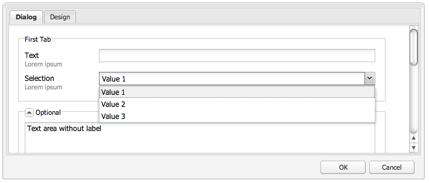
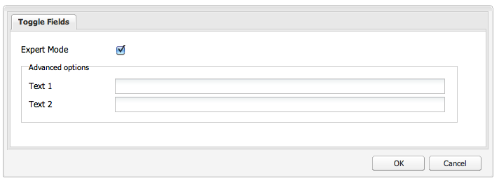

# Utilizzo ed estensione dei widget (interfaccia classica){#using-and-extending-widgets-classic-ui}

>[!NOTE]
>
>Questa pagina descrive l’utilizzo dei widget all’interno dell’interfaccia utente classica, che è stato dichiarato obsoleto in AEM 6.4.
>
>L&#39;Adobe consiglia di sfruttare il moderno, [interfaccia touch](/help/sites-developing/touch-ui-concepts.md) basato su [Interfaccia Coral](/help/sites-developing/touch-ui-concepts.md#coral-ui) e [Interfaccia Granite](/help/sites-developing/touch-ui-concepts.md#granite-ui-foundation-components).

L’interfaccia web di Adobe Experience Manager utilizza AJAX e altre moderne tecnologie del browser per consentire la modifica e la formattazione WYSIWYG dei contenuti da parte degli autori direttamente sulla pagina web.

Adobe Experience Manager (AEM) utilizza il [ExtJS](https://www.sencha.com/) Libreria di widget, che fornisce elementi di interfaccia utente altamente sofisticati che funzionano su tutti i browser più importanti e consentono la creazione di esperienze di interfaccia utente di livello desktop.

Questi widget sono inclusi in AEM e, oltre ad essere utilizzati da AEM, possono essere utilizzati da qualsiasi sito web creato utilizzando AEM.

Per un riferimento completo di tutti i widget disponibili in AEM è possibile fare riferimento al [documentazione API per widget](https://helpx.adobe.com/experience-manager/6-5/sites/developing/using/reference-materials/widgets-api/index.html) o [elenco di xtype esistenti](/help/sites-developing/xtypes.md). Inoltre, molti esempi che mostrano come utilizzare il framework ExtJS sono disponibili nella sezione [Sencha](https://www.sencha.com/products/extjs/examples/) sito, proprietario del framework.

Questa pagina fornisce alcune informazioni su come utilizzare ed estendere i widget. In primo luogo, descrive come [includere codice lato client in una pagina](#including-the-client-sided-code-in-a-page). Vengono quindi descritti alcuni componenti di esempio creati per illustrare alcuni utilizzi e estensioni di base. Tali componenti sono disponibili nella **Utilizzo dei widget ExtJS** pacchetto **Condivisione pacchetti**.

Il pacchetto include esempi di:

* [Finestra di dialogo di base](#basic-dialogs) integrato con widget preconfigurati.
* [Finestra di dialogo dinamica](#dynamic-dialogs) integrato con widget predefiniti e logica javascript personalizzata.
* Finestre di dialogo basate su [widget personalizzati](#custom-widgets).
* A [pannello ad albero](#tree-overview) visualizzazione di una struttura JCR sotto un determinato percorso.
* A [pannello a griglia](#grid-overview) visualizzazione dei dati in formato tabulare.

>[!NOTE]
>
>L’interfaccia classica di Adobe Experience Manager è basata su [ExtJS 3.4.0](https://extjs.cachefly.net/ext-3.4.0/docs/).

## Inclusione del codice lato client in una pagina {#including-the-client-sided-code-in-a-page}

Il codice javascript e foglio di stile lato client deve essere inserito in una libreria client.

Per creare una libreria client:

1. Crea un nodo sotto `/apps/<project>` con le seguenti proprietà:

   * name=&quot;clientlib&quot;
   * jcr:mixinTypes=&quot;[mix:bloccabile]&quot;
   * jcr:primaryType=&quot;cq:ClientLibraryFolder&quot;
   * sling:resourceType=&quot;widgets/clientlib&quot;
   * categories=&quot;[&lt;category-name>]&quot;
   * dependencies=&quot;[cq.widgets]&quot;

   `Note: <category-name> is the name of the custom library (e.g. "cq.extjstraining") and is used to include the library on the page.`

1. Sotto `clientlib` crea `css` e `js` cartelle (nt:folder).

1. Sotto `clientlib` crea `css.txt` e `js.txt` file (nt:files). Tali file .txt elencano i file inclusi nella libreria.

1. Modifica `js.txt`: deve iniziare con &quot; `#base=js`&#39; seguito dall&#39;elenco dei file che saranno aggregati dal servizio libreria client CQ, ad esempio:

   ```
   #base=js
    components.js
    exercises.js
    CustomWidget.js
    CustomBrowseField.js
    InsertTextPlugin.js
   ```

1. Modifica `css.txt`: deve iniziare con &quot; `#base=css`&#39; seguito dall&#39;elenco dei file che saranno aggregati dal servizio libreria client CQ, ad esempio:

   ```
   #base=css
    components.css
   ```

1. Sotto la `js` cartella, inserire i file javascript che appartengono alla libreria.

1. Sotto la `css` cartella, posizionare `.css` file e risorse utilizzate dai file css (ad esempio `my_icon.png`).

>[!NOTE]
>
>La gestione dei fogli di stile descritti in precedenza è facoltativa.

Per includere la libreria client nel componente pagina jsp:

* per includere sia il codice javascript che i fogli di stile:
   `<ui:includeClientLib categories="<category-name1>, <category-name2>, ..."/>`
Dove 
`<category-nameX>` è il nome della libreria lato client.

* per includere solo il codice javascript:
   `<ui:includeClientLib js="<category-name>"/>`

Per ulteriori dettagli consulta la descrizione del [&lt;ui:includeclientlib>](/help/sites-developing/taglib.md#lt-ui-includeclientlib) tag .

In alcuni casi una libreria client dovrebbe essere disponibile solo in modalità di authoring e dovrebbe essere esclusa in modalità di pubblicazione. Può essere realizzato come segue:

```xml
    if (WCMMode.fromRequest(request) != WCMMode.DISABLED) {
        %><ui:includeClientLib categories="cq.collab.blog"/><%
    }
```

### Guida introduttiva agli esempi {#getting-started-with-the-samples}

Per seguire le esercitazioni su questa pagina, installa il pacchetto chiamato **Utilizzo dei widget ExtJS** in un’istanza AEM locale e crea una pagina di esempio in cui i componenti verranno inclusi. Per eseguire questa operazione:

1. Nella tua istanza AEM scarica il pacchetto chiamato **Utilizzo dei widget ExtJS (v01)** da Condivisione pacchetti e installa il pacchetto. Crea il progetto `extjstraining` di seguito `/apps` nel repository.
1. Includi la libreria client contenente gli script (js) e il foglio di stile (css) nel tag head della pagina geometrixx jsp, in quanto includerai i componenti di esempio in una nuova pagina del **Geometrixx** ramo: in **CRXDE Lite** aprire il file `/apps/geometrixx/components/page/headlibs.jsp` e aggiungi la `cq.extjstraining` alla categoria esistente `<ui:includeClientLib>` come segue:
   `%><ui:includeClientLib categories="apps.geometrixx-main, cq.extjstraining"/><%`
1. Crea una nuova pagina nel **Geometrixx** ramo sottostante `/content/geometrixx/en/products` e chiamalo **Utilizzo dei widget ExtJS**.
1. Vai in modalità progettazione e aggiungi tutti i componenti del gruppo denominato **Utilizzo dei widget ExtJS** alla progettazione di Geometrixx
1. Torna alla modalità di modifica: i componenti del gruppo **Utilizzo dei widget ExtJS** sono disponibili nella barra laterale.

>[!NOTE]
>
>Gli esempi in questa pagina si basano sul contenuto di esempio di Geometrixx, che non viene più fornito con AEM, essendo stato sostituito da We.Retail. Vedere il documento [Implementazione di riferimento di We.Retail](/help/sites-developing/we-retail.md#we-retail-geometrixx) per informazioni su come scaricare e installare Geometrixx.

### Finestre di dialogo di base {#basic-dialogs}

Le finestre di dialogo vengono in genere utilizzate per modificare il contenuto, ma possono anche visualizzare solo le informazioni. Un modo semplice per visualizzare una finestra di dialogo completa è quello di accedere alla relativa rappresentazione in formato json. A tale scopo, rivolgiti al browser in uso per:

`https://localhost:4502/<path-to-dialog>.-1.json`

Il primo componente del **Utilizzo dei widget ExtJS** Il gruppo nella barra laterale è denominato **1. Nozioni di base sulla finestra di dialogo** e include quattro finestre di dialogo di base integrate con widget predefiniti e senza logica javascript personalizzata. Le finestre di dialogo sono memorizzate di seguito `/apps/extjstraining/components/dialogbasics`. Le finestre di dialogo di base sono:

* la finestra di dialogo Completa ( `full` nodo): visualizza una finestra con 3 schede, ciascuna con 2 campi di testo.
* la finestra di dialogo Pannello singolo( `singlepanel` nodo): visualizza una finestra con 1 scheda con 2 campi di testo.
* finestra di dialogo Pannello multiplo( `multipanel` nodo): la visualizzazione è la stessa della finestra di dialogo Completa, ma viene creata in modo diverso.
* finestra di dialogo Progettazione( `design` nodo): visualizza una finestra con 2 schede. La prima scheda contiene un campo di testo, un menu a discesa e un’area di testo comprimibile. La seconda scheda presenta un campo impostato con 4 campi di testo e un campo comprimibile impostato con 2 campi di testo.

Includi il **1. Nozioni di base sulla finestra di dialogo** nella pagina di esempio:

1. Aggiungi il **1. Nozioni di base sulla finestra di dialogo** nella pagina di esempio dal **Utilizzo dei widget ExtJS** nella scheda **Barra laterale**.
1. Il componente visualizza un titolo, un testo e un **PROPRIETÀ** link: fai clic sul collegamento per visualizzare le proprietà del paragrafo memorizzato nella directory archivio. Fai di nuovo clic sul collegamento per nascondere le proprietà.

Il componente viene visualizzato come segue:


#### Esempio 1: Finestra di dialogo completa {#example-full-dialog}

La **Completo** In questa finestra di dialogo viene visualizzata una finestra con tre schede, ciascuna con due campi di testo. È la finestra di dialogo predefinita **Nozioni di base sulla finestra di dialogo** componente. Le sue caratteristiche sono:

* È definito da un nodo: tipo di nodo = `cq:Dialog`, xtype = ` [dialog](/help/sites-developing/xtypes.md#dialog)`.
* Visualizza 3 schede (tipo di nodo = `cq:Panel`).
* Ogni scheda ha 2 campi di testo (tipo di nodo = `cq:Widget`, xtype = ` [textfield](/help/sites-developing/xtypes.md#textfield)`).
* È definito dal nodo:
   `/apps/extjstraining/components/dialogbasics/full`
* Viene eseguito il rendering in formato JSON richiedendo:
   `https://localhost:4502/apps/extjstraining/components/dialogbasics/full.-1.json`

La finestra di dialogo viene visualizzata come segue:


#### Esempio 2: Finestra di dialogo a pannello singolo {#example-single-panel-dialog}

La **Pannello singolo** visualizza una finestra con una scheda contenente due campi di testo. Le sue caratteristiche sono:

* Visualizza una scheda (tipo di nodo = `cq:Dialog`, xtype = ` [panel](/help/sites-developing/xtypes.md#panel)`)
* La scheda ha 2 campi di testo (tipo di nodo = `cq:Widget`, xtype = ` [textfield](/help/sites-developing/xtypes.md#textfield)`)
* È definito dal nodo:
   `/apps/extjstraining/components/dialogbasics/singlepanel`
* Viene eseguito il rendering in formato json richiedendo:
   `https://localhost:4502/apps/extjstraining/components/dialogbasics/singlepanel.-1.json`
* Un vantaggio rispetto al **Finestra di dialogo completa** è necessario ridurre la configurazione.
* Utilizzo consigliato: per finestre di dialogo semplici che visualizzano informazioni o che contengono solo alcuni campi.

Per utilizzare la finestra di dialogo Pannello singolo:

1. Sostituire la finestra di dialogo del **Nozioni di base sulla finestra di dialogo** con **Pannello singolo** finestra di dialogo:
   1. In **CRXDE Lite**, elimina il nodo: `/apps/extjstraining/components/dialogbasics/dialog`
   1. Fai clic su **Salva tutto** per salvare le modifiche.
   1. Copia il nodo: `/apps/extjstraining/components/dialogbasics/singlepanel`
   1. Incolla il nodo copiato di seguito: `/apps/extjstraining/components/dialogbasics`
   1. Seleziona il nodo: `/apps/extjstraining/components/dialogbasics/Copy of singlepanel`e rinominarlo `dialog`.
1. Modifica il componente: la finestra di dialogo viene visualizzata come segue:


#### Esempio 3: Finestra di dialogo a più pannelli {#example-multi-panel-dialog}

La **Pannello multiplo** la finestra di dialogo presenta la stessa visualizzazione della **Completo** ma viene generato in modo diverso. Le sue caratteristiche sono:

* È definito da un nodo (tipo di nodo = `cq:Dialog`, xtype = ` [tabpanel](/help/sites-developing/xtypes.md#tabpanel)`).
* Visualizza 3 schede (tipo di nodo = `cq:Panel`).
* Ogni scheda ha 2 campi di testo (tipo di nodo = `cq:Widget`, xtype = ` [textfield](/help/sites-developing/xtypes.md#textfield)`).
* È definito dal nodo:
   `/apps/extjstraining/components/dialogbasics/multipanel`
* Viene eseguito il rendering in formato json richiedendo:
   `https://localhost:4502/apps/extjstraining/components/dialogbasics/multipanel.-1.json`
* Un vantaggio rispetto al **Finestra di dialogo completa** è che ha una struttura semplificata.
* Utilizzo consigliato: per finestre di dialogo con più schede.

Per utilizzare la finestra di dialogo Pannello multiplo:

1. Sostituire la finestra di dialogo del **Nozioni di base sulla finestra di dialogo** con **Pannello multiplo** finestra di dialogo: segui i passaggi descritti per [Esempio 2: Finestra di dialogo a pannello singolo](#example-single-panel-dialog)
1. Modifica il componente: la finestra di dialogo viene visualizzata come segue:


#### Esempio 4: Finestra di dialogo ricca {#example-rich-dialog}

La **Ricco** visualizza una finestra con due schede. La prima scheda contiene un campo di testo, un menu a discesa e un’area di testo comprimibile. La seconda scheda presenta un campo impostato con quattro campi di testo e un campo comprimibile con due campi di testo. Le sue caratteristiche sono:

* È definito da un nodo (tipo di nodo = `cq:Dialog`, xtype = ` [dialog](/help/sites-developing/xtypes.md#dialog)`).
* Visualizza 2 schede (tipo di nodo = `cq:Panel`).
* La prima scheda ha un ` [dialogfieldset](/help/sites-developing/xtypes.md#dialogfieldset)` widget con un ` [textfield](/help/sites-developing/xtypes.md#textfield)` e ` [selection](/help/sites-developing/xtypes.md#selection)` widget con 3 opzioni e un comprimibile ` [dialogfieldset](/help/sites-developing/xtypes.md#dialogfieldset)` con ` [textarea](/help/sites-developing/xtypes.md#textarea)` widget.
* La seconda scheda ha un ` [dialogfieldset](/help/sites-developing/xtypes.md#dialogfieldset)` widget con 4 ` [textfield](/help/sites-developing/xtypes.md#textfield)` widget e un `dialogfieldset` con 2 ` [textfield](/help/sites-developing/xtypes.md#textfield)` widget.
* È definito dal nodo:
   `/apps/extjstraining/components/dialogbasics/rich`
* Viene eseguito il rendering in formato json richiedendo:
   `https://localhost:4502/apps/extjstraining/components/dialogbasics/rich.-1.json`

Per utilizzare **Ricco** finestra di dialogo:

1. Sostituire la finestra di dialogo del **Nozioni di base sulla finestra di dialogo** con **Ricco** finestra di dialogo: segui i passaggi descritti per [Esempio 2: Finestra di dialogo a pannello singolo](#example-single-panel-dialog)
1. Modifica il componente: la finestra di dialogo viene visualizzata come segue:

 

### Finestre di dialogo dinamiche {#dynamic-dialogs}

Il secondo componente del **Utilizzo dei widget ExtJS** Il gruppo nella barra laterale è denominato **2. Finestre di dialogo dinamiche** e include tre finestre di dialogo dinamiche integrate con widget predefiniti e **con logica javascript personalizzata**. Le finestre di dialogo sono memorizzate di seguito `/apps/extjstraining/components/dynamicdialogs`. Le finestre di dialogo dinamiche sono:

* Finestra di dialogo Cambia schede ( `switchtabs` nodo): viene visualizzata una finestra con due schede. La prima scheda presenta una selezione radio con tre opzioni: quando è selezionata un’opzione, viene visualizzata una scheda relativa all’opzione . La seconda scheda contiene due campi di testo.
* il dialogo arbitrale ( `arbitrary` nodo): visualizza una finestra con una scheda. La scheda contiene un campo da rilasciare o caricare una risorsa e un campo che visualizza alcune informazioni sulla pagina contenitore e sulla risorsa, se vi si fa riferimento.
* Finestra di dialogo Attiva/Disattiva campi ( `togglefield` nodo): visualizza una finestra con una scheda. La scheda dispone di una casella di controllo: quando è selezionato, viene visualizzato un set di campi con due campi di testo.

Per includere **2. Finestre di dialogo dinamiche** nella pagina di esempio:

1. Aggiungi il **2. Finestre di dialogo dinamiche** nella pagina di esempio dal **Utilizzo dei widget ExtJS** nella scheda **Barra laterale**.
1. Il componente visualizza un titolo, un testo e un **PROPRIETÀ** link: fare clic su per visualizzare le proprietà del paragrafo memorizzato nella directory archivio. Fai di nuovo clic su per nascondere le proprietà.

Il componente viene visualizzato come segue:


#### Esempio 1: Finestra di dialogo Cambia schede {#example-switch-tabs-dialog}

La **Schede di commutazione** visualizza una finestra con due schede. La prima scheda presenta una selezione radio con tre opzioni: quando è selezionata un’opzione, viene visualizzata una scheda relativa all’opzione . La seconda scheda contiene due campi di testo.

Le sue principali caratteristiche sono:

* È definito da un nodo (tipo di nodo = `cq:Dialog`, xtype = ` [dialog](/help/sites-developing/xtypes.md#dialog)`).
* Visualizza 2 schede (tipo di nodo = `cq:Panel`): 1 scheda di selezione, la seconda scheda dipende dalla selezione nella prima scheda (3 opzioni).
* Ha 3 schede facoltative (tipo di nodo = `cq:Panel`), ciascuno ha 2 campi di testo (tipo di nodo = `cq:Widget`, xtype = ` [textfield](/help/sites-developing/xtypes.md#textfield)`). Viene visualizzata una sola scheda opzionale alla volta.
* È definito dal `switchtabs` nodo in:
   `/apps/extjstraining/components/dynamicdialogs/switchtabs`
* Viene eseguito il rendering in formato json richiedendo:
   `https://localhost:4502/apps/extjstraining/components/dynamicdialogs/switchtabs.-1.json`

La logica viene implementata tramite listener di eventi e codice javascript come segue:

* Il nodo di dialogo ha un &quot; `beforeshow`&quot; listener che nasconde tutte le schede facoltative prima che venga visualizzata la finestra di dialogo:
   `beforeshow="function(dialog){Ejst.x2.manageTabs(dialog.items.get(0));}"`

   `dialog.items.get(0)` ottiene il pannello a schede contenente il pannello di selezione e i 3 pannelli facoltativi.
* La `Ejst.x2` è definito nella `exercises.js` file in:
   `/apps/extjstraining/clientlib/js/exercises.js`
* In `Ejst.x2.manageTabs()` come valore di `index` è -1, tutte le schede facoltative sono nascoste (da 1 a 3).
* La scheda Selezione dispone di 2 ascoltatori: che mostra la scheda selezionata quando la finestra di dialogo viene caricata (&quot; `loadcontent`&quot; event) e uno che mostra la scheda selezionata quando la selezione viene modificata (&quot; `selectionchanged`&quot; evento):
   `loadcontent="function(field,rec,path){Ejst.x2.showTab(field);}"`

   `selectionchanged="function(field,value){Ejst.x2.showTab(field);}"`
* In `Ejst.x2.showTab()` metodo:
   `field.findParentByType('tabpanel')` ottiene la scheda che contiene tutte le schede ( `field` rappresenta il widget di selezione)
   `field.getValue()` ottiene il valore della selezione, ad esempio: scheda2
   `Ejst.x2.manageTabs()` visualizza la scheda selezionata.
* Ogni scheda opzionale ha un listener che nasconde la scheda su &quot; `render`&quot; evento:
   `render="function(tab){Ejst.x2.hideTab(tab);}"`
* In `Ejst.x2.hideTab()` metodo:
   `tabPanel` è la scheda che contiene tutte le schede
   `index` è l&#39;indice della scheda opzionale
   `tabPanel.hideTabStripItem(index)` nasconde la scheda

Viene visualizzato come segue:


#### Esempio 2: Dialogo arbitrario {#example-arbitrary-dialog}

Molto spesso una finestra di dialogo visualizza il contenuto del componente sottostante. La finestra di dialogo qui descritta, denominata **Arbitrato** richiama il contenuto da un componente diverso.

La **Arbitrato** visualizza una finestra con una scheda. La scheda presenta due campi: uno per rilasciare o caricare una risorsa e uno per visualizzare alcune informazioni sulla pagina contenente e sulla risorsa, se vi è stato riferimento.

Le sue principali caratteristiche sono:

* È definito da un nodo (tipo di nodo = `cq:Dialog`, xtype = ` [dialog](/help/sites-developing/xtypes.md#dialog)`).
* Visualizza 1 widget per pannello a schede (tipo di nodo = `cq:Widget`, xtype = ` [tabpanel](/help/sites-developing/xtypes.md#tabpanel)`) con 1 pannello (tipo di nodo = `cq:Panel`)
* Il pannello ha un widget di smartfile (tipo di nodo = `cq:Widget`, xtype = ` [smartfile](/help/sites-developing/xtypes.md#smartfile)`) e un widget di disegno di proprietà (tipo di nodo = `cq:Widget`, xtype = ` [ownerdraw](/help/sites-developing/xtypes.md#ownerdraw)`)
* È definito dal `arbitrary` nodo in:
   `/apps/extjstraining/components/dynamicdialogs/arbitrary`
* Viene eseguito il rendering in formato json richiedendo:
   `https://localhost:4502/apps/extjstraining/components/dynamicdialogs/arbitrary.-1.json`

La logica viene implementata tramite listener di eventi e codice javascript come segue:

* Il widget di disegno proprietario ha un &quot; `loadcontent`&quot; listener che mostra informazioni sulla pagina contenente il componente e la risorsa a cui fa riferimento il widget smartfile al caricamento del contenuto:
   `loadcontent="function(field,rec,path){Ejst.x2.showInfo(field,rec,path);}"`

   `field` è impostato con l&#39;oggetto ownerdraw
   `path` è impostato con il percorso del contenuto del componente (ad esempio: /content/geometrixx/en/products/triangle/ui-tutorial/jcr:content/par/dynamic dialogs)
* La `Ejst.x2` è definito nella `exercises.js` file in:
   `/apps/extjstraining/clientlib/js/exercises.js`
* In `Ejst.x2.showInfo()` metodo:
   `pagePath` è il percorso della pagina contenente il componente
   `pageInfo` rappresenta le proprietà della pagina in formato json
   `reference` è il percorso della risorsa di riferimento
   `metadata` rappresenta i metadati della risorsa in formato json
   `ownerdraw.getEl().update(html);` visualizza l’html creato nella finestra di dialogo

Per utilizzare **Arbitrato** finestra di dialogo:

1. Sostituire la finestra di dialogo del **Finestra di dialogo dinamica** con **Arbitrato** finestra di dialogo: segui i passaggi descritti per [Esempio 2: Finestra di dialogo a pannello singolo](#example-single-panel-dialog)
1. Edit the component: the dialog displays as follows:


#### Example 3: Toggle Fields Dialog {#example-toggle-fields-dialog}

**** La scheda dispone di una casella di controllo: quando è selezionato, viene visualizzato un set di campi con due campi di testo.

Le sue principali caratteristiche sono:

* È definito da un nodo (tipo di nodo = `cq:Dialog`, xtype = ` [dialog](/help/sites-developing/xtypes.md#dialog)`).
* Visualizza 1 widget per pannello a schede (tipo di nodo = `cq:Widget`, xtype = ` [tabpanel](/help/sites-developing/xtypes.md#textpanel)`) con 1 pannello (tipo di nodo = `cq:Panel`).
* `cq:Widget`` [selection](/help/sites-developing/xtypes.md#selection)`` [checkbox](/help/sites-developing/xtypes.md#checkbox)``cq:Widget`` [dialogfieldset](/help/sites-developing/xtypes.md#dialogfieldset)``cq:Widget`` [textfield](/help/sites-developing/xtypes.md#textfield)`
* `togglefields`
   `/apps/extjstraining/components/dynamicdialogs/togglefields`
* Viene eseguito il rendering in formato json richiedendo:
   `https://localhost:4502/apps/extjstraining/components/dynamicdialogs/togglefields.-1.json`

La logica viene implementata tramite listener di eventi e codice javascript come segue:

* la scheda di selezione include 2 ascoltatori: che mostra la forma dialogfield, quando il contenuto viene caricato (&quot; `loadcontent`&quot; event) e uno che mostra la forma dialogfiel, quando la selezione viene modificata (&quot; `selectionchanged`&quot; evento):
   `loadcontent="function(field,rec,path){Ejst.x2.toggleFieldSet(field);}"`

   `selectionchanged="function(field,value){Ejst.x2.toggleFieldSet(field);}"`
* La `Ejst.x2` è definito nella `exercises.js` file in:
   `/apps/extjstraining/clientlib/js/exercises.js`
* In `Ejst.x2.toggleFieldSet()` metodo:
   `box` è l&#39;oggetto selezionato
   `panel` è il pannello contenente la selezione e i widget di dialogfieldità
   `fieldSet` è l&#39;oggetto dialogfielddell
   `show` è il valore della selezione (true o false) in base a &#39; `show`&quot; viene visualizzato o meno il dialogfielddell

Per utilizzare **Attiva/Disattiva campi** finestra di dialogo:

1. Sostituire la finestra di dialogo del **Finestra di dialogo dinamica** con **Attiva/Disattiva campi** finestra di dialogo: segui i passaggi descritti per [Esempio 2: Finestra di dialogo a pannello singolo](#example-single-panel-dialog)
1. Modifica il componente: la finestra di dialogo viene visualizzata come segue:



### Widget personalizzati {#custom-widgets}

I widget preconfigurati forniti con AEM devono coprire la maggior parte dei casi d’uso. Tuttavia, a volte potrebbe essere necessario creare un widget personalizzato per soddisfare un requisito specifico del progetto. Puoi creare widget personalizzati estendendone quelli esistenti. Per aiutarti a iniziare con questa personalizzazione, la **Utilizzo dei widget ExtJS** il pacchetto include tre finestre di dialogo che utilizzano tre widget personalizzati diversi:

* Finestra di dialogo Campo multiplo ( `multifield` node) visualizza una finestra con una scheda. La scheda dispone di un widget multicampo personalizzato con due campi: un menu a discesa con due opzioni e un campo di testo. Poiché si basa sul `multifield` widget (che ha solo un campo di testo), ha tutte le caratteristiche di `multifield` widget.
* Finestra di dialogo Sfoglia struttura ( `treebrowse` node) visualizza una finestra con una scheda contenente un widget di navigazione del percorso: quando si fa clic sulla freccia, viene visualizzata una finestra in cui è possibile sfogliare una gerarchia e selezionare un elemento. Il percorso dell’elemento viene quindi aggiunto al campo percorso e viene mantenuto quando la finestra di dialogo viene chiusa.
* una finestra di dialogo basata su plug-in per editor Rich Text ( `rteplugin` node) che aggiunge un pulsante personalizzato all’Editor Rich Text per inserire del testo personalizzato nel testo principale. È costituito da un `richtext` widget (RTE) e di una funzione personalizzata che viene aggiunta tramite il meccanismo plug-in RTE.

I widget personalizzati e il plug-in sono inclusi nel componente denominato **3. Widget personalizzati** del **Utilizzo dei widget ExtJS** pacchetto. Per includere questo componente nella pagina di esempio:

1. Aggiungi il **3. Widget personalizzati** nella pagina di esempio dal **Utilizzo dei widget ExtJS** nella scheda **Barra laterale**.
1. Il componente visualizza un titolo, un testo e, quando fai clic sul pulsante **PROPRIETÀ** , le proprietà del paragrafo memorizzate nella directory archivio. Facendo di nuovo clic le proprietà vengono nascoste.
Il componente viene visualizzato come segue:


#### Esempio 1: Widget multicampo personalizzato {#example-custom-multifield-widget}

La **Multicampo personalizzato** nella finestra di dialogo basata su widget viene visualizzata una finestra con una scheda. La scheda dispone di un widget multicampo personalizzato che, a differenza di quello standard che ha un campo, ha due campi: un menu a discesa con due opzioni e un campo di testo.

La **Multicampo personalizzato** finestra di dialogo basata su widget:

* È definito da un nodo (tipo di nodo = `cq:Dialog`, xtype = ` [dialog](/help/sites-developing/xtypes.md#dialog)`).
* Visualizza 1 widget per pannello a schede (tipo di nodo = `cq:Widget`, xtype = ` [tabpanel](/help/sites-developing/xtypes.md#tabpanel)`) contenente un pannello (tipo di nodo = `cq:Widget`, xtype = ` [panel](/help/sites-developing/xtypes.md#panel)`).
* Il pannello ha un `multifield` widget (tipo di nodo = `cq:Widget`, xtype = ` [multifield](/help/sites-developing/xtypes.md#multifield)`).
* La `multifield` widget ha un file config (tipo di nodo = `nt:unstructured`, xtype = `ejstcustom`, optionsProvider = `Ejst.x3.provideOptions`) basata sull&#39;xtype personalizzato &#39; `ejstcustom`&#39;:
   * &#39; `fieldconfig`&#39; è un&#39;opzione di configurazione del ` [CQ.form.MultiField](https://helpx.adobe.com/experience-manager/6-5/sites/developing/using/reference-materials/widgets-api/index.html?class=CQ.form.MultiField)` oggetto.
   * &#39; `optionsProvider`&#39; è una configurazione del `ejstcustom` widget. È impostato con `Ejst.x3.provideOptions` metodo definito in `exercises.js` a:
      `/apps/extjstraining/clientlib/js/exercises.js`
e restituisce 2 opzioni.
* È definito dal `multifield` nodo in:
   `/apps/extjstraining/components/customwidgets/multifield`
* Viene eseguito il rendering in formato json richiedendo:
   `https://localhost:4502/apps/extjstraining/components/customwidgets/multifield.-1.json`

Il widget multicampo personalizzato (xtype = `ejstcustom`):

* È un oggetto JavaScript denominato `Ejst.CustomWidget`.
* È definito in `CustomWidget.js` file javascript in:
   `/apps/extjstraining/clientlib/js/CustomWidget.js`
* Estende il ` [CQ.form.CompositeField](https://helpx.adobe.com/experience-manager/6-5/sites/developing/using/reference-materials/widgets-api/index.html?class=CQ.form.CompositeField)` widget.
* Dispone di 3 campi: `hiddenField` (campo tessile), `allowField` (ComboBox) e `otherField` (Campo di testo)
* Sostituzioni `CQ.Ext.Component#initComponent` per aggiungere i 3 campi:
   * `allowField` è un [CQ.form.Selection](https://helpx.adobe.com/experience-manager/6-5/sites/developing/using/reference-materials/widgets-api/index.html?class=CQ.form.Selection) oggetto di tipo &quot;select&quot;. optionsProvider è una configurazione dell&#39;oggetto Selection creata con la configurazione optionsProvider del Widget personalizzato definito nella finestra di dialogo
   * `otherField` è un [CQ.Ext.form.TextField](https://helpx.adobe.com/experience-manager/6-5/sites/developing/using/reference-materials/widgets-api/index.html?class=CQ.Ext.form.TextField) oggetto
* Sostituisce i metodi `setValue`, `getValue` e `getRawValue` di [CQ.form.CompositeField](https://helpx.adobe.com/experience-manager/6-5/sites/developing/using/reference-materials/widgets-api/index.html?class=CQ.form.CompositeField) per impostare e recuperare il valore di CustomWidget con il formato:
   `<allowField value>/<otherField value>, e.g.: 'Bla1/hello'`.
* `ejstcustom`
   `CQ.Ext.reg('ejstcustom', Ejst.CustomWidget);`

****


#### Esempio 2: Widget personalizzato per righe di testo {#example-custom-treebrowse-widget}

L&#39;utente personalizzato **Treebrowse** nella finestra di dialogo basata su widget viene visualizzata una finestra con una scheda contenente un widget di navigazione del percorso personalizzato: quando si fa clic sulla freccia, viene visualizzata una finestra in cui è possibile sfogliare una gerarchia e selezionare un elemento. Il percorso dell’elemento viene quindi aggiunto al campo percorso e viene mantenuto quando la finestra di dialogo viene chiusa.

The custom treebrowse dialog:

* `cq:Dialog`` [dialog](/help/sites-developing/xtypes.md#dialog)`
* `cq:Widget`` [tabpanel](/help/sites-developing/xtypes.md#tabpanel)``cq:Widget`` [panel](/help/sites-developing/xtypes.md#panel)`
* Il pannello ha un widget personalizzato (tipo di nodo = `cq:Widget`, xtype = `ejstbrowse`)
* È definito dal `treebrowse` nodo in:
   `/apps/extjstraining/components/customwidgets/treebrowse`
* Viene eseguito il rendering in formato json richiedendo:
   `https://localhost:4502/apps/extjstraining/components/customwidgets/treebrowse.-1.json`

Widget personalizzato della barra degli strumenti (xtype = `ejstbrowse`):

* È un oggetto JavaScript denominato `Ejst.CustomWidget`.
* È definito in `CustomBrowseField.js` file javascript in:
   `/apps/extjstraining/clientlib/js/CustomBrowseField.js`
* Estensioni ` [CQ.Ext.form.TriggerField](https://helpx.adobe.com/experience-manager/6-5/sites/developing/using/reference-materials/widgets-api/index.html?class=CQ.Ext.form.TriggerField)`.
* Definisce una finestra di ricerca denominata `browseWindow`.
* Sostituzioni ` [CQ.Ext.form.TriggerField](https://helpx.adobe.com/experience-manager/6-5/sites/developing/using/reference-materials/widgets-api/index.html?class=CQ.Ext.form.TriggerField)#onTriggerClick` per visualizzare la finestra Sfoglia quando si fa clic sulla freccia.
* Definisce un [CQ.Ext.tree.TreePanel](https://helpx.adobe.com/experience-manager/6-5/sites/developing/using/reference-materials/widgets-api/index.html?class=CQ.Ext.tree.TreePanel) oggetto:
   * Ottiene i suoi dati chiamando il servlet registrato in `/bin/wcm/siteadmin/tree.json`.
   * La sua radice è &quot; `apps/extjstraining`&quot;.
* Definisce un `window` oggetto ( ` [CQ.Ext.Window](https://helpx.adobe.com/experience-manager/6-5/sites/developing/using/reference-materials/widgets-api/index.html?class=CQ.Ext.Window)`):
   * Basato sul pannello predefinito.
   * Ha **OK** che imposta il valore del percorso selezionato e nasconde il pannello.
* La finestra è ancorata sotto la **Percorso** campo .
* Il percorso selezionato viene passato dal campo Sfoglia alla finestra in `show` evento.
* Si registra come &#39; `ejstbrowse`xtype:
   `CQ.Ext.reg('ejstbrowse', Ejst.CustomBrowseField);`

Per utilizzare **Barra degli strumenti personalizzata** finestra di dialogo basata su widget:

1. Sostituire la finestra di dialogo del **Widget personalizzati** con **Barra degli strumenti personalizzata** finestra di dialogo: segui i passaggi descritti per [Esempio 2: Finestra di dialogo a pannello singolo](#example-single-panel-dialog)
1. Modifica il componente: la finestra di dialogo viene visualizzata come segue:


#### Esempio 3: Plug-in Editor Rich Text {#example-rich-text-editor-rte-plug-in}

La **Plug-in editor Rich Text** la finestra di dialogo basata su Rich Text Editor dispone di un pulsante personalizzato per inserire testo personalizzato tra parentesi quadre. Il testo personalizzato può essere analizzato da una logica lato server (non implementata in questo esempio), ad esempio per aggiungere del testo definito nel percorso specificato:

La **Plug-in RTE** finestra di dialogo basata:

* È definito dal nodo rteplugin in:
   `/apps/extjstraining/components/customwidgets/rteplugin`
* Viene eseguito il rendering in formato json richiedendo:
   `https://localhost:4502/apps/extjstraining/components/customwidgets/rteplugin.-1.json`
* La `rtePlugins` nodo figlio `inserttext` (tipo di nodo = `nt:unstructured`) che prende il nome dal plug-in. Ha una proprietà denominata `features`, che definisce quali delle funzioni plug-in sono disponibili per l’editor Rich Text.

Il plug-in RTE:

* È un oggetto JavaScript denominato `Ejst.InsertTextPlugin`.
* È definito in `InsertTextPlugin.js` file javascript in:
   `/apps/extjstraining/clientlib/js/InsertTextPlugin.js`
* Estende il ` [CQ.form.rte.plugins.Plugin](https://helpx.adobe.com/experience-manager/6-5/sites/developing/using/reference-materials/widgets-api/index.html?class=CQ.form.rte.plugins.Plugin)` oggetto.
* I seguenti metodi definiscono le ` [CQ.form.rte.plugins.Plugin](https://helpx.adobe.com/experience-manager/6-5/sites/developing/using/reference-materials/widgets-api/index.html?class=CQ.form.rte.plugins.Plugin)` e sono ignorati nel plug-in di implementazione:
   * `getFeatures()` restituisce un array di tutte le funzionalità rese disponibili dal plug-in.
   * `initializeUI()` aggiunge il nuovo pulsante alla barra degli strumenti dell’editor Rich Text.
   * `notifyPluginConfig()` visualizza il titolo e il testo quando si passa il mouse sul pulsante.
   * `execute()` viene chiamato quando si fa clic sul pulsante ed esegue l’azione plug-in: visualizza una finestra utilizzata per definire il testo da includere.
* `insertText()` inserisce un testo utilizzando l’oggetto finestra di dialogo corrispondente `Ejst.InsertTextPlugin.Dialog` (vedere in seguito).
* `executeInsertText()` viene chiamato da `apply()` del metodo della finestra di dialogo, che viene attivato quando il **OK** fai clic su .
* Si registra come &#39; `inserttext`plugin:
   `CQ.form.rte.plugins.PluginRegistry.register("inserttext", Ejst.InsertTextPlugin);`
* la `Ejst.InsertTextPlugin.Dialog` l’oggetto definisce la finestra di dialogo che viene aperta quando si fa clic sul pulsante del plug-in. La finestra di dialogo è costituita da un pannello, un modulo, un campo di testo e due pulsanti (**OK** e **Annulla**).

Per utilizzare **Plug-in editor Rich Text** finestra di dialogo basata:

1. Sostituire la finestra di dialogo del **Widget personalizzati** con **Plug-in editor Rich Text** finestra di dialogo basata: segui i passaggi descritti per [Esempio 2: Finestra di dialogo a pannello singolo](#example-single-panel-dialog)
1. Modificate il componente.
1. Fai clic sull’ultima icona a destra (quella con quattro frecce). Immettere un percorso e fare clic su **OK**: Il percorso viene visualizzato tra parentesi ([ ]).
1. Fai clic su **OK** per chiudere l’Editor Rich Text.

La **Plug-in editor Rich Text** viene visualizzata la seguente finestra di dialogo basata:


>[!NOTE]
>
>*[]*

### Tree Overview {#tree-overview}

` [CQ.Ext.tree.TreePanel](https://helpx.adobe.com/experience-manager/6-5/sites/developing/using/reference-materials/widgets-api/index.html?class=CQ.Ext.tree.TreePanel)` ****`TreePanel` La finestra stessa può essere agganciata/sganciata. In questo esempio, la logica della finestra è incorporata nel componente jsp tra &lt;script>&lt;/script> tag.

Per includere **Panoramica della struttura** nella pagina di esempio:

1. Aggiungi il **4. Panoramica della struttura** nella pagina di esempio dal **Utilizzo dei widget ExtJS** nella scheda **Barra laterale**.
1. Viene visualizzato il componente:
   * a title, with some text
   * a **PROPRIETÀ** link: fare clic su per visualizzare le proprietà del paragrafo memorizzato nella directory archivio. Fai di nuovo clic su per nascondere le proprietà.
   * una finestra mobile con una rappresentazione ad albero dell&#39;archivio, che può essere espansa.

Il componente viene visualizzato come segue:


Componente Panoramica albero:

* È definito in:
   `/apps/extjstraining/components/treeoverview`

* La finestra di dialogo consente di impostare le dimensioni della finestra e di agganciare/sganciare la finestra (vedere i dettagli di seguito).

Il componente jsp:

* Recupera la larghezza, l’altezza e le proprietà ancorate dall’archivio.
* Visualizza del testo sul formato dei dati della panoramica della struttura.
* Incorpora la logica della finestra nel componente jsp tra i tag javascript.
* È definito in:
   `apps/extjstraining/components/treeoverview/content.jsp`

Il codice javascript incorporato nel componente jsp:

* Definisce un `tree` cercando di recuperare una finestra ad albero dalla pagina.
* Se la finestra che mostra la struttura non esiste, `treePanel` ([CQ.Ext.tree.TreePanel](https://helpx.adobe.com/experience-manager/6-5/sites/developing/using/reference-materials/widgets-api/index.html?class=CQ.Ext.tree.TreePanel)) viene creato:
   * `treePanel` contiene i dati utilizzati per creare la finestra.
   * I dati vengono recuperati chiamando il servlet registrato in:
      `/bin/wcm/siteadmin/tree.json`
* La `beforeload` listener si assicura che il nodo selezionato sia caricato.
* La `root` l&#39;oggetto imposta il percorso `apps/extjstraining` come radice dell&#39;albero.
* `tree` ( ` [CQ.Ext.Window](https://helpx.adobe.com/experience-manager/6-5/sites/developing/using/reference-materials/widgets-api/index.html?class=CQ.Ext.Window)`) è impostata in base alla `treePanel`e viene visualizzato con:
   `tree.show();`
* Se la finestra esiste già, viene visualizzata in base alla larghezza, all’altezza e alle proprietà ancorate recuperate dall’archivio.

Finestra di dialogo del componente:

* Visualizza 1 scheda con 2 campi per impostare le dimensioni (larghezza e altezza) della finestra della panoramica della struttura e 1 campo per agganciare/sganciare la finestra
* È definito da un nodo (tipo di nodo = `cq:Dialog`, xtype = ` [panel](/help/sites-developing/xtypes.md#panel)`).
* Il pannello ha un widget di campo di dimensione (tipo di nodo = `cq:Widget`, xtype = ` [sizefield](/help/sites-developing/xtypes.md#sizefield)`) e un widget di selezione (tipo di nodo = `cq:Widget`, xtype = ` [selection](/help/sites-developing/xtypes.md#selection)`, tipo = `radio`) con 2 opzioni (true/false)
* È definito dal nodo di dialogo in:
   `/apps/extjstraining/components/treeoverview/dialog`
* Viene eseguito il rendering in formato json richiedendo:
   `https://localhost:4502/apps/extjstraining/components/treeoverview/dialog.-1.json`
* Visualizza come segue:


### Panoramica sulla griglia {#grid-overview}

Un pannello Griglia rappresenta i dati in un formato tabulare di righe e colonne. È composto dai seguenti elementi:

* Archivio : il modello contenente i record di dati (righe).
* Modello a colonne : il trucco delle colonne.
* Visualizza : incapsula l&#39;interfaccia utente.
* Modello di selezione : il comportamento di selezione.

Il componente Panoramica sulla griglia incluso nel **Utilizzo dei widget ExtJS** Il pacchetto mostra come visualizzare i dati in formato tabulare:

* Nell&#39;esempio 1 vengono utilizzati dati statici.
* Nell’esempio 2 vengono utilizzati i dati recuperati dall’archivio.

Per includere il componente Panoramica griglia nella pagina di esempio:

1. Aggiungi il **5. Panoramica sulla griglia** nella pagina di esempio dal **Utilizzo dei widget ExtJS** nella scheda **Barra laterale**.
1. Viene visualizzato il componente:
   * un titolo con del testo
   * a **PROPRIETÀ** link: fare clic su per visualizzare le proprietà del paragrafo memorizzato nella directory archivio. Fai di nuovo clic su per nascondere le proprietà.
   * una finestra mobile contenente dati in formato tabulare.

Il componente viene visualizzato come segue:


#### Esempio 1: Griglia predefinita {#example-default-grid}

Nella sua versione standard, il **Panoramica sulla griglia** visualizza una finestra con dati statici in formato tabulare. In questo esempio, la logica è incorporata nel componente jsp in due modi:

* the generic logic is defined between &lt;script>&lt;/script> tags
* the specific logic is available in a separate .js file and is linked to in the jsp. This setup enables to easily switch between the two logic (static/dynamic) by commenting the desired &lt;script> tags.

The Grid Overview component:

* Is defined at:
   `/apps/extjstraining/components/gridoverview`
* La finestra di dialogo consente di impostare le dimensioni della finestra e di agganciare/sganciare la finestra.

Il componente jsp:

* Recupera la larghezza, l’altezza e le proprietà ancorate dall’archivio.
* Displays some text as introduction to the grid overview data format.
* References javascript code that defines the GridPanel object:
   `<script type="text/javascript" src="/apps/extjstraining/components/gridoverview/defaultgrid.js"></script>`

   `defaultgrid.js`
* Incorpora il codice javascript tra i tag javascript che definisce l&#39;oggetto Window che consuma l&#39;oggetto GridPanel.
* È definito in:
   `apps/extjstraining/components/gridoverview/content.jsp`

Il codice javascript incorporato nel componente jsp:

* Definisce la `grid` tentando di recuperare il componente finestra dalla pagina:
   `var grid = CQ.Ext.getCmp("<%= node.getName() %>-grid");`
* Se `grid` non esiste, un [CQ.Ext.grid.GridPanel](https://helpx.adobe.com/experience-manager/6-5/sites/developing/using/reference-materials/widgets-api/index.html?class=CQ.Ext.grid.GridPanel) oggetto ( `gridPanel`) viene definita chiamando la variabile `getGridPanel()` metodo (vedi di seguito). Questo metodo è definito in `defaultgrid.js`.
* `grid` è un ` [CQ.Ext.Window](https://helpx.adobe.com/experience-manager/6-5/sites/developing/using/reference-materials/widgets-api/index.html?class=CQ.Ext.Window)` in base al GridPanel predefinito e viene visualizzato: `grid.show();`
* Se `grid` esiste già, viene visualizzato in base alla larghezza, all’altezza e alle proprietà ancorate recuperate dall’archivio.

Il file javascript ( `defaultgrid.js`) nel componente jsp definisce il `getGridPanel()` metodo chiamato dallo script incorporato nel JSP e restituisce un ` [CQ.Ext.grid.GridPanel](https://helpx.adobe.com/experience-manager/6-5/sites/developing/using/reference-materials/widgets-api/index.html?class=CQ.Ext.grid.GridPanel)` in base a dati statici. La logica è la seguente:

* `myData` è una matrice di dati statici formattata come una tabella di 5 colonne e 4 righe.
* `store` è un `CQ.Ext.data.Store` oggetto che consuma `myData`.
* `store` viene caricato in memoria:
   `store.load();`
* `gridPanel` è un ` [CQ.Ext.grid.GridPanel](https://helpx.adobe.com/experience-manager/6-5/sites/developing/using/reference-materials/widgets-api/index.html?class=CQ.Ext.grid.GridPanel)` oggetto che consuma `store`:
   * le larghezze delle colonne vengono sempre riproporzioni:
      `forceFit: true`
   * è possibile selezionare una sola riga alla volta:
      `singleSelect:true`

#### Esempio 2: Griglia di ricerca di riferimento {#example-reference-search-grid}

Quando installi il pacchetto, la `content.jsp` del **Panoramica sulla griglia** visualizza una griglia basata su dati statici. È possibile modificare il componente per visualizzare una griglia con le seguenti caratteristiche:

* Ha tre colonne.
* Si basa sui dati recuperati dall’archivio chiamando un servlet.
* È possibile modificare le celle dell’ultima colonna. Il valore viene mantenuto in un `test` sotto il nodo definito dal percorso visualizzato nella prima colonna.

Come spiegato nella sezione precedente, l&#39;oggetto finestra ottiene il proprio ` [CQ.Ext.grid.GridPanel](https://helpx.adobe.com/experience-manager/6-5/sites/developing/using/reference-materials/widgets-api/index.html?class=CQ.Ext.grid.GridPanel)` chiamando `getGridPanel()` metodo definito nel `defaultgrid.js` file a `/apps/extjstraining/components/gridoverview/defaultgrid.js`. Il componente **Panoramica griglia **fornisce un’implementazione diversa per `getGridPanel()` , definito nel `referencesearch.js` file a `/apps/extjstraining/components/gridoverview/referencesearch.js`. Cambiando il file .js a cui si fa riferimento nel componente jsp, la griglia sarà basata sui dati recuperati dal repository.

Cambia il file .js a cui si fa riferimento nel componente jsp:

1. In **CRXDE Lite**, nella `content.jsp` file del componente, commenta la riga che include il `defaultgrid.js` file , in modo che si presenti come segue:
   `<!-- script type="text/javascript" src="/apps/extjstraining/components/gridoverview/defaultgrid.js"></script-->`
1. Rimuovi il commento dalla riga che include il `referencesearch.js` file , in modo che si presenti come segue:
   `<script type="text/javascript" src="/apps/extjstraining/components/gridoverview/referencesearch.js"></script>`
1. Salva le modifiche.
1. Aggiorna la pagina di esempio.

Il componente viene visualizzato come segue:


Il codice javascript a cui si fa riferimento nel componente jsp ( `referencesearch.js`) definisce il `getGridPanel()` metodo chiamato dal componente jsp e restituisce un ` [CQ.Ext.grid.GridPanel](https://helpx.adobe.com/experience-manager/6-5/sites/developing/using/reference-materials/widgets-api/index.html?class=CQ.Ext.grid.GridPanel)` in base ai dati recuperati dinamicamente dall&#39;archivio. La logica in `referencesearch.js` definisce alcuni dati dinamici come base per GridPanel:

* `reader` è un ` [CQ.Ext.data.JsonReader](https://helpx.adobe.com/experience-manager/6-5/sites/developing/using/reference-materials/widgets-api/index.html?class=CQ.Ext.data.JsonReader)`oggetto che legge la risposta del servlet in formato json per 3 colonne.
* `cm` è un ` [CQ.Ext.grid.ColumnModel](https://helpx.adobe.com/experience-manager/6-5/sites/developing/using/reference-materials/widgets-api/index.html?class=CQ.Ext.grid.ColumnModel)` oggetto per 3 colonne.
Le celle della colonna &quot;Test&quot; possono essere modificate in quanto sono definite con un editor:
   `editor: new [CQ.Ext.form.TextField](https://helpx.adobe.com/experience-manager/6-5/sites/developing/using/reference-materials/widgets-api/index.html?class=CQ.Ext.form.TextField)({})`
* le colonne sono ordinabili:
   `cm.defaultSortable = true;`
* `store` è un ` [CQ.Ext.data.GroupingStore](https://helpx.adobe.com/experience-manager/6-5/sites/developing/using/reference-materials/widgets-api/index.html?class=CQ.Ext.data.GroupingStore)` oggetto:
   * ottiene i suoi dati chiamando il servlet registrato in &quot; `/bin/querybuilder.json`&quot; con alcuni parametri utilizzati per filtrare la query
   * si basa su `reader`, precedentemente definito
   * la tabella viene ordinata in base al **jcr:path** colonna in ordine crescente
* `gridPanel` è un ` [CQ.Ext.grid.EditorGridPanel](https://helpx.adobe.com/experience-manager/6-5/sites/developing/using/reference-materials/widgets-api/index.html?class=CQ.Ext.grid.EditorGridPanel)` oggetto modificabile:
   * si basa sul `store` e sul modello a colonne `cm`
   * è possibile selezionare una sola riga alla volta:
      `sm: new [CQ.Ext.grid.RowSelectionModel](https://helpx.adobe.com/experience-manager/6-5/sites/developing/using/reference-materials/widgets-api/index.html?class=CQ.Ext.grid.RowSelectionModel)({singleSelect:true})`
   * la `afteredit` il listener si accerta che dopo una cella in &quot;**Test**&quot; la colonna è stata modificata:
      * la proprietà &#39; `test`&#39; del nodo nel percorso definito dal &quot;**jcr:path**&quot; colonna impostata nel repository con il valore della cella
      * se POST ha esito positivo, il valore viene aggiunto al `store` oggetto, altrimenti viene rifiutato
