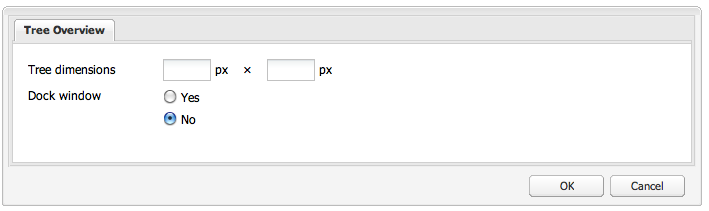

# Utilizzo ed estensione dei widget (interfaccia classica){#using-and-extending-widgets-classic-ui}

>[!NOTE]
>
>Questa pagina descrive l’utilizzo dei widget nell’interfaccia classica, obsoleto in AEM 6.4.
>
> Adobe consiglia di utilizzare l&#39;interfaccia touch moderna [basata su [interfaccia utente Coral](/help/sites-developing/touch-ui-concepts.md#coral-ui) e [interfaccia utente Granite](/help/sites-developing/touch-ui-concepts.md#granite-ui-foundation-components).](/help/sites-developing/touch-ui-concepts.md)

L&#39;interfaccia basata su Web di Adobe Experience Manager utilizza AJAX e altre moderne tecnologie di browser per consentire la modifica e la formattazione WYSIWYG dei contenuti da parte degli autori direttamente sulla pagina Web.

Adobe Experience Manager (AEM) utilizza la libreria di widget [ExtJS](https://www.sencha.com/), che fornisce gli elementi dell&#39;interfaccia utente altamente lucidi che funzionano su tutti i browser più importanti e consentono la creazione di esperienze dell&#39;interfaccia utente di livello desktop.

Questi widget sono inclusi in AEM e, oltre ad essere utilizzati da AEM, possono essere utilizzati da qualsiasi sito Web creato utilizzando AEM.

Per un riferimento completo a tutti i widget disponibili in AEM è possibile fare riferimento alla [documentazione API widget](https://helpx.adobe.com/experience-manager/6-5/sites/developing/using/reference-materials/widgets-api/index.html) o all&#39; [elenco di xtype esistenti](/help/sites-developing/xtypes.md). Inoltre, molti esempi che mostrano come utilizzare il framework ExtJS sono disponibili sul sito [Sencha](https://www.sencha.com/products/extjs/examples/), il proprietario del framework.

Questa pagina fornisce alcune informazioni su come utilizzare ed estendere i widget. La prima descrive come [includere il codice lato client in una pagina](#including-the-client-sided-code-in-a-page). Vengono quindi descritti alcuni componenti di esempio creati per illustrare l’uso e l’estensione di base. Tali componenti sono disponibili nel pacchetto **Using ExtJS Widgets** su **Package Share**.

Il pacchetto include esempi di:

* [Finalità ](#basic-dialogs) di dialogo con widget integrati.
* [Finestra di ](#dynamic-dialogs) dialogo dinamica integrata con widget predefiniti e logica JavaScript personalizzata.
* Finestre di dialogo basate su [widget personalizzati](#custom-widgets).
* Un [pannello ad albero](#tree-overview) che visualizza una struttura JCR sotto un determinato percorso.
* Un [pannello griglia](#grid-overview) che visualizza i dati in formato tabulare.

>[!NOTE]
>
>L&#39;interfaccia classica di Adobe Experience Manager è basata su [ExtJS 3.4.0](https://extjs.cachefly.net/ext-3.4.0/docs/).

## Inclusione del codice lato client in una pagina {#including-the-client-sided-code-in-a-page}

Il codice javascript e del foglio di stile lato client deve essere inserito in una libreria client.

Per creare una libreria client:

1. Create un nodo sotto `/apps/<project>` con le seguenti proprietà:

   * name=&quot;clientlib&quot;
   * jcr:mixinTypes=&quot;[mix:lockable]&quot;
   * jcr:PrimaryType=&quot;cq:ClientLibraryFolder&quot;
   * sling:resourceType=&quot;widgets/clientlib&quot;
   * category=&quot;[&lt;category-name>]&quot;
   * dipendenze=&quot;[cq.widgets]&quot;

   `Note: <category-name> is the name of the custom library (e.g. "cq.extjstraining") and is used to include the library on the page.`

1. Sotto `clientlib` creare le cartelle `css` e `js` (nt:folder).

1. Sotto `clientlib` creare i file `css.txt` e `js.txt` (nt:files). Tali file .txt elencano i file inclusi nella libreria.

1. Modifica `js.txt`: deve iniziare con &#39; `#base=js`&#39; seguito dall&#39;elenco dei file che saranno aggregati dal servizio di libreria client CQ, ad esempio:

   ```
   #base=js
    components.js
    exercises.js
    CustomWidget.js
    CustomBrowseField.js
    InsertTextPlugin.js
   ```

1. Modifica `css.txt`: deve iniziare con &#39; `#base=css`&#39; seguito dall&#39;elenco dei file che saranno aggregati dal servizio di libreria client CQ, ad esempio:

   ```
   #base=css
    components.css
   ```

1. Sotto la cartella `js`, inserite i file javascript che appartengono alla libreria.

1. Sotto la cartella `css`, inserite i file `.css` e le risorse utilizzate dai file css (ad esempio `my_icon.png`).

>[!NOTE]
>
>La gestione dei fogli di stile descritti in precedenza è facoltativa.

Per includere la libreria client nell’jsp del componente pagina:

* per includere sia il codice JavaScript che i fogli di stile:
   `<ui:includeClientLib categories="<category-name1>, <category-name2>, ..."/>`
dove 
`<category-nameX>` è il nome della libreria sul lato client.

* per includere solo il codice JavaScript:
   `<ui:includeClientLib js="<category-name>"/>`

Per ulteriori dettagli, fare riferimento alla descrizione del tag [&lt;ui:includeClientLib>](/help/sites-developing/taglib.md#lt-ui-includeclientlib).

In alcuni casi, una libreria client dovrebbe essere disponibile solo in modalità di creazione e dovrebbe essere esclusa in modalità di pubblicazione. Può essere realizzato come segue:

```xml
    if (WCMMode.fromRequest(request) != WCMMode.DISABLED) {
        %><ui:includeClientLib categories="cq.collab.blog"/><%
    }
```

### Guida introduttiva agli esempi {#getting-started-with-the-samples}

Per seguire le esercitazioni riportate in questa pagina, installate il pacchetto denominato **Using ExtJS Widgets** in un’istanza AEM locale e create una pagina di esempio in cui i componenti saranno inclusi. A questo scopo:

1. Nell&#39;istanza AEM scaricate il pacchetto denominato **Using ExtJS Widgets (v01)** da Package Share e installate il pacchetto. Crea il progetto `extjstraining` sotto `/apps` nella directory archivio.
1. Includete la libreria client contenente gli script (js) e il foglio di stile (css) nel tag head del jsp pagina geometrixx, in quanto includerete i componenti di esempio in una nuova pagina del ramo **Geometrixx**:
in **CRXDE Lite** aprire il file `/apps/geometrixx/components/page/headlibs.jsp` e aggiungere la categoria `cq.extjstraining` al tag `<ui:includeClientLib>` esistente come segue:
   `%><ui:includeClientLib categories="apps.geometrixx-main, cq.extjstraining"/><%`
1. Create una nuova pagina nel ramo **Geometrixx** sotto `/content/geometrixx/en/products` e chiamatela **Utilizzo dei widget ExtJS**.
1. Passate alla modalità di progettazione e aggiungete tutti i componenti del gruppo denominato **Using ExtJS Widgets** alla progettazione dell&#39;Geometrixx
1. Torna alla modalità di modifica: i componenti del gruppo **Using ExtJS Widgets** sono disponibili nella barra laterale.

>[!NOTE]
>
>Gli esempi in questa pagina si basano sul contenuto di Geometrixx, che non viene più fornito con AEM, essendo stato sostituito da We.Retail. Per informazioni su come scaricare e installare Geometrixx, consultate il documento [We.Retail Reference Implementation](/help/sites-developing/we-retail.md#we-retail-geometrixx).

### Finestre di dialogo di base {#basic-dialogs}

Le finestre di dialogo vengono in genere utilizzate per modificare il contenuto, ma possono anche visualizzare solo informazioni. Un modo semplice per visualizzare una finestra di dialogo completa è accedere alla relativa rappresentazione in formato json. A tale scopo, indicate il browser in uso per:

`https://localhost:4502/<path-to-dialog>.-1.json`

Il primo componente del gruppo **Using ExtJS Widgets** nella barra laterale è denominato **1. Nozioni di base sulle finestre di dialogo** e comprende quattro finestre di dialogo di base, integrate con widget predefiniti e senza logica JavaScript personalizzata. Le finestre di dialogo sono memorizzate sotto `/apps/extjstraining/components/dialogbasics`. Le finestre di dialogo di base sono:

* la finestra di dialogo Completa ( `full` nodo): viene visualizzata una finestra con 3 schede, ciascuna con 2 campi di testo.
* la finestra di dialogo Pannello singolo( `singlepanel` nodo): viene visualizzata una finestra con 1 scheda con 2 campi di testo.
* la finestra di dialogo Pannello multiplo ( `multipanel` nodo): la visualizzazione è la stessa della finestra di dialogo Completa, ma viene creata in modo diverso.
* la finestra di dialogo Progettazione( `design` nodo): viene visualizzata una finestra con 2 schede. La prima scheda include un campo di testo, un menu a discesa e un&#39;area di testo comprimibile. La seconda scheda dispone di un campo con 4 campi di testo e un campo comprimibile con 2 campi di testo.

Includere il **1. Finestra di dialogo Nozioni di base** nella pagina di esempio:

1. Aggiungere il simbolo **1. Finestra di dialogo Nozioni di base** nella pagina di esempio dalla scheda **Utilizzo dei widget ExtJS** nella **Barra laterale**.
1. Il componente visualizza un titolo, un testo e un collegamento **PROPERTIES**: fate clic sul collegamento per visualizzare le proprietà del paragrafo memorizzato nella directory archivio. Fate nuovamente clic sul collegamento per nascondere le proprietà.

Il componente viene visualizzato come segue:


#### Esempio 1: Finestra di dialogo completa {#example-full-dialog}

La finestra di dialogo **Completa** visualizza una finestra con tre schede, ciascuna con due campi di testo. Si tratta della finestra di dialogo predefinita del componente **Dialog Basics**. Le sue caratteristiche sono:

* È definito da un nodo: tipo di nodo = `cq:Dialog`, xtype = ` [dialog](/help/sites-developing/xtypes.md#dialog)`.
* Visualizza 3 schede (tipo di nodo = `cq:Panel`).
* Ogni scheda ha 2 campi di testo (tipo di nodo = `cq:Widget`, xtype = ` [textfield](/help/sites-developing/xtypes.md#textfield)`).
* È definito dal nodo:
   `/apps/extjstraining/components/dialogbasics/full`
* Viene eseguito il rendering in formato JSON richiedendo:
   `https://localhost:4502/apps/extjstraining/components/dialogbasics/full.-1.json`

La finestra di dialogo viene visualizzata come segue:


#### Esempio 2: Finestra di dialogo del pannello singolo {#example-single-panel-dialog}

Nella finestra di dialogo **Pannello singolo** viene visualizzata una finestra con una scheda contenente due campi di testo. Le sue caratteristiche sono:

* Visualizza la scheda 1 (tipo di nodo = `cq:Dialog`, xtype = ` [panel](/help/sites-developing/xtypes.md#panel)`)
* La scheda ha due campi di testo (tipo di nodo = `cq:Widget`, xtype = ` [textfield](/help/sites-developing/xtypes.md#textfield)`)
* È definito dal nodo:
   `/apps/extjstraining/components/dialogbasics/singlepanel`
* Viene eseguito il rendering in formato json richiedendo:
   `https://localhost:4502/apps/extjstraining/components/dialogbasics/singlepanel.-1.json`
* Un vantaggio rispetto alla **finestra di dialogo completa** è che è necessaria una minore configurazione.
* Utilizzo consigliato: per finestre di dialogo semplici che visualizzano informazioni o che contengono solo alcuni campi.

Per utilizzare la finestra di dialogo Pannello singolo:

1. Sostituire la finestra di dialogo del componente **Dialog Basics** con la finestra di dialogo **Pannello singolo**:
   1. In **CRXDE Lite**, eliminare il nodo: `/apps/extjstraining/components/dialogbasics/dialog`
   1. Fare clic su **Salva tutto** per salvare le modifiche.
   1. Copia il nodo: `/apps/extjstraining/components/dialogbasics/singlepanel`
   1. Incolla il nodo copiato di seguito: `/apps/extjstraining/components/dialogbasics`
   1. Selezionare il nodo: `/apps/extjstraining/components/dialogbasics/Copy of singlepanel`e rinominarlo `dialog`.
1. Modificate il componente: la finestra di dialogo viene visualizzata come segue:


#### Esempio 3: Finestra di dialogo multipannello {#example-multi-panel-dialog}

La finestra di dialogo **Pannello multiplo** ha lo stesso display della finestra di dialogo **Completa**, ma è costruita in modo diverso. Le sue caratteristiche sono:

* È definito da un nodo (tipo di nodo = `cq:Dialog`, xtype = ` [tabpanel](/help/sites-developing/xtypes.md#tabpanel)`).
* Visualizza 3 schede (tipo di nodo = `cq:Panel`).
* Ogni scheda ha 2 campi di testo (tipo di nodo = `cq:Widget`, xtype = ` [textfield](/help/sites-developing/xtypes.md#textfield)`).
* È definito dal nodo:
   `/apps/extjstraining/components/dialogbasics/multipanel`
* Viene eseguito il rendering in formato json richiedendo:
   `https://localhost:4502/apps/extjstraining/components/dialogbasics/multipanel.-1.json`
* Un vantaggio rispetto alla finestra di dialogo **Completa** è che dispone di una struttura semplificata.
* Utilizzo consigliato: per finestre di dialogo con più schede.

Per utilizzare la finestra di dialogo Pannello multiplo:

1. Sostituire la finestra di dialogo del componente **Dialog Basics** con la finestra di dialogo **Multi Panel**:
seguire i passaggi descritti per l&#39; [Esempio 2: Finestra di dialogo del pannello singolo](#example-single-panel-dialog)
1. Modificate il componente: la finestra di dialogo viene visualizzata come segue:


#### Esempio 4: Finestra di dialogo RTF {#example-rich-dialog}

La finestra di dialogo **Rich** presenta due schede. La prima scheda include un campo di testo, un menu a discesa e un&#39;area di testo comprimibile. La seconda scheda presenta un campo con quattro campi di testo e un campo comprimibile con due campi di testo. Le sue caratteristiche sono:

* È definito da un nodo (tipo di nodo = `cq:Dialog`, xtype = ` [dialog](/help/sites-developing/xtypes.md#dialog)`).
* Visualizza 2 schede (tipo di nodo = `cq:Panel`).
* La prima scheda è dotata di un widget ` [dialogfieldset](/help/sites-developing/xtypes.md#dialogfieldset)` con ` [textfield](/help/sites-developing/xtypes.md#textfield)` e un widget ` [selection](/help/sites-developing/xtypes.md#selection)` con 3 opzioni, e di un ` [dialogfieldset](/help/sites-developing/xtypes.md#dialogfieldset)` comprimibile con un widget ` [textarea](/help/sites-developing/xtypes.md#textarea)`.
* La seconda scheda include un widget ` [dialogfieldset](/help/sites-developing/xtypes.md#dialogfieldset)` con 4 ` [textfield](/help/sites-developing/xtypes.md#textfield)` widget e un `dialogfieldset` comprimibile con 2 ` [textfield](/help/sites-developing/xtypes.md#textfield)` widget.
* È definito dal nodo:
   `/apps/extjstraining/components/dialogbasics/rich`
* Viene eseguito il rendering in formato json richiedendo:
   `https://localhost:4502/apps/extjstraining/components/dialogbasics/rich.-1.json`

Per utilizzare la finestra di dialogo **Rich**:

1. Sostituire la finestra di dialogo del componente **Dialog Basics** con la finestra di dialogo **Rich**:
seguire i passaggi descritti per l&#39; [Esempio 2: Finestra di dialogo del pannello singolo](#example-single-panel-dialog)
1. Modificate il componente: la finestra di dialogo viene visualizzata come segue:

 

### Finestre di dialogo dinamiche {#dynamic-dialogs}

Il secondo componente del gruppo **Using ExtJS Widgets** nella barra laterale è denominato **2. Dialoghi dinamici** e comprende tre finestre di dialogo dinamiche costruite con widget predefiniti e **con logica javascript personalizzata**. Le finestre di dialogo sono memorizzate sotto `/apps/extjstraining/components/dynamicdialogs`. Le finestre di dialogo dinamiche sono:

* la finestra di dialogo Switch Tabs ( `switchtabs` nodo): viene visualizzata una finestra con due schede. La prima scheda dispone di una selezione di pulsanti di scelta con tre opzioni: quando è selezionata un&#39;opzione, viene visualizzata una scheda relativa all&#39;opzione. La seconda scheda contiene due campi di testo.
* la finestra di dialogo arbitraria ( `arbitrary` nodo): viene visualizzata una finestra con una scheda. Nella scheda è presente un campo da cui rilasciare o caricare una risorsa e un campo in cui sono visualizzate informazioni sulla pagina contenitore e sulla risorsa, se vi si fa riferimento.
* finestra di dialogo Attiva/disattiva campi ( `togglefield` nodo): viene visualizzata una finestra con una scheda. La scheda dispone di una casella di controllo: quando viene selezionato, viene visualizzato un set di campi con due campi di testo.

Per includere il **2. Finestra di dialogo dinamica** nella pagina di esempio:

1. Aggiungere il simbolo **2. Finestra di dialogo dinamica** nella pagina di esempio dalla scheda **Using ExtJS Widgets** nella **Barra laterale**.
1. Il componente visualizza un titolo, un testo e un collegamento **PROPERTIES**: fare clic per visualizzare le proprietà del paragrafo memorizzato nella directory archivio. Fate di nuovo clic per nascondere le proprietà.

Il componente viene visualizzato come segue:


#### Esempio 1: Finestra di dialogo Cambia schede {#example-switch-tabs-dialog}

Nella finestra di dialogo **Switch Tabs** viene visualizzata una finestra con due schede. La prima scheda dispone di una selezione di pulsanti di scelta con tre opzioni: quando è selezionata un&#39;opzione, viene visualizzata una scheda relativa all&#39;opzione. La seconda scheda contiene due campi di testo.

Le sue caratteristiche principali sono:

* È definito da un nodo (tipo di nodo = `cq:Dialog`, xtype = ` [dialog](/help/sites-developing/xtypes.md#dialog)`).
* Visualizza 2 schede (tipo di nodo = `cq:Panel`): 1 scheda di selezione, la seconda scheda dipende dalla selezione nella prima scheda (3 opzioni).
* Sono disponibili 3 schede facoltative (tipo di nodo = `cq:Panel`), ognuna con 2 campi di testo (tipo di nodo = `cq:Widget`, xtype = ` [textfield](/help/sites-developing/xtypes.md#textfield)`). Viene visualizzata una sola scheda opzionale alla volta.
* È definito dal nodo `switchtabs` in:
   `/apps/extjstraining/components/dynamicdialogs/switchtabs`
* Viene eseguito il rendering in formato json richiedendo:
   `https://localhost:4502/apps/extjstraining/components/dynamicdialogs/switchtabs.-1.json`

La logica è implementata tramite i listener di eventi e il codice javascript come segue:

* Il nodo di dialogo ha un listener &quot; `beforeshow`&quot; che nasconde tutte le schede facoltative prima della visualizzazione della finestra di dialogo:
   `beforeshow="function(dialog){Ejst.x2.manageTabs(dialog.items.get(0));}"`

   `dialog.items.get(0)` ottiene la scheda contenente il pannello di selezione e i 3 pannelli opzionali.
* L&#39;oggetto `Ejst.x2` è definito nel file `exercises.js` in:
   `/apps/extjstraining/clientlib/js/exercises.js`
* Nel metodo `Ejst.x2.manageTabs()`, poiché il valore di `index` è -1, tutte le schede opzionali sono nascoste (i va da 1 a 3).
* Nella scheda di selezione sono presenti due listener: una che mostra la scheda selezionata quando la finestra di dialogo viene caricata (&quot; `loadcontent`&quot; event) e una che mostra la scheda selezionata quando la selezione viene modificata (&quot; `selectionchanged`&quot; event):
   `loadcontent="function(field,rec,path){Ejst.x2.showTab(field);}"`

   `selectionchanged="function(field,value){Ejst.x2.showTab(field);}"`
* Nel metodo `Ejst.x2.showTab()`:
   `field.findParentByType('tabpanel')` ottiene la scheda contenente tutte le schede ( `field` rappresenta il widget di selezione)
   `field.getValue()` ottiene il valore della selezione, ad esempio: tab2
   `Ejst.x2.manageTabs()` visualizza la scheda selezionata.
* Ogni scheda opzionale ha un listener che nasconde la scheda sull&#39;evento &quot; `render`&quot;:
   `render="function(tab){Ejst.x2.hideTab(tab);}"`
* Nel metodo `Ejst.x2.hideTab()`:
   `tabPanel` è la scheda che contiene tutte le schede
   `index` è l&#39;indice della scheda opzionale
   `tabPanel.hideTabStripItem(index)` nasconde la scheda

Viene visualizzato come segue:


#### Esempio 2: Finestra di dialogo arbitrario {#example-arbitrary-dialog}

Molto spesso viene visualizzata una finestra di dialogo con il contenuto del componente sottostante. La finestra di dialogo descritta qui, denominata finestra di dialogo **Arbitrario**, estrae il contenuto da un componente diverso.

La finestra di dialogo **Arbitrario** visualizza una finestra con una scheda. La scheda presenta due campi: uno per rilasciare o caricare una risorsa e uno per visualizzare informazioni sulla pagina contenitore e sulla risorsa, se vi è stato riferimento.

Le sue caratteristiche principali sono:

* È definito da un nodo (tipo di nodo = `cq:Dialog`, xtype = ` [dialog](/help/sites-developing/xtypes.md#dialog)`).
* Visualizza 1 widget del pannello tabulazioni (tipo di nodo = `cq:Widget`, xtype = ` [tabpanel](/help/sites-developing/xtypes.md#tabpanel)`) con 1 pannello (tipo di nodo = `cq:Panel`)
* Il pannello dispone di un widget smartfile (tipo di nodo = `cq:Widget`, xtype = ` [smartfile](/help/sites-developing/xtypes.md#smartfile)`) e di un widget di disegno proprietario (tipo di nodo = `cq:Widget`, xtype = ` [ownerdraw](/help/sites-developing/xtypes.md#ownerdraw)`)
* È definito dal nodo `arbitrary` in:
   `/apps/extjstraining/components/dynamicdialogs/arbitrary`
* Viene eseguito il rendering in formato json richiedendo:
   `https://localhost:4502/apps/extjstraining/components/dynamicdialogs/arbitrary.-1.json`

La logica è implementata tramite i listener di eventi e il codice javascript come segue:

* Il widget di proprietà dispone di un listener &quot; `loadcontent`&quot; che mostra informazioni sulla pagina contenente il componente e la risorsa a cui fa riferimento il widget smartfile quando il contenuto viene caricato:
   `loadcontent="function(field,rec,path){Ejst.x2.showInfo(field,rec,path);}"`

   `field` è impostato con l&#39;oggetto ownerdraw
   `path` è impostato con il percorso del contenuto del componente (ad es.: /content/geometrixx/it/products/triangle/ui-tutorial/jcr:content/par/dynamicdialogs)
* L&#39;oggetto `Ejst.x2` è definito nel file `exercises.js` in:
   `/apps/extjstraining/clientlib/js/exercises.js`
* Nel metodo `Ejst.x2.showInfo()`:
   `pagePath` è il percorso della pagina contenente il componente
   `pageInfo` rappresenta le proprietà della pagina in formato json
   `reference` è il percorso della risorsa di riferimento
   `metadata` rappresenta i metadati della risorsa in formato json
   `ownerdraw.getEl().update(html);` visualizza il codice HTML creato nella finestra di dialogo

Per utilizzare la finestra di dialogo **Arbitrario**:

1. Sostituire la finestra di dialogo del componente **Dialogo dinamico** con la finestra di dialogo **Arbitrario**:
seguire i passaggi descritti per l&#39; [Esempio 2: Finestra di dialogo del pannello singolo](#example-single-panel-dialog)
1. Modificate il componente: la finestra di dialogo viene visualizzata come segue:


#### Esempio 3: Finestra di dialogo Attiva/disattiva campi {#example-toggle-fields-dialog}

La finestra di dialogo **Attiva/Disattiva campi** visualizza una finestra con una scheda. La scheda dispone di una casella di controllo: quando viene selezionato, viene visualizzato un set di campi con due campi di testo.

Le sue caratteristiche principali sono:

* È definito da un nodo (tipo di nodo = `cq:Dialog`, xtype = ` [dialog](/help/sites-developing/xtypes.md#dialog)`).
* Visualizza 1 widget del pannello tabulazioni (tipo di nodo = `cq:Widget`, xtype = ` [tabpanel](/help/sites-developing/xtypes.md#textpanel)`) con 1 pannello (tipo di nodo = `cq:Panel`).
* Il pannello dispone di un widget di selezione/casella di controllo (tipo di nodo = `cq:Widget`, xtype = ` [selection](/help/sites-developing/xtypes.md#selection)`, type = ` [checkbox](/help/sites-developing/xtypes.md#checkbox)`) e di un widget di tipo di campo di dialogo comprimibile (tipo di nodo = `cq:Widget`, xtype = ` [dialogfieldset](/help/sites-developing/xtypes.md#dialogfieldset)`) nascosto per impostazione predefinita, con 2 widget di campo di testo (tipo di nodo = `cq:Widget`, xtype = ` [textfield](/help/sites-developing/xtypes.md#textfield)`).
* È definito dal nodo `togglefields` in:
   `/apps/extjstraining/components/dynamicdialogs/togglefields`
* Viene eseguito il rendering in formato json richiedendo:
   `https://localhost:4502/apps/extjstraining/components/dynamicdialogs/togglefields.-1.json`

La logica è implementata tramite i listener di eventi e il codice javascript come segue:

* nella scheda di selezione sono presenti due listener: uno che mostra l&#39;argomento di dialogo quando il contenuto viene caricato (&quot; `loadcontent`&quot; event) e uno che mostra l&#39;argomento di dialogo quando la selezione viene modificata (&quot; `selectionchanged`&quot; event):
   `loadcontent="function(field,rec,path){Ejst.x2.toggleFieldSet(field);}"`

   `selectionchanged="function(field,value){Ejst.x2.toggleFieldSet(field);}"`
* L&#39;oggetto `Ejst.x2` è definito nel file `exercises.js` in:
   `/apps/extjstraining/clientlib/js/exercises.js`
* Nel metodo `Ejst.x2.toggleFieldSet()`:
   `box` è l&#39;oggetto selezione
   `panel` è il pannello che contiene la selezione e i widget di dialogfieldset
   `fieldSet` è l&#39;oggetto dialogfieldset
   `show` è il valore della selezione (true o false) in base a &#39;  `show`&#39; viene visualizzato o meno il valore dialogfielddell

Per utilizzare la finestra di dialogo **Attiva/disattiva campi**:

1. Sostituire la finestra di dialogo del componente **Finestra di dialogo dinamica** con la finestra di dialogo **Attiva/disattiva campi**:
seguire i passaggi descritti per l&#39; [Esempio 2: Finestra di dialogo del pannello singolo](#example-single-panel-dialog)
1. Modificate il componente: la finestra di dialogo viene visualizzata come segue:


### Widget personalizzati {#custom-widgets}

I widget forniti con AEM dovrebbero includere la maggior parte dei casi di utilizzo. Tuttavia, a volte potrebbe essere necessario creare un widget personalizzato per soddisfare un requisito specifico del progetto. È possibile creare widget personalizzati estendendone quelli esistenti. Per iniziare a utilizzare questa personalizzazione, il pacchetto **Using ExtJS Widgets** include tre finestre di dialogo che utilizzano tre diversi widget personalizzati:

* la finestra di dialogo Campo multiplo ( `multifield` nodo) visualizza una finestra con una scheda. La scheda dispone di un widget multicampo personalizzato con due campi: un menu a discesa con due opzioni e un campo di testo. Poiché si basa sul widget `multifield` fornito con un solo campo di testo, esso presenta tutte le caratteristiche del widget `multifield`.
* la finestra di dialogo Sfoglia struttura ( `treebrowse` nodo) visualizza una finestra con una scheda contenente un widget di ricerca percorso: quando si fa clic sulla freccia, si apre una finestra in cui è possibile esplorare una gerarchia e selezionare un elemento. Il percorso dell’elemento viene quindi aggiunto al campo percorso e viene mantenuto alla chiusura della finestra di dialogo.
* una finestra di dialogo basata sul plug-in Editor Rich Text (nodo `rteplugin`) che aggiunge un pulsante personalizzato all&#39;Editor Rich Text per inserire del testo personalizzato nel testo principale. È costituito da un `richtext` widget (RTE) e da una funzione personalizzata che viene aggiunta tramite il meccanismo plug-in RTE.

I widget personalizzati e il plug-in sono inclusi nel componente denominato **3. Widget personalizzati** del pacchetto **Using ExtJS Widgets**. Per includere questo componente nella pagina di esempio:

1. Aggiungere il simbolo **3. Widget personalizzati** nella pagina di esempio dalla scheda **Using ExtJS Widgets** nella **Barra laterale**.
1. Il componente visualizza un titolo, un testo e, quando si fa clic sul collegamento **PROPERTIES**, le proprietà del paragrafo memorizzato nella directory archivio. Facendo di nuovo clic le proprietà vengono nascoste.
Il componente viene visualizzato come segue:


#### Esempio 1: Widget multicampo personalizzato {#example-custom-multifield-widget}

La finestra di dialogo **Custom Multifield** basata su widget visualizza una finestra con una scheda. La scheda dispone di un widget multicampo personalizzato che, a differenza di quello standard con un campo, ha due campi: un menu a discesa con due opzioni e un campo di testo.

Finestra di dialogo **Custom Multifield** basata sui widget:

* È definito da un nodo (tipo di nodo = `cq:Dialog`, xtype = ` [dialog](/help/sites-developing/xtypes.md#dialog)`).
* Visualizza 1 widget del pannello tabulazioni (tipo di nodo = `cq:Widget`, xtype = ` [tabpanel](/help/sites-developing/xtypes.md#tabpanel)`) contenente un pannello (tipo di nodo = `cq:Widget`, xtype = ` [panel](/help/sites-developing/xtypes.md#panel)`).
* Il pannello ha un widget `multifield` (tipo di nodo = `cq:Widget`, xtype = ` [multifield](/help/sites-developing/xtypes.md#multifield)`).
* Il widget `multifield` dispone di un file config (tipo di nodo = `nt:unstructured`, xtype = `ejstcustom`, optionsProvider = `Ejst.x3.provideOptions`) basato sul xtype personalizzato &#39; `ejstcustom`&#39;:
   * &#39; `fieldconfig`&#39; è un&#39;opzione di configurazione dell&#39;oggetto ` [CQ.form.MultiField](https://helpx.adobe.com/experience-manager/6-5/sites/developing/using/reference-materials/widgets-api/index.html?class=CQ.form.MultiField)`.
   * &#39; `optionsProvider`&#39; è una configurazione del widget `ejstcustom`. Viene impostato con il metodo `Ejst.x3.provideOptions` definito in `exercises.js` in:
      `/apps/extjstraining/clientlib/js/exercises.js`
e restituisce 2 opzioni.
* È definito dal nodo `multifield` in:
   `/apps/extjstraining/components/customwidgets/multifield`
* Viene eseguito il rendering in formato json richiedendo:
   `https://localhost:4502/apps/extjstraining/components/customwidgets/multifield.-1.json`

Il widget multicampo personalizzato (xtype = `ejstcustom`):

* È un oggetto javascript denominato `Ejst.CustomWidget`.
* È definito nel file `CustomWidget.js` javascript in:
   `/apps/extjstraining/clientlib/js/CustomWidget.js`
* Estende il widget ` [CQ.form.CompositeField](https://helpx.adobe.com/experience-manager/6-5/sites/developing/using/reference-materials/widgets-api/index.html?class=CQ.form.CompositeField)`.
* Contiene 3 campi: `hiddenField` (Campo di testo), `allowField` (Casella combinata) e `otherField` (Campo di testo)
* Sostituisce `CQ.Ext.Component#initComponent` per aggiungere i 3 campi:
   * `allowField` è un oggetto  [CQ.form.](https://helpx.adobe.com/experience-manager/6-5/sites/developing/using/reference-materials/widgets-api/index.html?class=CQ.form.Selection) Selectiondi tipo &#39;select&#39;. optionsProvider è una configurazione dell&#39;oggetto Selection creata con la configurazione optionsProvider del CustomWidget definito nella finestra di dialogo
   * `otherField` è un oggetto  [CQ.Ext.form.](https://helpx.adobe.com/experience-manager/6-5/sites/developing/using/reference-materials/widgets-api/index.html?class=CQ.Ext.form.TextField) TextField
* Sostituisce i metodi `setValue`, `getValue` e `getRawValue` di [CQ.form.CompositeField](https://helpx.adobe.com/experience-manager/6-5/sites/developing/using/reference-materials/widgets-api/index.html?class=CQ.form.CompositeField) per impostare e recuperare il valore di CustomWidget con il formato:
   `<allowField value>/<otherField value>, e.g.: 'Bla1/hello'`.
* Si registra come xtype &#39; `ejstcustom`&#39;:
   `CQ.Ext.reg('ejstcustom', Ejst.CustomWidget);`

La finestra di dialogo **Custom Multifield** basata su widget viene visualizzata come segue:


#### Esempio 2: Widget personalizzato Sfoglia {#example-custom-treebrowse-widget}

La finestra di dialogo personalizzata basata su widget **Treebrowse** visualizza una finestra con una scheda contenente un widget di ricerca del percorso personalizzato: quando si fa clic sulla freccia, si apre una finestra in cui è possibile esplorare una gerarchia e selezionare un elemento. Il percorso dell’elemento viene quindi aggiunto al campo percorso e viene mantenuto alla chiusura della finestra di dialogo.

Finestra di dialogo delle righe di testo personalizzata:

* È definito da un nodo (tipo di nodo = `cq:Dialog`, xtype = ` [dialog](/help/sites-developing/xtypes.md#dialog)`).
* Visualizza 1 widget del pannello tabulazioni (tipo di nodo = `cq:Widget`, xtype = ` [tabpanel](/help/sites-developing/xtypes.md#tabpanel)`) contenente un pannello (tipo di nodo = `cq:Widget`, xtype = ` [panel](/help/sites-developing/xtypes.md#panel)`).
* Il pannello ha un widget personalizzato (tipo di nodo = `cq:Widget`, xtype = `ejstbrowse`)
* È definito dal nodo `treebrowse` in:
   `/apps/extjstraining/components/customwidgets/treebrowse`
* Viene eseguito il rendering in formato json richiedendo:
   `https://localhost:4502/apps/extjstraining/components/customwidgets/treebrowse.-1.json`

Il widget personalizzato della barra degli strumenti (xtype = `ejstbrowse`):

* È un oggetto javascript denominato `Ejst.CustomWidget`.
* È definito nel file `CustomBrowseField.js` javascript in:
   `/apps/extjstraining/clientlib/js/CustomBrowseField.js`
* Estende ` [CQ.Ext.form.TriggerField](https://helpx.adobe.com/experience-manager/6-5/sites/developing/using/reference-materials/widgets-api/index.html?class=CQ.Ext.form.TriggerField)`.
* Definisce una finestra di ricerca denominata `browseWindow`.
* Sostituisce ` [CQ.Ext.form.TriggerField](https://helpx.adobe.com/experience-manager/6-5/sites/developing/using/reference-materials/widgets-api/index.html?class=CQ.Ext.form.TriggerField)#onTriggerClick` per mostrare la finestra di ricerca quando si fa clic sulla freccia.
* Definisce un oggetto [CQ.Ext.treePanel](https://helpx.adobe.com/experience-manager/6-5/sites/developing/using/reference-materials/widgets-api/index.html?class=CQ.Ext.tree.TreePanel):
   * Ottiene i dati chiamando il servlet registrato in `/bin/wcm/siteadmin/tree.json`.
   * La radice è &quot; `apps/extjstraining`&quot;.
* Definisce un oggetto `window` ( ` [CQ.Ext.Window](https://helpx.adobe.com/experience-manager/6-5/sites/developing/using/reference-materials/widgets-api/index.html?class=CQ.Ext.Window)`):
   * Basato sul pannello predefinito.
   * Contiene un pulsante **OK** che imposta il valore del percorso selezionato e nasconde il pannello.
* La finestra è ancorata sotto il campo **Path**.
* Il percorso selezionato viene passato dal campo di ricerca alla finestra in corrispondenza dell&#39;evento `show`.
* Si registra come xtype &#39; `ejstbrowse`&#39;:
   `CQ.Ext.reg('ejstbrowse', Ejst.CustomBrowseField);`

Per utilizzare la finestra di dialogo basata su widget **Custom Treebrowse**:

1. Sostituire la finestra di dialogo del componente **Widget personalizzati** con la finestra di dialogo **Custom Treebrowse**:
seguire i passaggi descritti per l&#39; [Esempio 2: Finestra di dialogo del pannello singolo](#example-single-panel-dialog)
1. Modificate il componente: la finestra di dialogo viene visualizzata come segue:


#### Esempio 3: Plug-in Editor Rich Text (RTE) {#example-rich-text-editor-rte-plug-in}

La finestra di dialogo basata sul plug-in **Editor Rich Text (RTE) è una finestra di dialogo basata su Editor Rich Text con un pulsante personalizzato per inserire del testo personalizzato tra parentesi quadre.** Il testo personalizzato può essere analizzato da una logica lato server (non implementata in questo esempio), ad esempio per aggiungere del testo definito nel percorso specificato:

Finestra di dialogo basata sul plug-in **RTE**:

* È definito dal nodo reteplugin in in:
   `/apps/extjstraining/components/customwidgets/rteplugin`
* Viene eseguito il rendering in formato json richiedendo:
   `https://localhost:4502/apps/extjstraining/components/customwidgets/rteplugin.-1.json`
* Il nodo `rtePlugins` ha un nodo secondario `inserttext` (tipo di nodo = `nt:unstructured`) a cui viene assegnato il nome in base al plug-in. Ha una proprietà denominata `features`, che definisce quale delle funzioni plug-in è disponibile per l&#39;editor Rich Text.

Il plug-in RTE:

* È un oggetto javascript denominato `Ejst.InsertTextPlugin`.
* È definito nel file `InsertTextPlugin.js` javascript in:
   `/apps/extjstraining/clientlib/js/InsertTextPlugin.js`
* Estende l&#39;oggetto ` [CQ.form.rte.plugins.Plugin](https://helpx.adobe.com/experience-manager/6-5/sites/developing/using/reference-materials/widgets-api/index.html?class=CQ.form.rte.plugins.Plugin)`.
* I seguenti metodi definiscono l&#39;oggetto ` [CQ.form.rte.plugins.Plugin](https://helpx.adobe.com/experience-manager/6-5/sites/developing/using/reference-materials/widgets-api/index.html?class=CQ.form.rte.plugins.Plugin)` e vengono sostituiti nel plug-in di implementazione:
   * `getFeatures()` restituisce un array di tutte le funzioni che il plug-in rende disponibili.
   * `initializeUI()` aggiunge il nuovo pulsante alla barra degli strumenti dell’editor Rich Text.
   * `notifyPluginConfig()` visualizza titolo e testo quando il pulsante è tenuto premuto.
   * `execute()` viene chiamato quando si fa clic sul pulsante ed esegue l&#39;azione del plug-in: viene visualizzata una finestra che consente di definire il testo da includere.
* `insertText()` inserisce un testo utilizzando l&#39;oggetto finestra di dialogo corrispondente  `Ejst.InsertTextPlugin.Dialog` (vedere dopo).
* `executeInsertText()` viene chiamato dal  `apply()` metodo della finestra di dialogo, che viene attivato quando si fa clic sul pulsante  **** OK.
* Si registra come plug-in &#39; `inserttext`&#39;:
   `CQ.form.rte.plugins.PluginRegistry.register("inserttext", Ejst.InsertTextPlugin);`
* l&#39;oggetto `Ejst.InsertTextPlugin.Dialog` definisce la finestra di dialogo che viene aperta quando si fa clic sul pulsante del plug-in. La finestra di dialogo è composta da un pannello, un modulo, un campo di testo e due pulsanti (**OK** e **Annulla**).

Per utilizzare la finestra di dialogo basata su **Editor Rich Text (RTE) Plug-in**:

1. Sostituire la finestra di dialogo del componente **Widget personalizzati** con la finestra di dialogo basata su **Editor Rich Text (RTE) Plug-in**:
seguire i passaggi descritti per l&#39; [Esempio 2: Finestra di dialogo del pannello singolo](#example-single-panel-dialog)
1. Modificate il componente.
1. Fate clic sull’ultima icona a destra (quella con quattro frecce). Immettete un percorso e fate clic su **OK**:
Il percorso viene visualizzato tra parentesi ([ ]).
1. Fare clic su **OK** per chiudere l&#39;Editor Rich Text.

La finestra di dialogo basata su **Editor Rich Text (RTE) Plug-in** viene visualizzata come segue:


>[!NOTE]
>
>Questo esempio mostra solo come implementare la parte client della logica: i segnaposto (*[text]*) devono quindi essere analizzati esplicitamente sul lato server (ad esempio nel JSP componente).

### Panoramica struttura {#tree-overview}

L&#39;oggetto out-of-the-box ` [CQ.Ext.tree.TreePanel](https://helpx.adobe.com/experience-manager/6-5/sites/developing/using/reference-materials/widgets-api/index.html?class=CQ.Ext.tree.TreePanel)` fornisce una rappresentazione dell&#39;interfaccia utente strutturata ad albero di dati strutturati. Il componente Panoramica struttura incluso nel pacchetto **Using ExtJS Widgets** mostra come utilizzare l&#39;oggetto `TreePanel` per visualizzare una struttura JCR sotto un determinato percorso. La finestra stessa può essere agganciata/sganciata. In questo esempio, la logica della finestra è incorporata nel jsp del componente tra i tag &lt;script>&lt;/script>.

Per includere il componente **Panoramica albero** nella pagina di esempio:

1. Aggiungere il simbolo **4. Panoramica struttura** nella pagina di esempio dalla scheda **Using ExtJS Widgets** nella **Barra laterale**.
1. Viene visualizzato il componente:
   * un titolo, con del testo
   * un collegamento **PROPERTIES**: fare clic per visualizzare le proprietà del paragrafo memorizzato nella directory archivio. Fate di nuovo clic per nascondere le proprietà.
   * una finestra mobile con una struttura ad albero che può essere espansa.

Il componente viene visualizzato come segue:


Il componente Panoramica struttura:

* È definito in:
   `/apps/extjstraining/components/treeoverview`

* La finestra di dialogo consente di impostare le dimensioni della finestra e di agganciare o sganciare la finestra (vedere i dettagli di seguito).

Il componente jsp:

* Recupera la larghezza, l&#39;altezza e le proprietà agganciate dalla directory archivio.
* Visualizza del testo sul formato dei dati della panoramica della struttura.
* Incorpora la logica della finestra nel componente jsp tra i tag javascript.
* È definito in:
   `apps/extjstraining/components/treeoverview/content.jsp`

Il codice javascript incorporato nel componente jsp:

* Definisce un oggetto `tree` cercando di recuperare una finestra ad albero dalla pagina.
* Se la finestra che visualizza la struttura non esiste, viene creato `treePanel` ([CQ.Ext.tree.TreePanel](https://helpx.adobe.com/experience-manager/6-5/sites/developing/using/reference-materials/widgets-api/index.html?class=CQ.Ext.tree.TreePanel)):
   * `treePanel` contiene i dati utilizzati per creare la finestra.
   * I dati vengono recuperati chiamando il servlet registrato in:
      `/bin/wcm/siteadmin/tree.json`
* Il listener `beforeload` verifica che il nodo selezionato sia caricato.
* L&#39;oggetto `root` imposta il percorso `apps/extjstraining` come radice della struttura.
* `tree` (  ` [CQ.Ext.Window](https://helpx.adobe.com/experience-manager/6-5/sites/developing/using/reference-materials/widgets-api/index.html?class=CQ.Ext.Window)`) è impostato in base alla definizione predefinita  `treePanel`, ed è visualizzato con:
   `tree.show();`
* Se la finestra esiste già, viene visualizzata in base alle proprietà larghezza, altezza e agganciata recuperate dalla directory archivio.

Finestra di dialogo del componente:

* Visualizza 1 scheda con 2 campi per impostare le dimensioni (larghezza e altezza) della finestra della panoramica struttura e 1 campo per agganciare/sganciare la finestra
* È definito da un nodo (tipo di nodo = `cq:Dialog`, xtype = ` [panel](/help/sites-developing/xtypes.md#panel)`).
* Il pannello ha un widget di dimensioni (tipo di nodo = `cq:Widget`, xtype = ` [sizefield](/help/sites-developing/xtypes.md#sizefield)`) e un widget di selezione (tipo di nodo = `cq:Widget`, xtype = ` [selection](/help/sites-developing/xtypes.md#selection)`, type = `radio`) con 2 opzioni (true/false)
* È definito dal nodo della finestra di dialogo in:
   `/apps/extjstraining/components/treeoverview/dialog`
* Viene eseguito il rendering in formato json richiedendo:
   `https://localhost:4502/apps/extjstraining/components/treeoverview/dialog.-1.json`
* Visualizza come segue:



### Panoramica sulla griglia {#grid-overview}

Un pannello Griglia rappresenta i dati in un formato tabulare di righe e colonne. È composto dai seguenti elementi:

* Store: il modello che contiene i record di dati (righe).
* Modello colonna: il trucco delle colonne.
* Visualizza : incapsula l&#39;interfaccia utente.
* Modello di selezione : il comportamento di selezione.

Il componente Panoramica griglia incluso nel pacchetto **Using ExtJS Widgets** mostra come visualizzare i dati in formato tabulare:

* Nell&#39;esempio 1 vengono utilizzati dati statici.
* Nell&#39;esempio 2 vengono utilizzati i dati recuperati dall&#39;archivio.

Per includere il componente Panoramica griglia nella pagina di esempio:

1. Aggiungere il simbolo **5. Panoramica griglia** nella pagina di esempio dalla scheda **Utilizzo dei widget ExtJS** nella **Barra laterale**.
1. Viene visualizzato il componente:
   * un titolo con del testo
   * un collegamento **PROPERTIES**: fare clic per visualizzare le proprietà del paragrafo memorizzato nella directory archivio. Fate di nuovo clic per nascondere le proprietà.
   * una finestra mobile contenente dati in formato tabulare.

Il componente viene visualizzato come segue:


#### Esempio 1: Griglia predefinita {#example-default-grid}

Nella versione standard, il componente **Panoramica griglia** visualizza una finestra con dati statici in formato tabulare. In questo esempio, la logica è incorporata nel jsp componente in due modi:

* la logica generica è definita tra i tag &lt;script>&lt;/script>
* la logica specifica è disponibile in un file .js separato ed è collegata nel jsp. Questa configurazione consente di passare facilmente tra le due logiche (statiche/dinamiche) commentando i tag &lt;script> desiderati.

Il componente Panoramica sulla griglia:

* È definito in:
   `/apps/extjstraining/components/gridoverview`
* La finestra di dialogo consente di impostare le dimensioni della finestra e di agganciare o sganciare la finestra.

Il componente jsp:

* Recupera la larghezza, l&#39;altezza e le proprietà agganciate dalla directory archivio.
* Visualizza parte del testo come introduzione al formato dati della panoramica della griglia.
* Fa riferimento al codice JavaScript che definisce l&#39;oggetto GridPanel:
   `<script type="text/javascript" src="/apps/extjstraining/components/gridoverview/defaultgrid.js"></script>`

   `defaultgrid.js` definisce alcuni dati statici come base per l&#39;oggetto GridPanel.
* Incorpora il codice JavaScript tra i tag javascript che definisce l&#39;oggetto Window che utilizza l&#39;oggetto GridPanel.
* È definito in:
   `apps/extjstraining/components/gridoverview/content.jsp`

Il codice javascript incorporato nel componente jsp:

* Definisce l&#39;oggetto `grid` cercando di recuperare il componente finestra dalla pagina:
   `var grid = CQ.Ext.getCmp("<%= node.getName() %>-grid");`
* Se `grid` non esiste, un oggetto [CQ.Ext.grid.GridPanel](https://helpx.adobe.com/experience-manager/6-5/sites/developing/using/reference-materials/widgets-api/index.html?class=CQ.Ext.grid.GridPanel) ( `gridPanel`) è definito chiamando il metodo `getGridPanel()` (vedere di seguito). Questo metodo è definito in `defaultgrid.js`.
* `grid` è un  ` [CQ.Ext.Window](https://helpx.adobe.com/experience-manager/6-5/sites/developing/using/reference-materials/widgets-api/index.html?class=CQ.Ext.Window)` oggetto, basato sul GridPanel predefinito, ed è visualizzato:  `grid.show();`
* Se `grid` esiste già, viene visualizzato in base alle proprietà larghezza, altezza e agganciato recuperate dall&#39;archivio.

Il file javascript ( `defaultgrid.js`) a cui si fa riferimento nel componente jsp definisce il metodo `getGridPanel()` che viene chiamato dallo script incorporato nel JSP e restituisce un oggetto ` [CQ.Ext.grid.GridPanel](https://helpx.adobe.com/experience-manager/6-5/sites/developing/using/reference-materials/widgets-api/index.html?class=CQ.Ext.grid.GridPanel)`, basato su dati statici. La logica è la seguente:

* `myData` è un array di dati statici formattati come tabella di 5 colonne e 4 righe.
* `store` è un  `CQ.Ext.data.Store` oggetto che consuma  `myData`.
* `store` è caricato in memoria:
   `store.load();`
* `gridPanel` è un  ` [CQ.Ext.grid.GridPanel](https://helpx.adobe.com/experience-manager/6-5/sites/developing/using/reference-materials/widgets-api/index.html?class=CQ.Ext.grid.GridPanel)` oggetto che consuma  `store`:
   * le larghezze delle colonne vengono sempre riproporzioni:
      `forceFit: true`
   * è possibile selezionare una sola riga alla volta:
      `singleSelect:true`

#### Esempio 2: Griglia di ricerca di riferimento {#example-reference-search-grid}

Quando installate il pacchetto, il componente `content.jsp` del componente **Panoramica griglia** visualizza una griglia basata su dati statici. È possibile modificare il componente per visualizzare una griglia con le seguenti caratteristiche:

* Ha tre colonne.
* Si basa sui dati recuperati dall&#39;archivio chiamando un servlet.
* È possibile modificare le celle dell&#39;ultima colonna. Il valore viene mantenuto in una proprietà `test` sotto il nodo definito dal percorso visualizzato nella prima colonna.

Come spiegato nella sezione precedente, l&#39;oggetto window ottiene l&#39;oggetto ` [CQ.Ext.grid.GridPanel](https://helpx.adobe.com/experience-manager/6-5/sites/developing/using/reference-materials/widgets-api/index.html?class=CQ.Ext.grid.GridPanel)` chiamando il metodo `getGridPanel()` definito nel file `defaultgrid.js` in `/apps/extjstraining/components/gridoverview/defaultgrid.js`. Il componente **Grid Overview **fornisce un&#39;implementazione diversa per il metodo `getGridPanel()`, definito nel file `referencesearch.js` in `/apps/extjstraining/components/gridoverview/referencesearch.js`. Cambiando il file .js a cui si fa riferimento nel jsp componente, la griglia sarà basata sui dati recuperati dal repository.

Cambiate il file .js a cui viene fatto riferimento nel componente jsp:

1. In **CRXDE Lite**, nel file `content.jsp` del componente, commentare la riga che include il file `defaultgrid.js`, in modo che abbia il seguente aspetto:
   `<!-- script type="text/javascript" src="/apps/extjstraining/components/gridoverview/defaultgrid.js"></script-->`
1. Rimuovere il commento dalla riga che include il file `referencesearch.js`, in modo che abbia l&#39;aspetto seguente:
   `<script type="text/javascript" src="/apps/extjstraining/components/gridoverview/referencesearch.js"></script>`
1. Salva le modifiche.
1. Aggiorna la pagina di esempio.

Il componente viene visualizzato come segue:


Il codice javascript a cui si fa riferimento nel componente jsp ( `referencesearch.js`) definisce il metodo `getGridPanel()` chiamato dal componente jsp e restituisce un oggetto ` [CQ.Ext.grid.GridPanel](https://helpx.adobe.com/experience-manager/6-5/sites/developing/using/reference-materials/widgets-api/index.html?class=CQ.Ext.grid.GridPanel)`, basato sui dati recuperati dinamicamente dall&#39;archivio. La logica in `referencesearch.js` definisce alcuni dati dinamici come base per il GridPanel:

* `reader` è un  ` [CQ.Ext.data.JsonReader](https://helpx.adobe.com/experience-manager/6-5/sites/developing/using/reference-materials/widgets-api/index.html?class=CQ.Ext.data.JsonReader)`oggetto che legge la risposta del servlet in formato json per 3 colonne.
* `cm` è un  ` [CQ.Ext.grid.ColumnModel](https://helpx.adobe.com/experience-manager/6-5/sites/developing/using/reference-materials/widgets-api/index.html?class=CQ.Ext.grid.ColumnModel)` oggetto per 3 colonne.
Le celle di colonna &quot;Test&quot; possono essere modificate in base alla definizione fornita con un editor:
   `editor: new [CQ.Ext.form.TextField](https://helpx.adobe.com/experience-manager/6-5/sites/developing/using/reference-materials/widgets-api/index.html?class=CQ.Ext.form.TextField)({})`
* le colonne sono ordinabili:
   `cm.defaultSortable = true;`
* `store` è un  ` [CQ.Ext.data.GroupingStore](https://helpx.adobe.com/experience-manager/6-5/sites/developing/using/reference-materials/widgets-api/index.html?class=CQ.Ext.data.GroupingStore)` oggetto:
   * ottiene i suoi dati chiamando il servlet registrato in &quot; `/bin/querybuilder.json`&quot; con alcuni parametri utilizzati per filtrare la query
   * è basato su `reader`, definito in precedenza
   * la tabella è ordinata in base alla colonna &quot;**jcr:path**&quot; in ordine crescente
* `gridPanel` è un  ` [CQ.Ext.grid.EditorGridPanel](https://helpx.adobe.com/experience-manager/6-5/sites/developing/using/reference-materials/widgets-api/index.html?class=CQ.Ext.grid.EditorGridPanel)` oggetto che può essere modificato:
   * si basa sul `store` predefinito e sul modello di colonna `cm`
   * è possibile selezionare una sola riga alla volta:
      `sm: new [CQ.Ext.grid.RowSelectionModel](https://helpx.adobe.com/experience-manager/6-5/sites/developing/using/reference-materials/widgets-api/index.html?class=CQ.Ext.grid.RowSelectionModel)({singleSelect:true})`
   * il listener `afteredit` verifica che dopo la modifica di una cella nella colonna &quot;**Test**&quot;:
      * la proprietà &#39; `test`&#39; del nodo nel percorso definito dalla colonna &quot;**jcr:path**&quot; è impostata nella directory archivio con il valore della cella
      * se il POST ha esito positivo, il valore viene aggiunto all&#39;oggetto `store`, altrimenti viene rifiutato
