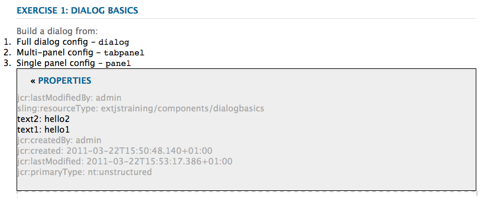

# Utilizzo ed estensione dei widget (interfaccia classica){#using-and-extending-widgets-classic-ui}

>[!NOTE]
>
>Questa pagina descrive l’utilizzo dei widget nell’interfaccia utente classica, che in AEM 6.4 è stata dichiarata obsoleta.
>
>L’Adobe consiglia di utilizzare il moderno, [interfaccia touch](/help/sites-developing/touch-ui-concepts.md) in base a [Coral UI](/help/sites-developing/touch-ui-concepts.md#coral-ui) e [Interfaccia utente Granite](/help/sites-developing/touch-ui-concepts.md#granite-ui-foundation-components).

L’interfaccia web di Adobe Experience Manager (AEM) utilizza l’AJAX e altre moderne tecnologie di browser per consentire agli autori di modificare e formattare i contenuti WYSIWYG direttamente sulla pagina web.

L’AEM utilizza [ExtJS](https://www.sencha.com/) libreria di widget, che fornisce gli elementi di interfaccia utente altamente raffinati che funzionano tra tutti i browser più importanti e consentono la creazione di esperienze di interfaccia utente di livello desktop.

Questi widget sono inclusi nell&#39;AEM e, oltre ad essere utilizzati dall&#39;AEM stesso, possono essere utilizzati da qualsiasi sito web creato utilizzando l&#39;AEM.

Per un riferimento completo di tutti i widget disponibili in AEM, vedi [documentazione API widget](https://developer.adobe.com/experience-manager/reference-materials/6-5/widgets-api/index.html) o [elenco degli xtype esistenti](/help/sites-developing/xtypes.md). Inoltre, molti esempi che mostrano come utilizzare il framework ExtJS sono disponibili sul [Sencha](https://examples.sencha.com/extjs/7.6.0/) site, il proprietario del framework.

Questa pagina fornisce informazioni su come utilizzare ed estendere i widget. In primo luogo, descrive come [includere codice lato client in una pagina](#including-the-client-sided-code-in-a-page). Vengono quindi descritti alcuni componenti di esempio creati per illustrare alcuni utilizzi e estensioni di base. Tali componenti sono disponibili nel **Utilizzo dei widget ExtJS** pacchetto su **Condivisione pacchetti**.

Il pacchetto include esempi di:

* [Finestre di dialogo di base](#basic-dialogs) generati con widget predefiniti.
* [Finestre di dialogo dinamiche](#dynamic-dialogs) generati con widget predefiniti e logica JavaScript personalizzata.
* Finestre di dialogo basate su [widget personalizzati](#custom-widgets).
* A [pannello struttura](#tree-overview) visualizzazione di una struttura JCR al di sotto di un determinato percorso.
* A [pannello griglia](#grid-overview) visualizzazione dei dati in formato tabulare.

>[!NOTE]
>
>L’interfaccia classica di Adobe Experience Manager si basa su [ExtJS 3.4.0](https://extjs.cachefly.net/ext-3.4.0/docs/).

## Inclusione del codice lato client in una pagina {#including-the-client-sided-code-in-a-page}

Il codice JavaScript lato client e il codice del foglio di stile devono essere inseriti in una libreria client.

Per creare una libreria client:

1. Crea un nodo sotto `/apps/<project>` con le seguenti proprietà:

   * name=&quot;clientlib&quot;
   * jcr:mixinTypes=&quot;[mix:bloccabile]&quot;
   * jcr:primaryType=&quot;cq:ClientLibraryFolder&quot;
   * sling:resourceType=&quot;widgets/clientlib&quot;
   * Categories=&quot;[&lt;category-name>]&quot;
   * dependencies=&quot;[cq.widgets]&quot;

   `Note: <category-name> is the name of the custom library (e.g. "cq.extjstraining") and is used to include the library on the page.`

1. Sotto `clientlib` creare `css` e `js` cartelle (nt:folder).

1. Sotto `clientlib` creare `css.txt` e `js.txt` file (nt:files). Tali file .txt elencano i file inclusi nella libreria.

1. Modifica `js.txt`: deve iniziare con &quot; `#base=js`&quot; seguito dall’elenco dei file aggregati dal servizio libreria client CQ, ad esempio:

   ```
   #base=js
    components.js
    exercises.js
    CustomWidget.js
    CustomBrowseField.js
    InsertTextPlugin.js
   ```

1. Modifica `css.txt`: deve iniziare con &quot; `#base=css`&quot; seguito dall’elenco dei file aggregati dal servizio libreria client CQ, ad esempio:

   ```
   #base=css
    components.css
   ```

1. Sotto `js` , inserisci i file JavaScript che appartengono alla libreria.

1. Sotto `css` cartella, inserisci `.css` e le risorse utilizzate dai file css (ad esempio, `my_icon.png`).

>[!NOTE]
>
>La gestione dei fogli di stile descritti in precedenza è facoltativa.

Per includere la libreria client nel componente jsp della pagina:

* per includere sia il codice JavaScript che i fogli di stile:
   `<ui:includeClientLib categories="<category-name1>, <category-name2>, ..."/>`
Dove 
`<category-nameX>` è il nome della libreria lato client.

* per includere solo codice JavaScript:
   `<ui:includeClientLib js="<category-name>"/>`

Per ulteriori informazioni, consulta la descrizione della [&lt;ui:includeclientlib>](/help/sites-developing/taglib.md#lt-ui-includeclientlib) tag.

A volte una libreria client dovrebbe essere disponibile solo in modalità di authoring e dovrebbe essere esclusa in modalità di pubblicazione. Tale obiettivo può essere conseguito nel modo seguente:

```xml
    if (WCMMode.fromRequest(request) != WCMMode.DISABLED) {
        %><ui:includeClientLib categories="cq.collab.blog"/><%
    }
```

### Guida introduttiva agli esempi {#getting-started-with-the-samples}

Per seguire i tutorial su questa pagina, installa il pacchetto **Utilizzo dei widget ExtJS** in un’istanza AEM locale e crea una pagina di esempio in cui sono inclusi i componenti. A tale scopo, eseguire le operazioni seguenti:

1. Nell’istanza AEM, scarica il pacchetto denominato **Utilizzo dei widget ExtJS (v01)** da Condivisione pacchetti e installare il pacchetto. Crea il progetto `extjstraining` sotto `/apps` nell’archivio.
1. Includi la libreria client contenente gli script (js) e il foglio di stile (css) nel tag head della jsp della pagina Geometrixx. Stai per includere i componenti di esempio in una nuova pagina della **Geometrixx** ramo: in **CRXDE Lite** apri il file `/apps/geometrixx/components/page/headlibs.jsp` e aggiungi `cq.extjstraining` categoria al esistente `<ui:includeClientLib>` tag come segue:
   `%><ui:includeClientLib categories="apps.geometrixx-main, cq.extjstraining"/><%`
1. Creare una pagina in **Geometrixx** ramo inferiore `/content/geometrixx/en/products` e chiamalo **Utilizzo dei widget ExtJS**.
1. Passa alla modalità progettazione e aggiungi tutti i componenti del gruppo denominato **Utilizzo dei widget ExtJS** alla progettazione del Geometrixx
1. Torna alla modalità di modifica: componenti del gruppo **Utilizzo dei widget ExtJS** sono disponibili nella barra laterale.

>[!NOTE]
>
>Gli esempi in questa pagina si basano sul contenuto del Geometrixx, che non viene più fornito con AEM ed è stato sostituito da We.Retail. Consulta la [Implementazione di riferimento We.Retail](/help/sites-developing/we-retail.md#we-retail-geometrixx) per informazioni su come scaricare e installare Geometrixx.

### Finestre di dialogo di base {#basic-dialogs}

Le finestre di dialogo vengono in genere utilizzate per modificare il contenuto, ma possono anche visualizzare informazioni. Un modo semplice per visualizzare una finestra di dialogo completa è accedere alla sua rappresentazione in formato JSON. A tale scopo, puntare il browser a:

`https://localhost:4502/<path-to-dialog>.-1.json`

Il primo componente del **Utilizzo dei widget ExtJS** gruppo nella barra laterale chiamato **1. Nozioni di base sulle finestre di dialogo** e include quattro finestre di dialogo di base create con widget predefiniti e senza logica JavaScript personalizzata. Le finestre di dialogo sono memorizzate sotto `/apps/extjstraining/components/dialogbasics`. Le finestre di dialogo di base sono:

* la finestra di dialogo Completa ( `full` node): visualizza una finestra con tre schede, ciascuna con due campi di testo.
* la finestra di dialogo Pannello singolo ( `singlepanel` node): visualizza una finestra con una scheda contenente due campi di testo.
* la finestra di dialogo Pannello multiplo ( `multipanel` node): la sua visualizzazione è uguale a quella della finestra di dialogo Completa, ma viene creata in modo diverso.
* la finestra di dialogo per progettazione( `design` node): visualizza una finestra con due schede. La prima scheda contiene un campo di testo, un menu a discesa e un&#39;area di testo comprimibile. La seconda scheda contiene un set di campi con quattro campi di testo e un set di campi comprimibili con due campi di testo.

Includi **1. Nozioni di base sulle finestre di dialogo** nella pagina di esempio:

1. Aggiungi il **1. Nozioni di base sulle finestre di dialogo** alla pagina di esempio dalla sezione **Utilizzo dei widget ExtJS** scheda in **Barra laterale**.
1. Il componente visualizza un titolo, del testo e un **PROPRIETÀ** collegamento. Selezionando il collegamento vengono visualizzate le proprietà del paragrafo memorizzato nel repository. Seleziona nuovamente il collegamento per nascondere le proprietà.

Il componente viene visualizzato come segue:



#### Esempio 1: finestra di dialogo completa {#example-full-dialog}

Il **Completo** visualizza una finestra con tre schede, ciascuna con due campi di testo. È la finestra di dialogo predefinita del **Nozioni di base sulle finestre di dialogo** componente. Le sue caratteristiche sono:

* È definito da un nodo: tipo di nodo = `cq:Dialog`, xtype = ` [dialog](/help/sites-developing/xtypes.md#dialog)`.
* Visualizza tre schede (tipo di nodo = `cq:Panel`).
* Ogni scheda dispone di due campi di testo (tipo di nodo = `cq:Widget`, xtype = ` [textfield](/help/sites-developing/xtypes.md#textfield)`).
* È definito dal nodo:
   `/apps/extjstraining/components/dialogbasics/full`
* Viene eseguito il rendering in formato JSON richiedendo:
   `https://localhost:4502/apps/extjstraining/components/dialogbasics/full.-1.json`

La finestra di dialogo viene visualizzata come segue:


#### Esempio 2: finestra di dialogo con pannello singolo {#example-single-panel-dialog}

Il **Pannello singolo** viene visualizzata una finestra con una scheda contenente due campi di testo. Le sue caratteristiche sono:

* Visualizza una scheda (tipo di nodo = `cq:Dialog`, xtype = ` [panel](/help/sites-developing/xtypes.md#panel)`)
* La scheda ha due campi di testo (tipo nodo = `cq:Widget`, xtype = ` [textfield](/help/sites-developing/xtypes.md#textfield)`)
* È definito dal nodo:
   `/apps/extjstraining/components/dialogbasics/singlepanel`
* Viene eseguito in formato json richiedendo:
   `https://localhost:4502/apps/extjstraining/components/dialogbasics/singlepanel.-1.json`
* Un vantaggio rispetto al **Finestra di dialogo completa** è necessaria una configurazione inferiore.
* Utilizzo consigliato: per finestre di dialogo semplici che visualizzano informazioni o che hanno solo pochi campi.

Per utilizzare la finestra di dialogo Pannello singolo:

1. Sostituisci la finestra di dialogo del **Nozioni di base sulle finestre di dialogo** componente con **Pannello singolo** finestra di dialogo:
   1. In entrata **CRXDE Lite**, elimina il nodo: `/apps/extjstraining/components/dialogbasics/dialog`
   1. Clic **Salva tutto** per salvare le modifiche.
   1. Copia il nodo: `/apps/extjstraining/components/dialogbasics/singlepanel`
   1. Incolla il nodo copiato di seguito: `/apps/extjstraining/components/dialogbasics`
   1. Seleziona il nodo: `/apps/extjstraining/components/dialogbasics/Copy of singlepanel`e rinominarlo `dialog`.
1. Modifica il componente: la finestra di dialogo viene visualizzata come segue:


#### Esempio 3: finestra di dialogo a più pannelli {#example-multi-panel-dialog}

Il **Pannello multiplo** la finestra di dialogo ha la stessa visualizzazione della **Completo** ma viene creata in modo diverso. Le sue caratteristiche sono:

* È definito da un nodo (tipo di nodo = `cq:Dialog`, xtype = ` [tabpanel](/help/sites-developing/xtypes.md#tabpanel)`).
* Visualizza tre schede (tipo di nodo = `cq:Panel`).
* Ogni scheda dispone di due campi di testo (tipo di nodo = `cq:Widget`, xtype = ` [textfield](/help/sites-developing/xtypes.md#textfield)`).
* È definito dal nodo:
   `/apps/extjstraining/components/dialogbasics/multipanel`
* Viene eseguito in formato json richiedendo:
   `https://localhost:4502/apps/extjstraining/components/dialogbasics/multipanel.-1.json`
* Un vantaggio rispetto al **Finestra di dialogo completa** è che ha una struttura semplificata.
* Utilizzo consigliato: per finestre di dialogo con più schede.

Per utilizzare la finestra di dialogo Multipannello:

1. Sostituisci la finestra di dialogo del **Nozioni di base sulle finestre di dialogo** componente con **Pannello multiplo** : segui i passaggi descritti per [Esempio 2: finestra di dialogo con pannello singolo](#example-single-panel-dialog)
1. Modifica il componente: la finestra di dialogo viene visualizzata come segue:


#### Esempio 4: finestra di dialogo ricca di contenuti {#example-rich-dialog}

Il **Ricco** viene visualizzata una finestra con due schede. La prima scheda contiene un campo di testo, un menu a discesa e un&#39;area di testo comprimibile. La seconda scheda contiene un set di campi con quattro campi di testo e un set di campi comprimibili con due campi di testo. Le sue caratteristiche sono:

* È definito da un nodo (tipo di nodo = `cq:Dialog`, xtype = ` [dialog](/help/sites-developing/xtypes.md#dialog)`).
* Visualizza due schede (tipo di nodo = `cq:Panel`).
* La prima scheda presenta un ` [dialogfieldset](/help/sites-developing/xtypes.md#dialogfieldset)` widget con ` [textfield](/help/sites-developing/xtypes.md#textfield)` e un ` [selection](/help/sites-developing/xtypes.md#selection)` widget con tre opzioni e un ` [dialogfieldset](/help/sites-developing/xtypes.md#dialogfieldset)` con un ` [textarea](/help/sites-developing/xtypes.md#textarea)` widget.
* La seconda scheda presenta un ` [dialogfieldset](/help/sites-developing/xtypes.md#dialogfieldset)` widget con quattro ` [textfield](/help/sites-developing/xtypes.md#textfield)` widget e un modulo comprimibile `dialogfieldset` con due ` [textfield](/help/sites-developing/xtypes.md#textfield)` widget.
* È definito dal nodo:
   `/apps/extjstraining/components/dialogbasics/rich`
* Viene eseguito in formato json richiedendo:
   `https://localhost:4502/apps/extjstraining/components/dialogbasics/rich.-1.json`

Per utilizzare **Ricco** finestra di dialogo:

1. Sostituisci la finestra di dialogo del **Nozioni di base sulle finestre di dialogo** componente con **Ricco** : segui i passaggi descritti per [Esempio 2: finestra di dialogo con pannello singolo](#example-single-panel-dialog)
1. Modifica il componente: la finestra di dialogo viene visualizzata come segue:

 

### Finestre di dialogo dinamiche {#dynamic-dialogs}

Il secondo componente della **Utilizzo dei widget ExtJS** gruppo nella barra laterale chiamato **2. Finestre di dialogo dinamiche** e include tre finestre di dialogo dinamiche create con widget predefiniti e **con logica JavaScript personalizzata**. Le finestre di dialogo sono memorizzate sotto `/apps/extjstraining/components/dynamicdialogs`. Le finestre di dialogo dinamiche sono:

* la finestra di dialogo Cambia schede ( `switchtabs` node): visualizza una finestra con due schede. La prima scheda dispone di una selezione di scelta con tre opzioni: quando viene selezionata un’opzione, viene visualizzata una scheda relativa all’opzione. La seconda scheda contiene due campi di testo.
* il dialogo arbitrale ( `arbitrary` node): visualizza una finestra con una scheda. La scheda contiene un campo per rilasciare o caricare una risorsa e un campo che visualizza alcune informazioni sulla pagina che la contiene e sulla risorsa, se presente.
* la finestra di dialogo Attiva/disattiva campi ( `togglefield` node): visualizza una finestra con una scheda. La scheda ha una casella di controllo: quando è selezionata, viene visualizzato un set di campi con due campi di testo.

Per includere **2. Finestre di dialogo dinamiche** nella pagina di esempio:

1. Aggiungi il **2. Finestre di dialogo dinamiche** alla pagina di esempio dalla sezione **Utilizzo dei widget ExtJS** scheda in **Barra laterale**.
1. Il componente visualizza un titolo, del testo e un **PROPRIETÀ** collegamento. Selezionando il collegamento vengono visualizzate le proprietà del paragrafo memorizzato nel repository. Seleziona nuovamente il collegamento per nascondere le proprietà.

Il componente viene visualizzato come segue:


#### Esempio 1: finestra di dialogo Cambia schede {#example-switch-tabs-dialog}

Il **Cambia schede** viene visualizzata una finestra con due schede. La prima scheda dispone di una selezione di scelta con tre opzioni: quando viene selezionata un’opzione, viene visualizzata una scheda relativa all’opzione. La seconda scheda contiene due campi di testo.

Le sue caratteristiche principali sono:

* È definito da un nodo (tipo di nodo = `cq:Dialog`, xtype = ` [dialog](/help/sites-developing/xtypes.md#dialog)`).
* Visualizza due schede (tipo di nodo = `cq:Panel`): una scheda di selezione, la seconda scheda dipende dalla selezione nella prima scheda (tre opzioni).
* Ha tre schede opzionali (tipo di nodo = `cq:Panel`), ciascuno ha due campi di testo (tipo di nodo = `cq:Widget`, xtype = ` [textfield](/help/sites-developing/xtypes.md#textfield)`). Viene visualizzata una sola scheda opzionale alla volta.
* È definito da `switchtabs` nodo in:
   `/apps/extjstraining/components/dynamicdialogs/switchtabs`
* Viene eseguito in formato json richiedendo:
   `https://localhost:4502/apps/extjstraining/components/dynamicdialogs/switchtabs.-1.json`

La logica viene implementata tramite i listener di eventi e il codice JavaScript come segue:

* Il nodo della finestra di dialogo ha un &quot; `beforeshow`&quot; listener che nasconde tutte le schede facoltative prima della visualizzazione della finestra di dialogo:
   `beforeshow="function(dialog){Ejst.x2.manageTabs(dialog.items.get(0));}"`

   `dialog.items.get(0)` ottiene il `tabpanel` contenente il pannello di selezione e i tre pannelli facoltativi.
* Il `Ejst.x2` l&#39;oggetto è definito in `exercises.js` file in:
   `/apps/extjstraining/clientlib/js/exercises.js`
* In `Ejst.x2.manageTabs()` metodo, come valore di `index` è -1, tutte le schede facoltative sono nascoste (i va da 1 a 3).
* La scheda di selezione dispone di due listener: uno che visualizza la scheda selezionata al caricamento della finestra di dialogo (&quot; `loadcontent`&quot;) e uno che mostra la scheda selezionata quando la selezione viene modificata (&quot; `selectionchanged`&quot;):
   `loadcontent="function(field,rec,path){Ejst.x2.showTab(field);}"`

   `selectionchanged="function(field,value){Ejst.x2.showTab(field);}"`
* Per `Ejst.x2.showTab()` metodo,
   `field.findParentByType('tabpanel')` ottiene il `tabpanel` che contiene tutte le schede ( `field` rappresenta il widget di selezione)
   `field.getValue()` ottiene il valore della selezione, ad esempio tab2
   `Ejst.x2.manageTabs()` visualizza la scheda selezionata.
* Ogni scheda facoltativa ha un listener che nasconde la scheda in &quot; `render`&quot; evento:
   `render="function(tab){Ejst.x2.hideTab(tab);}"`
* Per `Ejst.x2.hideTab()` metodo,
   `tabPanel` è il `tabpanel` che contiene tutte le schede
   `index` è l&#39;indice della scheda facoltativa
   `tabPanel.hideTabStripItem(index)` nasconde la scheda

Viene visualizzato come segue:


#### Esempio 2: dialogo arbitrario {#example-arbitrary-dialog}

Spesso una finestra di dialogo visualizza il contenuto del componente sottostante. La finestra di dialogo qui descritta, denominata **Arbitrario** , richiama il contenuto da un componente diverso.

Il **Arbitrario** viene visualizzata una finestra con una scheda. La scheda contiene due campi: uno per rilasciare o caricare una risorsa e uno per visualizzare alcune informazioni sulla pagina che la contiene e sulla risorsa, se ne è stato fatto riferimento.

Le sue caratteristiche principali sono:

* È definito da un nodo (tipo di nodo = `cq:Dialog`, xtype = ` [dialog](/help/sites-developing/xtypes.md#dialog)`).
* Visualizza un elemento `tabpanel` widget (tipo nodo = `cq:Widget`, xtype = ` [tabpanel](/help/sites-developing/xtypes.md#tabpanel)`) con un pannello (tipo di nodo = `cq:Panel`)
* Il pannello ha un widget smartfile (tipo nodo = `cq:Widget`, xtype = ` [smartfile](/help/sites-developing/xtypes.md#smartfile)`) e un widget ownerdraw (tipo di nodo = `cq:Widget`, xtype = ` [ownerdraw](/help/sites-developing/xtypes.md#ownerdraw)`)
* È definito da `arbitrary` nodo in:
   `/apps/extjstraining/components/dynamicdialogs/arbitrary`
* Viene eseguito in formato json richiedendo:
   `https://localhost:4502/apps/extjstraining/components/dynamicdialogs/arbitrary.-1.json`

La logica viene implementata tramite i listener di eventi e il codice JavaScript come segue:

* Il `ownerdraw` il widget ha un &quot; `loadcontent`&quot; listener che mostra informazioni sulla pagina contenente il componente. Ossia, la risorsa a cui fa riferimento il widget smartfile al caricamento del contenuto:
   `loadcontent="function(field,rec,path){Ejst.x2.showInfo(field,rec,path);}"`

   `field` è impostato con `ownerdraw` oggetto
   `path` è impostato con il percorso del contenuto del componente (ad esempio, `/content/geometrixx/en/products/triangle/ui-tutorial/jcr:content/par/dynamicdialogs`)
* Il `Ejst.x2` l&#39;oggetto è definito in `exercises.js` file in:
   `/apps/extjstraining/clientlib/js/exercises.js`
* Per `Ejst.x2.showInfo()` metodo,
   `pagePath` è il percorso della pagina contenente il componente;
   `pageInfo` rappresenta le proprietà di pagina in formato json;
   `reference` è il percorso della risorsa di riferimento;
   `metadata` rappresenta i metadati della risorsa in formato json;
   `ownerdraw.getEl().update(html);` visualizza l’html creato nella finestra di dialogo

Per utilizzare **Arbitrario** finestra di dialogo:

1. Sostituisci la finestra di dialogo del **Finestra di dialogo dinamica** componente con **Arbitrario** : segui i passaggi descritti per [Esempio 2: finestra di dialogo con pannello singolo](#example-single-panel-dialog)
1. Edit the component: the dialog displays as follows:


#### Example 3: Toggle Fields Dialog {#example-toggle-fields-dialog}

Il **Attiva/Disattiva campi** viene visualizzata una finestra con una scheda. La scheda ha una casella di controllo: quando è selezionata, viene visualizzato un set di campi con due campi di testo.

Le sue caratteristiche principali sono:

* È definito da un nodo (tipo di nodo = `cq:Dialog`, xtype = ` [dialog](/help/sites-developing/xtypes.md#dialog)`).
* Visualizza un elemento `tabpanel` widget (tipo nodo = `cq:Widget`, xtype = ` [tabpanel](/help/sites-developing/xtypes.md#textpanel)`) con un pannello (tipo di nodo = `cq:Panel`).
* Il pannello ha un widget di selezione/casella di controllo (tipo di nodo = `cq:Widget`, xtype = ` [selection](/help/sites-developing/xtypes.md#selection)`, type = ` [checkbox](/help/sites-developing/xtypes.md#checkbox)`) e un widget per set di finestre di dialogo comprimibile (tipo nodo = `cq:Widget`, xtype = ` [dialogfieldset](/help/sites-developing/xtypes.md#dialogfieldset)`) nascosta per impostazione predefinita, con due widget campo di testo (tipo nodo = `cq:Widget`, xtype = ` [textfield](/help/sites-developing/xtypes.md#textfield)`).
* È definito da `togglefields` nodo in:
   `/apps/extjstraining/components/dynamicdialogs/togglefields`
* Viene eseguito in formato json richiedendo:
   `https://localhost:4502/apps/extjstraining/components/dynamicdialogs/togglefields.-1.json`

La logica viene implementata tramite i listener di eventi e il codice JavaScript come segue:

* la scheda selezione dispone di due listener: uno che visualizza il set di campi di dialogo al caricamento del contenuto (&quot; `loadcontent`&quot;) e uno che mostra il set di campi di dialogo quando la selezione viene modificata (&quot; `selectionchanged`&quot;):
   `loadcontent="function(field,rec,path){Ejst.x2.toggleFieldSet(field);}"`

   `selectionchanged="function(field,value){Ejst.x2.toggleFieldSet(field);}"`
* Il `Ejst.x2` l&#39;oggetto è definito in `exercises.js` file in:
   `/apps/extjstraining/clientlib/js/exercises.js`
* Per `Ejst.x2.toggleFieldSet()` metodo,
   `box` è l&#39;oggetto di selezione;
   `panel` è il pannello contenente la selezione e i widget set di campi di dialogo;
   `fieldSet` è l&#39;oggetto dialogfieldset;
   `show` è il valore della selezione (true o false); basato su &#39; `show`&#39; l&#39;oggetto dialogfieldset viene visualizzato o meno

Per utilizzare **Attiva/Disattiva campi** eseguire le operazioni seguenti:

1. Sostituisci la finestra di dialogo del **Finestra di dialogo dinamica** componente con **Attiva/Disattiva campi** : segui i passaggi descritti per [Esempio 2: finestra di dialogo con pannello singolo](#example-single-panel-dialog)
1. Modifica il componente: la finestra di dialogo viene visualizzata come segue:


### Widget personalizzati {#custom-widgets}

I widget preconfigurati forniti con AEM devono coprire la maggior parte dei casi d’uso. Tuttavia, a volte potrebbe essere necessario creare un widget personalizzato per coprire un requisito specifico del progetto. I widget personalizzati possono essere creati estendendo quelli esistenti. Per aiutarti a iniziare con tale personalizzazione, il **`Using ExtJS Widgets`** Il pacchetto include tre finestre di dialogo che utilizzano tre diversi widget personalizzati:

* la finestra di dialogo Più campi ( `multifield` node) visualizza una finestra con una scheda. La scheda ha un widget multicampo personalizzato con due campi: un menu a discesa con due opzioni e un campo di testo. In quanto si basa sul modello preconfigurato `multifield` widget (che ha solo un campo di testo), ha tutte le caratteristiche del `multifield` widget.
* la finestra di dialogo Sfoglia albero ( `treebrowse` node) visualizza una finestra con una scheda contenente un widget di navigazione percorso: quando fai clic sulla freccia, viene visualizzata una finestra in cui puoi sfogliare una gerarchia e selezionare un elemento. Il percorso dell’elemento viene quindi aggiunto al campo percorso e viene mantenuto quando la finestra di dialogo viene chiusa.
* una finestra di dialogo basata su plug-in dell’Editor Rich Text ( `rteplugin` che aggiunge un pulsante personalizzato all’Editor Rich Text per inserire del testo personalizzato nel testo principale. È costituito da un `richtext` un widget (RTE) e di una funzione personalizzata aggiunta tramite il meccanismo di plug-in dell’editor Rich Text.

I widget personalizzati e il plug-in sono inclusi nel componente denominato **3. Widget personalizzati** del **Utilizzo dei widget ExtJS** pacchetto. Per includere questo componente nella pagina di esempio:

1. Aggiungi il **3. Widget personalizzati** alla pagina di esempio dalla sezione **Utilizzo dei widget ExtJS** scheda in **Barra laterale**.
1. Il componente visualizza un titolo, del testo e, quando si fa clic su **PROPRIETÀ** , le proprietà del paragrafo memorizzate nell&#39;archivio. Facendo di nuovo clic, le proprietà vengono nascoste.
Il componente viene visualizzato come segue:


#### Esempio 1: widget multicampo personalizzato {#example-custom-multifield-widget}

Il **Multifield personalizzato** la finestra di dialogo basata su widget mostra una finestra con una scheda. La scheda ha un widget multicampo personalizzato che, a differenza di quello standard che ha un campo, ha due campi: un menu a discesa con due opzioni e un campo di testo.

Il **Multifield personalizzato** finestra di dialogo basata su widget:

* È definito da un nodo (tipo di nodo = `cq:Dialog`, xtype = ` [dialog](/help/sites-developing/xtypes.md#dialog)`).
* Visualizza un elemento `tabpanel` widget (tipo nodo = `cq:Widget`, xtype = ` [tabpanel](/help/sites-developing/xtypes.md#tabpanel)`) contenente un pannello (tipo di nodo = `cq:Widget`, xtype = ` [panel](/help/sites-developing/xtypes.md#panel)`).
* Il pannello presenta una `multifield` widget (tipo nodo = `cq:Widget`, xtype = ` [multifield](/help/sites-developing/xtypes.md#multifield)`).
* Il `multifield` widget con fieldconfig (tipo nodo = `nt:unstructured`, xtype = `ejstcustom`, optionsProvider = `Ejst.x3.provideOptions`) basato sul tipo xtype personalizzato &#39; `ejstcustom`&#39;:
   * &#39; `fieldconfig`&#39; è un&#39;opzione di configurazione di ` [CQ.form.MultiField](https://developer.adobe.com/experience-manager/reference-materials/6-5/widgets-api/index.html?class=CQ.form.MultiField)` oggetto.
   * &#39; `optionsProvider`&#39; è una configurazione di `ejstcustom` widget. È impostato con `Ejst.x3.provideOptions` metodo definito in `exercises.js` a:
      `/apps/extjstraining/clientlib/js/exercises.js`
e restituisce due opzioni.
* È definito da `multifield` nodo in:
   `/apps/extjstraining/components/customwidgets/multifield`
* Viene eseguito in formato json richiedendo:
   `https://localhost:4502/apps/extjstraining/components/customwidgets/multifield.-1.json`

La personalizzazione `multifield` widget (xtype = `ejstcustom`):

* È un oggetto JavaScript denominato `Ejst.CustomWidget`
* È definito in `CustomWidget.js` File JavaScript in:
   `/apps/extjstraining/clientlib/js/CustomWidget.js`
* Estende il ` [CQ.form.CompositeField](https://developer.adobe.com/experience-manager/reference-materials/6-5/widgets-api/index.html?class=CQ.form.CompositeField)` widget.
* Ha tre campi: `hiddenField` (Campo di testo), `allowField` (ComboBox) e `otherField` (Campo di testo)
* Sostituzioni `CQ.Ext.Component#initComponent` per aggiungere i tre campi:
   * `allowField` è un [CQ.form.Selection](https://developer.adobe.com/experience-manager/reference-materials/6-5/widgets-api/index.html?class=CQ.form.Selection) oggetto di tipo &#39;select&#39;. optionsProvider è una configurazione dell&#39;oggetto Selection di cui viene creata un&#39;istanza con la configurazione optionsProvider dell&#39;oggetto CustomWidget definito nella finestra di dialogo
   * `otherField` è un [CQ.Ext.form.TextField](https://developer.adobe.com/experience-manager/reference-materials/6-5/widgets-api/index.html?class=CQ.Ext.form.TextField) oggetto
* `setValue``getValue``getRawValue`[](https://developer.adobe.com/experience-manager/reference-materials/6-5/widgets-api/index.html?class=CQ.form.CompositeField)
   `<allowField value>/<otherField value>, for example: 'Bla1/hello'`.
* `ejstcustom`
   `CQ.Ext.reg('ejstcustom', Ejst.CustomWidget);`

****


#### Esempio 2: personalizzato `Treebrowse` Widget {#example-custom-treebrowse-widget}

La personalizzazione **`Treebrowse`** nella finestra di dialogo basata su widget viene visualizzata una finestra con una scheda contenente un widget di navigazione percorso personalizzato. Quando si seleziona la freccia, viene visualizzata una finestra in cui è possibile sfogliare una gerarchia e selezionare un elemento. Il percorso dell’elemento viene quindi aggiunto al campo percorso e viene mantenuto quando la finestra di dialogo viene chiusa.

La personalizzazione `treebrowse` finestra di dialogo:

* È definito da un nodo (tipo di nodo = `cq:Dialog`, xtype = ` [dialog](/help/sites-developing/xtypes.md#dialog)`).
* Visualizza un elemento `tabpanel` widget (tipo nodo = `cq:Widget`, xtype = ` [tabpanel](/help/sites-developing/xtypes.md#tabpanel)`) contenente un pannello (tipo di nodo = `cq:Widget`, xtype = ` [panel](/help/sites-developing/xtypes.md#panel)`).
* Il pannello ha un widget personalizzato (tipo di nodo = `cq:Widget`, xtype = `ejstbrowse`)
* È definito da `treebrowse` nodo in:
   `/apps/extjstraining/components/customwidgets/treebrowse`
* Viene eseguito in formato json richiedendo:
   `https://localhost:4502/apps/extjstraining/components/customwidgets/treebrowse.-1.json`

Il widget personalizzato per la struttura ad albero (xtype = `ejstbrowse`):

* È un oggetto JavaScript denominato `Ejst.CustomWidget`
* È definito in `CustomBrowseField.js` File JavaScript in:
   `/apps/extjstraining/clientlib/js/CustomBrowseField.js`
* Estende ` [CQ.Ext.form.TriggerField](https://developer.adobe.com/experience-manager/reference-materials/6-5/widgets-api/index.html?class=CQ.Ext.form.TriggerField)`.
* Definisce una finestra di esplorazione denominata `browseWindow`.
* Sostituzioni ` [CQ.Ext.form.TriggerField](https://developer.adobe.com/experience-manager/reference-materials/6-5/widgets-api/index.html?class=CQ.Ext.form.TriggerField)#onTriggerClick` per visualizzare la finestra sfoglia quando si fa clic sulla freccia.
* Definisce un [CQ.Ext.tree.TreePanel](https://developer.adobe.com/experience-manager/reference-materials/6-5/widgets-api/index.html?class=CQ.Ext.tree.TreePanel) oggetto:
   * Ottiene i suoi dati chiamando il servlet registrato in `/bin/wcm/siteadmin/tree.json`.
   * La sua radice è &quot; `apps/extjstraining`&quot;.
* Definisce un `window` oggetto ( ` [CQ.Ext.Window](https://developer.adobe.com/experience-manager/reference-materials/6-5/widgets-api/index.html?class=CQ.Ext.Window)`):
   * In base al pannello predefinito.
   * Ha un **OK** che imposta il valore del tracciato selezionato e nasconde il pannello.
* La finestra è ancorata sotto il **Percorso** campo.
* Il percorso selezionato viene passato dal campo Sfoglia alla finestra il `show` evento.
* Si registra come &quot; `ejstbrowse`xtype:
   `CQ.Ext.reg('ejstbrowse', Ejst.CustomBrowseField);`

Per utilizzare **Sfoglia personalizzata** finestra di dialogo basata su widget:

1. Sostituisci la finestra di dialogo del **Widget personalizzati** componente con **Sfoglia personalizzata** : segui i passaggi descritti per [Esempio 2: finestra di dialogo con pannello singolo](#example-single-panel-dialog)
1. Modifica il componente: la finestra di dialogo viene visualizzata come segue:


#### Esempio 3: plug-in dell’editor Rich Text {#example-rich-text-editor-rte-plug-in}

Il **Plug-in Editor Rich Text** La finestra di dialogo basata è una finestra di dialogo basata su Editor Rich Text con un pulsante personalizzato che consente di inserire testo personalizzato tra parentesi quadre. Il testo personalizzato può essere analizzato da una logica lato server (non implementata in questo esempio), ad esempio per aggiungere del testo definito nel percorso specificato:

Il **Plug-in editor Rich Text** finestra di dialogo basata su:

* È definito dal nodo del plug-in in:
   `/apps/extjstraining/components/customwidgets/rteplugin`
* Viene eseguito in formato json richiedendo:
   `https://localhost:4502/apps/extjstraining/components/customwidgets/rteplugin.-1.json`
* Il `rtePlugins` il nodo ha un nodo figlio `inserttext` (tipo di nodo = `nt:unstructured`) che prende il nome dal plug-in. Ha una proprietà denominata `features` che definisce quali delle funzioni del plug-in sono disponibili per l’editor Rich Text.

Il plug-in dell’editor Rich Text:

* È un oggetto JavaScript denominato `Ejst.InsertTextPlugin`
* È definito in `InsertTextPlugin.js` File JavaScript in:
   `/apps/extjstraining/clientlib/js/InsertTextPlugin.js`
* Estende il ` [CQ.form.rte.plugins.Plugin](https://developer.adobe.com/experience-manager/reference-materials/6-5/widgets-api/index.html?class=CQ.form.rte.plugins.Plugin)` oggetto.
* I seguenti metodi definiscono ` [CQ.form.rte.plugins.Plugin](https://developer.adobe.com/experience-manager/reference-materials/6-5/widgets-api/index.html?class=CQ.form.rte.plugins.Plugin)` e vengono ignorati nel plug-in di implementazione:
   * `getFeatures()` restituisce un array di tutte le funzioni rese disponibili dal plug-in.
   * `initializeUI()` aggiunge il nuovo pulsante alla barra degli strumenti Editor Rich Text.
   * `notifyPluginConfig()` visualizza il titolo e il testo quando si passa il mouse sul pulsante.
   * `execute()` viene chiamato quando si fa clic sul pulsante ed esegue l’azione del plug-in: visualizza una finestra utilizzata per definire il testo da includere.
* `insertText()` inserisce un testo utilizzando l&#39;oggetto finestra di dialogo corrispondente `Ejst.InsertTextPlugin.Dialog` (vedere in seguito).
* `executeInsertText()` viene richiamato da `apply()` metodo della finestra di dialogo, che viene attivato quando **OK** clic sul pulsante.
* Si registra come &quot; `inserttext`Plug-in &#39;:
   `CQ.form.rte.plugins.PluginRegistry.register("inserttext", Ejst.InsertTextPlugin);`
* il `Ejst.InsertTextPlugin.Dialog` object definisce la finestra di dialogo che viene aperta quando si fa clic sul pulsante del plug-in. La finestra di dialogo è costituita da un pannello, una maschera, un campo di testo e due pulsanti (**OK** e **Annulla**).

Per utilizzare **Plug-in Editor Rich Text** finestra di dialogo basata su:

1. Sostituisci la finestra di dialogo del **Widget personalizzati** componente con **Plug-in Editor Rich Text** finestra di dialogo basata su: segui i passaggi descritti per [Esempio 2: finestra di dialogo con pannello singolo](#example-single-panel-dialog)
1. Modifica il componente.
1. Fai clic sull’ultima icona a destra (quella con quattro frecce). Inserisci un percorso e fai clic su **OK**: il percorso viene visualizzato tra parentesi quadre ([ ]).
1. Clic **OK** in modo da chiudere Editor Rich Text.

Il **Plug-in Editor Rich Text** viene visualizzata come segue:


>[!NOTE]
>
>*[]*

### Tree Overview {#tree-overview}

La soluzione preconfigurata ` [CQ.Ext.tree.TreePanel](https://developer.adobe.com/experience-manager/reference-materials/6-5/widgets-api/index.html?class=CQ.Ext.tree.TreePanel)` L&#39;oggetto fornisce una rappresentazione dell&#39;interfaccia utente con struttura ad albero dei dati con struttura ad albero. Il componente Panoramica struttura incluso in **Utilizzo dei widget ExtJS** mostra come utilizzare il `TreePanel` oggetto per visualizzare una struttura JCR al di sotto di un determinato percorso. La finestra stessa può essere ancorata/scollegata. In questo esempio, la logica della finestra è incorporata nel componente jsp tra &lt;script>&lt;/script> tag.

Per includere **Panoramica struttura** alla pagina di esempio:

1. Aggiungi il **4. Panoramica struttura** alla pagina di esempio dalla sezione **Utilizzo dei widget ExtJS** scheda in **Barra laterale**.
1. Il componente visualizza:
   * un titolo, con del testo
   * a **PROPRIETÀ** collegamento: fare clic per visualizzare le proprietà del paragrafo memorizzato nell&#39;archivio. Fai di nuovo clic su per nascondere le proprietà.
   * una finestra mobile con una rappresentazione ad albero dell’archivio che può essere espansa.

Il componente viene visualizzato come segue:


Il componente Panoramica struttura:

* È definito in:
   `/apps/extjstraining/components/treeoverview`

* La finestra di dialogo consente di impostare le dimensioni della finestra e di ancorarla o disancorarla (vedere i dettagli riportati di seguito).

Il componente jsp:

* Recupera le proprietà width, height e docked dal repository.
* Visualizza parte del testo sul formato dei dati della panoramica della struttura.
* Incorpora la logica della finestra nel jsp del componente tra i tag JavaScript.
* È definito in:
   `apps/extjstraining/components/treeoverview/content.jsp`

Il codice JavaScript incorporato nel componente jsp:

* Definisce un `tree` mediante il tentativo di recuperare una finestra della struttura dalla pagina.
* Se la finestra che visualizza la struttura non esiste, `treePanel` ([CQ.Ext.tree.TreePanel](https://developer.adobe.com/experience-manager/reference-materials/6-5/widgets-api/index.html?class=CQ.Ext.tree.TreePanel)) viene creato:
   * `treePanel` contiene i dati utilizzati per creare la finestra.
   * I dati vengono recuperati chiamando il servlet registrato in:
      `/bin/wcm/siteadmin/tree.json`
* Il `beforeload` listener verifica che il nodo selezionato sia caricato.
* Il `root` object imposta il percorso `apps/extjstraining` come radice dell’albero.
* `tree` ( ` [CQ.Ext.Window](https://developer.adobe.com/experience-manager/reference-materials/6-5/widgets-api/index.html?class=CQ.Ext.Window)`) è impostato in base al `treePanel`, e viene visualizzato con:
   `tree.show();`
* Se la finestra esiste, viene visualizzata in base alla larghezza, all&#39;altezza e alle proprietà ancorate recuperate dal repository.

La finestra di dialogo del componente:

* Visualizza una scheda con due campi per impostare le dimensioni (larghezza e altezza) della finestra della panoramica della struttura ad albero e un campo per ancorare/disancorare la finestra
* È definito da un nodo (tipo di nodo = `cq:Dialog`, xtype = ` [panel](/help/sites-developing/xtypes.md#panel)`).
* Il pannello ha un widget campo dimensione (tipo di nodo = `cq:Widget`, xtype = ` [sizefield](/help/sites-developing/xtypes.md#sizefield)`) e un widget di selezione (tipo di nodo = `cq:Widget`, xtype = ` [selection](/help/sites-developing/xtypes.md#selection)`, type = `radio`) con due opzioni (true/false)
* È definito dal nodo della finestra di dialogo in:
   `/apps/extjstraining/components/treeoverview/dialog`
* Viene eseguito in formato json richiedendo:
   `https://localhost:4502/apps/extjstraining/components/treeoverview/dialog.-1.json`
* Visualizza come segue:


### Panoramica sulla griglia {#grid-overview}

Un pannello Griglia rappresenta i dati in un formato tabulare di righe e colonne. È composto dai seguenti elementi:

* Store : il modello contenente i record di dati (righe).
* Modello colonna : il componente colonna.
* Visualizza : incapsula l&#39;interfaccia utente.
* Modello di selezione : il comportamento di selezione.

Il componente Panoramica griglia incluso in **Utilizzo dei widget ExtJS** nel pacchetto viene illustrato come visualizzare i dati in formato tabulare:

* Nell&#39;esempio 1 vengono utilizzati dati statici.
* Nell’esempio 2 vengono utilizzati i dati recuperati dall’archivio.

Per includere il componente Panoramica griglia nella pagina di esempio:

1. Aggiungi il **5. Panoramica sulla griglia** alla pagina di esempio dalla sezione **Utilizzo dei widget ExtJS** scheda in **Barra laterale**.
1. Il componente visualizza:
   * un titolo con testo
   * a **PROPRIETÀ** collegamento: fare clic per visualizzare le proprietà del paragrafo memorizzato nell&#39;archivio. Fai di nuovo clic su per nascondere le proprietà.
   * una finestra mobile contenente dati in formato tabulare.

Il componente viene visualizzato come segue:


#### Esempio 1: griglia predefinita {#example-default-grid}

Nella sua versione preconfigurata, il **Panoramica sulla griglia** Il componente visualizza una finestra con dati statici in formato tabulare. In questo esempio, la logica è incorporata nel componente jsp in due modi:

* the generic logic is defined between &lt;script>&lt;/script> tags
* the specific logic is available in a separate .js file and is linked to in the jsp. This setup lets you switch between the two logic (static/dynamic) by commenting the desired &lt;script> tags.

Il componente Panoramica griglia:

* È definito in:
   `/apps/extjstraining/components/gridoverview`
* La finestra di dialogo consente di impostare le dimensioni della finestra e di ancorarla o disancorarla.

Il componente jsp:

* Recupera le proprietà width, height e docked dal repository.
* Visualizza una parte di testo come introduzione al formato dati della panoramica griglia.
* Fa riferimento al codice JavaScript che definisce l&#39;oggetto GridPanel:
   `<script type="text/javascript" src="/apps/extjstraining/components/gridoverview/defaultgrid.js"></script>`

   `defaultgrid.js` definisce alcuni dati statici come base per l&#39;oggetto GridPanel.
* Incorpora il codice JavaScript tra tag JavaScript che definisce l&#39;oggetto Window che utilizza l&#39;oggetto GridPanel.
* È definito in:
   `apps/extjstraining/components/gridoverview/content.jsp`

Il codice JavaScript incorporato nel componente jsp:

* Definisce il `grid` mediante il tentativo di recuperare il componente finestra dalla pagina:
   `var grid = CQ.Ext.getCmp("<%= node.getName() %>-grid");`
* Se `grid` non esiste, un [CQ.Ext.grid.GridPanel](https://developer.adobe.com/experience-manager/reference-materials/6-5/widgets-api/index.html?class=CQ.Ext.grid.GridPanel) oggetto ( `gridPanel`) è definito chiamando il `getGridPanel()` (vedere di seguito). Questo metodo è definito in `defaultgrid.js`.
* `grid` è un ` [CQ.Ext.Window](https://developer.adobe.com/experience-manager/reference-materials/6-5/widgets-api/index.html?class=CQ.Ext.Window)` in base al GridPanel predefinito e viene visualizzato: `grid.show();`
* Se `grid` esiste, viene visualizzato in base alle proprietà width, height e docked recuperate dal repository.

Il file JavaScript ( `defaultgrid.js`) a cui si fa riferimento nel componente jsp definisce il `getGridPanel()` metodo chiamato dallo script incorporato nella JSP e restituisce un ` [CQ.Ext.grid.GridPanel](https://developer.adobe.com/experience-manager/reference-materials/6-5/widgets-api/index.html?class=CQ.Ext.grid.GridPanel)` basato su dati statici. La logica è la seguente:

* `myData` è una matrice di dati statici formattati come tabella di cinque colonne e quattro righe.
* `store` è un `CQ.Ext.data.Store` oggetto che utilizza `myData`.
* `store` è caricato in memoria:
   `store.load();`
* `gridPanel` è un ` [CQ.Ext.grid.GridPanel](https://developer.adobe.com/experience-manager/reference-materials/6-5/widgets-api/index.html?class=CQ.Ext.grid.GridPanel)` oggetto che utilizza `store`:
   * le larghezze delle colonne vengono sempre riproporzionate:
      `forceFit: true`
   * è possibile selezionare una sola riga alla volta:
      `singleSelect:true`

#### Esempio 2: griglia di ricerca di riferimento {#example-reference-search-grid}

Quando si installa il pacchetto, il `content.jsp` del **Panoramica sulla griglia** componente visualizza una griglia basata su dati statici. È possibile modificare il componente per visualizzare una griglia con le seguenti caratteristiche:

* Ha tre colonne.
* Si basa sui dati recuperati dall’archivio chiamando un servlet.
* È possibile modificare le celle dell&#39;ultima colonna. Il valore viene mantenuto in un `test` sotto il nodo definito dal percorso visualizzato nella prima colonna.

Come spiegato nella sezione precedente, l’oggetto finestra ottiene il relativo ` [CQ.Ext.grid.GridPanel](https://developer.adobe.com/experience-manager/reference-materials/6-5/widgets-api/index.html?class=CQ.Ext.grid.GridPanel)` oggetto chiamando il `getGridPanel()` metodo definito nel `defaultgrid.js` file in `/apps/extjstraining/components/gridoverview/defaultgrid.js`. Il componente **Panoramica griglia **fornisce un’implementazione diversa per `getGridPanel()` metodo, definito nella `referencesearch.js` file in `/apps/extjstraining/components/gridoverview/referencesearch.js`. Cambiando il file .js a cui si fa riferimento nel componente jsp, la griglia si basa sui dati recuperati dall’archivio.

Cambia il file .js a cui si fa riferimento nel jsp del componente:

1. In entrata **CRXDE Lite**, nella `content.jsp` del componente, aggiungi un commento alla riga che include il `defaultgrid.js` file, in modo che venga visualizzato come segue:
   `<!-- script type="text/javascript" src="/apps/extjstraining/components/gridoverview/defaultgrid.js"></script-->`
1. Rimuovi il commento dalla riga che include `referencesearch.js` file, in modo che venga visualizzato come segue:
   `<script type="text/javascript" src="/apps/extjstraining/components/gridoverview/referencesearch.js"></script>`
1. Salva le modifiche.
1. Aggiorna la pagina di esempio.

Il componente viene visualizzato come segue:


Il codice JavaScript a cui si fa riferimento nel componente jsp ( `referencesearch.js`) definisce la `getGridPanel()` chiamato dal componente jsp e restituisce un ` [CQ.Ext.grid.GridPanel](https://developer.adobe.com/experience-manager/reference-materials/6-5/widgets-api/index.html?class=CQ.Ext.grid.GridPanel)` oggetto, in base ai dati recuperati dinamicamente dal repository. La logica in `referencesearch.js` definisce alcuni dati dinamici come base per GridPanel:

* `reader` è un ` [CQ.Ext.data.JsonReader](https://developer.adobe.com/experience-manager/reference-materials/6-5/widgets-api/index.html?class=CQ.Ext.data.JsonReader)`oggetto che legge la risposta del servlet in formato json per tre colonne.
* `cm` è un ` [CQ.Ext.grid.ColumnModel](https://developer.adobe.com/experience-manager/reference-materials/6-5/widgets-api/index.html?class=CQ.Ext.grid.ColumnModel)` per tre colonne.
Le celle della colonna &quot;Test&quot; possono essere modificate così come sono definite con un editor:
   `editor: new [CQ.Ext.form.TextField](https://developer.adobe.com/experience-manager/reference-materials/6-5/widgets-api/index.html?class=CQ.Ext.form.TextField)({})`
* le colonne possono essere ordinate:
   `cm.defaultSortable = true;`
* `store` è un ` [CQ.Ext.data.GroupingStore](https://developer.adobe.com/experience-manager/reference-materials/6-5/widgets-api/index.html?class=CQ.Ext.data.GroupingStore)` oggetto:
   * ottiene i suoi dati chiamando il servlet registrato in &quot; `/bin/querybuilder.json`&quot; con alcuni parametri utilizzati per filtrare la query
   * si basa su `reader`, definito in precedenza
   * la tabella è ordinata in base al &quot;**jcr:path** Colonna &#39; in ordine crescente
* `gridPanel` è un ` [CQ.Ext.grid.EditorGridPanel](https://developer.adobe.com/experience-manager/reference-materials/6-5/widgets-api/index.html?class=CQ.Ext.grid.EditorGridPanel)` oggetto modificabile:
   * si basa su `store` e sul modello a colonne `cm`
   * è possibile selezionare una sola riga alla volta:
      `sm: new [CQ.Ext.grid.RowSelectionModel](https://developer.adobe.com/experience-manager/reference-materials/6-5/widgets-api/index.html?class=CQ.Ext.grid.RowSelectionModel)({singleSelect:true})`
   * il `afteredit` il listener si assicura che dopo una cella nella sezione &quot;**Test** La colonna &quot;è stata modificata:
      * proprietà &#39; `test`&#39; del nodo nel percorso definito da &quot;**jcr:path** La colonna &quot; è impostata nell’archivio con il valore della cella
      * in caso di esito positivo, il valore viene aggiunto al POST `store` oggetto, altrimenti viene rifiutato
