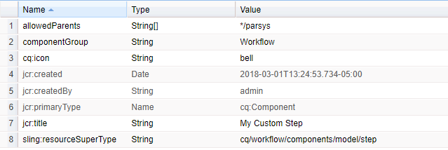

# Estensione della funzionalità per flussi di lavoro{#extending-workflow-functionality}

Questo argomento descrive come sviluppare componenti di passaggi personalizzati per i flussi di lavoro, quindi come interagire a livello di programmazione con i flussi di lavoro.

La creazione di un passaggio di flusso di lavoro personalizzato prevede le seguenti attività:

* Sviluppa il componente passaggio flusso di lavoro.
* Implementa la funzionalità step come servizio OSGi o script ECMA.

È inoltre possibile [interagire con i flussi di lavoro dai programmi e dagli script](/help/sites-developing/workflows-program-interaction.md).

## Componenti del passaggio del flusso di lavoro: nozioni di base {#workflow-step-components-the-basics}

Un componente passaggio flusso di lavoro definisce l’aspetto e il comportamento del passaggio durante la creazione dei modelli di flusso di lavoro:

* Il nome della categoria e del passaggio nella barra laterale del flusso di lavoro.
* L’aspetto del passaggio nei modelli di flusso di lavoro.
* Finestra di dialogo per modifica per configurare le proprietà del componente.
* Servizio o script eseguito in fase di esecuzione.

Come con [tutti i componenti](/help/sites-developing/components.md), i componenti del passaggio del flusso di lavoro ereditano dal componente specificato per `sling:resourceSuperType` proprietà. Il diagramma seguente mostra la gerarchia di `cq:component` nodi che costituiscono la base di tutti i componenti del passaggio del flusso di lavoro. Il diagramma include anche **Passaggio processo**, **Passaggio partecipante**, e **Passaggio partecipante dinamico** componenti, in quanto rappresentano i punti di partenza più comuni (e di base) per lo sviluppo di componenti per passaggi personalizzati.


>[!CAUTION]
>
>Tu ***deve*** non modificare nulla in `/libs` percorso.
>
>Questo perché il contenuto di `/libs` viene sovrascritto al successivo aggiornamento dell’istanza (e potrebbe benissimo essere sovrascritto quando applichi un hotfix o un feature pack).
>
>Il metodo consigliato per la configurazione e altre modifiche è:
>
>1. Ricrea l’elemento richiesto (ovvero come esiste in `/libs` in `/apps`
>2. Apporta le modifiche in `/apps`

Il `/libs/cq/workflow/components/model/step` il componente è l’antenato comune più vicino del **Passaggio processo**, **Passaggio partecipante**, e **Passaggio partecipante dinamico**, che ereditano tutti i seguenti elementi:

* `step.jsp`

  Il `step.jsp` script esegue il rendering del titolo del componente del passaggio quando viene aggiunto a un modello.

  

* [cq:dialog](/help/sites-developing/developing-components.md#creating-and-configuring-a-dialog)

  Una finestra di dialogo con le seguenti schede:

   * **Comune**: per modificare il titolo e la descrizione.
   * **Avanzate**: per modificare le proprietà delle notifiche e-mail.

   

  >[!NOTE]
  >
  >Quando le schede della finestra di dialogo per modifica di un componente del passaggio non corrispondono a questo aspetto predefinito, il componente del passaggio dispone di script definiti, proprietà del nodo o schede di dialogo che sovrascrivono queste schede ereditate.

### Script ECMA {#ecma-scripts}

Negli script ECMA sono disponibili i seguenti oggetti (a seconda del tipo di passo):

* [WorkItem](https://helpx.adobe.com/experience-manager/6-5/sites/developing/using/reference-materials/javadoc/com/day/cq/workflow/exec/WorkItem.html) workItem
* [WorkflowSession](https://helpx.adobe.com/experience-manager/6-5/sites/developing/using/reference-materials/javadoc/com/day/cq/workflow/WorkflowSession.html) workflowSession
* [WorkflowData](https://helpx.adobe.com/experience-manager/6-5/sites/developing/using/reference-materials/javadoc/com/day/cq/workflow/exec/WorkflowData.html) workflowData
* `args`: array con gli argomenti del processo.

* `sling`: per accedere ad altri servizi osgi.
* `jcrSession`

### MetaDataMap {#metadatamaps}

Puoi utilizzare i metadati del flusso di lavoro per mantenere le informazioni necessarie per tutta la durata del flusso di lavoro. Un requisito comune dei passaggi del flusso di lavoro consiste nel mantenere i dati per un utilizzo futuro nel flusso di lavoro o nel recuperare i dati persistenti.

Esistono tre tipi di oggetti MetaDataMap: per `Workflow`, `WorkflowData` e `WorkItem` oggetti. Tutte hanno lo stesso scopo: archiviare i metadati.

Un elemento di lavoro dispone di una MetaDataMap specifica che può essere utilizzata solo mentre l&#39;elemento di lavoro (ad esempio, il passaggio ) è in esecuzione.

Entrambi `Workflow` e `WorkflowData` i metadata sono condivisi sull&#39;intero flusso di lavoro. Per questi casi si consiglia di utilizzare solo il `WorkflowData` mappa metadati.

## Creazione di componenti personalizzati per passaggi del flusso di lavoro {#creating-custom-workflow-step-components}

I componenti dei passaggi del flusso di lavoro possono essere [creato nello stesso modo di qualsiasi altro componente](/help/sites-developing/components.md).

Per ereditare da uno dei componenti del passaggio base (esistenti), aggiungi la seguente proprietà al `cq:Component` nodo:

* Nome: `sling:resourceSuperType`
* Tipo: `String`
* Valore: uno dei percorsi seguenti viene risolto in un componente di base:

   * `cq/workflow/components/model/process`
   * `cq/workflow/components/model/participant`
   * `cq/workflow/components/model/dynamic_participant`

### Specifica del titolo e della descrizione predefiniti per le istanze di passo {#specifying-the-default-title-and-description-for-step-instances}

Per specificare i valori predefiniti per il **Titolo** e **Descrizione** campi sul **Comune** scheda.

>[!NOTE]
>
>I valori dei campi vengono visualizzati nell&#39;istanza del passo quando sono soddisfatti entrambi i requisiti riportati di seguito.
>
>* La finestra di dialogo per modifica del passaggio memorizza il titolo e la descrizione nelle seguenti posizioni: >
>* `./jcr:title`
>* `./jcr:description` posizioni
>
>  Questo requisito è soddisfatto quando la finestra di dialogo per modifica utilizza la scheda Comune che `/libs/cq/flow/components/step/step` il componente implementa.
>
>* Il componente del passo o un predecessore del componente non sostituisce il `step.jsp` scrivi che `/libs/cq/flow/components/step/step` il componente implementa.

1. Sotto `cq:Component` , aggiungere il seguente nodo:

   * Nome: `cq:editConfig`
   * Tipo: `cq:EditConfig`

   >[!NOTE]
   >
   >Per ulteriori informazioni sul nodo cq:editConfig, vedere [Configurazione del comportamento di modifica di un componente](/help/sites-developing/developing-components.md#configuring-the-edit-behavior).

1. Sotto `cq:EditConfig` , aggiungere il seguente nodo:

   * Nome: `cq:formParameters`
   * Tipo: `nt:unstructured`

1. Aggiungi `String` proprietà dei seguenti nomi per `cq:formParameters` nodo:

   * `jcr:title`: il valore riempie il **Titolo** campo del **Comune** scheda.
   * `jcr:description`: il valore riempie il **Descrizione** campo del **Comune** scheda.

### Salvataggio dei valori delle proprietà nei metadati del flusso di lavoro {#saving-property-values-in-workflow-metadata}

>[!NOTE]
>
>Consulta [Persistenza e accesso ai dati](#persisting-and-accessing-data). In particolare, per informazioni sull’accesso al valore della proprietà in fase di esecuzione, vedi [Accesso ai valori delle proprietà della finestra di dialogo in fase di esecuzione](#accessing-dialog-property-values-at-runtime).

La proprietà name di `cq:Widget` items specifica il nodo JCR che memorizza il valore del widget. Quando i widget nella finestra di dialogo dei componenti del passaggio del flusso di lavoro memorizzano i valori sotto `./metaData` viene aggiunto al flusso di lavoro. `MetaDataMap`.

Ad esempio, un campo di testo in una finestra di dialogo è un `cq:Widget` nodo con le seguenti proprietà:

| Nome | Tipo | Valore |
|---|---|---|
| `xtype` | `String` | `textarea` |
| `name` | `String` | `./metaData/subject` |
| `fieldLabel` | `String` | `Email Subject` |

Il valore specificato in questo campo di testo viene aggiunto al file dell’istanza del flusso di lavoro ` [MetaDataMap](#metadatamaps)` ed è associato all&#39;oggetto `subject` chiave.

>[!NOTE]
>
>Quando la chiave è `PROCESS_ARGS`, il valore è prontamente disponibile nelle implementazioni di script ECMA tramite `args` variabile. In questo caso, il valore della proprietà name è `./metaData/PROCESS_ARGS.`

### Ignorare l’implementazione del passaggio {#overriding-the-step-implementation}

Ogni componente del passaggio di base consente agli sviluppatori di modelli di flusso di lavoro di configurare le seguenti funzioni chiave in fase di progettazione:

* Passaggio del processo: il servizio o lo script ECMA da eseguire in fase di esecuzione.
* Passaggio partecipante: ID dell&#39;utente a cui viene assegnato l&#39;elemento di lavoro generato.
* Passaggio partecipante dinamico: il servizio o lo script ECMA che seleziona l&#39;ID dell&#39;utente a cui è assegnato l&#39;elemento di lavoro.

Per rendere attivo il componente per l’utilizzo in uno scenario di flusso di lavoro specifico, configura la funzione chiave nella progettazione e rimuovi la possibilità per gli sviluppatori di modelli di modificarlo.

1. Sotto il nodo cq:component, aggiungi il seguente nodo:

   * Nome: `cq:editConfig`
   * Tipo: `cq:EditConfig`

   Per ulteriori informazioni sul nodo cq:editConfig, vedere [Configurazione del comportamento di modifica di un componente](/help/sites-developing/developing-components.md#configuring-the-edit-behavior).

1. Al di sotto del nodo cq:EditConfig, aggiungi il seguente nodo:

   * Nome: `cq:formParameters`
   * Tipo: `nt:unstructured`

1. Aggiungi un `String` proprietà per il `cq:formParameters` nodo. Il super-tipo del componente determina il nome della proprietà:

   * Passaggio processo: `PROCESS`
   * Passaggio partecipante: `PARTICIPANT`
   * Passaggio partecipante dinamico: `DYNAMIC_PARTICIPANT`

1. Specifica il valore della proprietà:

   * `PROCESS`: percorso dello script ECMA o del PID del servizio che implementa il comportamento del passaggio.
   * `PARTICIPANT`: ID dell’utente a cui viene assegnato l’elemento di lavoro.
   * `DYNAMIC_PARTICIPANT`: percorso dello script ECMA o del PID del servizio che seleziona l’utente per assegnare l’elemento di lavoro.

1. Per impedire agli sviluppatori di modelli di modificare i valori delle proprietà, ignorare la finestra di dialogo del super tipo di componente.

### Aggiunta di Forms e finestre di dialogo ai passaggi dei partecipanti {#adding-forms-and-dialogs-to-participant-steps}

Personalizza il componente Passaggio partecipante per fornire le funzioni presenti nella [Passaggio partecipante modulo](/help/sites-developing/workflows-step-ref.md#form-participant-step) e [Passaggio partecipante finestra di dialogo](/help/sites-developing/workflows-step-ref.md#dialog-participant-step) componenti:

* Presentare un modulo all&#39;utente quando apre l&#39;elemento di lavoro generato.
* Presenta una finestra di dialogo personalizzata all’utente quando completa l’elemento di lavoro generato.

Attenersi alla seguente procedura per il nuovo componente (vedere [Creazione di componenti personalizzati per passaggi del flusso di lavoro](#creating-custom-workflow-step-components)):

1. Sotto `cq:Component` , aggiungere il seguente nodo:

   * Nome: `cq:editConfig`
   * Tipo: `cq:EditConfig`

   Per ulteriori informazioni sul nodo cq:editConfig, vedere [Configurazione del comportamento di modifica di un componente](/help/sites-developing/components-basics.md#edit-behavior).

1. Al di sotto del nodo cq:EditConfig, aggiungi il seguente nodo:

   * Nome: `cq:formParameters`
   * Tipo: `nt:unstructured`

1. Per presentare un modulo quando l’utente apre l’elemento di lavoro, aggiungi la seguente proprietà al `cq:formParameters` nodo:

   * Nome: `FORM_PATH`
   * Tipo: `String`
   * Valore: il percorso che viene risolto nel modulo

1. Per visualizzare una finestra di dialogo personalizzata quando l’utente completa l’elemento di lavoro, aggiungi la seguente proprietà alla `cq:formParameters` nodo

   * Nome: `DIALOG_PATH`
   * Tipo: `String`
   * Valore: il percorso che viene risolto nella finestra di dialogo

### Configurazione del comportamento runtime del passaggio del flusso di lavoro {#configuring-the-workflow-step-runtime-behavior}

Sotto `cq:Component` , aggiungere un `cq:EditConfig` nodo. Sotto che aggiungono un `nt:unstructured` nodo (deve essere denominato `cq:formParameters`) e aggiungere al nodo le seguenti proprietà:

* Nome: `PROCESS_AUTO_ADVANCE`

   * Tipo: `Boolean`
   * Valore:

      * se impostato su `true` il flusso di lavoro eseguirà il passaggio e continuerà. impostazione predefinita e consigliata
      * quando `false`, il flusso di lavoro verrà eseguito e arrestato; ciò richiede una gestione aggiuntiva, quindi `true` è consigliato

* Nome: `DO_NOTIFY`

   * Tipo: `Boolean`
   * Valore: indica se le notifiche e-mail devono essere inviate per i passaggi di partecipazione dell’utente (e presuppone che il server di posta sia configurato correttamente)

## Persistenza e accesso ai dati {#persisting-and-accessing-data}

### Dati persistenti per i passaggi successivi del flusso di lavoro {#persisting-data-for-subsequent-workflow-steps}

Puoi utilizzare i metadati del flusso di lavoro per mantenere le informazioni necessarie per tutta la durata del flusso di lavoro, e tra i passaggi. Un requisito comune dei passaggi del flusso di lavoro consiste nel mantenere i dati per utilizzi futuri o nel recuperare i dati persistenti dai passaggi precedenti.

I metadati del flusso di lavoro sono memorizzati in una [`MetaDataMap`](#metadatamaps) oggetto. L’API Java fornisce [`Workflow.getWorkflowData`](https://helpx.adobe.com/experience-manager/6-5/sites/developing/using/reference-materials/javadoc/com/adobe/granite/workflow/exec/Workflow.html) metodo per restituire un [`WorkflowData`](https://helpx.adobe.com/experience-manager/6-5/sites/developing/using/reference-materials/javadoc/com/adobe/granite/workflow/exec/WorkflowData.html) oggetto che fornisce l&#39;appropriato `MetaDataMap` oggetto. Questo `WorkflowData` `MetaDataMap` L’oggetto è disponibile per il servizio OSGi o per lo script ECMA di un componente della fase.

#### Java {#java}

Il metodo execute della `WorkflowProcess` l&#39;implementazione viene superata il `WorkItem` oggetto. Utilizzare questo oggetto per ottenere `WorkflowData` oggetto per l&#39;istanza di flusso di lavoro corrente. L&#39;esempio seguente aggiunge un elemento al flusso di lavoro `MetaDataMap` e quindi registra ogni elemento. L’elemento (&quot;mykey&quot;, &quot;My Step Value&quot;) è disponibile per i passaggi successivi nel flusso di lavoro.

```java
public void execute(WorkItem item, WorkflowSession session, MetaDataMap args) throws WorkflowException {

    MetaDataMap wfd = item.getWorkflow().getWorkflowData().getMetaDataMap();

    wfd.put("mykey", "My Step Value");

    Set<String> keyset = wfd.keySet();
    Iterator<String> i = keyset.iterator();
    while (i.hasNext()){
     Object key = i.next();
     log.info("The workflow medata includes key {} and value {}",key.toString(),wfd.get(key).toString());
    }
}
```

#### Script ECMA {#ecma-script}

Il `graniteWorkItem` variabile è la rappresentazione dello script ECMA dell&#39;attuale `WorkItem` Oggetto Java. Pertanto, puoi utilizzare il `graniteWorkItem` per ottenere i metadati del flusso di lavoro. Per implementare un **Passaggio processo** per aggiungere un elemento al flusso di lavoro `MetaDataMap` e quindi registrare ogni elemento. Questi elementi sono quindi disponibili per i passaggi successivi nel flusso di lavoro.

>[!NOTE]
>
>Il `metaData` variabile immediatamente disponibile per lo script step sono i metadati del step. I metadati della fase sono diversi da quelli del flusso di lavoro.

```
var currentDateInMillis = new Date().getTime();

graniteWorkItem.getWorkflowData().getMetaDataMap().put("hardcodedKey","theKey");

graniteWorkItem.getWorkflowData().getMetaDataMap().put("currentDateInMillisKey",currentDateInMillis);

var iterator = graniteWorkItem.getWorkflowData().getMetaDataMap().keySet().iterator();
while (iterator.hasNext()){
    var key = iterator.next();
    log.info("Workflow metadata key, value = " + key.toString() + ", " + graniteWorkItem.getWorkflowData().getMetaDataMap().get(key));
}
```

### Accesso ai valori delle proprietà della finestra di dialogo in fase di esecuzione {#accessing-dialog-property-values-at-runtime}

Il `MetaDataMap` L’oggetto delle istanze del flusso di lavoro è utile per memorizzare e recuperare i dati per tutta la durata del flusso di lavoro. Per le implementazioni dei componenti dei passaggi del flusso di lavoro, `MetaDataMap` è particolarmente utile per recuperare i valori delle proprietà dei componenti in fase di esecuzione.

>[!NOTE]
>
>Per informazioni sulla configurazione della finestra di dialogo del componente per memorizzare le proprietà come metadati del flusso di lavoro, vedi [Salvataggio dei valori delle proprietà nei metadati del flusso di lavoro](#saving-property-values-in-workflow-metadata).

Il flusso di lavoro `MetaDataMap` è disponibile per le implementazioni di processi di script Java ed ECMA:

* Nelle implementazioni Java dell’interfaccia WorkflowProcess, il `args` il parametro è il `MetaDataMap` oggetto per il flusso di lavoro.

* Nelle implementazioni degli script ECMA, il valore è disponibile utilizzando `args` e `metadata` variabili.

### Esempio: recupero degli argomenti del componente Passaggio processo {#example-retrieving-the-arguments-of-the-process-step-component}

La finestra di dialogo per modifica del **Passaggio processo** il componente include **Argomenti** proprietà. Il valore della proprietà **Argomenti** viene memorizzata nei metadati del flusso di lavoro ed è associata alla proprietà `PROCESS_ARGS` chiave.

Nel diagramma seguente, il valore di **Argomenti** la proprietà è `argument1, argument2`:


#### Java {#java-1}

Il seguente codice Java è `execute` metodo per un `WorkflowProcess` implementazione. Il metodo registra il valore in `args` `MetaDataMap` associato al `PROCESS_ARGS` chiave.

```java
public void execute(WorkItem item, WorkflowSession session, MetaDataMap args) throws WorkflowException {
     if (args.containsKey("PROCESS_ARGS")){
      log.info("workflow metadata for key PROCESS_ARGS and value {}",args.get("PROCESS_ARGS","string").toString());
     }
    }
```

Quando viene eseguito un passaggio del processo che utilizza questa implementazione Java, il registro contiene la seguente voce:

```xml
16.02.2018 12:07:39.566 *INFO* [JobHandler: /var/workflow/instances/server0/2018-02-16/model_855140139900189:/content/we-retail/de] com.adobe.example.workflow.impl.process.LogArguments workflow metadata for key PROCESS_ARGS and value argument1, argument2
```

#### Script ECMA {#ecma-script-1}

Il seguente script ECMA viene utilizzato come processo per **Passaggio processo**. Registra il numero di argomenti e i valori degli argomenti:

```
var iterator = graniteWorkItem.getWorkflowData().getMetaDataMap().keySet().iterator();
while (iterator.hasNext()){
    var key = iterator.next();
    log.info("Workflow metadata key, value = " + key.toString() + ", " + graniteWorkItem.getWorkflowData().getMetaDataMap().get(key));
}
log.info("hardcodedKey "+ graniteWorkItem.getWorkflowData().getMetaDataMap().get("hardcodedKey"));
log.info("currentDateInMillisKey "+ graniteWorkItem.getWorkflowData().getMetaDataMap().get("currentDateInMillisKey"));
```

>[!NOTE]
>
>In questa sezione viene descritto come utilizzare gli argomenti per le fasi del processo. Le informazioni si applicano anche ai selettori partecipanti dinamici.

>[!NOTE]
>Per un altro esempio di memorizzazione delle proprietà dei componenti nei metadati del flusso di lavoro, vedi Esempio: creare un passaggio del flusso di lavoro del logger. In questo esempio viene illustrata una finestra di dialogo che associa il valore dei metadati a una chiave diversa da PROCESS_ARGS.

### Script e argomenti processo {#scripts-and-process-arguments}

All’interno di uno script per **Passaggio processo** componente, gli argomenti sono disponibili tramite `args` oggetto.

Quando si crea un componente del passaggio personalizzato, l’oggetto `metaData` è disponibile in uno script. Questo oggetto è limitato a un singolo argomento stringa.

## Sviluppo di implementazioni di fasi del processo {#developing-process-step-implementations}

Quando si avviano le fasi del processo durante il processo di un flusso di lavoro, le fasi inviano una richiesta a un servizio OSGi o eseguono uno script ECMA. Sviluppa il servizio o lo script ECMA che esegue le azioni richieste dal flusso di lavoro.

>[!NOTE]
>
>Per informazioni sull&#39;associazione del componente Fase processo al servizio o allo script, vedere [Passaggio processo](/help/sites-developing/workflows-step-ref.md#process-step) o [Ignorare l’implementazione del passaggio](#overriding-the-step-implementation).

### Implementazione di un passaggio del processo con una classe Java {#implementing-a-process-step-with-a-java-class}

Per definire un passaggio del processo come componente del servizio OSGI (bundle Java):

1. Crea il bundle e distribuiscilo nel contenitore OSGI. Consulta la documentazione sulla creazione di un bundle con [CRXDE Liti](/help/sites-developing/developing-with-crxde-lite.md) o [Eclipse](/help/sites-developing/howto-projects-eclipse.md).

   >[!NOTE]
   >
   >Il componente OSGI deve implementare `WorkflowProcess` interfaccia con i relativi `execute()` metodo. Vedi il codice di esempio seguente.

   >[!NOTE]
   >
   >È necessario aggiungere il nome del pacchetto al `<*Private-Package*>` sezione del `maven-bundle-plugin` configurazione.

1. Aggiungi la proprietà SCR `process.label`  e imposta il valore come desiderato. Questo sarà il nome con cui verrà elencato il passaggio del processo quando si utilizza il generico **Passaggio processo** componente. Vedi l’esempio seguente.
1. In **Modelli** , aggiungi il passaggio del processo al flusso di lavoro utilizzando l&#39;editor **Passaggio processo** componente.
1. Nella finestra di dialogo per modifica (del **Passaggio processo**), vai al **Processo** e seleziona l’implementazione del processo.
1. Se si utilizzano argomenti nel codice, impostare **Argomenti processo**. Ad esempio: false.
1. Salva le modifiche sia per il passaggio che per il modello di flusso di lavoro (angolo in alto a sinistra dell’editor modelli).

I metodi Java, rispettivamente le classi che implementano il metodo Java eseguibile, vengono registrati come servizi OSGI, consentendo di aggiungere metodi in qualsiasi momento durante il runtime.

Il seguente componente OSGI aggiunge la proprietà `approved` al nodo del contenuto della pagina quando il payload è una pagina:

```java
package com.adobe.example.workflow.impl.process;

import com.adobe.granite.workflow.WorkflowException;
import com.adobe.granite.workflow.WorkflowSession;
import com.adobe.granite.workflow.exec.WorkItem;
import com.adobe.granite.workflow.exec.WorkflowData;
import com.adobe.granite.workflow.exec.WorkflowProcess;
import com.adobe.granite.workflow.metadata.MetaDataMap;

import org.apache.felix.scr.annotations.Component;
import org.apache.felix.scr.annotations.Property;
import org.apache.felix.scr.annotations.Service;

import org.osgi.framework.Constants;

import javax.jcr.Node;
import javax.jcr.RepositoryException;
import javax.jcr.Session;

/**
 * Sample workflow process that sets an <code>approve</code> property to the payload based on the process argument value.
 */
@Component
@Service
public class MyProcess implements WorkflowProcess {

 @Property(value = "An example workflow process implementation.")
 static final String DESCRIPTION = Constants.SERVICE_DESCRIPTION;
 @Property(value = "Adobe")
 static final String VENDOR = Constants.SERVICE_VENDOR;
 @Property(value = "My Sample Workflow Process")
 static final String LABEL="process.label";

 private static final String TYPE_JCR_PATH = "JCR_PATH";

 public void execute(WorkItem item, WorkflowSession session, MetaDataMap args) throws WorkflowException {
  WorkflowData workflowData = item.getWorkflowData();
  if (workflowData.getPayloadType().equals(TYPE_JCR_PATH)) {
   String path = workflowData.getPayload().toString() + "/jcr:content";
   try {
    Session jcrSession = session.adaptTo(Session.class);
    Node node = (Node) jcrSession.getItem(path);
    if (node != null) {
     node.setProperty("approved", readArgument(args));
     jcrSession.save();
    }
   } catch (RepositoryException e) {
    throw new WorkflowException(e.getMessage(), e);
   }
  }
 }

 private boolean readArgument(MetaDataMap args) {
  String argument = args.get("PROCESS_ARGS", "false");
  return argument.equalsIgnoreCase("true");
 }
}
```

>[!NOTE]
>
>Se il processo non riesce tre volte di fila, un elemento viene inserito nella casella in entrata dell’amministratore del flusso di lavoro.

### Utilizzo di ECMAScript {#using-ecmascript}

Gli script ECMA consentono agli sviluppatori di script di implementare i passaggi del processo. Gli script si trovano nell’archivio JCR e vengono eseguiti da lì.

Nella tabella seguente sono elencate le variabili immediatamente disponibili per gli script di elaborazione, che consentono di accedere agli oggetti dell’API Java del flusso di lavoro.

| Classe Java | Nome variabile script | Descrizione |
|---|---|---|
| `com.adobe.granite.workflow.exec.WorkItem` | `graniteWorkItem` | Istanza del passaggio corrente. |
| `com.adobe.granite.workflow.WorkflowSession` | `graniteWorkflowSession` | La sessione del flusso di lavoro dell’istanza del passaggio corrente. |
| `String[]` (contiene argomenti di processo) | `args` | Argomenti del passaggio. |
| `com.adobe.granite.workflow.metadata.MetaDataMap` | `metaData` | I metadati dell’istanza del passaggio corrente. |
| `org.apache.sling.scripting.core.impl.InternalScriptHelper` | `sling` | Fornisce l’accesso all’ambiente runtime di Sling. |

Lo script di esempio seguente illustra come accedere al nodo JCR che rappresenta il payload del flusso di lavoro. Il `graniteWorkflowSession` viene adattata a una variabile di sessione JCR, utilizzata per ottenere il nodo dal percorso del payload.

```
var workflowData = graniteWorkItem.getWorkflowData();
if (workflowData.getPayloadType() == "JCR_PATH") {
    var path = workflowData.getPayload().toString();
    var jcrsession = graniteWorkflowSession.adaptTo(Packages.javax.jcr.Session);
    var node = jcrsession.getNode(path);
    if (node.hasProperty("approved")){
     node.setProperty("approved", args[0] == "true" ? true : false);
     node.save();
 }
}
```

Lo script seguente controlla se il payload è un’immagine ( `.png` file), crea un&#39;immagine in bianco e nero e la salva come nodo di pari livello.

```
var workflowData = graniteWorkItem.getWorkflowData();
if (workflowData.getPayloadType() == "JCR_PATH") {
    var path = workflowData.getPayload().toString();
    var jcrsession = graniteWorkflowSession.adaptTo(Packages.javax.jcr.Session);
    var node = jcrsession.getRootNode().getNode(path.substring(1));
     if (node.isNodeType("nt:file") && node.getProperty("jcr:content/jcr:mimeType").getString().indexOf("image/") == 0) {
        var is = node.getProperty("jcr:content/jcr:data").getStream();
        var layer = new Packages.com.day.image.Layer(is);
        layer.grayscale();
                var parent = node.getParent();
                var gn = parent.addNode("grey" + node.getName(), "nt:file");
        var content = gn.addNode("jcr:content", "nt:resource");
                content.setProperty("jcr:mimeType","image/png");
                var cal = Packages.java.util.Calendar.getInstance();
                content.setProperty("jcr:lastModified",cal);
                var f = Packages.java.io.File.createTempFile("test",".png");
        var tout = new Packages.java.io.FileOutputStream(f);
        layer.write("image/png", 1.0, tout);
        var fis = new Packages.java.io.FileInputStream(f);
                content.setProperty("jcr:data", fis);
                parent.save();
        tout.close();
        fis.close();
        is.close();
        f.deleteOnExit();
    }
}
```

Per utilizzare lo script:

1. Crea lo script (ad esempio, con CRXDE Liti) e salvalo nell’archivio seguente `//apps/workflow/scripts/`
1. Per specificare un titolo che identifichi lo script in **Passaggio processo** finestra di dialogo per modifica, aggiungi le seguenti proprietà alla `jcr:content` nodo dello script:

   | Nome | Tipo | Valore |
   |---|---|---|
   | `jcr:mixinTypes` | `Name[]` | `mix:title` |
   | `jcr:title` | `String` | Nome da visualizzare nella finestra di dialogo per modifica. |

1. Modifica il **Passaggio processo** e specificare lo script da utilizzare.

## Sviluppo di selezioni partecipanti {#developing-participant-choosers}

Puoi sviluppare i selettori partecipanti per **Passaggio partecipante dinamico** componenti.

Quando un **Passaggio partecipante dinamico** il componente viene avviato durante un flusso di lavoro, il passaggio deve determinare il partecipante a cui può essere assegnato l’elemento di lavoro generato. A questo scopo, effettua una delle seguenti operazioni:

* invia una richiesta a un servizio OSGi
* esegue uno script ECMA per selezionare il partecipante

È possibile sviluppare un servizio o uno script ECMA che seleziona il partecipante in base ai requisiti del flusso di lavoro.

>[!NOTE]
>
>Per informazioni sull&#39;associazione **Passaggio partecipante dinamico** con il servizio o lo script, vedi [Passaggio partecipante dinamico](/help/sites-developing/workflows-step-ref.md#dynamic-participant-step) o [Ignorare l’implementazione del passaggio](#persisting-and-accessing-data).

### Sviluppo di un selettore partecipanti utilizzando una classe Java {#developing-a-participant-chooser-using-a-java-class}

Per definire un passaggio partecipante come componente del servizio OSGI (classe Java):

1. Il componente OSGI deve implementare `ParticipantStepChooser` interfaccia con i relativi `getParticipant()` metodo. Vedi il codice di esempio seguente.

   Crea il bundle e distribuiscilo nel contenitore OSGI.

1. Aggiungi la proprietà SCR `chooser.label` e imposta il valore come richiesto. Questo sarà il nome con cui è elencato il selettore partecipanti, utilizzando **Passaggio partecipante dinamico** componente. Vedi l’esempio:

   ```java
   package com.adobe.example.workflow.impl.process;
   
   import com.adobe.granite.workflow.WorkflowException;
   import com.adobe.granite.workflow.WorkflowSession;
   import com.adobe.granite.workflow.exec.ParticipantStepChooser;
   import com.adobe.granite.workflow.exec.WorkItem;
   import com.adobe.granite.workflow.exec.WorkflowData;
   import com.adobe.granite.workflow.metadata.MetaDataMap;
   
   import org.apache.felix.scr.annotations.Component;
   import org.apache.felix.scr.annotations.Property;
   import org.apache.felix.scr.annotations.Service;
   
   import org.osgi.framework.Constants;
   
   /**
    * Sample dynamic participant step that determines the participant based on a path given as argument.
    */
   @Component
   @Service
   
   public class MyDynamicParticipant implements ParticipantStepChooser {
   
    @Property(value = "An example implementation of a dynamic participant chooser.")
    static final String DESCRIPTION = Constants.SERVICE_DESCRIPTION;
       @Property(value = "Adobe")
       static final String VENDOR = Constants.SERVICE_VENDOR;
       @Property(value = "Dynamic Participant Chooser Process")
       static final String LABEL=ParticipantStepChooser.SERVICE_PROPERTY_LABEL;
   
       private static final String TYPE_JCR_PATH = "JCR_PATH";
   
       public String getParticipant(WorkItem workItem, WorkflowSession workflowSession, MetaDataMap args) throws WorkflowException {
           WorkflowData workflowData = workItem.getWorkflowData();
           if (workflowData.getPayloadType().equals(TYPE_JCR_PATH)) {
               String path = workflowData.getPayload().toString();
               String pathFromArgument = args.get("PROCESS_ARGS", String.class);
               if (pathFromArgument != null && path.startsWith(pathFromArgument)) {
                   return "admin";
               }
           }
           return "administrators";
       }
   }
   ```

1. In **Modelli** , aggiungi il passaggio partecipante dinamico al flusso di lavoro utilizzando il **Passaggio partecipante dinamico** componente.
1. Nella finestra di dialogo per modifica, seleziona **Selettore partecipanti** e seleziona l’implementazione del selettore.
1. Se si utilizzano argomenti nel set di codice, **Argomenti processo**. Per questo esempio: `/content/we-retail/de`.
1. Salva le modifiche per il passaggio e il modello di flusso di lavoro.

### Sviluppo di un selettore partecipanti utilizzando uno script ECMA {#developing-a-participant-chooser-using-an-ecma-script}

È possibile creare uno script ECMA che seleziona l&#39;utente a cui è assegnato l&#39;elemento di lavoro che **Passaggio partecipante** genera. Lo script deve includere una funzione denominata `getParticipant` che non richiede argomenti e restituisce un `String` che contiene l’ID di un utente o gruppo.

Gli script si trovano nell’archivio JCR e vengono eseguiti da lì.

Nella tabella seguente sono elencate le variabili che forniscono accesso immediato agli oggetti Java del flusso di lavoro negli script.

| Classe Java | Nome variabile script |
|---|---|
| `com.adobe.granite.workflow.exec.WorkItem` | `graniteWorkItem` |
| `com.adobe.granite.workflow.WorkflowSession` | `graniteWorkflowSession` |
| `String[]` (contiene argomenti di processo) | `args` |
| `com.adobe.granite.workflow.metadata.MetaDataMap` | `metaData` |
| `org.apache.sling.scripting.core.impl.InternalScriptHelper` | `sling` |

```
function getParticipant() {
    var workflowData = graniteWorkItem.getWorkflowData();
    if (workflowData.getPayloadType() == "JCR_PATH") {
        var path = workflowData.getPayload().toString();
        if (path.indexOf("/content/we-retail/de") == 0) {
            return "admin";
        } else {
            return "administrators";
        }
    }
}
```

1. Crea lo script (ad esempio, con CRXDE Liti) e salvalo nell’archivio seguente `//apps/workflow/scripts`
1. Per specificare un titolo che identifichi lo script in **Passaggio processo** finestra di dialogo per modifica, aggiungi le seguenti proprietà alla `jcr:content` nodo dello script:

   | Nome | Tipo | Valore |
   |---|---|---|
   | `jcr:mixinTypes` | `Name[]` | `mix:title` |
   | `jcr:title` | `String` | Nome da visualizzare nella finestra di dialogo per modifica. |

1. Modifica il [Passaggio partecipante dinamico](/help/sites-developing/workflows-step-ref.md#dynamic-participant-step) e specificare lo script da utilizzare.

## Gestione dei pacchetti del flusso di lavoro {#handling-workflow-packages}

[Pacchetti flusso di lavoro](/help/sites-authoring/workflows-applying.md#specifying-workflow-details-in-the-create-workflow-wizard) può essere passato a un flusso di lavoro per l’elaborazione. I pacchetti del flusso di lavoro contengono riferimenti a risorse come pagine e risorse.

>[!NOTE]
>
>I seguenti passaggi del processo di flusso di lavoro accettano pacchetti di flusso di lavoro per l’attivazione di pagine in blocco:
>
>* [`com.day.cq.wcm.workflow.process.ActivatePageProcess`](https://helpx.adobe.com/experience-manager/6-5/sites/developing/using/reference-materials/javadoc/com/day/cq/wcm/workflow/process/ActivatePageProcess.html)
>* [`com.day.cq.wcm.workflow.process.DeactivatePageProcess`](https://helpx.adobe.com/experience-manager/6-5/sites/developing/using/reference-materials/javadoc/com/day/cq/wcm/workflow/process/DeactivatePageProcess.html)
>

Puoi sviluppare i passaggi del flusso di lavoro per ottenere le risorse del pacchetto ed elaborarle. I seguenti membri della `com.day.cq.workflow.collection` forniscono accesso ai pacchetti del flusso di lavoro:

* `ResourceCollection`: classe del pacchetto del flusso di lavoro.
* `ResourceCollectionUtil`: utilizzato per recuperare gli oggetti ResourceCollection.
* `ResourceCollectionManager`: crea e recupera le raccolte. Un’implementazione viene distribuita come servizio OSGi.

Nell&#39;esempio di classe Java riportato di seguito viene illustrato come ottenere le risorse del pacchetto:

```java
package com.adobe.example;

import java.util.ArrayList;
import java.util.List;

import com.day.cq.workflow.WorkflowException;
import com.day.cq.workflow.WorkflowSession;
import com.day.cq.workflow.collection.ResourceCollection;
import com.day.cq.workflow.collection.ResourceCollectionManager;
import com.day.cq.workflow.collection.ResourceCollectionUtil;
import com.day.cq.workflow.exec.WorkItem;
import com.day.cq.workflow.exec.WorkflowData;
import com.day.cq.workflow.exec.WorkflowProcess;
import com.day.cq.workflow.metadata.MetaDataMap;

import org.apache.felix.scr.annotations.Component;
import org.apache.felix.scr.annotations.Property;
import org.apache.felix.scr.annotations.Service;
import org.apache.felix.scr.annotations.Reference;
import org.osgi.framework.Constants;

import org.slf4j.Logger;
import org.slf4j.LoggerFactory;

import javax.jcr.Node;
import javax.jcr.PathNotFoundException;
import javax.jcr.RepositoryException;
import javax.jcr.Session;

@Component
@Service
public class LaunchBulkActivate implements WorkflowProcess {

 private static final Logger log = LoggerFactory.getLogger(LaunchBulkActivate.class);

 @Property(value="Bulk Activate for Launches")
  static final String PROCESS_NAME ="process.label";
 @Property(value="A sample workflow process step to support Launches bulk activation of pages")
 static final String SERVICE_DESCRIPTION = Constants.SERVICE_DESCRIPTION;

 @Reference
 private ResourceCollectionManager rcManager;
public void execute(WorkItem workItem, WorkflowSession workflowSession) throws Exception {
    Session session = workflowSession.getSession();
    WorkflowData data = workItem.getWorkflowData();
    String path = null;
    String type = data.getPayloadType();
    if (type.equals(TYPE_JCR_PATH) && data.getPayload() != null) {
        String payloadData = (String) data.getPayload();
        if (session.itemExists(payloadData)) {
            path = payloadData;
        }
    } else if (data.getPayload() != null && type.equals(TYPE_JCR_UUID)) {
        Node node = session.getNodeByUUID((String) data.getPayload());
        path = node.getPath();
    }

    // CUSTOMIZED CODE IF REQUIRED....

    if (path != null) {
        // check for resource collection
        ResourceCollection rcCollection = ResourceCollectionUtil.getResourceCollection((Node)session.getItem(path), rcManager);
        // get list of paths to replicate (no resource collection: size == 1
        // otherwise size >= 1
        List<String> paths = getPaths(path, rcCollection);
        for (String aPath: paths) {

            // CUSTOMIZED CODE....

        }
    } else {
        log.warn("Cannot process because path is null for this " + "workitem: " + workItem.toString());
    }
}

/**
 * helper
 */
private List<String> getPaths(String path, ResourceCollection rcCollection) {
    List<String> paths = new ArrayList<String>();
    if (rcCollection == null) {
        paths.add(path);
    } else {
        log.debug("ResourceCollection detected " + rcCollection.getPath());
        // this is a resource collection. the collection itself is not
        // replicated. only its members
        try {
            List<Node> members = rcCollection.list(new String[]{"cq:Page", "dam:Asset"});
            for (Node member: members) {
                String mPath = member.getPath();
                paths.add(mPath);
            }
        } catch(RepositoryException re) {
            log.error("Cannot build path list out of the resource collection " + rcCollection.getPath());
        }
    }
    return paths;
}
}
```

## Esempio: creazione di un passaggio personalizzato {#example-creating-a-custom-step}

Un modo semplice per iniziare a creare un passaggio personalizzato consiste nel copiare un passaggio esistente da:

`/libs/cq/workflow/components/model`

### Creazione del passaggio di base {#creating-the-basic-step}

1. Ricrea il percorso in /apps; ad esempio:

   `/apps/cq/workflow/components/model`

   Le nuove cartelle sono di tipo `nt:folder`:

   ```xml
   - apps
     - cq
       - workflow (nt:folder)
         - components (nt:folder)
           - model (nt:folder)
   ```

   >[!NOTE]
   >
   >Questo passaggio non si applica all’editor di modelli dell’interfaccia utente classica.

1. Quindi inserisci il passaggio copiato nella cartella /apps; ad esempio, come:

   `/apps/cq/workflow/components/model/myCustomStep`

   Ecco il risultato del passaggio personalizzato di esempio:

   

   >[!CAUTION]
   >
   >Perché nell’interfaccia utente standard, sulla scheda non vengono visualizzati solo il titolo e non i dettagli, `details.jsp` non è necessario, come per l’editor di interfaccia classica.

1. Applica le seguenti proprietà al nodo:

   `/apps/cq/workflow/components/model/myCustomStep`

   **Proprietà:**

   * `sling:resourceSuperType`

     Deve ereditare da un passaggio esistente.

     In questo esempio ereditiamo dal passaggio base in `cq/workflow/components/model/step`, ma puoi utilizzare altri super tipi come `participant`, `process`e così via.

   * `jcr:title`

     è il titolo visualizzato quando il componente è elencato nel browser dei passaggi (pannello laterale sinistro dell’editor modelli di flusso di lavoro).

   * `cq:icon`

     Utilizzato per specificare un [Icona rosso corallo](https://helpx.adobe.com/experience-manager/6-5/sites/developing/using/reference-materials/coral-ui/coralui3/Coral.Icon.html) per il passaggio.

   * `componentGroup`

     Deve essere uno dei seguenti:

      * Flusso di lavoro collaborazione
      * Flusso di lavoro DAM
      * Flusso di lavoro per moduli
      * Progetti
      * Flusso di lavoro WCM
      * Flusso di lavoro

   

1. Ora puoi aprire un modello di flusso di lavoro per la modifica. Nel browser dei passaggi puoi filtrare per visualizzare **Passaggio personalizzato**:

   

   Trascinamento **Passaggio personalizzato** sul modello viene visualizzata la scheda:

   

   In caso negativo `cq:icon` è stato definito per il passaggio, quindi viene riprodotta un’icona predefinita utilizzando le prime due lettere del titolo. Ad esempio:

   

#### Definizione della finestra di dialogo di configurazione del passaggio {#defining-the-step-configure-dialog}

Dopo [Creazione del passaggio di base](#creating-the-basic-step), definisci il passaggio **Configura** finestra di dialogo come segue:

1. Configurare le proprietà sul nodo `cq:editConfig` come segue:

   **Proprietà:**

   * `cq:inherit`

     Se impostato su `true`, il componente del passaggio erediterà le proprietà dal passaggio specificato in `sling:resourceSuperType`.

   * `cq:disableTargeting`

     Imposta come richiesto.

   

1. Configurare le proprietà sul nodo `cq:formsParameter` come segue:

   **Proprietà:**

   * `jcr:title`

     Imposta il titolo predefinito sulla scheda del passo nella mappa del modello e nel **Titolo** campo del **Personalizzato - Proprietà passaggio** finestra di dialogo per configurazione.

   * Puoi anche definire proprietà personalizzate.

   

1. Configurare le proprietà sul nodo `cq:listeners`.

   Il `cq:listener` Il nodo e le relative proprietà consentono di impostare gestori eventi che reagiscono agli eventi nell’editor modelli dell’interfaccia utente touch, ad esempio il trascinamento di un passaggio in una pagina del modello o la modifica delle proprietà di un passaggio.

   **Proprietà:**

   * `afterMove: REFRESH_PAGE`
   * `afterdelete: CQ.workflow.flow.Step.afterDelete`
   * `afteredit: CQ.workflow.flow.Step.afterEdit`
   * `afterinsert: CQ.workflow.flow.Step.afterInsert`

   Questa configurazione è essenziale per il corretto funzionamento dell’editor. Nella maggior parte dei casi questa configurazione non deve essere modificata.

   Tuttavia, l&#39;impostazione `cq:inherit` su true (il `cq:editConfig` (vedi sopra) consente di ereditare questa configurazione, senza doverla includere esplicitamente nella definizione del passaggio. Se non è presente alcuna ereditarietà, è necessario aggiungere questo nodo con le proprietà e i valori seguenti.

   In questo esempio, è stata attivata l’ereditarietà per rimuovere il `cq:listeners` e il passaggio continuerà a funzionare correttamente.

   

1. Ora puoi aggiungere un’istanza del passaggio a un modello di flusso di lavoro. Quando **Configura** il passaggio visualizzato nella finestra di dialogo:

    

#### Markup di esempio utilizzato in questo esempio {#sample-markup-used-in-this-example}

Il markup per un passaggio personalizzato deve essere rappresentato nel `.content.xml` del nodo principale del componente. Il campione `.content.xml` utilizzato per questo esempio:

`/apps/cq/workflow/components/model/myCustomStep/.content.xml`

```xml
<?xml version="1.0" encoding="UTF-8"?>
<jcr:root xmlns:sling="https://sling.apache.org/jcr/sling/1.0" xmlns:cq="https://www.day.com/jcr/cq/1.0" xmlns:jcr="https://www.jcp.org/jcr/1.0"
    cq:icon="bell"
    jcr:primaryType="cq:Component"
    jcr:title="My Custom Step"
    sling:resourceSuperType="cq/workflow/components/model/process"
    allowedParents="[*/parsys]"
    componentGroup="Workflow"/>
```

Il `_cq_editConfig.xml` esempio utilizzato in questo esempio:

```xml
<?xml version="1.0" encoding="UTF-8"?>
<jcr:root xmlns:cq="https://www.day.com/jcr/cq/1.0" xmlns:jcr="https://www.jcp.org/jcr/1.0" xmlns:nt="https://www.jcp.org/jcr/nt/1.0"
    cq:disableTargeting="{Boolean}true"
    cq:inherit="{Boolean}true"
    jcr:primaryType="cq:EditConfig">
    <cq:formParameters
        jcr:primaryType="nt:unstructured"
        jcr:title="My Custom Step Card"
        SAMPLE_PROPERY="sample value"/>
    <cq:listeners
        jcr:primaryType="cq:EditListenersConfig"
        afterdelete="CQ.workflow.flow.Step.afterDelete"
        afteredit="CQ.workflow.flow.Step.afterEdit"
        afterinsert="CQ.workflow.flow.Step.afterInsert"
        afterMove="REFRESH_PAGE"/>
</jcr:root>
```

Il `_cq_dialog/.content.xml` esempio utilizzato in questo esempio:

```xml
<?xml version="1.0" encoding="UTF-8"?>
<jcr:root xmlns:sling="https://sling.apache.org/jcr/sling/1.0" xmlns:cq="https://www.day.com/jcr/cq/1.0" xmlns:jcr="https://www.jcp.org/jcr/1.0" xmlns:nt="https://www.jcp.org/jcr/nt/1.0"
    jcr:primaryType="nt:unstructured"
    jcr:title="My Custom - Step Properties"
    sling:resourceType="cq/gui/components/authoring/dialog">
    <content
        jcr:primaryType="nt:unstructured"
        sling:resourceType="granite/ui/components/coral/foundation/tabs">
        <items jcr:primaryType="nt:unstructured">
            <common
                cq:hideOnEdit="true"
                jcr:primaryType="nt:unstructured"
                jcr:title="Common"
                sling:resourceType="granite/ui/components/coral/foundation/fixedcolumns"/>
            <process
                cq:hideOnEdit="true"
                jcr:primaryType="nt:unstructured"
                jcr:title="Process"
                sling:resourceType="granite/ui/components/coral/foundation/fixedcolumns"/>
            <mycommon
                jcr:primaryType="nt:unstructured"
                jcr:title="Common"
                sling:resourceType="granite/ui/components/coral/foundation/fixedcolumns">
                <items jcr:primaryType="nt:unstructured">
                    <columns
                        jcr:primaryType="nt:unstructured"
                        sling:resourceType="granite/ui/components/coral/foundation/container">
                        <items jcr:primaryType="nt:unstructured">
                            <title
                                jcr:primaryType="nt:unstructured"
                                sling:resourceType="granite/ui/components/coral/foundation/form/textfield"
                                fieldLabel="Title"
                                name="./jcr:title"/>
                            <description
                                jcr:primaryType="nt:unstructured"
                                sling:resourceType="granite/ui/components/coral/foundation/form/textarea"
                                fieldLabel="Description"
                                name="./jcr:description"/>
                        </items>
                    </columns>
                </items>
            </mycommon>
            <advanced
                jcr:primaryType="nt:unstructured"
                jcr:title="Advanced"
                sling:resourceType="granite/ui/components/coral/foundation/fixedcolumns">
                <items jcr:primaryType="nt:unstructured">
                    <columns
                        jcr:primaryType="nt:unstructured"
                        sling:resourceType="granite/ui/components/coral/foundation/container">
                        <items jcr:primaryType="nt:unstructured">
                            <email
                                jcr:primaryType="nt:unstructured"
                                sling:resourceType="granite/ui/components/coral/foundation/form/checkbox"
                                fieldDescription="Notify user via email."
                                fieldLabel="Email"
                                name="./metaData/PROCESS_AUTO_ADVANCE"
                                text="Notify user via email."
                                value="true"/>
                        </items>
                    </columns>
                </items>
            </advanced>
        </items>
    </content>
</jcr:root>
```

>[!NOTE]
>
>Osserva i nodi comuni e di processo nella definizione della finestra di dialogo. Questi vengono ereditati dal passaggio del processo utilizzato come supertipo per il passaggio personalizzato:
>
>`sling:resourceSuperType : cq/workflow/components/model/process`

>[!NOTE]
>
>Le finestre di dialogo dell’editor di modelli dell’interfaccia classica continueranno a funzionare con l’editor di interfaccia touch standard.
>
>Anche se l&#39;AEM ha [strumenti di modernizzazione](/help/sites-developing/modernization-tools.md) se desideri aggiornare le finestre di dialogo classiche dei passaggi dell’interfaccia utente alle finestre di dialogo standard dell’interfaccia utente. Dopo la conversione ci sono ancora alcuni miglioramenti manuali che potrebbero essere apportati alla finestra di dialogo per alcuni casi.
>
>* Nei casi in cui una finestra di dialogo aggiornata è vuota, puoi visualizzare le finestre di dialogo in `/libs` che hanno funzionalità simili a esempi di come fornire una soluzione. Ad esempio:
>
>* `/libs/cq/workflow/components/model`
>* `/libs/cq/workflow/components/workflow`
>* `/libs/dam/components`
>* `/libs/wcm/workflow/components/autoassign`
>* `/libs/cq/projects`
>
>  Non è necessario modificare nulla in `/libs`, è sufficiente utilizzarli come esempi. Se desideri utilizzare uno dei passaggi esistenti, copiali in `/apps` e modificarli qui.
