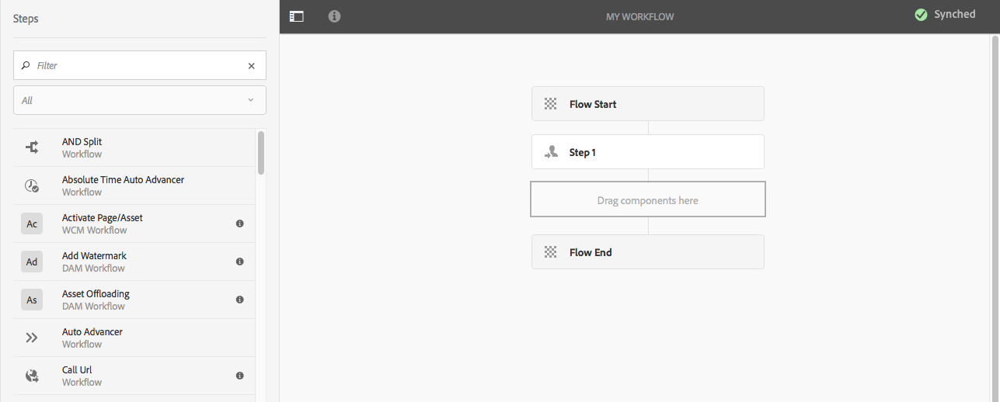

# Creazione di modelli di flussi di lavoro{#creating-workflow-models}

>[!CAUTION]
>
>Per informazioni sull&#39;utilizzo dell&#39;interfaccia classica, consultare la [documentazione di AEM 6.3](https://helpx.adobe.com/it/experience-manager/6-3/help/sites-developing/workflows-models.html).

È possibile creare un [modello di flusso di lavoro](/help/sites-developing/workflows.md#model) per definire la serie di passaggi eseguiti all&#39;avvio del flusso di lavoro da parte di un utente. Puoi anche definire le proprietà del modello, ad esempio se il flusso di lavoro è transitorio o utilizza più risorse.

Quando un utente avvia un flusso di lavoro, viene avviata un&#39;istanza; si tratta del modello di runtime corrispondente, creato quando [Sincronizza](#sync-your-workflow-generate-a-runtime-model) le modifiche.

## Creazione di un nuovo flusso di lavoro {#creating-a-new-workflow}

La prima volta che crei un modello di flusso di lavoro, contiene:

* Passaggi: **Inizio flusso** e **Fine flusso**.
Questi rappresentano l’inizio e la fine del flusso di lavoro. Questi passaggi sono necessari e non possono essere modificati/rimossi.
* Un passaggio **Partecipante** di esempio denominato **Passaggio 1**.
Questo passaggio è configurato per assegnare un elemento di lavoro all&#39;iniziatore del flusso di lavoro. Modifica o elimina questo passaggio e aggiungi i passaggi richiesti.

Per creare un flusso di lavoro con l’editor:

1. Apri la console **Modelli flusso di lavoro** tramite **Strumenti**, **Flusso di lavoro**, **Modelli** o, ad esempio: [https://localhost:4502/aem/workflow](https://localhost:4502/aem/workflow)
1. Seleziona **Crea**, quindi **Crea modello**.
1. Viene visualizzata la finestra di dialogo **Aggiungi modello flusso di lavoro**. Immetti **Titolo** e **Nome** (facoltativo) prima di selezionare **Fine**.
1. Il nuovo modello è elencato nella console **Modelli flusso di lavoro**.
1. Seleziona il nuovo flusso di lavoro, quindi utilizza [**Modifica** per aprirlo per la configurazione](#editinganexistingworkflow):
   

>[!NOTE]
>
>Se crei modelli a livello di programmazione (utilizzando un pacchetto crx), puoi anche creare una sottocartella all’interno di:
>
>`/var/workflow/models`
>
>Ad esempio `/var/workflow/models/prototypes`
>
>Questa cartella può quindi essere utilizzata per [gestire l&#39;accesso ai modelli in tale cartella](/help/sites-administering/workflows-managing.md#create-a-subfolder-in-var-workflow-models-and-apply-the-acl-to-that).

## Modifica di un flusso di lavoro {#editing-a-workflow}

Puoi modificare qualsiasi modello di flusso di lavoro esistente in:

* [definisci i passaggi](#addingasteptoamodel-) e i relativi [parametri](#configuring-a-workflow-step)
* configura le proprietà del flusso di lavoro, tra cui [fasi](#configuring-workflow-stages-that-show-workflow-progress), [se il flusso di lavoro è transitorio](#creatingatransientworkflow-) e/o [utilizza più risorse](#configuring-a-workflow-for-multi-resource-support)

La modifica di un flusso di lavoro [**Predefinito e/o Legacy** (preconfigurato)](#editing-a-default-or-legacy-workflow-for-the-first-time) include un ulteriore passaggio per assicurarsi che venga eseguita una [copia sicura](/help/sites-developing/workflows-best-practices.md#locations-workflow-models) prima di apportare le modifiche.

Una volta completati gli aggiornamenti al flusso di lavoro, devi usare **Sync** per **Generare un modello di runtime**. Per informazioni, consulta [Sincronizzare il flusso di lavoro](#sync-your-workflow-generate-a-runtime-model).

### Sincronizzare il flusso di lavoro - Generare un modello di runtime {#sync-your-workflow-generate-a-runtime-model}

**Sync** (direttamente nella barra degli strumenti dell&#39;editor) genera un [modello runtime](/help/sites-developing/workflows.md#runtime-model). Il modello di runtime è il modello effettivamente utilizzato quando un utente avvia un flusso di lavoro. Se non **Sincronizza** le modifiche, queste non saranno disponibili in fase di esecuzione.

Quando apporti modifiche al flusso di lavoro (o qualsiasi altro utente), devi utilizzare **Sync** per generare un modello di runtime, anche quando le singole finestre di dialogo (ad esempio, i passaggi) hanno le proprie opzioni di salvataggio.

Quando le modifiche vengono sincronizzate con il modello di runtime (salvato), viene visualizzato **Synched**.

Alcuni passaggi dispongono di campi obbligatori e/o di una convalida incorporata. Se queste condizioni non sono soddisfatte, viene visualizzato un errore quando si tenta di **sincronizzare** il modello. Ad esempio, se non è stato definito alcun partecipante per un passaggio **Partecipante**:


### Modifica di un flusso di lavoro predefinito o legacy per la prima volta {#editing-a-default-or-legacy-workflow-for-the-first-time}

Quando apri un [modello predefinito e/o legacy](/help/sites-developing/workflows.md#workflow-types) per la modifica:

* Il browser Passaggi non è disponibile (lato sinistro).
* Nella barra degli strumenti (lato destro) è disponibile un&#39;azione **Modifica**.
* Inizialmente il modello e le relative proprietà vengono presentati in modalità di sola lettura come:
   * I flussi di lavoro predefiniti si trovano in `/libs`
   * I flussi di lavoro legacy si trovano in `/etc`
Se selezioni **Modifica**:
* copia del flusso di lavoro in `/conf`
* rendere disponibile il browser Passaggi
* consente di apportare modifiche

>[!NOTE]
>
>Per ulteriori informazioni, vedere [Percorsi dei modelli di flusso di lavoro](/help/sites-developing/workflows-best-practices.md#locations-workflow-models).


### Aggiunta di un passaggio a un modello {#adding-a-step-to-a-model}

Aggiungi i passaggi al modello per rappresentare l’attività da eseguire: ogni passaggio esegue un’attività specifica. Una selezione di componenti step è disponibile in un’istanza AEM standard.

Quando modifichi un modello, i passaggi disponibili vengono visualizzati nei vari gruppi del browser **Passaggi**. Ad esempio:


>[!NOTE]
>
>Per informazioni sui componenti del passaggio principale installati con AEM, vedere [Riferimento passaggi flusso di lavoro](/help/sites-developing/workflows-step-ref.md).

Per aggiungere passaggi al modello di flusso di lavoro:

1. Apri un modello di flusso di lavoro esistente per la modifica. Dalla console **Modello flussi di lavoro**, seleziona il modello richiesto, quindi **Modifica**.
1. Apri il browser Passaggi utilizzando **Attiva/Disattiva pannello laterale**, all&#39;estrema sinistra della barra degli strumenti superiore. È possibile:

   * **Filtro** per passaggi specifici.
   * Utilizza il selettore a discesa per limitare la selezione a un gruppo specifico di passaggi.
   * Selezionare l&#39;icona Mostra descrizione  per visualizzare ulteriori dettagli sul passaggio appropriato.

   

1. Trascinate i passi appropriati nella posizione desiderata nel modello.

   Ad esempio, un **Passaggio partecipante**.

   Una volta aggiunto al flusso, puoi [configurare il passaggio](#configuring-a-workflow-step).

   

1. Aggiungi tutti i passaggi, o altri aggiornamenti, necessari.

   In fase di esecuzione, i passi vengono eseguiti nell&#39;ordine in cui vengono visualizzati nel modello. Dopo aver aggiunto i componenti del passo, potete trascinarli in una posizione diversa nel modello.

   È inoltre possibile copiare, tagliare, incollare, raggruppare o eliminare i passaggi esistenti, come con l&#39;editor di pagine [.](/help/sites-authoring/editing-content.md)

   È inoltre possibile comprimere/espandere i passaggi di suddivisione utilizzando l&#39;opzione della barra degli strumenti: 

1. Conferma le modifiche con **Sync** (barra degli strumenti dell&#39;editor) per generare il modello di runtime.

   Per informazioni, consulta [Sincronizzare il flusso di lavoro](#sync-your-workflow-generate-a-runtime-model).

### Configurazione di un passaggio del flusso di lavoro {#configuring-a-workflow-step}

Puoi **Configurare** e personalizzare il comportamento di un passaggio del flusso di lavoro utilizzando le finestre di dialogo **Proprietà passaggio**.

1. Per aprire la finestra di dialogo **Proprietà passaggio** per un passaggio:

   * Fai clic sul passaggio* *nel modello di flusso di lavoro e seleziona **Configura** dalla barra degli strumenti del componente.

   * Fare doppio clic sul passaggio.

   >[!NOTE]
   >
   >Per informazioni sui componenti del passaggio principale installati con AEM, vedere [Riferimento passaggi flusso di lavoro](/help/sites-developing/workflows-step-ref.md).

1. Configura il **passaggio Proprietà** come richiesto; le proprietà disponibili dipendono dal tipo di passaggio; potrebbero anche essere disponibili diverse schede. Ad esempio, il **Passaggio partecipante** predefinito, presente in un nuovo flusso di lavoro come `Step 1`:

   

1. Conferma gli aggiornamenti selezionando.
1. Conferma le modifiche con **Sync** (barra degli strumenti dell&#39;editor) per generare il modello di runtime.

   Per informazioni, consulta [Sincronizzare il flusso di lavoro](#sync-your-workflow-generate-a-runtime-model).

### Creazione di un flusso di lavoro transitorio {#creating-a-transient-workflow}

Puoi creare un modello di flusso di lavoro [Transitorio](/help/sites-developing/workflows.md#transient-workflows) durante la creazione di un modello o modificandone uno esistente:

1. Apri il modello di flusso di lavoro per [modifica](#editinganexistingworkflow).
1. Seleziona **Proprietà modello flusso di lavoro** nella barra degli strumenti.
1. Nella finestra di dialogo attiva **Flusso di lavoro transitorio** (o disattiva se necessario):

   

1. Conferma la modifica con **Salva e chiudi**; seguito da **Sincronizza** (barra degli strumenti dell&#39;editor) per generare il modello di runtime.

   Per informazioni, consulta [Sincronizzare il flusso di lavoro](#sync-your-workflow-generate-a-runtime-model).

>[!NOTE]
>
>AEM Quando si esegue un flusso di lavoro in modalità [transitoria](/help/sites-developing/workflows.md#transient-workflows), la cronologia del flusso di lavoro non viene memorizzata. Pertanto, [Timeline](/help/sites-authoring/basic-handling.md#timeline) non visualizza alcuna informazione relativa a tale flusso di lavoro.

## Rendere disponibili i modelli di flusso di lavoro nell’interfaccia utente touch {#classic2touchui}

Se un modello di flusso di lavoro è presente nell&#39;interfaccia classica ma manca nel menu a comparsa di selezione nella barra **[!UICONTROL Timeline]** dell&#39;interfaccia utente touch, segui la configurazione per renderlo disponibile. Nei passaggi seguenti viene illustrato l&#39;utilizzo del modello di flusso di lavoro denominato **[!UICONTROL Richiesta di attivazione]**.

1. Verifica che il modello non sia disponibile nell’interfaccia utente touch. Accedere a una risorsa utilizzando il percorso `/assets.html/content/dam`. Seleziona una risorsa. Apri **[!UICONTROL Timeline]** nella barra a sinistra. Fai clic su **[!UICONTROL Avvia flusso di lavoro]** e verifica che il modello **[!UICONTROL Request for Activation]** non sia presente nell&#39;elenco a comparsa.

1. Passa a **[!UICONTROL Strumenti > Generale > Assegnazione tag]**. Seleziona **[!UICONTROL Flusso di lavoro]**.

1. Selezionare **[!UICONTROL Crea > Crea tag]**. Imposta **[!UICONTROL Titolo]** come `DAM` e **[!UICONTROL Nome]** come `dam`. Seleziona **[!UICONTROL Invia]**.
   

1. Passa a **[!UICONTROL Strumenti > Flusso di lavoro > Modelli]**. Seleziona **[!UICONTROL Richiesta di attivazione]**, quindi seleziona **[!UICONTROL Modifica]**.

1. Seleziona **[!UICONTROL Modifica]**, apri il menu **[!UICONTROL Informazioni pagina]**, quindi seleziona **[!UICONTROL Apri proprietà]** e passa alla scheda **[!UICONTROL Base]** (se non è già aperta).

1. Aggiungi `Workflow : DAM` al campo **[!UICONTROL Tag]**. Conferma la selezione selezionando (segno di spunta).

1. Conferma l&#39;aggiunta del tag con **[!UICONTROL Salva e chiudi]**.
   

1. Completa il processo con **[!UICONTROL Sync]**. Il flusso di lavoro è ora disponibile nell’interfaccia utente touch.

### Configurazione di un flusso di lavoro per il supporto di più risorse {#configuring-a-workflow-for-multi-resource-support}

È possibile configurare un modello di flusso di lavoro per [Supporto risorse multiple](/help/sites-developing/workflows.md#multi-resource-support) durante la creazione di un modello o modificandone uno esistente:

1. Apri il modello di flusso di lavoro per [modifica](#editinganexistingworkflow).
1. Seleziona **Proprietà modello flusso di lavoro** nella barra degli strumenti.

1. Nella finestra di dialogo attiva **Supporto risorse multiple** (o disattiva se necessario):

   

1. Conferma la modifica con **Salva e chiudi**; seguito da **Sincronizza** (barra degli strumenti dell&#39;editor) per generare il modello di runtime.

   Per informazioni, consulta [Sincronizzare il flusso di lavoro](#sync-your-workflow-generate-a-runtime-model).

### Configurazione delle fasi del flusso di lavoro (che mostrano l’avanzamento del flusso di lavoro) {#configuring-workflow-stages-that-show-workflow-progress}

[Le fasi del flusso di lavoro](/help/sites-developing/workflows.md#workflow-stages) consentono di visualizzare l&#39;avanzamento di un flusso di lavoro durante la gestione delle attività.

>[!CAUTION]
>
>Se le fasi del flusso di lavoro sono definite in **Proprietà pagina**, ma non vengono utilizzate per alcun passaggio del flusso di lavoro, la barra di avanzamento non mostrerà alcun avanzamento (indipendentemente dal passaggio del flusso di lavoro corrente).

Le fasi da rendere disponibili sono definite nei modelli di flusso di lavoro; i modelli di flusso di lavoro esistenti possono essere aggiornati per includere le definizioni delle fasi. È possibile definire un numero qualsiasi di fasi per il modello di flusso di lavoro.

Per definire **Stadi** per il flusso di lavoro:

1. Apri il modello di flusso di lavoro per la modifica.
1. Seleziona **Proprietà modello flusso di lavoro** nella barra degli strumenti. Quindi apri la scheda **Stadi**.
1. Aggiungi (e posiziona) le **fasi** richieste. È possibile definire un numero qualsiasi di fasi per il modello di flusso di lavoro.

   Ad esempio:

   

1. Fai clic su **Salva e chiudi** per salvare le proprietà.
1. Assegna una fase a ciascuno dei passaggi nel modello di flusso di lavoro. Ad esempio:

   

   È possibile assegnare una fase a più fasi. Ad esempio:

   | **Passaggio** | **Fase** |
   |---|---|
   | Passaggio 1 | Creare |
   | Passaggio 2 | Creare |
   | Passaggio 3 | Rivedi |
   | Passaggio 4 | Approva |
   | Passaggio 5 | Approva |
   | Passaggio 6 | Completato |

1. Conferma le modifiche con **Sync** (barra degli strumenti dell&#39;editor) per generare il modello di runtime.

   Per informazioni, consulta [Sincronizzare il flusso di lavoro](#sync-your-workflow-generate-a-runtime-model).

## Esportazione di un modello di flusso di lavoro in un pacchetto {#exporting-a-workflow-model-in-a-package}

Per esportare un modello di flusso di lavoro in un pacchetto:

1. Creare un pacchetto utilizzando [Gestione pacchetti](/help/sites-administering/package-manager.md#package-manager):

   1. Passare a Gestione pacchetti tramite **Strumenti**, **Distribuzione**, **Pacchetti**.

   1. Fare clic su **Crea pacchetto**.
   1. Specificare il **Nome pacchetto** ed eventuali altri dettagli.
   1. Fai clic su **OK**.

1. Fai clic su **Modifica** nella barra degli strumenti del nuovo pacchetto.

1. Apri la scheda **Filtri**.

1. Seleziona **Aggiungi filtro** e specifica il percorso del modello di flusso di lavoro *progettazione*:

   `/conf/global/settings/workflow/models/<*your-model-name*>`

   Fai clic su **Fine**.

1. Seleziona **Aggiungi filtro** e specifica il percorso del modello di flusso di lavoro *runtime*:

   `/var/workflow/models/<*your-model-name*>`

   Fai clic su **Fine**.

1. Aggiungi altri filtri per gli script personalizzati utilizzati dal modello.
1. Fai clic su **Salva** per confermare le definizioni dei filtri.
1. Seleziona **Build** dalla barra degli strumenti della definizione del pacchetto.
1. Seleziona **Scarica** dalla barra degli strumenti del pacchetto.

## Utilizzo dei flussi di lavoro per elaborare gli invii dei moduli {#using-workflows-to-process-form-submissions}

È possibile configurare un modulo da elaborare tramite il flusso di lavoro selezionato. Quando gli utenti inviano il modulo, viene creata una nuova istanza di flusso di lavoro con i dati dell’invio del modulo come payload.

Per configurare il flusso di lavoro da utilizzare con il modulo:

1. Crea una pagina e aprila per la modifica.
1. Aggiungi un componente **Modulo** alla pagina.
1. **Configura** il componente **Inizio modulo** visualizzato nella pagina.
1. Utilizza **Avvia flusso di lavoro** per selezionare il flusso di lavoro desiderato tra quelli disponibili:

   

1. Conferma la nuova configurazione del modulo selezionando.

## Verifica dei flussi di lavoro {#testing-workflows}

È buona prassi quando si esegue il test di un flusso di lavoro per utilizzare diversi tipi di payload, inclusi quelli diversi da quello per cui è stato sviluppato. Ad esempio, se desideri che il flusso di lavoro gestisca Assets, testa impostando una pagina come payload e assicurati che non generi errori.

Ad esempio, prova il nuovo flusso di lavoro come segue:

1. [Avvia il modello di flusso di lavoro](/help/sites-administering/workflows-starting.md) dalla console.
1. Definisci il **Payload** e conferma.

1. Intraprende le azioni necessarie in modo che il flusso di lavoro proceda.
1. Monitora i file di registro durante l’esecuzione del flusso di lavoro.

È inoltre possibile configurare AEM per visualizzare **DEBUG** messaggi nei file di registro. Consulta [Registrazione](/help/sites-deploying/configure-logging.md) per ulteriori informazioni e al termine dello sviluppo, imposta di nuovo **Livello registro** su **Informazioni**.

## Esempi {#examples}

### Esempio: creazione di un flusso di lavoro (semplice) per accettare o rifiutare una richiesta di pubblicazione {#example-creating-a-simple-workflow-to-accept-or-reject-a-request-for-publication}

Per illustrare alcune delle possibilità di creazione di un flusso di lavoro, nell&#39;esempio seguente viene creata una variante del flusso di lavoro `Publish Example`.

1. [Crea un modello di flusso di lavoro](#creating-a-new-workflow).

   Il nuovo flusso di lavoro conterrà:

   * **Inizio flusso**
   * `Step 1`
   * **Fine flusso**

1. Elimina `Step 1` (in quanto è il tipo di passaggio errato per questo esempio):

   * Fai clic sul passaggio e seleziona **Elimina** dalla barra degli strumenti del componente. Conferma l’azione.

1. Dalla selezione **Workflow** del browser dei passaggi, trascina un **Passaggio partecipante** nel flusso di lavoro e posizionalo tra **Inizio flusso** e **Fine flusso**.
1. Per aprire la finestra di dialogo delle proprietà:

   * Fai clic sul passaggio partecipante e seleziona **Configura** dalla barra degli strumenti del componente.
   * Fare doppio clic sul passaggio partecipante.

1. Nella scheda **Comune** immettere `Validate Content` sia per **Titolo** che per **Descrizione**.
1. Apri la scheda **Utente/Gruppo**:

   * Attiva **Notifica all&#39;utente tramite e-mail**.
   * Selezionare `Administrator` ( `admin`) per il campo **Utente/Gruppo**.

   >[!NOTE]
   >
   >Per inviare le e-mail, [è necessario configurare il servizio di posta e i dettagli dell&#39;account utente](/help/sites-administering/notification.md).

1. Conferma gli aggiornamenti selezionando.

   Tornerai alla panoramica del modello di flusso di lavoro. Il passaggio partecipante sarà stato rinominato `Validate Content`.

1. Trascina un **o una divisione** nel flusso di lavoro e posizionalo tra `Validate Content` e **Fine flusso**.
1. Apri **Or Split** per la configurazione.
1. Configurare:

   * **Comune**: specifica il nome della divisione.
   * **Ramo 1**: selezionare **Percorso predefinito**.

   * **Ramo 2**: verificare che **Route predefinita** non sia selezionata.

1. Conferma gli aggiornamenti alla **Divisione OR**.
1. Trascina un **Passaggio partecipante** nel ramo sinistro, apri le proprietà, specifica i valori seguenti, quindi conferma le modifiche:

   * **Titolo**: `Reject Publish Request`

   * **Utente/Gruppo**: ad esempio, `projects-administrators`

   * **Notifica all&#39;utente tramite e-mail**: attiva questa opzione per ricevere una notifica tramite e-mail.

1. Trascina un **Passaggio processo** nel ramo destro, apri le proprietà, specifica i seguenti valori, quindi conferma le modifiche:

   * **Titolo**: `Publish Page as Requested`

   * **Processo**: selezionare `Activate Page`. Questo processo pubblica la pagina selezionata nelle istanze dell’editore.

1. Fai clic su **Sincronizza** (barra degli strumenti dell&#39;editor) per generare il modello di runtime.

   Per informazioni, consulta [Sincronizzare il flusso di lavoro](#sync-your-workflow-generate-a-runtime-model).

   Il nuovo modello di flusso di lavoro sarà simile al seguente:

   

1. Applica questo flusso di lavoro alla pagina, in modo che quando l&#39;utente passa a **Completa** il passaggio **Convalida contenuto**, possa scegliere se desidera **Publish Page come richiesto** o **Rifiuta richiesta Publish**.

   

### Esempio: definizione di una regola per una suddivisione OR utilizzando lo script ECMA {#defineruleecmascript}

I passaggi **OR Split** ti consentono di introdurre nel flusso di lavoro i percorsi di elaborazione condizionale.

Per definire una regola OR, procedere come segue:

1. Crea due script e salvali nell’archivio, ad esempio, in:

   `/apps/myapp/workflow/scripts`

   >[!NOTE]
   >
   >Gli script devono avere una funzione [ `check()`](#function-check) che restituisce un valore booleano.

1. Modifica il flusso di lavoro e aggiungi **OR Split** al modello.
1. Modifica le proprietà del **ramo 1** della **divisione OR**:

   * Definisci come **Route predefinita** impostando **Valore** su `true`.

   * Imposta il percorso dello script come **Regola**. Ad esempio:

     `/apps/myapp/workflow/scripts/myscript1.ecma`

   >[!NOTE]
   >
   >Se necessario, puoi cambiare l’ordine della filiale.

1. Modifica le proprietà del **ramo 2** della **divisione OR**.

   * Imposta il percorso dell&#39;altro script come **Regola**. Ad esempio:

     `/apps/myapp/workflow/scripts/myscript2.ecma`

1. Imposta le proprietà dei singoli passaggi in ciascun ramo. Verificare che l&#39;**utente/gruppo** sia impostato.
1. Fai clic su **Sincronizza** (barra degli strumenti dell&#39;editor) per confermare le modifiche apportate al modello di runtime.

   Per informazioni, consulta [Sincronizzare il flusso di lavoro](#sync-your-workflow-generate-a-runtime-model).

#### Function Check() {#function-check}

>[!NOTE]
>
>Vedere [Utilizzo di ECMAScript](/help/sites-developing/workflows-customizing-extending.md#using-ecmascript).

Il seguente script di esempio restituisce `true` se il nodo è un `JCR_PATH` che si trova in `/content/we-retail/us/en`:

```
function check() {
    if (workflowData.getPayloadType() == "JCR_PATH") {
      var path = workflowData.getPayload().toString();
      var node = jcrSession.getItem(path);

      if (node.getPath().indexOf("/content/we-retail/us/en") >= 0) {
       return true;
      } else {
       return false;
      }
     } else {
      return false;
     }
}
```

### Esempio: richiesta di attivazione personalizzata {#example-customized-request-for-activation}

Puoi personalizzare qualsiasi flusso di lavoro predefinito. Per ottenere un comportamento personalizzato, puoi sovrapporre i dettagli del flusso di lavoro appropriato.

**Richiesta di attivazione**. Questo flusso di lavoro viene utilizzato per la pubblicazione di pagine in **Sites** e viene attivato automaticamente quando un autore di contenuti non dispone dei diritti di replica appropriati. Per ulteriori dettagli, vedi [Personalizzazione dell&#39;authoring delle pagine - Personalizzazione della richiesta per il flusso di lavoro di attivazione](/help/sites-developing/customizing-page-authoring-touch.md#customizing-the-request-for-activation-workflow).
