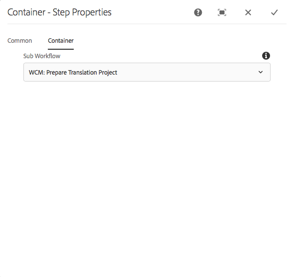
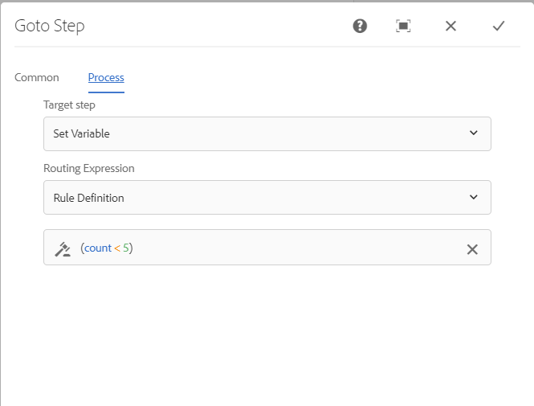

# Guida di riferimento per i passaggi dei flussi di lavoro {#workflow-step-reference}

I modelli di flusso di lavoro sono costituiti da una serie di passaggi di vari tipi. A seconda del tipo, questi passaggi possono essere configurati ed estesi con parametri e script per fornire le funzionalità e il controllo necessari.

>[!NOTE]
>
>Questa sezione descrive i passaggi standard del flusso di lavoro.
>
>Per i passaggi specifici dei moduli, vedi quanto segue:
>
>* [Riferimento passaggio flusso di lavoro di AEM Forms](/help/forms/using/aem-forms-workflow-step-reference.md)
>* [Elaborazione delle risorse tramite gestori di contenuti multimediali e flussi di lavoro](/help/assets/media-handlers.md)
>

## Proprietà passaggio {#step-properties}

Ogni componente del passaggio ha una **Proprietà passaggio** che consente di definire e modificare le proprietà richieste.

### Proprietà passaggio: scheda Comune {#step-properties-common-tab}

Per la maggior parte dei componenti del passaggio del flusso di lavoro, nella sezione **Comune** scheda della finestra di dialogo proprietà:

* **Titolo**
Titolo del passaggio.

* **Descrizione**
Descrizione del passaggio.

* **Fase flusso di lavoro**

  Un selettore a discesa per applicare una [Fase](/help/sites-developing/workflows.md#workflow-stages) al passaggio.

* **Timeout**

  Il periodo dopo il quale il passaggio &quot;scade&quot;.
Puoi scegliere tra: **Disattivato**, **Immediato**, **1 ora**, **6 ore**, **12 ore**, **24 ore**.

* **Gestore timeout**

  Gestore che controlla il flusso di lavoro quando il passaggio scade. Ad esempio `Auto Advancer`

* **Avanzamento gestore**

  Seleziona questa opzione per far avanzare automaticamente il flusso di lavoro al passaggio successivo dopo l’esecuzione. Se non viene selezionato, lo script di implementazione deve gestire l’avanzamento del flusso di lavoro.

### Proprietà passaggio: scheda Utente/gruppo {#step-properties-user-group-tab}

Le seguenti proprietà sono disponibili per molti componenti del passaggio del flusso di lavoro, nel **Utente/Gruppo** scheda della finestra di dialogo proprietà:

* **Notifica all&#39;utente via e-mail**

   * Puoi inviare una notifica ai partecipanti inviando loro un’e-mail quando il flusso di lavoro raggiunge il passaggio.
   * Se abilitata, viene inviata un’e-mail all’utente definito dalla proprietà **Utente/Gruppo** o a ciascun membro del gruppo, se è definito un gruppo.

* **Utente/Gruppo**

   * Una casella di selezione a discesa consente di individuare e selezionare un utente o un gruppo.
   * Se assegni il passaggio a un utente specifico, solo questo utente può agire sul passaggio.
   * Se assegni il passaggio a un intero gruppo, quando il flusso di lavoro raggiunge questo passaggio, tutti gli utenti di questo gruppo hanno l’azione nel loro **Casella in entrata flusso di lavoro**.
   * Consulta [Partecipazione ai flussi di lavoro](/help/sites-authoring/workflows-participating.md) per ulteriori informazioni.

## Suddivisione E {#and-split}

Il **Divisione AND** crea una suddivisione nel flusso di lavoro, dopo la quale entrambi i rami sono attivi. Puoi aggiungere i passaggi del flusso di lavoro a ogni ramo in base alle esigenze. Questo passaggio ti consente di introdurre più percorsi di elaborazione nel flusso di lavoro. Ad esempio, puoi consentire che determinati passaggi di revisione si verifichino in parallelo, risparmiando tempo.


### Suddivisione AND - Configurazione {#and-split-configuration}

Per configurare la suddivisione:

* Modifica il **Proprietà suddivisione E**:

   * **Nome suddivisione**: assegna un nome a scopo esplicativo
   * Selezionare il numero di filiali richieste: 2, 3, 4 o 5.

* Aggiungi i passaggi del flusso di lavoro ai rami in base alle esigenze.

  

## Passaggio contenitore {#container-step}

Un passaggio contenitore avvia un altro modello di flusso di lavoro che viene eseguito come flusso di lavoro figlio.

Questo contenitore può consentire di riutilizzare i modelli di flusso di lavoro per implementare sequenze di passaggi comuni. Ad esempio, un modello di flusso di lavoro di traduzione può essere utilizzato in più flussi di lavoro di modifica.



### Passaggio contenitore - Configurazione {#container-step-configuration}

Per configurare il passaggio, modifica e utilizza le seguenti schede:

* [Comune](#step-properties-common-tab)
* **Contenitore**

   * **Flusso di lavoro secondario**: seleziona il flusso di lavoro da avviare.

## Passaggio {#goto-step}

Il **Vai al passaggio** consente di specificare il passaggio successivo da eseguire nel modello di flusso di lavoro. È possibile specificare una definizione di regola, uno script esterno o uno script ECMA come espressione di indirizzamento per valutare il passaggio successivo per il modello di flusso di lavoro.

* Se la condizione specificata è vera, il valore **Vai al passaggio** viene completato e il motore del flusso di lavoro esegue il passaggio specificato.
* Se la condizione specificata non contiene true, il **Vai al passaggio** viene completato e la normale logica di routing determina il passaggio successivo da eseguire.

Il **Vai al passaggio** consente di implementare strutture di routing avanzate nei modelli di flusso di lavoro. Ad esempio, per implementare un ciclo, il **Vai al passaggio** può essere definito per eseguire un passaggio precedente nel flusso di lavoro, con l’espressione di indirizzamento che valuta una condizione di loop.

### Passaggio - Configurazione {#goto-step-configuration}

Per configurare il passaggio, modifica e utilizza le seguenti schede:

* [Comune](#step-properties-common-tab)
* **Processo**

   * **Passaggio di destinazione**: seleziona la fase da eseguire dopo aver valutato la condizione per l’espressione di indirizzamento.
   * **Espressione di indirizzamento**: seleziona Definizione regola, Script esterno o script ECMA che determina se eseguire o meno **Passaggio di destinazione**.

      * **Definizione regola:** Utilizza il [editor di espressioni](/help/forms/using/variable-in-aem-workflows.md#use-expression-editor) per definire la regola.
      * **Script esterno:** Percorso dello script esterno.
      * **Script ECMA**: script che determina se eseguire il **Vai al passaggio**.

#### Simulazione di un ciclo for {#simulating-a-for-loop}

La simulazione di un ciclo &quot;for&quot; richiede di mantenere un conteggio del numero di iterazioni del ciclo che si sono verificate:

* Il conteggio rappresenta in genere un indice degli elementi sui quali viene eseguita un’azione nel flusso di lavoro.
* Il conteggio viene valutato come il criterio di uscita del ciclo.

Ad esempio, per implementare un flusso di lavoro che esegue un’azione su più nodi JCR, puoi utilizzare un contatore di loop come indice per i nodi. Per mantenere il conteggio, memorizza un `integer` nella mappa dati dell’istanza del flusso di lavoro. Per incrementare il conteggio e confrontarlo con i criteri di uscita, utilizza lo script del **Vai al passaggio**.

```
function check(){
   var count=0;
   var keyname="loopcount"
   try{
      if (workflowData.getMetaDataMap().containsKey(keyname)){
        log.info("goto script: found loopcount key");
        count= parseInt(workflowData.getMetaDataMap().get(keyname))+1;
      }

     workflowData.getMetaDataMap().put(keyname,count);

     }catch(err) {
         log.info(err.message);
         return false;
    }
   if (parseInt(count) <7){
       return true;
   } else {
      return false;
   }
}
```

### Simulazione di un ciclo for tramite la definizione della regola {#simulateforloop}

Potete anche simulare un ciclo for utilizzando Definizione regola (Rule Definition) come espressione di instradamento. [Creare un **count** variabile](/help/forms/using/variable-in-aem-workflows.md#create-a-variable) del tipo di dati Long. Utilizzare **Espressione** come modalità di mappatura in **[Imposta variabile](/help/sites-developing/using-variables-in-aem-workflows.md#set-a-variable)** passaggio per impostare il valore del **count** variabile a **count + 1** a ogni esecuzione del **Imposta variabile** passaggio.


In **Vai al passaggio**, utilizza **Imposta variabile** come **Passaggio di destinazione** e **count &lt; 5** come espressione di indirizzamento.



Il **Imposta variabile** viene eseguito ripetutamente, incrementando il valore di **count** variabile di 1 a ogni esecuzione fino a quando il valore raggiunge 5.

## Suddivisione O {#or-split}

Il **Suddivisione O** crea una suddivisione nel flusso di lavoro, dopo la quale è attivo un solo ramo. Questo passaggio ti consente di introdurre nel flusso di lavoro i percorsi di elaborazione condizionale. Puoi aggiungere i passaggi del flusso di lavoro a ogni ramo in base alle esigenze.

>[!NOTE]
>
>Consulta [O Dividi passaggio](https://experienceleague.adobe.com/docs/experience-manager-65/developing/extending-aem/extending-workflows/using-variables-in-aem-workflows.html?lang=en#use-a-variable)


### Suddivisione OR - Configurazione {#or-split-configuration}

Per configurare la suddivisione:

* Modifica il **Proprietà suddivisione O**:

   * **Comune**

      * Specifica il nome della divisione.

   * **Rami (*x)***

      * **Aggiungi ramo:** Aggiungi altri rami al passaggio.
      * **Seleziona espressione di indirizzamento**: per valutare il ramo attivo, seleziona l’espressione di indirizzamento. I valori possibili includono: Definizione regola, Script esterno e script ECMA.
      * **Fai clic per aggiungere un’espressione**: se selezioni, aggiungi un’espressione per valutare il ramo attivo **Definizione regola** come espressione di indirizzamento.
      * **Percorso script**: percorso di un file contenente lo script per valutare il ramo attivo, se selezioni **Script esterno** come espressione di indirizzamento.
      * **Script**: aggiungi lo script nella casella per valutare il ramo attivo, se selezioni **Script ECMA** come espressione di indirizzamento.
      * **Percorso predefinito**: se sono presenti più rami, viene seguito il ramo predefinito. Per impostazione predefinita, è possibile specificare un solo ramo.

  >[!NOTE]
  >
  >    * Un ramo viene valutato alla volta in base all’espressione di indirizzamento.
  >    * I rami vengono valutati dall’alto verso il basso.
  >    * Viene eseguito il primo script che restituisce true.
  >    * Se nessun ramo restituisce true, il flusso di lavoro non avanza.
  >
  >

  >[!NOTE]
  >
  >Consulta [Definizione di una regola per una suddivisione OR](/help/sites-developing/workflows-models.md#defineruleecmascript).

* Aggiungi i passaggi del flusso di lavoro ai rami in base alle esigenze.

## Passaggi e selettori partecipanti {#participant-steps-and-choosers}

### Passaggio partecipante {#participant-step}

A **Passaggio partecipante** consente di assegnare la proprietà di una particolare azione. Il flusso di lavoro procede solo quando l’utente ha riconosciuto manualmente il passaggio. Questo flusso di lavoro viene utilizzato quando si desidera che un utente lo utilizzi. Ad esempio, un passaggio di revisione.

Anche se non direttamente correlata, l’autorizzazione dell’utente deve essere considerata durante l’assegnazione di un’azione; l’utente deve avere accesso alla pagina che è il payload del flusso di lavoro.

#### Passaggio partecipante - Configurazione {#participant-step-configuration}

Per configurare il passaggio, modifica e utilizza le seguenti schede:

* [Comune](#step-properties-common-tab)
* [Utente/Gruppo](#step-properties-user-group-tab)

>[!NOTE]
>
>L’iniziatore del flusso di lavoro viene sempre informato quando:
>
>* Il flusso di lavoro è stato completato (completato).
>* Il flusso di lavoro viene interrotto.
>

>[!NOTE]
>
>Alcune proprietà devono essere configurate per abilitare le notifiche e-mail. Puoi anche personalizzare il modello e-mail o aggiungere un modello e-mail per una nuova lingua. Per configurare le notifiche e-mail in AEM, consulta [Configurazione delle notifiche e-mail](/help/sites-administering/notification.md#configuringemailnotification).

### Passaggio partecipante finestra di dialogo {#dialog-participant-step}

Utilizza un **Passaggio partecipante finestra di dialogo** per raccogliere informazioni dall&#39;utente a cui è assegnato l&#39;elemento di lavoro. Questo passaggio è utile per raccogliere piccole quantità di dati da utilizzare successivamente nel flusso di lavoro.

Al termine del passaggio, il **Completa elemento di lavoro** contiene i campi definiti nella finestra di dialogo. I dati raccolti nei campi vengono memorizzati nei nodi del payload del flusso di lavoro. I passaggi successivi del flusso di lavoro possono quindi leggere il valore dall’archivio.

Per configurare il passaggio, specificare il gruppo o l&#39;utente a cui assegnare l&#39;elemento di lavoro e il percorso della finestra di dialogo.

#### Passaggio partecipante finestra di dialogo - Configurazione {#dialog-participant-step-configuration}

Per configurare il passaggio, modifica e utilizza le seguenti schede:

* [Comune](#step-properties-common-tab)
* [Utente/Gruppo](#step-properties-user-group-tab)
* **Finestra di dialogo**

   * **Percorso finestra di dialogo**: percorso del nodo della finestra di dialogo [finestra di dialogo creata](#dialog-participant-step-creating-a-dialog).

#### Passaggio partecipante finestra di dialogo - Creazione di una finestra di dialogo {#dialog-participant-step-creating-a-dialog}

Per creare una finestra di dialogo, è necessario creare la finestra di dialogo:

* Decidere dove si trovano i dati risultanti [memorizzato nel payload](#dialog-participant-step-storing-data-in-the-payload).
* [Definire la finestra di dialogo; include la definizione dei campi utilizzati per raccogliere e salvare i dati](#dialog-participant-step-dialog-definition).

#### Passaggio partecipante finestra di dialogo - Memorizzazione dei dati nel payload {#dialog-participant-step-storing-data-in-the-payload}

Puoi memorizzare i dati del widget nel payload del flusso di lavoro o nei metadati dell’elemento di lavoro. Il formato del `name` proprietà del nodo del widget determina dove vengono memorizzati i dati.

* **Memorizza dati con il payload**

   * Per memorizzare i dati del widget come proprietà del payload del flusso di lavoro, utilizzate il seguente formato per il valore della proprietà name del nodo del widget:
     `./jcr:content/nodename`

   * I dati vengono memorizzati nel `nodename` del nodo payload. Se il nodo non contiene tale proprietà, la proprietà viene creata.
   * Quando viene memorizzato con il payload, gli utilizzi successivi della finestra di dialogo con lo stesso payload sovrascrivono il valore della proprietà.

* **Memorizza dati con l’elemento di lavoro**

   * Per memorizzare i dati del widget come proprietà dei metadati dell&#39;elemento di lavoro, utilizzate il seguente formato per il valore della proprietà name:
     `nodename`

   * I dati vengono memorizzati nel `nodename` proprietà dell&#39;elemento di lavoro `metadata`. I dati vengono conservati se la finestra di dialogo viene successivamente utilizzata con lo stesso payload.

#### Passaggio partecipante finestra di dialogo - Definizione finestra di dialogo {#dialog-participant-step-dialog-definition}

1. **Struttura della finestra di dialogo**

   Le finestre di dialogo per i passaggi dei partecipanti alle finestre di dialogo sono simili alle finestre di dialogo create per la creazione dei componenti. Sono memorizzate in:

   `/apps/myapp/workflow/dialogs`

   Le finestre di dialogo per l’interfaccia utente standard touch hanno la seguente struttura di nodi:

   ```xml
   newComponent (cq:Component)
     |- cq:dialog (nt:unstructured)
       |- content
         |- layout
           |- items
             |- column
               |- items
                 |- component0
                 |- component1
                 |- ...
   ```

   >[!NOTE]
   >
   >Consulta [Creazione e configurazione di una finestra di dialogo](/help/sites-developing/developing-components.md#creating-and-configuring-a-dialog).

1. **Proprietà percorso finestra di dialogo**

   Il **Passaggio partecipante finestra di dialogo** ha **Percorso finestra di dialogo** proprietà (insieme alle proprietà di un [Passaggio partecipante](#participant-step)). Il valore della proprietà **Percorso finestra di dialogo** è il percorso del file `dialog` della finestra di dialogo.

   Ad esempio, la finestra di dialogo è contenuta in un componente denominato `EmailWatch` memorizzato nel nodo:

   `/apps/myapp/workflows/dialogs`

   Per l’interfaccia touch, per l’interfaccia utente viene utilizzato il seguente valore **Percorso finestra di dialogo** proprietà:

   `/apps/myapp/workflow/dialogs/EmailWatch/cq:dialog`

   

1. **Esempio di definizione della finestra di dialogo**

   Il seguente frammento di codice XML rappresenta una finestra di dialogo in cui è memorizzato un `String` valore in `watchEmail` del contenuto del payload. Il nodo titolo rappresenta [CampoTesto](https://developer.adobe.com/experience-manager/reference-materials/6-5/granite-ui/api/jcr_root/libs/granite/ui/components/coral/foundation/form/textfield/index.html) componente:

   ```xml
   jcr:primaryType="nt:unstructured"
       jcr:title="Watcher Email Address Dialog"
       sling:resourceType="cq/gui/components/authoring/dialog">
       <content jcr:primaryType="nt:unstructured"
           sling:resourceType="granite/ui/components/foundation/container">
           <layout jcr:primaryType="nt:unstructured"
               margin="false"
               sling:resourceType="granite/ui/components/foundation/layouts/fixedcolumns"
           />
           <items jcr:primaryType="nt:unstructured">
               <column jcr:primaryType="nt:unstructured"
                   sling:resourceType="granite/ui/components/foundation/container">
                   <items jcr:primaryType="nt:unstructured">
                       <title jcr:primaryType="nt:unstructured"
                           fieldLabel="Notification Email Address"
                           name="./jcr:content/watchEmails"
                           sling:resourceType="granite/ui/components/foundation/form/textfield"
                       />
                   </items>
               </column>
           </items>
       </content>
   </cq:dialog>
   ```

   Nell’interfaccia touch, questo esempio genera una finestra di dialogo come la seguente:

   

### Passaggio partecipante dinamico {#dynamic-participant-step}

Il **Passaggio partecipante dinamico** il componente è simile a **[Passaggio partecipante](#participant-step)** con la differenza che il partecipante viene selezionato automaticamente in fase di runtime.

Per configurare il passaggio, seleziona una **Selettore partecipanti** che identifica il partecipante a cui assegnare l’elemento di lavoro, insieme a una finestra di dialogo.

#### Passaggio partecipante dinamico - Configurazione {#dynamic-participant-step-configuration}

Per configurare il passaggio, modifica e utilizza le seguenti schede:

* [Comune](#step-properties-common-tab)
* **Selettore partecipanti**

   * **Selettore partecipanti**: nome del [selettore partecipanti creato](#developingtheparticipantchooser).
   * **Argomenti**: eventuali argomenti obbligatori.
   * **E-mail**: indica se una notifica e-mail deve essere inviata all’utente.

* **Finestra di dialogo**

   * **Percorso finestra di dialogo**: percorso del nodo della finestra di dialogo [finestra di dialogo creata (come con **Passaggio partecipante finestra di dialogo**)](#dialog-participant-step-creating-a-dialog).

#### Passaggio partecipante dinamico: sviluppo del selettore partecipanti {#dynamic-participant-step-developing-the-participant-chooser}

Puoi creare il selettore partecipanti. Pertanto, puoi utilizzare qualsiasi logica o criterio di selezione. Ad esempio, il selettore partecipanti può selezionare l&#39;utente (all&#39;interno di un gruppo) con il minor numero di elementi di lavoro. Puoi creare un numero qualsiasi di selettori partecipanti da utilizzare con diverse istanze del **Passaggio partecipante dinamico** nei modelli di flusso di lavoro.

Crea un servizio OSGi o un ECMAScript che seleziona un utente a cui assegnare l’elemento di lavoro.

* **ECMAscript**

  Gli script devono includere una funzione denominata getParticipant che restituisce un ID utente come `String` valore. Memorizza gli script personalizzati, ad esempio, nel `/apps/myapp/workflow/scripts` cartella o una sottocartella.

  Uno script di esempio è incluso in un’istanza AEM standard:

  `/libs/workflow/scripts/initiator-participant-chooser.ecma`

  >[!CAUTION]
  >
  >Non modificare nulla nella `/libs` percorso.
  >
  >
  >Il motivo è che il contenuto di `/libs` viene sovrascritto al successivo aggiornamento dell’istanza (e può essere sovrascritto quando si applica un hotfix o un feature pack).

  Questo script seleziona l&#39;iniziatore del flusso di lavoro come partecipante:

  ```
  function getParticipant() {
      return workItem.getWorkflow().getInitiator();
  }
  ```

  >[!NOTE]
  >
  >Il **Selettore partecipante iniziatore flusso di lavoro** il componente estende **Passaggio partecipante dinamico** e utilizza questo script come implementazione del passaggio.

* **Servizio OSGi**

  I servizi devono implementare [com.day.cq.workflow.exec.ParticipantStepChooser](https://developer.adobe.com/experience-manager/reference-materials/6-5/javadoc/com/day/cq/workflow/exec/ParticipantStepChooser.html) di rete. L’interfaccia definisce i seguenti membri:

   * `SERVICE_PROPERTY_LABEL` campo: utilizzare questo campo per specificare il nome del selettore partecipanti. Il nome viene visualizzato in un elenco di selettori partecipanti disponibili nel **Passaggio partecipante dinamico** proprietà.

   * `getParticipant` metodo: restituisce l&#39;ID entità risolto dinamicamente come `String` valore.

  >[!CAUTION]
  >
  >Il `getParticipant` Il metodo restituisce l&#39;ID entità risolto dinamicamente. Può essere un ID gruppo o un ID utente.
  >
  >
  >Tuttavia, un ID gruppo può essere utilizzato solo per **Passaggio partecipante**, quando viene restituito un elenco di partecipanti. Per un **Passaggio partecipante dinamico**, viene restituito un elenco vuoto che non può essere utilizzato per la delega.

  Per rendere la tua implementazione disponibile per **Passaggio partecipante dinamico** componenti, aggiungi la classe Java™ a un bundle OSGi che esporta il servizio e distribuisci il bundle al server AEM.

  >[!NOTE]
  >
  >**Selettore casuale partecipanti** è un servizio di esempio che seleziona un utente casuale ( `com.day.cq.workflow.impl.process.RandomParticipantChooser`). Il **Selezione casuale partecipanti** Un esempio di componente in un passaggio estende **Passaggio partecipante dinamico** e utilizza questo servizio come implementazione del passaggio.

#### Passaggio partecipante dinamico - Esempio di servizio Selettore partecipanti {#dynamic-participant-step-example-participant-chooser-service}

La classe Java™ seguente implementa `ParticipantStepChooser` di rete. La classe restituisce il nome del partecipante che ha avviato il workflow. Il codice utilizza la stessa logica dello script di esempio (`initiator-participant-chooser.ecma`) utilizza.

Il `@Property` annotation imposta il valore di `SERVICE_PROPERTY_LABEL` campo a `Workflow Initiator Participant Chooser`.

```java
package com.adobe.example;

import org.apache.felix.scr.annotations.Component;
import org.apache.felix.scr.annotations.Properties;
import org.apache.felix.scr.annotations.Property;
import org.apache.felix.scr.annotations.Service;
import org.osgi.framework.Constants;
import org.slf4j.Logger;
import org.slf4j.LoggerFactory;

import com.adobe.granite.workflow.WorkflowException;
import com.adobe.granite.workflow.WorkflowSession;
import com.adobe.granite.workflow.exec.ParticipantStepChooser;
import com.adobe.granite.workflow.exec.WorkItem;
import com.adobe.granite.workflow.metadata.MetaDataMap;

@Component
@Service
@Properties({
        @Property(name = Constants.SERVICE_DESCRIPTION, value = "An example implementation of a dynamic participant chooser."),
        @Property(name = ParticipantStepChooser.SERVICE_PROPERTY_LABEL, value = "Workflow Initiator Participant Chooser (service)") })
public class InitiatorParticipantChooser implements ParticipantStepChooser {

 private Logger logger = LoggerFactory.getLogger(this.getClass());

 public String getParticipant(WorkItem arg0, WorkflowSession arg1,
   MetaDataMap arg2) throws WorkflowException {

  String initiator = arg0.getWorkflow().getInitiator();
  logger.info("Assigning Dynamic Participant Step work item to {}",initiator);

  return initiator;
 }
}
```

In **Passaggio partecipante dinamico** proprietà, la finestra di dialogo **Selettore partecipanti** l&#39;elenco include l&#39;elemento `Workflow Initiator Participant Chooser (script)`, che rappresenta questo servizio.

All&#39;avvio del modello di workflow, il log indica l&#39;ID dell&#39;utente che ha avviato il workflow e a cui è assegnato l&#39;elemento di lavoro. In questo esempio, la proprietà `admin` l&#39;utente ha avviato il flusso di lavoro.

`13.09.2015 15:48:53.037 *INFO* [10.176.129.223 [1347565733037] POST /etc/workflow/instances HTTP/1.1] com.adobe.example.InitiatorParticipantChooser Assigning Dynamic Participant Step work item to admin`

### Passaggio partecipante modulo {#form-participant-step}

Il **Passaggio partecipante modulo** visualizza un modulo all&#39;apertura dell&#39;elemento di lavoro. Quando l’utente compila e invia il modulo, i dati dei campi vengono memorizzati nei nodi del payload del flusso di lavoro.

Per configurare il passaggio, specificare il gruppo o l&#39;utente a cui assegnare l&#39;elemento di lavoro e il percorso del modulo.

>[!CAUTION]
>
>Questa sezione tratta della [Sezione Forms dei componenti di base per l’authoring delle pagine](/help/sites-authoring/default-components-foundation.md#form).

#### Passaggio partecipante modulo - Configurazione {#form-participant-step-configuration}

Per configurare il passaggio, modifica e utilizza le seguenti schede:

* [Comune](#step-properties-common-tab)
* [Utente/Gruppo](#step-properties-user-group-tab)
* **Modulo**

   * **Percorso modulo**: percorso di [modulo creato](#form-participant-step-creating-the-form).

#### Passaggio partecipante modulo: creazione del modulo {#form-participant-step-creating-the-form}

Creare un modulo da utilizzare con un **Passaggio partecipante modulo** come normale. Tuttavia, i moduli per un passaggio Partecipante modulo devono avere le seguenti configurazioni:

* Il **Inizio modulo** il componente deve avere **Tipo di azione** proprietà impostata su `Edit Workflow Controlled Resource(s)`.
* Il **Inizio modulo** il componente deve avere un valore per `Form Identifier` proprietà.
* I componenti del modulo devono avere **Nome elemento** impostata sul percorso del nodo in cui sono memorizzati i dati del campo. Il percorso deve individuare un nodo nel contenuto del payload del flusso di lavoro. Il valore utilizza il formato seguente:

  `./jcr:content/path_to_node`

* Il modulo deve includere **Pulsante invio flusso di lavoro** componente. Non puoi configurare alcuna proprietà del componente.

I requisiti del flusso di lavoro determinano la posizione in cui memorizzare i dati dei campi. Ad esempio, i dati dei campi possono essere utilizzati per configurare le proprietà del contenuto della pagina. Il seguente valore di un **Nome elemento** la proprietà memorizza i dati del campo come valore della proprietà `redirectTarget` proprietà del `jcr:content` nodo:

`./jcr:content/redirectTarget`

Nell&#39;esempio seguente, i dati del campo vengono utilizzati come contenuto di un **Testo** componente nella pagina payload:

`./jcr:content/par/text_3/text`

Il primo esempio può essere utilizzato per qualsiasi pagina che `cq:Page` rendering del componente. Il secondo esempio può essere utilizzato solo quando la pagina di payload include **Testo** componente con ID `text_3`.

Il modulo può trovarsi in qualsiasi punto del repository, tuttavia gli utenti del flusso di lavoro devono essere autorizzati a leggerlo.

### Selettore casuale partecipanti {#random-participant-chooser}

Il **Selettore casuale partecipanti** il passaggio è un selettore partecipanti che assegna l&#39;elemento di lavoro generato a un utente selezionato in modo casuale da un elenco.


#### Selettore casuale partecipanti - Configurazione {#random-participant-chooser-configuration}

Per configurare il passaggio, modifica e utilizza le seguenti schede:

* [Comune](#step-properties-common-tab)
* **Argomenti**

   * **Partecipanti**: specifica l&#39;elenco di utenti disponibili per la selezione. Per aggiungere un utente all&#39;elenco, fare clic su **Aggiungi elemento** e digita il percorso principale del nodo utente o l’ID utente. L’ordine degli utenti non influisce sulla probabilità che venga assegnato un elemento di lavoro.

### Selettore partecipante iniziatore flusso di lavoro {#workflow-initiator-participant-chooser}

Il **Selettore partecipante iniziatore flusso di lavoro** il passaggio è un selettore partecipanti che assegna l&#39;elemento di lavoro generato all&#39;utente che ha avviato il flusso di lavoro. Non sono disponibili proprietà da configurare diverse da **Comune** proprietà.

#### Selettore partecipante iniziatore flusso di lavoro - Configurazione {#workflow-initiator-participant-chooser-configuration}

Per configurare il passaggio, modifica utilizzando le seguenti schede:

* [Comune](#step-properties-common-tab)

## Passaggio processo {#process-step}

A **Passaggio processo** esegue un ECMAScript o chiama un servizio OSGi per eseguire l’elaborazione automatica.


### Passaggio processo - Configurazione {#process-step-configuration}

Per configurare il passaggio, modifica e utilizza le seguenti schede:

* [Comune](#step-properties-common-tab)
* **Processo**

   * **Processo**: implementazione del processo da eseguire. Utilizza il menu a discesa per selezionare il servizio ECMAScript o OSGi. Per informazioni su:

      * I servizi standard ECMAScripts e OSGi, vedi [Processi incorporati per le fasi del processo](/help/sites-developing/workflows-process-ref.md).
      * Creazione di ECMAScript per un passaggio del processo, vedere [Implementazione di un passaggio del processo con un ECMAScript](/help/sites-developing/workflows-customizing-extending.md#using-ecmascript).
      * Creazione di servizi OSGi per un passaggio del processo, consulta [Implementazione di un passaggio del processo con una classe Java™](/help/sites-developing/workflows-customizing-extending.md#implementing-a-process-step-with-a-java-class).

   * **Avanzamento gestore**: seleziona questa opzione per far avanzare automaticamente il flusso di lavoro al passaggio successivo dopo l’esecuzione. Se non viene selezionato, lo script di implementazione deve gestire l’avanzamento del flusso di lavoro.
   * **Argomenti**: argomenti da passare al processo.

## Imposta variabile {#set-variable}

Il passaggio Imposta variabile consente di impostare il valore di una variabile e definire l&#39;ordine in cui i valori vengono impostati. La variabile viene impostata nell&#39;ordine in cui le mappature delle variabili sono elencate nel passaggio Imposta variabile.


### Imposta variabile - Configurazione {#setvariable}

Per configurare il passaggio, modifica e utilizza le seguenti schede:

* [Comune](/help/sites-developing/workflows-step-ref.md#step-properties-common-tab)
* **Mappatura**

   * **Seleziona variabile:** Utilizza questa opzione per selezionare una variabile per impostarne il valore.
   * **Seleziona modalità di mappatura:**  Per impostare il valore della variabile, seleziona una modalità di mappatura. A seconda del tipo di dati della variabile, puoi utilizzare le seguenti opzioni per impostare il valore di una variabile:

      * **Valore letterale:** Utilizza l’opzione quando conosci il valore esatto da specificare.
      * **Espressione:** Utilizza l’opzione quando il valore da utilizzare viene calcolato in base a un’espressione. L’espressione viene creata nell’editor di espressioni fornito.
      * **Notazione in punti JSON:** Utilizza l’opzione per recuperare un valore da una variabile di tipo JSON o FDM.
      * **XPATH:** Utilizzare l&#39;opzione per recuperare un valore da una variabile di tipo XML.
      * **Relativo al payload:** Utilizza l’opzione quando il valore da salvare nella variabile è disponibile in un percorso relativo al payload.
      * **Percorso assoluto:** Utilizza l’opzione quando il valore da salvare nella variabile è disponibile in un percorso assoluto.

   * **Specifica valore:** Per eseguire il mapping alla variabile, specifica un valore. Il valore specificato in questo campo dipende dalla modalità di mappatura.
   * **Aggiungi mappatura:** Utilizza questa opzione per aggiungere altre mappature per impostare un valore per la variabile.
