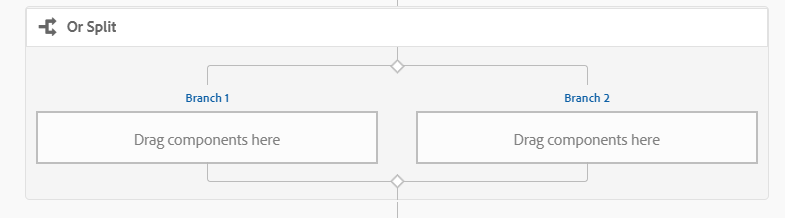
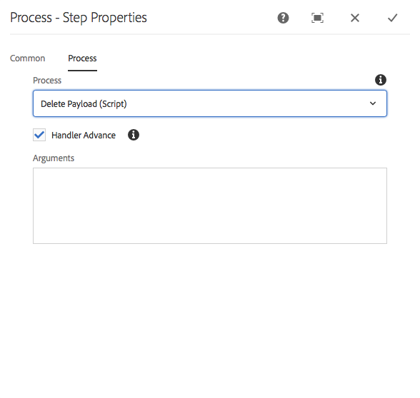

# Riferimento passo flusso di lavoro {#workflow-step-reference}

I modelli di workflow sono composti di una serie di passaggi di vari tipi. In base al tipo, questi passaggi possono essere configurati ed estesi con parametri e script per fornire le funzionalità e il controllo richiesti.

>[!NOTE]
>
>Questa sezione descrive i passaggi standard del flusso di lavoro.
>
>Per i passaggi specifici del modulo, vedi anche:
>
>* [Riferimento al passaggio del flusso di lavoro AEM Forms](/help/forms/using/aem-forms-workflow-step-reference.md)
>* [Elaborazione delle risorse tramite gestori e flussi di lavoro](/help/assets/media-handlers.md)
>


## Proprietà passaggio {#step-properties}

Ciascun componente passo dispone di una finestra di dialogo Proprietà **** passo che consente di definire e modificare le proprietà richieste.

### Proprietà passaggio - Scheda comune {#step-properties-common-tab}

Nella scheda **Comune** della finestra di dialogo delle proprietà sono disponibili una combinazione delle seguenti proprietà per la maggior parte dei componenti dei passaggi del flusso di lavoro:

* **Titolo** Titolo del passaggio.

* **Descrizione** Una descrizione del passaggio.

* **Stadio flusso di lavoro**

   Selettore a discesa per applicare uno [stage](/help/sites-developing/workflows.md#workflow-stages) al passaggio.

* **Timeout**

   Il periodo dopo il quale il passaggio verrà &quot;timeout&quot;.
È possibile selezionare tra: **Off**, **Immediato**, **1h**, **6h**, **12h******, 24h.

* **Gestore timeout**

   Il gestore che controllerà il flusso di lavoro quando il passaggio viene eseguito; ad esempio:
   `Auto Advancer`

* **Avanzamento gestore**

   Selezionate questa opzione per avanzare automaticamente il flusso di lavoro al passaggio successivo dopo l’esecuzione. Se non è selezionato, lo script di implementazione deve gestire l&#39;avanzamento del flusso di lavoro.

### Proprietà passaggio - scheda Utente/gruppo {#step-properties-user-group-tab}

Le seguenti proprietà sono disponibili per molti componenti dei passaggi del flusso di lavoro, nella scheda **Utente/Gruppo** della finestra di dialogo delle proprietà:

* **Notifica all&#39;utente via e-mail**

   * Potete inviare una notifica ai partecipanti inviando loro un messaggio e-mail quando il flusso di lavoro raggiunge il passo.
   * Se abilitata, verrà inviata un&#39;e-mail all&#39;utente definito dalla proprietà **Utente/Gruppo** oppure a ciascun membro del gruppo, se è definito un gruppo.

* **Utente/Gruppo**

   * Una casella di selezione a discesa consente di navigare e selezionare un utente o un gruppo.
   * Se assegnate il passaggio a un utente specifico, solo questo utente può intervenire sul passaggio.
   * Se assegnate il passaggio a un intero gruppo, quando il flusso di lavoro raggiunge questo passaggio tutti gli utenti del gruppo avranno l’azione nella propria Casella in entrata **** Flusso di lavoro.
   * Per ulteriori informazioni, vedere [Partecipazione ai flussi di lavoro](/help/sites-authoring/workflows-participating.md) .

## Suddivisione E {#and-split}

La divisione **AND (AND Split** ) crea una divisione nel flusso di lavoro, dopo di che saranno attivi entrambi i rami. Potete aggiungere i passaggi del flusso di lavoro a ogni ramo, a seconda delle necessità. Questo passaggio consente di introdurre più percorsi di elaborazione nel flusso di lavoro. Ad esempio, è possibile consentire che alcuni passaggi di revisione si verifichino in parallelo, risparmiando tempo.


### E Split - Configurazione {#and-split-configuration}

Per configurare la divisione:

* Modificate le proprietà **AND Split**:

   * **Nome** divisione: assegnare un nome a scopo esplicativo
   * Selezionare il numero di rami richiesti; 2, 3, 4 o 5.

* Aggiungi i passaggi del flusso di lavoro ai rami come necessario.

   

## Passaggio contenitore {#container-step}

Un passaggio contenitore avvia un altro modello di flusso di lavoro che viene eseguito come flusso di lavoro secondario.

Questo contenitore consente di riutilizzare i modelli di flusso di lavoro per implementare le sequenze di passaggi più comuni. Ad esempio, un modello di flusso di lavoro di traduzione potrebbe essere utilizzato in più flussi di lavoro di modifica.


### Passaggio contenitore - Configurazione {#container-step-configuration}

Per configurare il passaggio, modificate e utilizzate le seguenti schede:

* [Comune](#step-properties-common-tab)
* **Contenitore**

   * **Flusso di lavoro** secondario: Selezionare il flusso di lavoro da avviare.

## Passaggio GoTo {#goto-step}

Il passaggio **Vai** consente di specificare il passaggio successivo da eseguire nel modello di workflow. È possibile specificare una definizione di regola, uno script esterno o uno script ECMA come espressione di routing per valutare il passaggio successivo per il modello di workflow.

* Se la condizione specificata rimane true, il passaggio **Vai** viene completato e il motore del flusso di lavoro esegue il passaggio specificato.
* Se la condizione specificata non contiene il valore vero, **Goto Step** viene completato e la logica di routing normale determina il passaggio successivo da eseguire.

Il passo **** Vai consente di implementare strutture di routing avanzate nei modelli di workflow. Ad esempio, per implementare un ciclo, **Goto Step** può essere definito per eseguire un passaggio precedente nel flusso di lavoro, con l&#39;espressione di routing che valuta una condizione del ciclo.

### Passaggio Vai - Configurazione {#goto-step-configuration}

Per configurare il passaggio, modificate e utilizzate le seguenti schede:

* [Comune](#step-properties-common-tab)
* **Processo**

   * **Passaggio** di destinazione: Selezionare il passaggio da eseguire dopo aver valutato la condizione per l&#39;espressione di routing.
   * **Espressione** di routing: Selezionare Definizione regola, Script esterno o uno script ECMA che determina se eseguire il passaggio **** Target.

      * **** Definizione regola: Utilizzate l&#39;editor [di](/help/forms/using/variable-in-aem-workflows.md#use-expression-editor) espressioni per definire la regola.
      * **** Script esterno: Percorso dello script esterno.
      * **Script** ECMA: Lo script che determina se eseguire il **passaggio** Vai.

#### Simulazione di un ciclo for {#simulating-a-for-loop}

Per simulare un ciclo for è necessario mantenere un conteggio del numero di iterazioni del ciclo che si sono verificate:

* In genere, il conteggio rappresenta un indice di elementi su cui viene eseguita l&#39;azione nel flusso di lavoro.
* Il conteggio viene valutato come criterio di uscita del ciclo.

Ad esempio, per implementare un flusso di lavoro che esegue un&#39;azione su più nodi JCR, è possibile utilizzare un contatore di loop come indice per i nodi. Per mantenere il conteggio, memorizzare un `integer` valore nella mappa dati dell&#39;istanza del flusso di lavoro. Utilizzare lo script del passaggio **** Vai per incrementare il conteggio e confrontare il conteggio con i criteri di uscita.

```
function check(){
   var count=0;
   var keyname="loopcount"
   try{
      if (workflowData.getMetaDataMap().containsKey(keyname)){
        log.info("goto script: found loopcount key");
        count= parseInt(workflowData.getMetaDataMap().get(keyname))+1;
      }

     workflowData.getMetaDataMap().put(keyname,count);

     }catch(err) {
         log.info(err.message);
         return false;
    }
   if (parseInt(count) <7){
       return true;
   } else {
      return false;
   }
}
```

### Simulazione di un ciclo for mediante la definizione della regola {#simulateforloop}

È inoltre possibile simulare un ciclo for utilizzando Definizione regola come espressione di routing. [Creare una variabile **count** di tipo](/help/forms/using/variable-in-aem-workflows.md#create-a-variable) di dati Long. Utilizzate **Espressione** come modalità di mappatura nel passaggio **[Imposta variabile](/help/sites-developing/using-variables-in-aem-workflows.md#set-a-variable)**per impostare il valore della variabile **count**su **count + 1**su ogni esecuzione del passaggio **Imposta variabile**.


Nel passaggio **** Vai, utilizzare **Imposta variabile** come passo **** Target e **contare &lt; 5** come espressione di routing.


Il passaggio **Imposta variabile** viene eseguito incrementando ripetutamente il valore della variabile **count** di 1 per ogni esecuzione fino a raggiungere 5.

## Suddivisione O {#or-split}

La divisione **OR (OR Split** ) crea una divisione nel flusso di lavoro, dopo di che sarà attivo solo un ramo. Questo passaggio consente di introdurre i percorsi di elaborazione condizionale nel flusso di lavoro. Potete aggiungere i passaggi del flusso di lavoro a ogni ramo, a seconda delle necessità.

>[!NOTE]
>
>Per ulteriori informazioni sulla creazione di una divisione OR, vedete: [https://helpx.adobe.com/experience-manager/using/aem64_workflow_servlet.html](https://helpx.adobe.com/experience-manager/using/aem64_workflow_servlet.html)



### O suddivisione - Configurazione {#or-split-configuration}

Per configurare la divisione:

* Modificate le proprietà **OR Split**:

   * **Comune**

      * Specificate il nome della divisione.
   * **Rami (*x)***

      * **** Aggiungi ramo: Aggiungete altri rami al passaggio.
      * **Seleziona espressione** di routing: Selezionare l&#39;espressione di routing per valutare il ramo attivo. I valori possibili sono: Definizione regola, script esterni ed ECMA.
      * **Fare clic per aggiungere espressione**: Aggiungi espressione per valutare il ramo attivo se selezioni Definizione **** regola come espressione di routing.
      * **Percorso** script: Percorso di un file contenente lo script per valutare il ramo attivo se si seleziona Script **** esterno come espressione di routing.
      * **Script**: Aggiungere lo script nella casella per valutare il ramo attivo se si seleziona **ECMA Script** come espressione di routing.
      * **Percorso** predefinito: Il ramo predefinito viene seguito nel caso di più rami. Per impostazione predefinita è possibile specificare solo un ramo.
   >[!NOTE]
   >
   >    * Un ramo viene valutato alla volta in base all&#39;espressione di routing.
   >    * I rami vengono valutati dall&#39;alto verso il basso.
   >    * Viene eseguito il primo script che restituisce true.
   >    * Se nessun ramo restituisce true, il flusso di lavoro non procede.


   >[!NOTE]
   >
   >Consultate [Definizione di una regola per una divisione](/help/sites-developing/workflows-models.md#defineruleecmascript)OR.

* Aggiungi i passaggi del flusso di lavoro ai rami come necessario.

## Passaggi e scelte dei partecipanti {#participant-steps-and-choosers}

### Passaggio partecipante {#participant-step}

Un passo **** partecipante consente di assegnare la proprietà per una particolare azione. Il flusso di lavoro continuerà solo se l&#39;utente ha riconosciuto manualmente il passaggio. Viene utilizzato quando si desidera che un utente esegua un’azione sul flusso di lavoro; ad esempio, un passaggio di revisione.

Anche se non direttamente correlata, l&#39;autorizzazione utente deve essere presa in considerazione al momento dell&#39;assegnazione di un&#39;azione; l&#39;utente deve avere accesso alla pagina che rappresenta il payload del flusso di lavoro.

#### Passaggio partecipante - Configurazione {#participant-step-configuration}

Per configurare il passaggio, modificate e utilizzate le seguenti schede:

* [Comune](#step-properties-common-tab)
* [Utente/Gruppo](#step-properties-user-group-tab)

>[!NOTE]
>
>L’iniziatore del flusso di lavoro riceve sempre una notifica quando:
>
>* Il flusso di lavoro è completato (completato).
>* Il flusso di lavoro viene interrotto (terminato).
>


>[!NOTE]
>
>Per abilitare le notifiche e-mail è necessario configurare alcune proprietà. Potete inoltre personalizzare il modello e-mail o aggiungere un modello e-mail per una nuova lingua. See [Configuring Email Notification](/help/sites-administering/notification.md#configuringemailnotification) to configure email notifications in AEM.

### Passaggio partecipante finestra di dialogo {#dialog-participant-step}

Utilizzare un Passaggio **partecipante alla finestra di** dialogo per raccogliere informazioni dall&#39;utente a cui è assegnato l&#39;elemento di lavoro. Questo passaggio è utile per raccogliere piccole quantità di dati da utilizzare successivamente nel flusso di lavoro.

Al termine del passaggio, la finestra di dialogo **Completa elemento** di lavoro contiene i campi definiti nella finestra di dialogo. I dati raccolti nei campi vengono memorizzati nei nodi del payload del flusso di lavoro. I passaggi successivi del flusso di lavoro possono quindi leggere il valore dalla directory archivio.

Per configurare il passaggio, specificate il gruppo o l’utente a cui assegnare l’elemento di lavoro e il percorso della finestra di dialogo.

#### Passaggio partecipante finestra di dialogo - Configurazione {#dialog-participant-step-configuration}

Per configurare il passaggio, modificate e utilizzate le seguenti schede:

* [Comune](#step-properties-common-tab)
* [Utente/Gruppo](#step-properties-user-group-tab)
* **Finestra di dialogo**

   * **Percorso** finestra di dialogo: Percorso del nodo della finestra di [dialogo creata](#dialog-participant-step-creating-a-dialog).

#### Passaggio partecipante finestra di dialogo - Creazione di una finestra di dialogo {#dialog-participant-step-creating-a-dialog}

Per creare una finestra di dialogo è necessario creare la finestra di dialogo:

* Decidete dove saranno [memorizzati i dati risultanti nel payload](#dialog-participant-step-storing-data-in-the-payload).
* [Definire la finestra di dialogo; ciò include la definizione dei campi utilizzati per raccogliere (e salvare) i dati](#dialog-participant-step-dialog-definition).

#### Passaggio partecipante finestra di dialogo - Memorizzazione dei dati nel payload {#dialog-participant-step-storing-data-in-the-payload}

Potete memorizzare i dati widget nel payload del flusso di lavoro o nei metadati dell’elemento di lavoro. Il formato della `name` proprietà del nodo widget determina la posizione di memorizzazione dei dati.

* **Archiviare i dati con il payload**

   * Per memorizzare i dati dei widget come proprietà del payload del flusso di lavoro, utilizzate il formato seguente per il valore della proprietà name del nodo del widget:
      `./jcr:content/nodename`

   * I dati vengono memorizzati nella `nodename` proprietà del nodo payload. Se il nodo non contiene tale proprietà, la proprietà viene creata.
   * Se memorizzato con il payload, gli usi successivi della finestra di dialogo con lo stesso payload sovrascrivono il valore della proprietà.

* **Archiviare i dati con l&#39;elemento di lavoro**

   * Per memorizzare i dati dei widget come proprietà dei metadati dell&#39;elemento di lavoro, utilizzate il formato seguente per il valore della proprietà name:
      `nodename`

   * I dati vengono memorizzati nella `nodename` proprietà dell&#39;elemento di lavoro `metadata`. I dati vengono conservati se la finestra di dialogo viene successivamente utilizzata con lo stesso payload.

#### Passaggio partecipante finestra di dialogo - Definizione finestra di dialogo {#dialog-participant-step-dialog-definition}

1. **Struttura finestra di dialogo**

   Le finestre di dialogo per i passi partecipanti alla finestra di dialogo sono simili alle finestre di dialogo create per creare componenti. Sono memorizzati in:

   `/apps/myapp/workflow/dialogs`

   Le finestre di dialogo per l’interfaccia touch standard hanno la seguente struttura di nodi:

   ```xml
   newComponent (cq:Component)
     |- cq:dialog (nt:unstructured)
       |- content
         |- layout
           |- items
             |- column
               |- items
                 |- component0
                 |- component1
                 |- ...
   ```

   >[!NOTE]
   >
   >Per ulteriori informazioni, vedere [Creazione e configurazione di una finestra di dialogo](/help/sites-developing/developing-components.md#creating-and-configuring-a-dialog).

1. **Proprietà del percorso di dialogo**

   Il Passaggio **partecipante alla finestra di** dialogo ha la proprietà Percorso **** finestra di dialogo (insieme alle proprietà di un Passaggio [](#participant-step)partecipante). Il valore della proprietà **Dialog Path** è il percorso del `dialog` nodo della finestra di dialogo.

   Ad esempio, la finestra di dialogo è contenuta in un componente denominato `EmailWatch` memorizzato nel nodo:

   `/apps/myapp/workflows/dialogs`

   Per l’interfaccia touch, per la proprietà Percorso **finestra di** dialogo viene utilizzato il valore seguente:

   `/apps/myapp/workflow/dialogs/EmailWatch/cq:dialog`

   

1. **Definizione finestra di esempio**

   Il frammento di codice XML seguente rappresenta una finestra di dialogo che memorizza un `String` valore nel `watchEmail` nodo del contenuto del payload. Il nodo titolo rappresenta il componente [TextField](https://helpx.adobe.com/experience-manager/6-5/sites/developing/using/reference-materials/granite-ui/api/jcr_root/libs/granite/ui/components/coral/foundation/form/textfield/index.html) :

   ```xml
   jcr:primaryType="nt:unstructured"
       jcr:title="Watcher Email Address Dialog"
       sling:resourceType="cq/gui/components/authoring/dialog">
       <content jcr:primaryType="nt:unstructured"
           sling:resourceType="granite/ui/components/foundation/container">
           <layout jcr:primaryType="nt:unstructured"
               margin="false"
               sling:resourceType="granite/ui/components/foundation/layouts/fixedcolumns"
           />
           <items jcr:primaryType="nt:unstructured">
               <column jcr:primaryType="nt:unstructured"
                   sling:resourceType="granite/ui/components/foundation/container">
                   <items jcr:primaryType="nt:unstructured">
                       <title jcr:primaryType="nt:unstructured"
                           fieldLabel="Notification Email Address"
                           name="./jcr:content/watchEmails"
                           sling:resourceType="granite/ui/components/foundation/form/textfield"
                       />
                   </items>
               </column>
           </items>
       </content>
   </cq:dialog>
   ```

   In questo esempio, nel caso dell’interfaccia touch, viene visualizzata una finestra di dialogo come:

   

### Passaggio partecipante dinamico {#dynamic-participant-step}

Il componente Passaggio **partecipante** dinamico è simile al Passaggio **[](#participant-step)**partecipante con la differenza che il partecipante viene selezionato automaticamente in fase di esecuzione.

Per configurare il passaggio, selezionate un Selettore **partecipanti** che identifica il partecipante a cui assegnare l’elemento di lavoro, insieme a una finestra di dialogo.

#### Passaggio partecipante dinamico - Configurazione {#dynamic-participant-step-configuration}

Per configurare il passaggio, modificate e utilizzate le seguenti schede:

* [Comune](#step-properties-common-tab)
* **Selettore partecipanti**

   * **Selezione** partecipanti: Nome del selettore [partecipante creato](#developingtheparticipantchooser).
   * **Argomenti**: Eventuali argomenti richiesti.
   * **E-mail**: Indica se inviare una notifica e-mail all’utente.

* **Finestra di dialogo**

   * **Percorso** finestra di dialogo: Percorso del nodo della finestra di [dialogo creato (come con il Passaggio **partecipante alla** finestra di dialogo)](#dialog-participant-step-creating-a-dialog).

#### Passaggio partecipante dinamico - Sviluppo del selettore partecipante {#dynamic-participant-step-developing-the-participant-chooser}

Potete creare il selettore partecipanti. Pertanto, potete utilizzare qualsiasi logica o criterio di selezione. Ad esempio, il selettore partecipanti può selezionare l&#39;utente (all&#39;interno di un gruppo) con il minor numero di elementi di lavoro. Potete creare un numero qualsiasi di partecipanti che scelgono di utilizzare con istanze diverse del componente Passaggio **partecipante** dinamico nei modelli di flusso di lavoro.

Creare un servizio OSGi o un codice ECMAScript che selezioni un utente a cui assegnare l’elemento di lavoro.

* **ECMAscript**

   Gli script devono includere una funzione denominata getParticipant che restituisce un ID utente come `String` valore. Memorizzare gli script personalizzati, ad esempio nella `/apps/myapp/workflow/scripts` cartella o in una sottocartella.

   Uno script di esempio è incluso in un’istanza standard di AEM:

   `/libs/workflow/scripts/initiator-participant-chooser.ecma`

   >[!CAUTION]
   >
   >Non ***devi*** cambiare nulla nel `/libs` percorso.
   >
   >
   >Questo perché il contenuto di `/libs` viene sovrascritto al successivo aggiornamento dell’istanza (e potrebbe essere sovrascritto quando applicate un hotfix o un pacchetto di funzioni).

   Questo script seleziona l&#39;iniziatore del flusso di lavoro come partecipante:

   ```
   function getParticipant() {
       return workItem.getWorkflow().getInitiator();
   }
   ```

   >[!NOTE]
   >
   >Il componente Selezione **partecipanti iniziatore** flusso di lavoro estende il passo **partecipante** dinamico e utilizza questo script come implementazione passo.

* **servizio OSGi**

   I servizi devono implementare l&#39;interfaccia [com.day.cq.workflow.exec.ParticipantStepChooser](https://helpx.adobe.com/experience-manager/6-5/sites/developing/using/reference-materials/javadoc/com/day/cq/workflow/exec/ParticipantStepChooser.html) . L&#39;interfaccia definisce i membri seguenti:

   * `SERVICE_PROPERTY_LABEL` field: Utilizzate questo campo per specificare il nome del selettore partecipanti. Il nome viene visualizzato in un elenco dei selettori partecipanti disponibili nelle proprietà Passaggio **partecipante** dinamico.

   * `getParticipant` metodo: Restituisce l&#39;ID Principal risolto dinamicamente come `String` valore.
   >[!CAUTION]
   >
   >Il `getParticipant` metodo restituisce l’ID Principal risolto dinamicamente. Può trattarsi di un ID gruppo o di un ID utente.
   >
   >
   >Tuttavia, un ID gruppo può essere utilizzato solo per un Passaggio **** partecipante, quando viene restituito un elenco di partecipanti. Per un passo **partecipante** dinamico viene restituito un elenco vuoto che non può essere utilizzato per la delega.

   Per rendere disponibile l’implementazione ai componenti Passo **partecipante** dinamico, aggiungete la classe Java a un bundle OSGi che esporta il servizio e implementate il bundle nel server AEM.

   >[!NOTE]
   >
   >**Selettore** casuale partecipanti è un servizio di esempio che seleziona un utente casuale ( `com.day.cq.workflow.impl.process.RandomParticipantChooser`). L’esempio del componente **Selettore** casuale partecipanti estende il passo **partecipante** dinamico e utilizza questo servizio come implementazione passo.

#### Passaggio partecipante dinamico - Esempio di servizio di selezione partecipanti {#dynamic-participant-step-example-participant-chooser-service}

La seguente classe Java implementa l&#39; `ParticipantStepChooser` interfaccia. La classe restituisce il nome del partecipante che ha avviato il flusso di lavoro. Il codice utilizza la stessa logica utilizzata dallo script di esempio (`initiator-participant-chooser.ecma`).

L&#39; `@Property` annotazione imposta il valore del `SERVICE_PROPERTY_LABEL` campo su `Workflow Initiator Participant Chooser`.

```java
package com.adobe.example;

import org.apache.felix.scr.annotations.Component;
import org.apache.felix.scr.annotations.Properties;
import org.apache.felix.scr.annotations.Property;
import org.apache.felix.scr.annotations.Service;
import org.osgi.framework.Constants;
import org.slf4j.Logger;
import org.slf4j.LoggerFactory;

import com.adobe.granite.workflow.WorkflowException;
import com.adobe.granite.workflow.WorkflowSession;
import com.adobe.granite.workflow.exec.ParticipantStepChooser;
import com.adobe.granite.workflow.exec.WorkItem;
import com.adobe.granite.workflow.metadata.MetaDataMap;

@Component
@Service
@Properties({
        @Property(name = Constants.SERVICE_DESCRIPTION, value = "An example implementation of a dynamic participant chooser."),
        @Property(name = ParticipantStepChooser.SERVICE_PROPERTY_LABEL, value = "Workflow Initiator Participant Chooser (service)") })
public class InitiatorParticipantChooser implements ParticipantStepChooser {

 private Logger logger = LoggerFactory.getLogger(this.getClass());

 public String getParticipant(WorkItem arg0, WorkflowSession arg1,
   MetaDataMap arg2) throws WorkflowException {

  String initiator = arg0.getWorkflow().getInitiator();
  logger.info("Assigning Dynamic Participant Step work item to {}",initiator);

  return initiator;
 }
}
```

Nella finestra di dialogo Proprietà passo **partecipante** dinamico, il **Selettore** partecipanti include l&#39;elemento `Workflow Initiator Participant Chooser (script)`, che rappresenta questo servizio.

Quando il modello di workflow viene avviato, il registro indica l&#39;ID dell&#39;utente che ha avviato il flusso di lavoro e a cui è stato assegnato l&#39;elemento di lavoro. In questo esempio, l&#39; `admin` utente ha avviato il flusso di lavoro.

`13.09.2015 15:48:53.037 *INFO* [10.176.129.223 [1347565733037] POST /etc/workflow/instances HTTP/1.1] com.adobe.example.InitiatorParticipantChooser Assigning Dynamic Participant Step work item to admin`

### Passaggio partecipante modulo {#form-participant-step}

Il Passaggio **partecipante** modulo presenta un modulo quando l’elemento di lavoro viene aperto. Quando l&#39;utente compila e invia il modulo, i dati del campo vengono memorizzati nei nodi del payload del flusso di lavoro.

Per configurare il passaggio, specificare il gruppo o l&#39;utente a cui assegnare l&#39;elemento di lavoro e il percorso del modulo.

>[!CAUTION]
>
>Questa sezione descrive la sezione [Moduli di Foundation Components for Page Authoring](/help/sites-authoring/default-components-foundation.md#form).

#### Passaggio partecipante modulo - Configurazione {#form-participant-step-configuration}

Per configurare il passaggio, modificate e utilizzate le seguenti schede:

* [Comune](#step-properties-common-tab)
* [Utente/Gruppo](#step-properties-user-group-tab)
* **Modulo**

   * **Percorso** modulo: Percorso del [modulo creato](#form-participant-step-creating-the-form).

#### Passaggio partecipante modulo - Creazione del modulo {#form-participant-step-creating-the-form}

Creare un modulo da utilizzare normalmente con un passaggio partecipante **modulo** . Tuttavia, i moduli per un Passaggio partecipante modulo devono avere le seguenti configurazioni:

* Il componente **Inizio modulo** deve avere la proprietà Tipo **** azione impostata su `Edit Workflow Controlled Resource(s)`.
* Il componente **Inizio modulo** deve avere un valore per la `Form Identifier` proprietà.
* Ai componenti modulo deve essere impostata la proprietà Nome **** elemento sul percorso del nodo in cui sono memorizzati i dati del campo. Il percorso deve individuare un nodo nel contenuto del payload del flusso di lavoro. Il valore utilizza il formato seguente:

   `./jcr:content/path_to_node`

* Il modulo deve includere un componente **Pulsante Invia per** flusso di lavoro. Non si configurano proprietà del componente.

I requisiti del flusso di lavoro determinano dove memorizzare i dati del campo. Ad esempio, i dati dei campi possono essere utilizzati per configurare le proprietà del contenuto della pagina. Il seguente valore di una proprietà Nome **** elemento memorizza i dati del campo come valore della `redirectTarget` proprietà del `jcr:content` nodo:

`./jcr:content/redirectTarget`

Nell&#39;esempio seguente, i dati del campo vengono utilizzati come contenuto di un componente **Testo** nella pagina di payload:

`./jcr:content/par/text_3/text`

Il primo esempio può essere utilizzato per qualsiasi pagina rappresentata dal `cq:Page` componente. Il secondo esempio può essere utilizzato solo quando la pagina di payload include un componente **Testo** con un ID di `text_3`.

Il modulo può trovarsi ovunque nella directory archivio, tuttavia gli utenti del flusso di lavoro devono essere autorizzati a leggere il modulo.

### Selettore casuale partecipanti {#random-participant-chooser}

Il passaggio **Selettore** casuale partecipanti è un selettore partecipante che assegna l’elemento di lavoro generato a un utente selezionato in modo casuale da un elenco.


#### Selettore casuale partecipanti - Configurazione {#random-participant-chooser-configuration}

Per configurare il passaggio, modificate e utilizzate le seguenti schede:

* [Comune](#step-properties-common-tab)
* **Argomenti**

   * **Partecipanti**: Specifica l&#39;elenco di utenti disponibili per la selezione. Per aggiungere un utente all’elenco, fate clic su **Aggiungi elemento** e digitate il percorso principale del nodo utente o l’ID utente. L&#39;ordine degli utenti non influisce sulla probabilità che gli venga assegnato un elemento di lavoro.

### Selettore partecipante iniziatore flusso di lavoro {#workflow-initiator-participant-chooser}

Il passaggio di selezione partecipanti iniziatore **flusso di lavoro** è un selettore partecipante che assegna l’elemento di lavoro generato all’utente che ha avviato il flusso di lavoro. Nessuna proprietà da configurare oltre alle proprietà **comuni** .

#### Workflow Initiator Participant Chooser - Configuration {#workflow-initiator-participant-chooser-configuration}

Per configurare il passaggio, effettuate le modifiche utilizzando le seguenti schede:

* [Comune](#step-properties-common-tab)

## Passaggio processo {#process-step}

Un passo **di** processo esegue un ECMAScript o chiama un servizio OSGi per eseguire l&#39;elaborazione automatica.



### Passaggio processo - Configurazione {#process-step-configuration}

Per configurare il passaggio, modificate e utilizzate le seguenti schede:

* [Comune](#step-properties-common-tab)
* **Processo**

   * **Processo**: L&#39;implementazione del processo da eseguire. Utilizzate il menu a discesa per selezionare il servizio ECMAScript o OSGi. Per informazioni su:

      * I servizi standard ECMAScripts e OSGi, consultate Processi [predefiniti per i passaggi](/help/sites-developing/workflows-process-ref.md)di processo.
      * Creazione di ECMAScripts per un passaggio del processo, vedere [Implementazione di un passaggio del processo con un ECMAScript](/help/sites-developing/workflows-customizing-extending.md#using-ecmascript).
      * Creazione di servizi OSGi per un passaggio del processo, vedere [Implementazione di un passaggio del processo con una classe](/help/sites-developing/workflows-customizing-extending.md#implementing-a-process-step-with-a-java-class)Java.
   * **Avanzamento** gestore:Selezionate questa opzione per avanzare automaticamente il flusso di lavoro al passaggio successivo dopo l’esecuzione. Se non è selezionato, lo script di implementazione deve gestire l&#39;avanzamento del flusso di lavoro.
   * **Argomenti**: Argomenti da passare al processo.


## Imposta variabile {#set-variable}

Il passaggio Imposta variabile consente di impostare il valore di una variabile e definire l’ordine in cui i valori vengono impostati. La variabile viene impostata nell&#39;ordine in cui le mappature delle variabili sono elencate nel passaggio Imposta variabile.


### Imposta variabile - Configurazione {#setvariable}

Per configurare il passaggio, modificate e utilizzate le seguenti schede:

* [Comune](/help/sites-developing/workflows-step-ref.md#step-properties-common-tab)
* **Mappatura**

   * **** Seleziona variabile: Utilizzare questa opzione per selezionare una variabile per impostarne il valore.
   * **** Seleziona modalità mapping: Selezionate una modalità di mappatura per impostare il valore della variabile. A seconda del tipo di dati della variabile, è possibile utilizzare le seguenti opzioni per impostare il valore di una variabile:

      * **** Letterale: Utilizzate l&#39;opzione quando conoscete il valore esatto da specificare.
      * **** Espressione: Utilizzare l&#39;opzione quando il valore da utilizzare viene calcolato in base a un&#39;espressione. L&#39;espressione viene creata nell&#39;editor di espressioni fornito.
      * **** Notazione punto JSON: Utilizzate l&#39;opzione per recuperare un valore da una variabile di tipo JSON o FDM.
      * **** XPATH: Utilizzare l&#39;opzione per recuperare un valore da una variabile di tipo XML.
      * **** Relativo al payload: Utilizzare l&#39;opzione quando il valore da salvare in variabile è disponibile in un percorso relativo al payload.
      * **** Percorso assoluto: Utilizzare l&#39;opzione quando il valore da salvare nella variabile è disponibile in un percorso assoluto.
   * **** Specificare il valore: Specificate un valore da associare alla variabile. Il valore specificato in questo campo dipende dalla modalità di mappatura.
   * **** Aggiungi mapping: Utilizzare questa opzione per aggiungere altre mappature per impostare un valore per la variabile.
